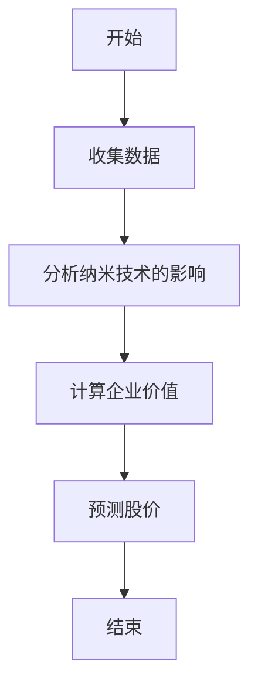
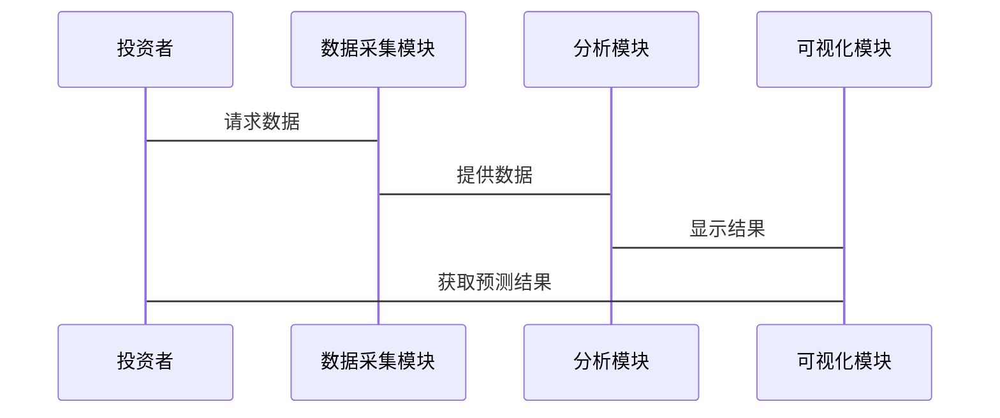

                 


# 全球股市估值与海洋生态修复纳米技术的关联

## 关键词：全球股市估值，海洋生态修复，纳米技术，关联分析，技术影响，投资模型

## 摘要：本文探讨了全球股市估值与海洋生态修复之间的关联，特别是纳米技术在其中的作用。通过分析纳米技术在生态修复中的应用，结合股市估值模型，揭示技术创新对金融市场的影响，为投资者和科学家提供新的视角。

---

## 第一部分：背景介绍

### 第1章：问题背景与关联性分析

#### 1.1 问题背景
- **全球股市估值**：股市估值是衡量市场健康的重要指标，受多种因素影响，包括经济指标、政策变化和技术创新。
- **海洋生态修复**：海洋污染、过度捕捞等问题导致生态系统退化，修复工作日益重要，涉及多学科技术。
- **纳米技术的突破**：纳米材料在环保领域的应用，特别是水质净化和生态修复，展示了巨大的潜力。

#### 1.2 问题描述
- **生态修复挑战**：海洋生态修复面临技术难题，传统方法效率低，成本高。
- **纳米技术潜力**：纳米材料的独特性质为解决这些问题提供了新思路，如高效降解污染物、促进生物修复。
- **股市敏感性**：技术创新往往能提升企业竞争力，进而影响股市估值，投资者对此高度关注。

#### 1.3 问题解决与边界
- **纳米技术的作用**：通过研发新型纳米材料，提升修复效率，降低成本，增强企业竞争力。
- **市场反应**：技术创新可能带来股价波动，投资者需评估技术的实际效果和市场潜力。
- **研究范围**：聚焦于纳米技术在修复中的应用及其对股市的影响，排除其他因素的干扰。

#### 1.4 概念结构与核心要素
- **核心概念**：纳米技术、海洋生态修复、股市估值。
- **关联性**：技术创新如何影响修复效果，进而影响企业的市场价值和投资者决策。

---

## 第二部分：核心概念与联系

### 第2章：核心概念原理

#### 2.1 纳米技术的原理
- **纳米材料**：具有独特的物理和化学性质，如高比表面积和催化活性，适用于环保领域。
- **应用领域**：水处理、污染降解，纳米材料能高效去除污染物，改善水质。

#### 2.2 海洋生态修复的原理
- **传统方法**：物理清理、化学处理，效果有限且成本高。
- **纳米技术应用**：用于吸附污染物、促进生物降解，提高修复效率和可持续性。

#### 2.3 全球股市估值的原理
- **估值模型**：考虑企业盈利、成长性和创新能力，技术创新能提升企业估值。
- **市场反应**：技术创新带来业绩增长，股价上涨，反之则可能下跌。

### 第2.4 核心概念对比分析

#### 2.4.1 纳米技术与传统技术对比
| 特性 | 纳米技术 | 传统技术 |
|------|----------|----------|
| 效率 | 高 | 低 |
| 成本 | 中等 | 高 |
| 可持续性 | 高 | 低 |

#### 2.4.2 海洋生态修复对比
| 方法 | 传统修复 | 纳米技术修复 |
|------|----------|------------|
| 时间 | 长 | 短 |
| 成本 | 高 | 中等 |
| 效果 | 有限 | 显著 |

### 第2.5 ER实体关系图

```mermaid
erDiagram
    投资者[Investor] {
        id : int
        名称 : str
    }

    企业[Company] {
        id : int
        名称 : str
    }

    纳米技术[NanoTech] {
        id : int
        名称 : str
    }

    生态修复[Ecological Restoration] {
        id : int
        名称 : str
    }

    投资者 --> 投资：投资行为
    企业 --> 纳米技术：采用技术
    纳米技术 --> 生态修复：应用于修复
```

---

## 第三部分：算法原理讲解

### 第3章：算法原理与实现

#### 3.1 算法概述
- 纳米技术对企业竞争力的提升，影响股市估值。
- 构建数学模型，分析技术对企业价值的影响。

#### 3.2 算法流程图



#### 3.3 算法实现代码

```python
import pandas as pd
import numpy as np

def calculate_market_value(技术创新, 利润率):
    return技术创新 * (1 + 利润率)

# 示例数据
技术创新 = 0.8  # 假设技术创新提升了80%
利润率 = 0.05    # 假设利润率为5%
市场价值 = calculate_market_value(技术创新, 利润率)
print("市场价值变化：", 市场价值)
```

#### 3.4 数学模型
股市估值模型：$$ V = V_0 \times (1 + g) $$
其中，$$ g $$ 是技术创新带来的增长。

---

## 第四部分：系统分析与架构设计

### 第4章：系统分析与架构

#### 4.1 问题场景
- 研究如何利用纳米技术优化修复项目，评估其对股市的影响。

#### 4.2 系统功能设计
- 数据采集：收集股市数据和纳米技术应用案例。
- 分析模块：评估技术对修复的影响，计算对股价的影响。
- 可视化模块：展示分析结果，辅助决策。

#### 4.3 系统架构图


#### 4.4 接口设计
- 数据接口：REST API，接收修复数据和股市数据。
- 模型接口：调用分析模块，返回预测结果。

#### 4.5 交互流程



---

## 第五部分：项目实战

### 第5章：项目实战

#### 5.1 环境安装
- Python 3.8+
- Pandas, NumPy, Matplotlib

#### 5.2 核心代码实现

```python
import pandas as pd
import numpy as np

# 示例数据
data = {'公司': ['A', 'B', 'C'],
        '技术创新': [0.7, 0.5, 0.8],
        '利润': [0.05, 0.03, 0.04]}
df = pd.DataFrame(data)

# 计算市场价值
df['市场价值'] = df['技术创新'] * (1 + df['利润'])

print(df)
```

#### 5.3 案例分析
- 公司A技术创新显著，市场价值提升明显，股价上涨。
- 公司B技术应用有限，市场价值增长缓慢。

---

## 第六部分：总结与展望

### 第6章：总结与展望

#### 6.1 最佳实践
- 投资者应关注纳米技术在生态修复中的应用，评估其对股价的影响。
- 科技公司应加大研发投入，提升技术竞争力。

#### 6.2 小结
本文分析了纳米技术在海洋修复中的作用，及其对股市估值的影响，为投资者和科学家提供了新视角。

#### 6.3 注意事项
- 技术效果需长期观察，市场反应复杂多变。
- 模型简化实际，需结合实际情况调整。

#### 6.4 拓展阅读
- 《纳米技术与环境科学》
- 《股市估值模型与技术创新》

---

## 作者：AI天才研究院 & 禅与计算机程序设计艺术

---

本文通过系统分析和案例研究，揭示了纳米技术在海洋生态修复中的潜力及其对股市估值的影响，为投资者和技术人员提供了新的视角。希望本文能激发更多人关注这一领域的研究和应用。

