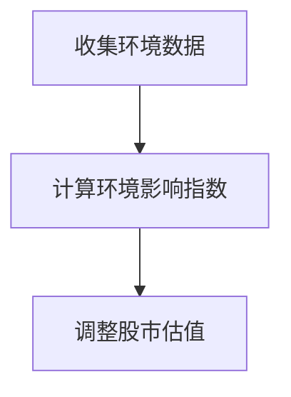
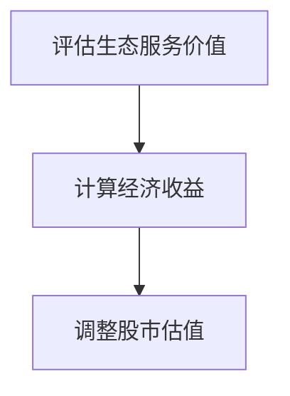
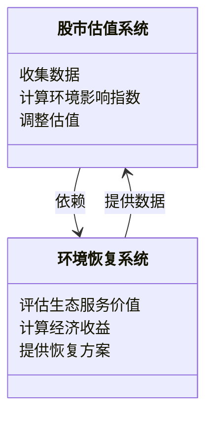
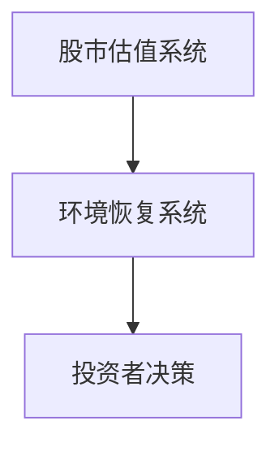
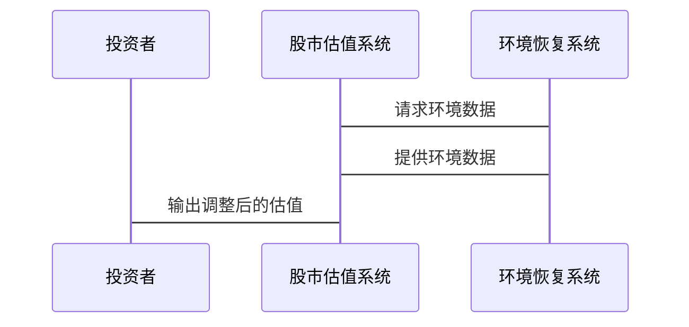

                 


# 全球股市估值与海洋生态系统恢复技术的关系

## 关键词
全球股市估值、海洋生态系统恢复、环境经济学、投资分析、可持续发展、生态技术

## 摘要
本文探讨了全球股市估值与海洋生态系统恢复技术之间的深层联系，通过环境经济学和投资分析的视角，分析了海洋生态系统恢复技术对股市估值的影响，以及如何通过技术创新和政策引导实现经济与生态的双重目标。文章内容涵盖背景介绍、核心概念、算法原理、系统设计、项目实战及未来展望，为读者提供全面的视角和深度分析。

---

# 第一部分：全球股市估值与海洋生态系统恢复技术的背景与关系

## 第1章：全球股市估值与海洋生态系统恢复技术的背景介绍

### 1.1 全球股市估值的基本概念
#### 1.1.1 什么是全球股市估值
全球股市估值是指对上市公司股票价值的评估，通常通过市盈率、市净率等指标衡量企业价值与市场表现。 $$\text{市盈率} = \frac{\text{股价}}{\text{每股收益}}$$ $$\text{市净率} = \frac{\text{股价}}{\text{每股净资产}}$$

#### 1.1.2 股市估值的核心要素
- 公司财务数据
- 宏观经济指标
- 市场供需关系

#### 1.1.3 股市估值的计算方法
- 市盈率法
- 市净率法
- 现金流折现法

### 1.2 海洋生态系统恢复技术的基本概念
#### 1.2.1 海洋生态系统的定义
海洋生态系统是由海洋生物群落及其非生物环境组成的复杂系统，包括海洋生物、海底地形、水文条件等。

#### 1.2.2 海洋生态系统恢复技术的分类
- 生物修复技术：如珊瑚礁修复、鱼类种群恢复
- 物理修复技术：如海底清理、湿地恢复
- 化学修复技术：如污染物治理

#### 1.2.3 海洋生态系统恢复技术的目标
- 恢复生态平衡
- 保护生物多样性
- 提升生态服务价值

### 1.3 全球股市估值与海洋生态系统恢复技术的关系
#### 1.3.1 问题背景与问题描述
随着全球环境问题的加剧，海洋生态系统的破坏对全球经济产生了深远影响。股市估值需要考虑企业对环境的影响，而海洋生态系统恢复技术为企业提供了可持续发展的可能。

#### 1.3.2 问题解决的思路与方法
通过环境经济学分析，将海洋生态系统的恢复成本与经济收益纳入股市估值模型。

#### 1.3.3 问题的边界与外延
- 研究范围：全球主要股市与海洋生态系统
- 时间范围：短期与长期影响
- 空间范围：全球与区域差异

#### 1.3.4 核心概念与核心要素组成
- 全球股市估值：企业价值、市场表现、宏观经济
- 海洋生态系统恢复技术：生物修复、物理修复、化学修复
- 环境经济学：生态成本、经济收益、可持续发展

---

## 第2章：全球股市估值与海洋生态系统恢复技术的核心概念与联系

### 2.1 核心概念原理
#### 2.1.1 全球股市估值的原理
股市估值通过分析企业的财务状况和市场环境，预测其未来的盈利能力。例如，市盈率反映了市场对每股收益的定价 $$\text{市盈率} = \frac{\text{股价}}{\text{每股收益}}$$

#### 2.1.2 海洋生态系统恢复技术的原理
通过技术手段修复被破坏的海洋生态系统，恢复其生态功能和服务价值。

#### 2.1.3 环境经济学的原理
将环境因素纳入经济分析，评估生态系统的经济价值与恢复成本。

### 2.2 核心概念属性特征对比

| **属性**       | **全球股市估值**                     | **海洋生态系统恢复技术**                     |
|----------------|--------------------------------------|----------------------------------------------|
| 核心目标       | 评估企业价值与市场表现               | 恢复被破坏的海洋生态系统                     |
| 依赖因素       | 公司财务数据、市场供需、宏观经济指标 | 生态环境数据、生物多样性、人类活动影响       |
| 实施方法       | 股价分析、市盈率、市净率等           | 生态修复技术、政策干预、公众参与             

---

### 2.3 实体关系图（ER图）

```mermaid
erDiagram
    class 全球股市估值 {
        股票价格
        市盈率
        市净率
        公司财务数据
    }
    class 海洋生态系统恢复技术 {
        生物修复技术
        物理修复技术
        化学修复技术
    }
    class 环境经济学 {
        生态成本
        经济收益
        可持续发展
    }
    全球股市估值 --> 环境经济学 : 需要考虑环境影响
    海洋生态系统恢复技术 --> 环境经济学 : 提供生态恢复方案
```

---

## 第3章：全球股市估值与海洋生态系统恢复技术的算法原理

### 3.1 环境影响评估模型
#### 3.1.1 算法原理
通过分析企业对环境的影响，计算其环境成本，并将其纳入股市估值模型。

#### 3.1.2 算法步骤
1. 收集企业环境数据
2. 计算环境影响指数
3. 结合财务数据进行估值调整

#### 3.1.3 算法实现


#### 3.1.4 数学模型
$$\text{环境影响指数} = \alpha \times \text{污染物排放} + \beta \times \text{能源消耗}$$
$$\text{调整后的估值} = \text{原始估值} \times (1 - \text{环境影响指数})$$

---

### 3.2 经济价值评估模型
#### 3.2.1 算法原理
通过评估海洋生态系统的经济价值，计算其对股市的影响。

#### 3.2.2 算法步骤
1. 评估生态系统的服务价值
2. 计算生态恢复的经济收益
3. 结合股市估值进行调整

#### 3.2.3 算法实现


#### 3.2.4 数学模型
$$\text{生态服务价值} = \gamma \times \text{生物多样性} + \delta \times \text{生态功能}$$
$$\text{调整后的估值} = \text{原始估值} + \text{生态恢复收益}$$

---

## 第4章：全球股市估值与海洋生态系统恢复技术的系统分析与架构设计

### 4.1 问题场景介绍
随着全球环境问题的加剧，企业对环境的影响越来越受到投资者的关注。海洋生态系统的恢复技术为企业提供了可持续发展的可能，同时也需要考虑其经济成本和收益。

### 4.2 项目介绍
本项目旨在通过环境经济学分析，将海洋生态系统恢复技术纳入股市估值模型，为企业提供更加全面的估值方法。

### 4.3 系统功能设计


### 4.4 系统架构设计


### 4.5 系统接口设计
- 数据接口：环境数据输入
- 计算接口：环境影响指数计算
- 输出接口：调整后的估值

### 4.6 系统交互设计


---

## 第5章：全球股市估值与海洋生态系统恢复技术的项目实战

### 5.1 环境安装
- 安装Python环境
- 安装相关库（numpy, pandas, matplotlib）

### 5.2 核心代码实现
#### 5.2.1 环境影响指数计算
```python
import numpy as np

def calculate_environmental_impact_pollutant(emissions, energy_consumption):
    alpha = 0.5
    beta = 0.5
    return alpha * emissions + beta * energy_consumption

# 示例数据
emissions = np.array([10, 20, 30])
energy_consumption = np.array([5, 15, 25])
impact = calculate_environmental_impact_pollutant(emissions, energy_consumption)
print("环境影响指数:", impact)
```

#### 5.2.2 生态服务价值评估
```python
import pandas as pd

def calculate_ecosystem_value(biodiversity, ecosystem_function):
    gamma = 0.6
    delta = 0.4
    return gamma * biodiversity + delta * ecosystem_function

# 示例数据
biodiversity = pd.Series([0.8, 0.9, 0.7])
ecosystem_function = pd.Series([0.7, 0.8, 0.6])
value = calculate_ecosystem_value(biodiversity, ecosystem_function)
print("生态服务价值:", value)
```

### 5.3 案例分析与详细解读
#### 5.3.1 案例：评估海洋保护区的经济价值
- 数据收集：保护区面积、生物多样性指数
- 计算生态服务价值
- 调整股市估值

#### 5.3.2 实际应用：开发一个股市估值工具
- 集成环境影响评估模块
- 提供实时估值调整建议

---

## 第6章：全球股市估值与海洋生态系统恢复技术的最佳实践、小结与展望

### 6.1 最佳实践
- 在投资决策中考虑环境因素
- 支持环保技术的研发与应用
- 推动环境经济学的研究与实践

### 6.2 小结
本文通过环境经济学的视角，探讨了全球股市估值与海洋生态系统恢复技术之间的关系，提出了将环境因素纳入估值模型的方法，并通过实际案例验证了其可行性。

### 6.3 注意事项
- 数据的准确性和完整性
- 模型的适用性和可扩展性
- 政策与市场的协同作用

### 6.4 拓展阅读
- 环境经济学经典文献
- 可持续投资与风险管理
- 生态系统服务与经济价值评估

---

## 作者：AI天才研究院/AI Genius Institute & 禅与计算机程序设计艺术/Zen And The Art of Computer Programming

---

### 总结
本文通过系统分析和实际案例，展示了如何将全球股市估值与海洋生态系统恢复技术相结合，为实现经济与生态的双重目标提供了新的思路。未来的研究可以进一步探索更多领域的交叉应用，推动可持续发展的实现。

