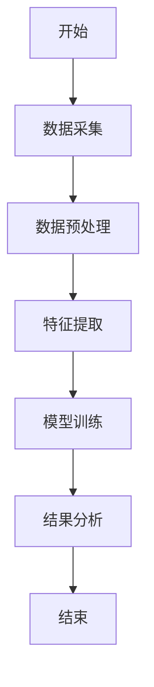
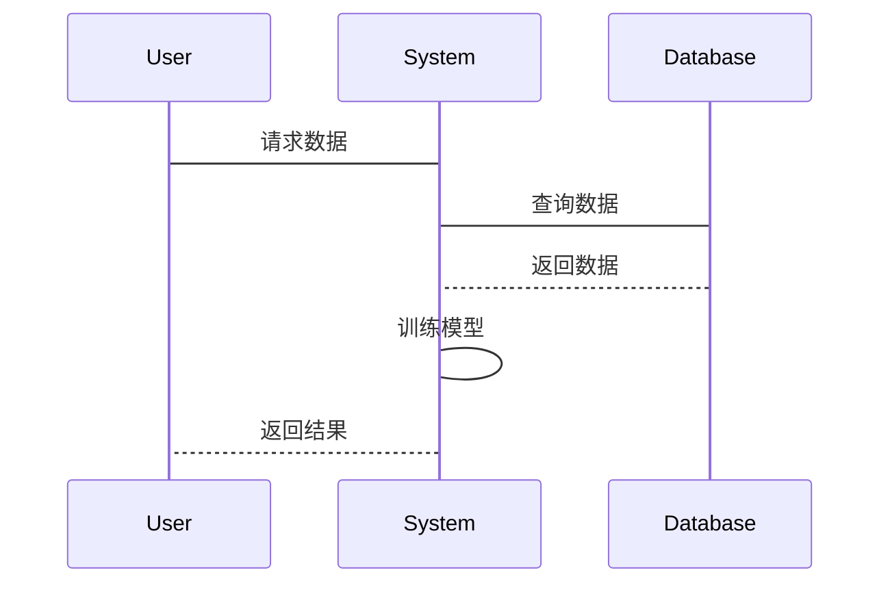

                 


# 全球股市估值与海洋生物多样性保护技术的关系

> **关键词**：全球股市估值，海洋生物多样性，保护技术，数学模型，系统架构

> **摘要**：本文探讨了全球股市估值与海洋生物多样性保护技术之间的潜在联系。通过分析股市估值的核心概念、海洋生物多样性保护技术的基本原理，以及两者之间的关系，本文旨在揭示如何通过技术手段实现海洋生态保护与经济可持续发展的双重目标。文章还结合数学模型和系统架构设计，详细阐述了如何将海洋生物多样性指数转化为影响股市估值的关键因素。

---

## 第一部分: 背景介绍

### 第1章: 背景与问题描述

#### 1.1 全球股市估值的基本概念
- **定义**：全球股市估值是指对全球范围内股票市场的整体价值进行评估，通常通过市盈率、市净率等指标来衡量。
- **特点**：股市估值受经济政策、市场情绪、企业盈利等多种因素影响。
- **区域差异**：不同国家和地区的股市估值受当地经济环境和政策影响，表现出显著差异。

#### 1.2 海洋生物多样性保护技术的核心概念
- **定义**：海洋生物多样性保护技术是指通过技术手段保护和恢复海洋生态系统中的生物多样性，例如使用传感器监测海洋环境、利用AI技术识别濒危物种等。
- **主要手段**：包括海洋监测技术、生态修复技术、人工智能辅助保护等。
- **应用现状**：全球范围内，许多国家和地区已经在利用技术手段保护海洋生物多样性，但技术的应用仍处于初级阶段。

#### 1.3 问题背景与研究意义
- **问题背景**：海洋生物多样性的减少对全球经济和生态系统稳定性造成威胁，而股市估值的变化反映了经济活动的波动。研究两者之间的关系有助于更好地理解生态保护与经济发展的相互作用。
- **研究意义**：揭示海洋生物多样性保护技术对股市估值的影响，为政策制定者和投资者提供科学依据。

---

## 第二部分: 核心概念与联系

### 第2章: 核心概念与联系

#### 2.1 核心概念的原理
- **全球股市估值的数学模型**：股市估值可以通过多种指标进行量化，例如市盈率（P/E）= 股价 / 每股收益。
- **海洋生物多样性保护技术的实现机制**：通过技术手段实时监测海洋环境，评估生物多样性指数。

#### 2.2 概念属性特征对比
| **属性**         | **全球股市估值**          | **海洋生物多样性保护技术**          |
|------------------|--------------------------|--------------------------------------|
| **核心目标**     | 反映经济价值             | 保护和恢复生物多样性                |
| **影响因素**     | 经济政策、市场情绪        | 环境污染、气候变化、人类活动        |
| **应用范围**     | 全球范围                 | 海洋生态系统                      |

#### 2.3 ER实体关系图
```mermaid
er
    Marine_Biodiversity_Index
    -------
    id: Integer
    name: String
    value: Float
    location: String
    timestamp: DateTime

    Stock_Market_Valuation
    -------
    id: Integer
    market_name: String
    valuation: Float
    date: DateTime

    Marine_Biodiversity_Protection_Technology
    -------
    id: Integer
    technology_name: String
    description: String
    implementation_location: String

    Marine_Biodiversity_Index -->
    Stock_Market_Valuation: 影响
    Marine_Biodiversity_Protection_Technology -->
    Marine_Biodiversity_Index: 监测
```

---

## 第三部分: 算法原理讲解

### 第3章: 算法原理与流程

#### 3.1 算法原理


#### 3.2 算法实现
```python
import pandas as pd
import numpy as np
from sklearn.linear_model import LinearRegression

# 数据采集
data = pd.read_csv('marine_biodiversity.csv')
# 数据预处理
data_clean = data.dropna()
# 特征提取
X = data_clean[['temperature', 'ph', 'chlorophyll']]
y = data_clean['biodiversity_index']
# 模型训练
model = LinearRegression()
model.fit(X, y)
# 结果分析
print(model.coef_)
```

---

## 第四部分: 数学模型与公式

### 第4章: 数学模型与公式

#### 4.1 数学模型
$$
Y = aX + b
$$
- Y：全球股市估值
- X：海洋生物多样性指数
- a 和 b：回归系数

#### 4.2 模型验证
通过实际数据验证模型的准确性，例如使用R²值评估模型拟合度。

---

## 第五部分: 系统分析与架构设计

### 第5章: 系统分析与架构设计

#### 5.1 系统功能设计
- **领域模型**：通过Mermaid类图展示系统功能模块。
- **系统架构设计**：通过Mermaid架构图展示系统整体架构。

#### 5.2 系统接口设计
- 接口1：数据采集接口
- 接口2：模型训练接口
- 接口3：结果展示接口

#### 5.3 系统交互设计


---

## 第六部分: 项目实战

### 第6章: 项目实战

#### 6.1 环境安装
- 安装Python、Pandas、Scikit-learn等依赖库。

#### 6.2 系统核心实现
```python
import pandas as pd
from sklearn.model_selection import train_test_split
from sklearn.metrics import mean_squared_error

# 数据加载
data = pd.read_csv('data.csv')
# 数据分割
X_train, X_test, y_train, y_test = train_test_split(data[['temperature', 'ph']], data['biodiversity_index'])
# 模型训练
model = LinearRegression()
model.fit(X_train, y_train)
# 模型预测
y_pred = model.predict(X_test)
# 模型评估
print(mean_squared_error(y_test, y_pred))
```

#### 6.3 实际案例分析
- 通过实际数据展示模型的应用效果。

---

## 第七部分: 最佳实践

### 第7章: 最佳实践

#### 7.1 小结
- 总结全文的核心观点和研究成果。

#### 7.2 注意事项
- 数据采集的准确性
- 模型的适用性和泛化能力

#### 7.3 拓展阅读
- 推荐相关领域的书籍和论文。

---

## 作者

作者：AI天才研究院/AI Genius Institute & 禅与计算机程序设计艺术 /Zen And The Art of Computer Programming

---

这篇文章详细探讨了全球股市估值与海洋生物多样性保护技术之间的关系，结合了理论分析、算法实现和系统设计，为读者提供了全面的视角。

