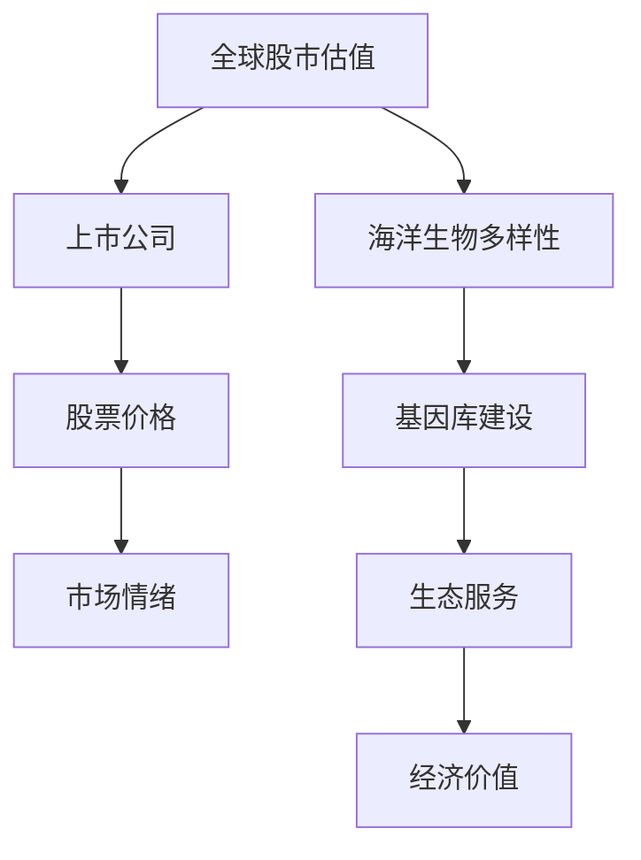
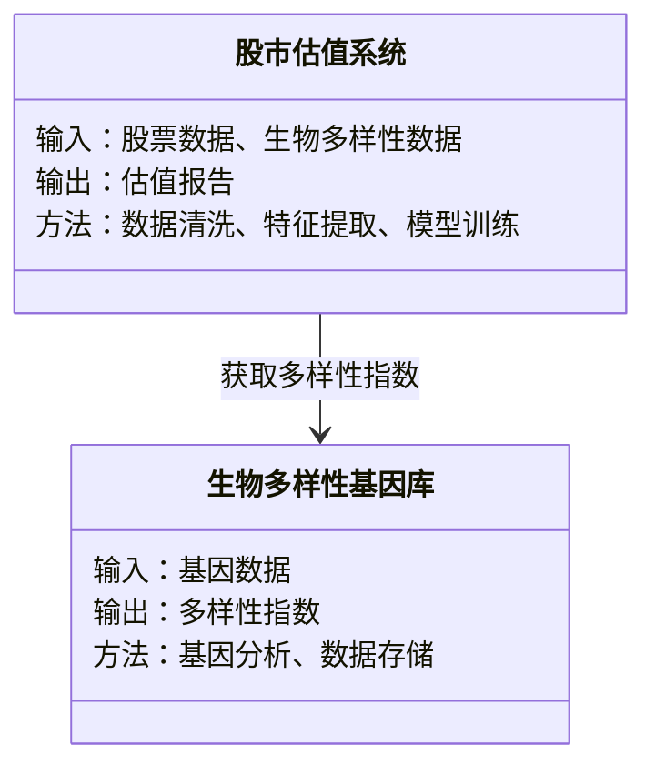
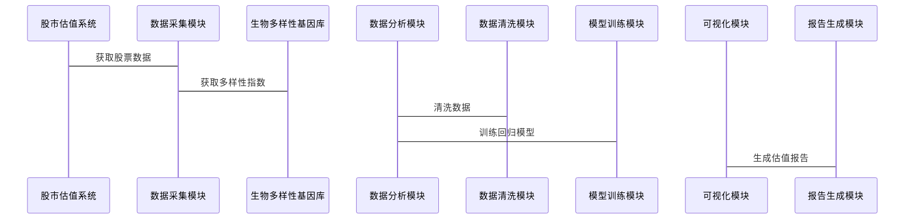

                 


# 全球股市估值与海洋生物多样性基因库建设的关系

> **关键词**：全球股市估值，海洋生物多样性，基因库建设，系统动力学模型，数据驱动决策

> **摘要**：本文探讨了全球股市估值与海洋生物多样性基因库建设之间的潜在联系。通过分析两者的核心概念、数学模型和系统架构，展示了如何利用数据驱动的方法将生物多样性保护与经济价值评估相结合。文章从背景介绍、核心概念、算法原理、系统设计、项目实战到总结，层层递进，最终提出构建一个综合性的生物多样性-经济价值评估系统，为海洋生态保护和经济可持续发展提供新的思路。

---

## 第1章: 全球股市估值与海洋生物多样性基因库建设的背景与关系

### 1.1 问题背景与问题描述

#### 1.1.1 全球股市估值的现状与挑战
全球股市估值是衡量经济发展的重要指标，反映了市场的整体健康状况。然而，近年来，股市的波动性加剧，尤其是在2020年新冠疫情爆发期间，股市经历了剧烈的震荡。这种波动不仅影响了全球经济，还揭示了传统估值模型的局限性。传统的估值方法主要依赖于财务指标，如市盈率、市净率等，但这些方法难以捕捉非财务因素，如环境风险和生物多样性变化对经济的影响。

#### 1.1.2 海洋生物多样性基因库建设的必要性
海洋生物多样性是地球上最重要的生态系统之一，它不仅支持着海洋经济（如渔业、旅游业），还为人类提供了重要的生态服务，如碳汇和氧气生产。然而，过度捕捞、污染和气候变化等因素正在严重威胁海洋生态系统的健康。建立海洋生物多样性基因库不仅是保护濒危物种的必要措施，也是维护海洋生态平衡的关键手段。

#### 1.1.3 问题解决的思路与目标
本研究旨在探索如何将海洋生物多样性基因库建设与全球股市估值相结合，通过数据驱动的方法，量化生物多样性变化对经济的影响。目标是构建一个综合性的评估系统，帮助投资者和政策制定者更好地理解环境风险，并将其纳入投资决策中。

---

### 1.2 核心概念与边界

#### 1.2.1 全球股市估值的核心概念
全球股市估值是通过对上市公司股票价格和成交量的综合分析，评估市场的整体价值。传统估值方法主要依赖财务指标，但随着环境问题的加剧，非财务因素（如生物多样性）对估值的影响日益显著。

#### 1.2.2 海洋生物多样性基因库的核心要素
海洋生物多样性基因库是保存海洋生物遗传信息的数据库，包括基因序列、物种分布和生态功能等。这些数据为研究生物多样性变化对经济的影响提供了基础。

#### 1.2.3 问题的边界与外延
本研究的边界主要集中在海洋生态系统，不涉及淡水生态系统。同时，研究重点在于基因库建设对经济的影响，不考虑其他环境因素（如空气污染）对股市的影响。

---

## 第2章: 全球股市估值与海洋生物多样性基因库建设的核心概念与联系

### 2.1 核心概念的原理与属性

#### 2.1.1 全球股市估值的原理
股市估值的核心在于通过分析上市公司的财务表现和市场情绪，预测其股票价格的变化趋势。传统方法包括市盈率（P/E）和市净率（P/B）等，但这些方法难以捕捉环境风险的影响。

#### 2.1.2 海洋生物多样性基因库的原理
基因库的建设通过收集和分析海洋生物的遗传数据，评估物种的多样性和生态功能。这些数据为研究生物多样性变化对经济的影响提供了基础。

#### 2.1.3 核心概念的属性对比
以下是全球股市估值和海洋生物多样性基因库建设的核心属性对比：

| 属性               | 全球股市估值                              | 海洋生物多样性基因库建设                        |
|--------------------|-----------------------------------------|-----------------------------------------------|
| 核心目标           | 评估市场价值                             | 保护和研究生物多样性                           |
| 数据来源           | 财务报表、市场交易数据                   | 基因序列、物种分布数据                         |
| 分析方法           | 财务指标分析、市场情绪分析               | 生物信息学分析、生态模型                        |
| 应用场景           | 投资决策、风险管理                      | 生态保护、学术研究                            |

（图：核心概念属性对比表）

---

### 2.2 概念结构与核心要素

#### 2.2.1 概念结构图
以下是全球股市估值与海洋生物多样性基因库建设的概念结构图：



#### 2.2.2 核心要素的详细描述
- **上市公司**：通过股票市场融资，其经营状况直接影响股市估值。
- **基因库建设**：通过收集和分析海洋生物的遗传数据，为研究生物多样性变化提供基础。
- **生态服务**：海洋生态系统提供的生态服务（如碳汇）对全球经济有重要影响。

---

## 第3章: 全球股市估值与海洋生物多样性基因库建设的数学模型与公式

### 3.1 数学模型的构建

#### 3.1.1 系统动力学模型
系统动力学模型用于描述生物多样性变化对股市估值的影响。模型包括以下变量：
- **B(t)**：时间t时的生物多样性指数
- **S(t)**：时间t时的股市估值
- **k**：生物多样性对股市估值的影响系数

模型公式：
$$ S(t) = \alpha B(t) + \beta S(t-1) $$

其中，$\alpha$ 和 $\beta$ 是回归系数。

#### 3.1.2 统计模型
统计模型用于分析生物多样性指数与股市估值的相关性。公式如下：
$$ \text{Correlation}(B(t), S(t)) = \frac{\sum (B(t) - \bar{B})(S(t) - \bar{S})}{\sqrt{\sum (B(t) - \bar{B})^2 \sum (S(t) - \bar{S})^2}} $$

其中，$\bar{B}$ 和 $\bar{S}$ 是生物多样性指数和股市估值的平均值。

---

### 3.2 关键公式与推导

#### 3.2.1 基因多样性指数公式
基因多样性指数（Genetic Diversity Index，GDI）用于衡量海洋生物的遗传多样性：
$$ GDI = \frac{\sum_{i=1}^{n} p_i \ln p_i}{\ln n} $$

其中，$p_i$ 是第i个物种的基因频率，$n$ 是物种总数。

#### 3.2.2 股市估值模型
基于系统动力学的股市估值模型：
$$ S(t) = \alpha B(t) + \beta S(t-1) + \epsilon $$

其中，$\epsilon$ 是误差项。

---

## 第4章: 全球股市估值与海洋生物多样性基因库建设的系统分析与架构设计

### 4.1 系统分析

#### 4.1.1 问题场景介绍
系统需要同时处理股市数据和生物多样性数据，实现对股市估值的动态评估。数据来源包括股票市场、基因库和环境监测机构。

#### 4.1.2 领域模型设计（Mermaid类图）
以下是领域模型设计图：



#### 4.1.3 系统架构设计（Mermaid架构图）
以下是系统架构设计图：

```mermaid
container 股市估值系统 {
    component 数据采集模块 {
        数据源：股票市场、基因库
    }
    component 数据分析模块 {
        方法：回归分析、聚类分析
    }
    component 可视化模块 {
        输出：估值报告、图表
    }
}
```

### 4.2 接口与交互设计

#### 4.2.1 系统接口设计
以下是系统接口设计图：



---

## 第5章: 全球股市估值与海洋生物多样性基因库建设的项目实战

### 5.1 环境安装与工具准备

#### 5.1.1 Python环境安装
安装Python 3.8或更高版本。

#### 5.1.2 数据库安装与配置
使用MySQL或PostgreSQL存储基因数据和股市数据。

#### 5.1.3 开发工具安装
安装Jupyter Notebook、PyCharm等开发工具。

### 5.2 核心实现与代码解读

#### 5.2.1 数据采集模块实现
以下是数据采集模块的代码示例：

```python
import pandas as pd
import requests

# 下载股票数据
def get_stock_data(ticker):
    url = f"https://api.example.com/stock/{ticker}"
    response = requests.get(url)
    return pd.DataFrame(response.json())

# 下载生物多样性数据
def get_biodiversity_data():
    url = "https://api.example.com/biodiversity"
    response = requests.get(url)
    return pd.DataFrame(response.json())
```

#### 5.2.2 数据分析模块实现
以下是数据分析模块的代码示例：

```python
from sklearn.linear_model import LinearRegression

def train_model(stock_data, biodiversity_data):
    model = LinearRegression()
    model.fit(stock_data[['BiodiversityIndex']], stock_data['StockValue'])
    return model
```

#### 5.2.3 可视化模块实现
以下是可视化模块的代码示例：

```python
import matplotlib.pyplot as plt

def plot_relationship(data):
    plt.scatter(data['BiodiversityIndex'], data['StockValue'])
    plt.xlabel('Biodiversity Index')
    plt.ylabel('Stock Value')
    plt.title('Relationship between Biodiversity and Stock Value')
    plt.show()
```

### 5.3 实际案例分析

#### 5.3.1 数据准备
从基因库获取海洋生物多样性指数数据，从股票市场获取相关股票的收盘价数据。

#### 5.3.2 数据分析与建模
使用回归分析模型，分析生物多样性指数与股票估值的相关性。

#### 5.3.3 结果展示
绘制生物多样性指数与股票估值的散点图，展示两者之间的相关性。

---

## 第6章: 全球股市估值与海洋生物多样性基因库建设的最佳实践与总结

### 6.1 最佳实践 tips

#### 6.1.1 数据采集
- 确保数据的准确性和完整性。
- 定期更新数据以反映最新的市场变化。

#### 6.1.2 系统设计
- 使用模块化设计，便于扩展和维护。
- 选择合适的算法，提高模型的准确性和效率。

#### 6.1.3 项目实施
- 与环保组织和金融机构合作，获取高质量的数据。
- 定期进行系统测试，确保数据处理和分析的准确性。

### 6.2 总结

本文探讨了全球股市估值与海洋生物多样性基因库建设之间的关系，提出了构建一个综合性的评估系统的方法。通过数据驱动的方式，将生物多样性保护与经济价值评估相结合，为海洋生态保护和经济可持续发展提供了新的思路。

### 6.3 注意事项

- 数据隐私和安全问题需要高度重视。
- 算法的优化和模型的改进是未来研究的重要方向。

### 6.4 拓展阅读

- 推荐阅读《系统动力学在金融中的应用》和《生物信息学与环境科学》。

---

## 作者

**作者**：AI天才研究院/AI Genius Institute & 禅与计算机程序设计艺术 /Zen And The Art of Computer Programming

---

通过本文的详细分析，我们展示了如何将全球股市估值与海洋生物多样性基因库建设结合起来，为环境保护和经济发展提供新的解决方案。希望本文能为相关领域的研究者和实践者提供有价值的参考。

