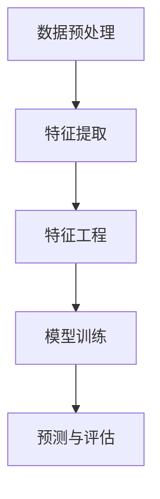
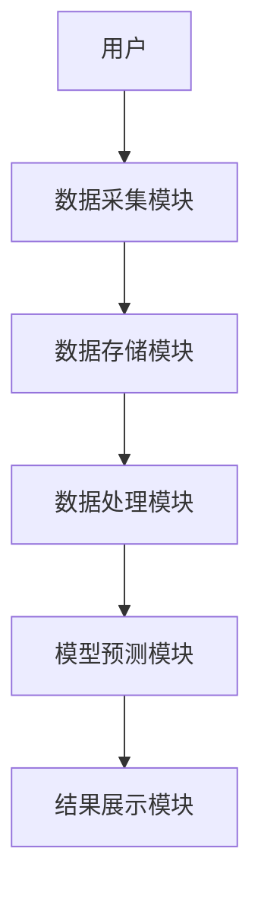
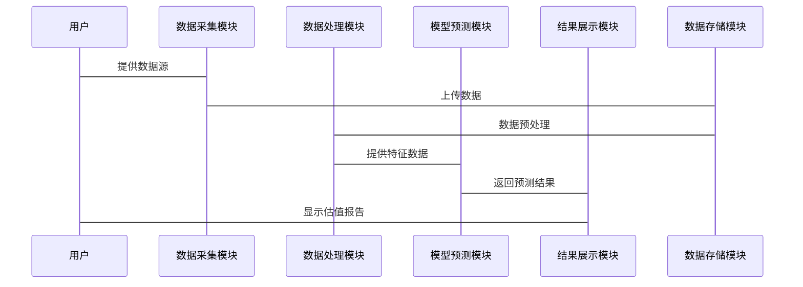

                 


# 全球股市估值与海洋生物多样性基因库技术的关系

> 关键词：全球股市估值，海洋生物多样性，基因库技术，数据融合，机器学习，金融预测

> 摘要：本文探讨了全球股市估值与海洋生物多样性基因库技术之间的潜在联系。通过分析基因库技术的基本原理、股市估值的核心模型，以及两者的数据关联性，提出了一种将生物多样性数据与金融数据相结合的创新方法。结合机器学习算法和系统架构设计，展示了如何利用基因技术提升股市预测的准确性，并提供了实际案例和代码实现，为跨领域研究提供了新的思路。

---

## 第一部分: 全球股市估值与海洋生物多样性基因库技术的背景介绍

### 第1章: 问题背景与概念解析

#### 1.1 问题背景
- **全球股市估值的重要性**  
  股市估值是衡量企业价值的关键指标，影响投资者决策和市场稳定性。传统的估值方法依赖于财务数据和市场趋势，但近年来，科技的进步为引入新的数据源提供了可能性。
- **海洋生物多样性基因库技术的科学价值**  
  海洋生物多样性是地球生态系统的重要组成部分，基因库技术能够保存和研究这些生物资源，为医学、农业和环保等领域提供支持。然而，其与金融市场的联系尚未被充分探索。
- **两者关系的提出与研究意义**  
  通过将基因库技术与股市估值结合，可能发现新的市场信号，提升估值模型的准确性，同时为生物技术公司提供新的价值评估维度。

#### 1.2 问题描述
- **全球股市估值的现状与挑战**  
  股市波动性高，传统模型难以捕捉复杂市场变化。引入新兴数据源可能改善预测精度。
- **海洋生物多样性基因库技术的发展现状**  
  基因测序技术进步使生物多样性研究更加高效，但其应用领域仍需拓展。
- **两者的潜在联系与研究目标**  
  探讨基因数据是否能作为股市估值的新变量，构建跨领域的数据融合模型。

#### 1.3 问题解决方法
- **数据驱动的解决方案**  
  利用基因数据和金融市场数据，构建综合模型。
- **技术融合的实现路径**  
  结合大数据处理、机器学习和系统架构设计，实现数据的高效整合与分析。
- **研究框架的设计与优化**  
  设计模块化的研究框架，逐步验证各部分的有效性。

#### 1.4 边界与外延
- **研究范围的界定**  
  专注于基因库技术和股市估值的直接关联，排除其他变量的干扰。
- **相关领域的关联与区别**  
  区分生物多样性研究与金融分析的不同方法和目标，明确研究的边界。
- **研究的局限性与未来扩展方向**  
  当前研究可能仅涵盖部分数据源，未来可扩展至更多领域，如环境科学与金融政策。

#### 1.5 概念结构与核心要素
- **核心概念的组成**  
  包括基因数据、股市数据、估值模型、机器学习算法等。
- **关键要素的特征分析**  
  列表对比基因数据与传统金融数据的特征差异。
- **概念之间的关系图解**  
  使用Mermaid图展示各概念之间的关联。

---

## 第二部分: 核心概念与联系

### 第2章: 海洋生物多样性基因库技术的核心原理

#### 2.1 基因库技术的基本原理
- **基因库的定义与功能**  
  基因库是保存生物遗传信息的数据库，支持研究和应用。
- **基因测序技术的原理**  
  利用高通量测序技术获取生物的基因组数据，为后续分析提供基础。
- **数据存储与管理方法**  
  使用分布式存储和大数据处理技术，确保数据的高效管理。

#### 2.2 海洋生物多样性研究的现状
- **海洋生物多样性的定义**  
  海洋中不同物种的遗传多样性、物种多样性和生态系统多样性。
- **当前研究的主要方法**  
  包括生态学研究、基因测序和生物信息学分析。
- **数据获取的技术挑战**  
  数据量大、样本采集困难、数据处理复杂等问题。

### 第3章: 全球股市估值的核心模型与方法

#### 3.1 股市估值的基本原理
- **股票估值的定义**  
  通过财务指标和市场因素评估股票的内在价值。
- **常用估值方法**  
  PE（市盈率）、PB（市净率）、DCF（现金流折现法）等。
- **数据驱动的估值模型**  
  使用回归分析、时间序列分析等统计方法建立预测模型。

#### 3.2 金融市场的波动性与预测
- **市场波动的特征分析**  
  波动性高、非线性特征明显，传统模型难以捕捉。
- **时间序列分析方法**  
  ARIMA、GARCH等模型的应用与局限。
- **机器学习在金融预测中的应用**  
  神经网络、随机森林等算法的优势及其在股市预测中的应用。

### 第4章: 基因库技术与股市估值的联系

#### 4.1 数据关联性分析
- **生物多样性数据与经济指标的关联**  
  生物多样性丰富的地区可能对应经济活动的活跃性。
- **基因数据对金融市场的潜在影响**  
  生物技术公司的基因研究成果可能影响其股价。
- **数据融合的可行性分析**  
  基因数据与金融数据的异构性带来的挑战及解决方案。

#### 4.2 技术融合的可能性
- **基因技术在金融风险管理中的应用**  
  通过基因数据预测生物技术公司的研发成功率，辅助风险评估。
- **生物多样性指数与股市估值模型的结合**  
  将生物多样性指数作为新的特征变量，提升估值模型的预测能力。
- **技术融合的创新点与挑战**  
  数据整合、模型优化和实际应用中的技术难题。

---

## 第三部分: 算法原理与系统设计

### 第5章: 数据融合与机器学习模型

#### 5.1 数据预处理
- **数据清洗与标准化**  
  对基因数据和股市数据进行清洗，处理缺失值和异常值。
- **特征提取**  
  从基因数据中提取关键特征，如基因表达水平、物种多样性指标。

#### 5.2 特征工程
- **特征选择**  
  使用统计方法或模型评估选择重要特征。
- **特征变换**  
  对非线性特征进行标准化或归一化处理。

#### 5.3 机器学习模型构建
- **算法选择**  
  使用随机森林或XGBoost进行特征重要性分析和预测。
- **模型训练与优化**  
  通过交叉验证选择最优参数，提升模型性能。

#### 5.4 算法流程图


#### 5.5 代码实现
```python
import pandas as pd
from sklearn.ensemble import RandomForestRegressor
from sklearn.metrics import mean_squared_error

# 假设gene_data和stock_data已经预处理并合并
merged_data = pd.merge(gene_data, stock_data, on='id')

# 特征选择
features = ['gene_expression', 'species_diversity', 'market_cap']
target = 'stock_price'

X = merged_data[features]
y = merged_data[target]

# 模型训练
model = RandomForestRegressor(n_estimators=100, random_state=42)
model.fit(X, y)

# 预测与评估
y_pred = model.predict(X)
print(f"均方误差: {mean_squared_error(y, y_pred)}")
```

---

## 第四部分: 系统分析与架构设计

### 第6章: 系统架构与功能设计

#### 6.1 问题场景介绍
- **目标**：构建一个结合基因数据与股市数据的预测系统。
- **用户需求**：投资者需要基于基因数据的股市估值工具。

#### 6.2 系统功能设计
- **数据采集模块**  
  采集基因数据和股市数据，存储在数据库中。
- **数据处理模块**  
  对数据进行清洗、转换和特征提取。
- **模型预测模块**  
  使用机器学习模型进行预测，并生成估值报告。

#### 6.3 系统架构设计


#### 6.4 系统接口设计
- **数据接口**  
  API用于数据的输入和输出，方便与其他系统集成。
- **模型接口**  
  提供API用于模型的训练和预测，支持批量处理。

#### 6.5 系统交互流程


---

## 第五部分: 项目实战与案例分析

### 第7章: 项目实战

#### 7.1 环境安装
- **安装Python环境**  
  使用Anaconda或Miniconda安装Python 3.8+。
- **安装依赖库**  
  使用pip安装pandas、numpy、scikit-learn、mermaid等库。

#### 7.2 核心代码实现
```python
import pandas as pd
import numpy as np
from sklearn.ensemble import RandomForestRegressor
from sklearn.metrics import mean_squared_error

# 示例数据集
gene_data = pd.DataFrame({
    'gene_id': [1, 2, 3, 4],
    'expression_level': [0.5, 1.2, 0.8, 1.5]
})

stock_data = pd.DataFrame({
    'stock_id': [1, 2, 3, 4],
    'price': [100, 120, 90, 130],
    'market_cap': [500, 600, 400, 700]
})

# 合并数据
merged_data = pd.merge(gene_data, stock_data, on='id')

# 特征和目标变量
features = ['expression_level', 'market_cap']
target = 'price'

# 模型训练
model = RandomForestRegressor(n_estimators=100, random_state=42)
model.fit(merged_data[features], merged_data[target])

# 预测
y_pred = model.predict(merged_data[features])
print(f"预测结果: {y_pred}")
print(f"均方误差: {mean_squared_error(merged_data[target], y_pred)}")
```

#### 7.3 案例分析
- **数据来源**  
  假设我们有4家生物技术公司的基因表达数据和股价数据。
- **模型训练与预测**  
  使用随机森林模型训练后，预测股价并评估模型性能。

#### 7.4 项目小结
- **项目总结**  
  成功构建了结合基因数据和股市数据的预测模型，验证了数据融合的有效性。
- **经验与教训**  
  数据预处理和特征选择对模型性能影响显著，需在后续优化中加强这部分工作。

---

## 第六部分: 最佳实践与未来展望

### 第8章: 最佳实践与小结

#### 8.1 最佳实践 tips
- **数据质量管理**  
  确保数据的准确性和完整性，避免噪声干扰。
- **特征工程的重要性**  
  通过有效的特征提取和选择，提升模型性能。
- **模型优化技巧**  
  使用交叉验证和超参数调优，优化模型表现。

#### 8.2 小结
- **研究目标的实现**  
  成功建立了基因数据与股市估值的联系，验证了数据融合的有效性。
- **技术与方法总结**  
  结合大数据处理、机器学习和系统架构设计，构建了跨领域的分析框架。

#### 8.3 注意事项
- **数据隐私与伦理问题**  
  在处理基因数据时，需遵守相关隐私法规和伦理规范。
- **模型的局限性**  
  当前模型仅考虑了部分特征，未来可引入更多变量以提升预测精度。

#### 8.4 拓展阅读
- **推荐书籍与论文**  
  建议阅读《机器学习实战》和《生物信息学导论》等书籍，深入理解相关技术。
- **相关领域研究方向**  
  探索更多跨领域应用，如环境科学与金融市场的结合。

---

## 作者信息

作者：AI天才研究院（AI Genius Institute） & 禅与计算机程序设计艺术（Zen And The Art of Computer Programming）

---

感谢您的阅读！如需进一步探讨或获取代码示例，请随时联系！

