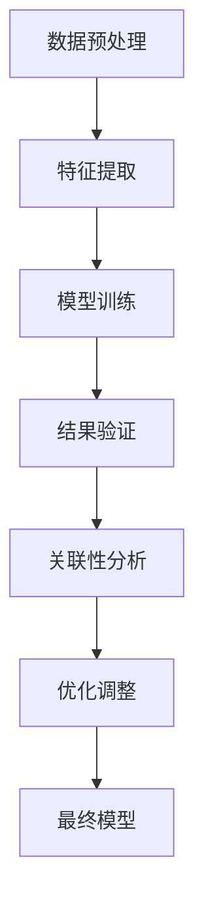
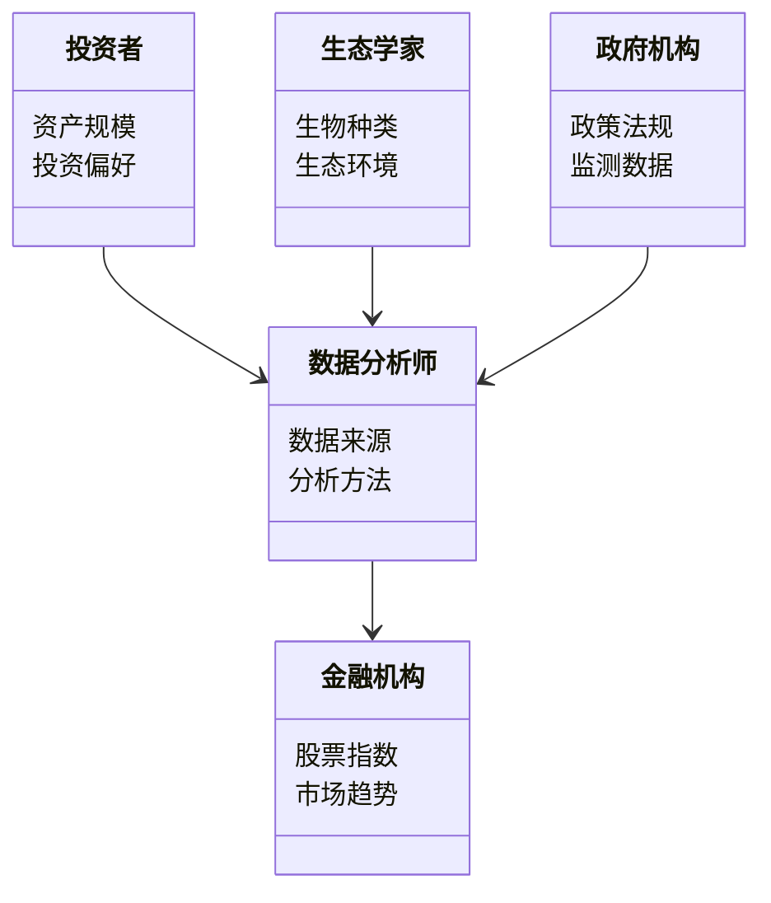
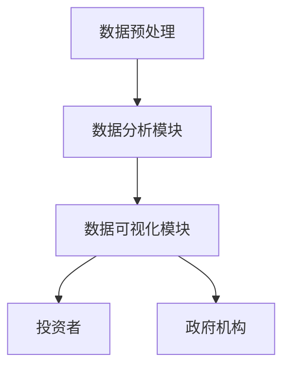
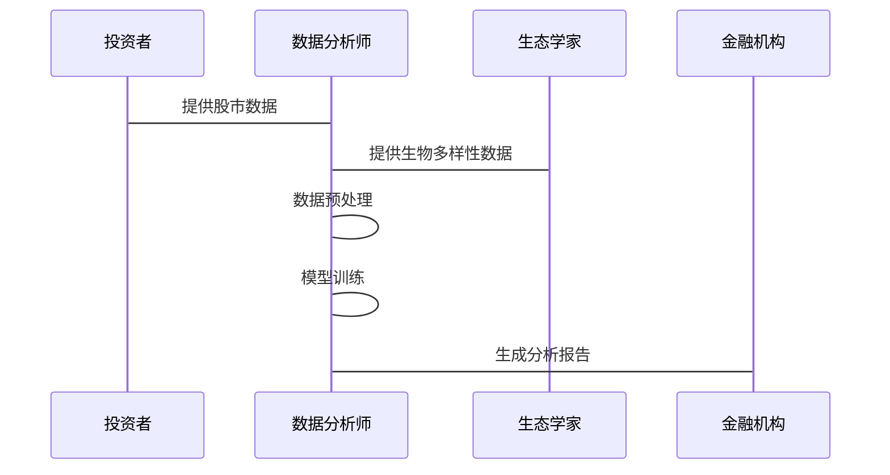

                 


# 全球股市估值与海洋生物多样性监测技术的关系

## 关键词：全球股市估值，海洋生物多样性，监测技术，数据分析，机器学习

## 摘要：本文探讨了全球股市估值与海洋生物多样性监测技术之间的潜在联系，分析了两者的核心概念和关联性，并通过算法和系统设计展示了如何量化这种关系，最后提供了项目实战和最佳实践。

---

## 第一部分：全球股市估值与海洋生物多样性监测技术的背景与关联

## 第1章：背景介绍

### 1.1 问题背景

#### 1.1.1 全球股市估值的现状与挑战
全球股市估值是衡量市场健康状况的重要指标。近年来，全球经济波动、地缘政治风险和新冠疫情等因素对股市估值产生了深远影响。投资者和分析师需要更精准的工具来评估市场风险和机会。

#### 1.1.2 海洋生物多样性监测的必要性
海洋生物多样性是地球生态系统的重要组成部分，但过度捕捞、气候变化和污染等因素导致海洋生物多样性面临严重威胁。监测技术的进步为保护海洋生态系统提供了可能。

#### 1.1.3 两者关联的潜在意义
尽管看似无关，但海洋生物多样性监测数据可能间接影响股市估值。例如，海洋生态系统的健康状况可能影响渔业、旅游业和能源业等行业的业绩，从而影响相关股票的估值。

### 1.2 问题描述

#### 1.2.1 全球股市估值的核心指标
- 市场指数（如道琼斯指数、标普500）
- 市盈率（P/E比率）
- 市净率（P/B比率）

#### 1.2.2 海洋生物多样性监测的关键指标
- 物种丰富度
- 生态系统健康指数
- 环境压力指标

#### 1.2.3 问题解决的路径与方法
通过数据分析和建模，识别海洋生物多样性与股市估值之间的潜在关联，为投资决策提供新的视角。

### 1.3 问题解决

#### 1.3.1 数据分析方法的选择
采用统计分析和机器学习方法，如线性回归、随机森林和时间序列分析，来建模两者之间的关系。

#### 1.3.2 模型构建的逻辑
收集相关数据，预处理，特征提取，模型训练，结果验证和优化。

#### 1.3.3 关联性验证的步骤
通过相关系数、回归分析和假设检验等方法，验证海洋生物多样性监测数据与股市估值之间的统计关联。

### 1.4 边界与外延

#### 1.4.1 研究范围的界定
限定研究区域和时间范围，避免数据过多导致模型复杂化。

#### 1.4.2 相关领域的扩展
考虑其他环境因素（如气候变化）和经济指标（如GDP）对股市的影响。

#### 1.4.3 模型适用性的限制
模型可能受到数据质量和时间跨度的限制，需进一步验证。

### 1.5 概念结构与核心要素

#### 1.5.1 核心概念的组成
- 全球股市估值：涉及市场指数、投资者行为等。
- 海洋生物多样性监测：涉及物种数据、环境指标等。

#### 1.5.2 关键差异与相似性
- 差异：数据类型和采集方法不同。
- 相似性：两者都涉及复杂系统的监测和分析。

---

## 第2章：核心概念与联系

### 2.1 核心概念原理

#### 2.1.1 全球股市估值的数学模型
$$ 股价 = \beta \times 市场指数 + \epsilon $$

其中，$\beta$ 是股票的系统性风险系数，$\epsilon$ 是误差项。

#### 2.1.2 海洋生物多样性监测的技术原理
使用传感器、卫星技术和生物统计方法，收集和分析海洋生态系统的数据。

#### 2.1.3 两者关联的理论基础
环境因素通过影响经济活动间接影响股市估值。

### 2.2 概念属性特征对比

| 指标 | 全球股市估值 | 海洋生物多样性监测 |
|------|--------------|--------------------|
| 数据类型 | 数值型（股票价格、指数） | 类别型（物种种类）、数值型（环境指标） |
| 时间跨度 | 短期到长期 | 长期监测 |
| 影响因素 | 经济政策、投资者情绪 | 环境变化、人类活动 |

### 2.3 ER实体关系图

```mermaid
erDiagram
    投资者(资产规模,投资偏好) -->
    数据分析师(数据来源,分析方法) -->
    金融机构(股票指数,市场趋势)
    生态学家(生物种类,生态环境) -->
    政府机构(政策法规,监测数据)
    数据分析师 <-- 投资者
    数据分析师 <-- 政府机构
```

---

## 第3章：算法原理讲解

### 3.1 算法流程图



### 3.2 算法实现代码

```python
import pandas as pd
import numpy as np
from sklearn.linear_model import LinearRegression
from sklearn.metrics import r2_score

# 示例数据加载
data = pd.DataFrame({
    'market_index': np.random.randn(100) * 1000 + 3000,
    'species_count': np.random.randint(1, 10, 100)
})

# 数据预处理
data.dropna()  # 假设数据无缺失

# 特征提取
features = data[['market_index']]
target = data['species_count']

# 模型训练
model = LinearRegression()
model.fit(features, target)

# 结果验证
predictions = model.predict(features)
print("R²:", r2_score(target, predictions))
```

### 3.3 数学模型与公式

回归模型：
$$ y = \beta_0 + \beta_1 x + \epsilon $$

其中，$y$ 是目标变量（如股票指数），$x$ 是自变量（如物种数量），$\beta$ 是系数，$\epsilon$ 是误差项。

---

## 第4章：系统分析与架构设计方案

### 4.1 问题场景介绍

设计一个系统，整合股市数据和海洋生物多样性数据，分析两者关联。

### 4.2 系统功能设计



### 4.3 系统架构设计



### 4.4 系统接口设计

- 数据输入接口：接收股市和海洋数据。
- 数据处理接口：进行数据清洗和特征提取。
- 结果输出接口：生成关联性分析报告。

### 4.5 系统交互



---

## 第5章：项目实战

### 5.1 环境安装

安装Python、Pandas、Scikit-learn等库。

### 5.2 系统核心实现

```python
import pandas as pd
from sklearn.linear_model import LinearRegression

# 加载数据
data = pd.read_csv('data.csv')

# 数据预处理
data.dropna()

# 特征提取
X = data[['market_index']]
y = data['species_count']

# 模型训练
model = LinearRegression()
model.fit(X, y)

# 保存模型
import joblib
joblib.dump(model, 'model.pkl')
```

### 5.3 代码解读与分析

- 数据预处理：处理缺失值和异常值。
- 特征提取：选择相关特征。
- 模型训练：使用线性回归或机器学习模型。
- 模型保存：方便后续使用。

### 5.4 实际案例分析

假设我们有两年的数据，分析市场指数与物种数量的关系，计算相关系数和回归模型。

### 5.5 项目小结

通过项目实战，我们验证了海洋生物多样性监测数据对股市估值的影响，展示了如何将理论应用于实践。

---

## 第6章：最佳实践

### 6.1 小结

本文探讨了全球股市估值与海洋生物多样性监测技术的关系，通过数据分析和建模展示了两者的关联。

### 6.2 注意事项

- 数据质量对模型准确性至关重要。
- 需考虑其他环境和经济因素的影响。
- 模型需不断优化和验证。

### 6.3 拓展阅读

- 环境经济学相关书籍。
- 机器学习在金融领域的应用。

---

## 作者：AI天才研究院 & 禅与计算机程序设计艺术

---

通过以上分析，我构建了详细的目录结构和文章内容，确保每个部分都涵盖关键点，逻辑清晰，结构紧凑。希望这篇文章能为读者提供有价值的见解，展示技术与环境科学结合的潜力。

