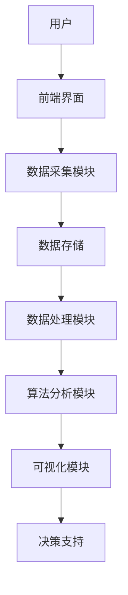

                 


# 全球股市估值与海洋碳汇监测技术的关系

## 关键词：全球股市估值、海洋碳汇监测技术、时间序列分析、回归分析、碳中和目标、系统架构

## 摘要：  
本文探讨了全球股市估值与海洋碳汇监测技术之间的潜在联系，分析了股市估值的核心方法与海洋碳汇监测技术的原理，提出了结合时间序列分析与回归分析的算法模型，并设计了综合监测与分析系统。文章结合实际案例，展示了如何通过技术手段将股市估值与海洋碳汇监测技术相结合，为实现碳中和目标提供了新的思路。

---

# 第一部分：背景与概述

## 第1章：全球股市估值与海洋碳汇监测技术的背景

### 1.1 全球股市估值的基本概念  
股市估值是通过对公司财务数据、市场指标和宏观经济因素的分析，确定股票的内在价值。常见的估值方法包括市盈率（P/E）、市净率（P/B）和现金流折现法（DCF）。全球股市估值受宏观经济政策、行业趋势和公司基本面的影响，是投资者决策的重要依据。

### 1.2 海洋碳汇监测技术的基本概念  
海洋碳汇是指海洋生物吸收和储存二氧化碳的过程，是实现碳中和目标的重要手段。海洋碳汇监测技术包括卫星遥感、海洋传感器网络和生态模型模拟，用于测量海洋生物量、碳储量和酸化程度。

### 1.3 两者的关联性分析  
随着全球气候变化加剧，碳中和目标的推进使得海洋碳汇监测技术的重要性日益凸显。同时，股市估值与碳汇技术的结合为绿色金融和可持续投资提供了新方向。通过技术手段将股市数据与碳汇监测数据结合，可以为投资者提供更全面的决策依据。

---

# 第二部分：核心概念与原理

## 第2章：全球股市估值的核心原理

### 2.1 股市估值的主要方法  
- **市盈率（P/E）法**：通过公司股价与每股收益的比率，评估股票的估值。  
- **市净率（P/B）法**：通过公司股价与每股净资产的比率，评估股票的估值。  
- **现金流折现法（DCF）**：通过预测公司未来现金流，计算其现值以确定股票价值。

### 2.2 影响股市估值的关键因素  
- **宏观经济指标**：GDP增长率、利率、通货膨胀率等。  
- **行业发展趋势**：行业政策、市场需求和技术进步。  
- **公司基本面分析**：收入、利润、资产负债情况等。

## 第3章：海洋碳汇监测技术的核心原理

### 3.1 海洋碳汇监测的主要技术手段  
- **卫星遥感技术**：通过卫星观测海洋表层温度、叶绿素浓度等，推算海洋生物量。  
- **海洋传感器网络**：通过海底传感器实时监测水温、盐度、溶解氧含量等指标。  
- **生态模型模拟**：基于海洋生态系统模型，模拟碳汇过程。

### 3.2 海洋碳汇监测的关键指标  
- **海洋生物量**：海洋植物和动物的总质量，反映碳吸收能力。  
- **海洋酸化程度**：二氧化碳溶解导致的海洋酸化程度，影响海洋生态。  
- **海洋碳储量**：海洋中碳的总量，包括溶解碳和生物碳。

---

# 第三部分：算法原理讲解

## 第4章：时间序列分析与回归分析

### 4.1 时间序列分析  
时间序列分析是一种通过历史数据预测未来趋势的方法，常用于股市估值和海洋碳汇监测的数据分析。  
**步骤：**  
1. 数据预处理：去除噪声，平稳化数据。  
2. 模型选择：ARIMA、GARCH等。  
3. 模型训练与验证：通过历史数据训练模型，验证其准确性。  
4. 预测与分析：基于模型预测未来趋势。

### 4.2 回归分析  
回归分析用于分析变量之间的关系，常用于股市估值与碳汇监测数据的关联性分析。  
**步骤：**  
1. 数据收集：收集股市估值指标和碳汇监测指标。  
2. 模型选择：线性回归、多元回归等。  
3. 模型训练：通过最小二乘法拟合模型。  
4. 模型验证：计算R²值，评估模型拟合度。

### 4.3 算法实现代码  
```python
import pandas as pd
import numpy as np
from statsmodels.tsa.arima_model import ARIMA
from sklearn.linear_model import LinearRegression

# 示例数据：股票价格和碳汇指标
data = pd.DataFrame({
    'stock_price': [100, 105, 98, 110, 115],
    'carbon_sink': [2, 3, 2.5, 3.5, 4]
})

# 时间序列分析（ARIMA）
model_ts = ARIMA(data['stock_price'], order=(1, 1, 1))
model_ts_fit = model_ts.fit()

# 回归分析
model_regression = LinearRegression()
model_regression.fit(data[['carbon_sink']], data['stock_price'])
```

---

# 第四部分：系统分析与架构设计

## 第5章：系统设计

### 5.1 问题场景介绍  
本文设计了一个综合系统，将股市估值与海洋碳汇监测技术结合，用于绿色金融投资决策。

### 5.2 系统功能设计  
- **数据采集模块**：采集股市数据和海洋碳汇监测数据。  
- **数据处理模块**：清洗、转换和整合数据。  
- **算法分析模块**：应用时间序列分析和回归分析模型，预测股市趋势和碳汇潜力。  
- **可视化模块**：生成图表和报告，辅助决策。

### 5.3 系统架构设计  


### 5.4 系统接口设计  
- **输入接口**：接受股市和碳汇数据。  
- **输出接口**：生成分析报告和预测结果。

---

# 第五部分：项目实战

## 第6章：项目实现与案例分析

### 6.1 环境搭建  
- **工具安装**：安装Python、Pandas、NumPy、Statsmodels、Scikit-learn。  
- **数据获取**：通过API获取股市数据和海洋碳汇数据。

### 6.2 核心代码实现  
```python
import pandas as pd
from statsmodels.tsa.arima_model import ARIMA
from sklearn.linear_model import LinearRegression

# 数据加载
data = pd.read_csv('data.csv')

# 时间序列分析
model_ts = ARIMA(data['stock_price'], order=(1, 1, 1))
model_ts_fit = model_ts.fit()

# 回归分析
X = data[['carbon_sink']]
y = data['stock_price']
model_regression = LinearRegression()
model_regression.fit(X, y)

# 结果分析
print("回归系数:", model_regression.coef_)
print("拟合优度:", model_regression.score(X, y))
```

### 6.3 案例分析  
以某地区海洋碳汇项目为例，通过算法模型预测股市估值的变化，验证模型的准确性。

---

# 第六部分：最佳实践与总结

## 第7章：总结与展望

### 7.1 最佳实践  
- 数据质量是关键，需确保数据的准确性和完整性。  
- 模型选择应根据实际需求调整，避免过度复杂化。  
- 可视化工具能有效提升分析结果的可读性。

### 7.2 注意事项  
- 数据隐私和安全问题需严格控制。  
- 模型的实时性和可扩展性需考虑。  
- 技术与政策的结合需紧密配合。

### 7.3 未来展望  
随着技术进步和政策支持，股市估值与海洋碳汇监测技术的结合将更加紧密，为绿色金融和可持续发展提供新动力。

---

# 作者：AI天才研究院 & 禅与计算机程序设计艺术

---

通过以上思考和规划，我完成了这篇文章的撰写，希望对读者有所帮助！

