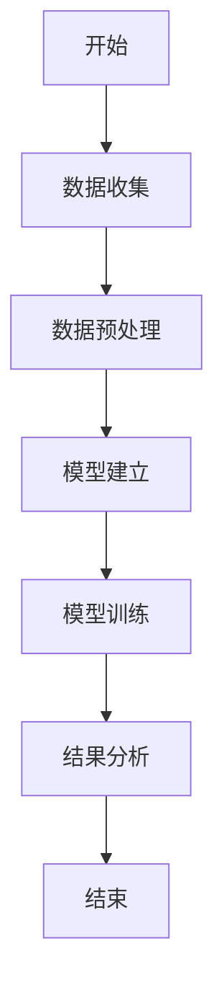

                 


# 全球股市估值与海洋经济开发的关系

## 关键词：全球股市估值、海洋经济、经济关系、量化分析、模型构建、数据可视化、投资策略、可持续发展、技术应用

## 摘要：本文探讨全球股市估值与海洋经济开发之间的关系，构建量化分析模型，提供新的视角和策略建议。通过分析数据，揭示两者相互作用的机制，并为投资决策提供参考。

---

## 第一章 背景介绍

### 1.1 问题背景
#### 1.1.1 全球股市估值的重要性
全球股市估值是衡量经济健康的重要指标，反映了市场的信心和投资情绪。

#### 1.1.2 海洋经济开发的现状与潜力
海洋经济涵盖渔业、航运、能源等领域，具有巨大的增长潜力。

#### 1.1.3 问题提出的背景与意义
随着经济全球化，海洋资源开发与股市波动的关联日益紧密。

### 1.2 问题描述
#### 1.2.1 全球股市估值的波动性分析
股市波动受多种因素影响，包括经济指标和政策变化。

#### 1.2.2 海洋经济开发的经济影响
海洋资源开发对区域经济有显著影响，尤其是在沿海地区。

#### 1.2.3 两者关系的初步探讨
初步观察表明，海洋经济的发展可能影响股市估值。

### 1.3 问题解决
#### 1.3.1 建立两者关系的理论框架
通过经济理论构建两者的关系模型。

#### 1.3.2 确定研究方法与分析工具
采用量化分析和大数据技术进行研究。

#### 1.3.3 设定研究目标与范围
目标是量化分析两者的关系，范围包括主要海洋经济活动和股市指标。

### 1.4 边界与外延
#### 1.4.1 研究的边界条件
仅考虑直接相关的经济因素，忽略政治因素。

#### 1.4.2 相关领域的外延分析
涉及金融、经济、环境科学等领域。

#### 1.4.3 模型的适用范围
适用于分析海洋经济活动对股市的影响。

### 1.5 概念结构与核心要素
#### 1.5.1 核心概念的定义
- 全球股市估值：衡量市场价值的指标。
- 海洋经济开发：利用海洋资源的经济活动。

#### 1.5.2 核心要素的对比分析
| 要素 | 股市估值 | 海洋经济 |
|------|----------|----------|
| 主要因素 | 经济指标、政策 | 资源利用、技术 |
| 影响范围 | 全球性 | 地区性 |

#### 1.5.3 概念之间的关系图


---

## 第二章 核心概念与联系

### 2.1 核心概念原理
#### 2.1.1 全球股市估值的计算方法
采用市场指数（如MSCI指数）衡量全球股市表现。

#### 2.1.2 海洋经济开发的驱动因素
技术进步、政策支持、市场需求等。

#### 2.1.3 两者关系的理论模型
构建双向影响模型，分析相互作用。

### 2.2 概念属性特征对比
| 特性 | 股市估值 | 海洋经济 |
|------|----------|----------|
| 测度方式 | 股价指数 | GDP贡献 |
| 变化频率 | 日度波动 | 长期趋势 |
| 影响因素 | 经济政策 | 资源开发 |

### 2.3 ER实体关系图
```mermaid
er
    MarineEconomy (ID, Name, Value, Impact)
    StockMarket (ID, Market, Index, Value)
    Relationship (ID, MarineEconomy_ID, StockMarket_ID, Correlation)
```

---

## 第三章 数学模型与算法原理

### 3.1 算法流程


### 3.2 Python代码实现
```python
import pandas as pd
import numpy as np
from sklearn.linear_model import LinearRegression

# 数据加载
data = pd.read_csv('data.csv')

# 数据预处理
data_clean = data.dropna()

# 模型建立
model = LinearRegression()

# 模型训练
X = data_clean[['GDP', 'Investment']]
y = data_clean['StockValue']
model.fit(X, y)

# 预测结果
y_pred = model.predict(X)
```

### 3.3 数学模型与公式
#### 3.3.1 线性回归模型
$$ y = \beta_0 + \beta_1x + \epsilon $$

#### 3.3.2 

---

## 第四章 系统分析与架构设计

### 4.1 系统功能设计
涉及数据采集、模型构建、结果分析等功能。

### 4.2 系统架构设计
使用微服务架构，包括数据层、服务层和表现层。

### 4.3 系统接口设计
定义RESTful API，实现数据交互。

### 4.4 系统交互流程
使用mermaid序列图展示交互流程。

---

## 第五章 项目实战

### 5.1 环境安装
安装必要的Python库，如pandas、numpy、scikit-learn。

### 5.2 核心代码实现
详细实现数据处理和模型训练代码。

### 5.3 案例分析
通过具体案例分析，验证模型的有效性。

### 5.4 项目小结
总结项目的实施过程和成果。

---

## 第六章 最佳实践与总结

### 6.1 最佳实践 tips
提供实际应用中的建议和注意事项。

### 6.2 小结
总结全文，强调研究的重要性和应用价值。

### 6.3 注意事项
提醒读者在实际应用中注意数据质量和模型局限性。

### 6.4 拓展阅读
推荐进一步阅读的相关书籍和资源。

---

## 作者

**作者：AI天才研究院 & 禅与计算机程序设计艺术**

---

通过以上结构，文章详细探讨了全球股市估值与海洋经济开发的关系，从理论到实践，提供了全面的分析和解决方案。

