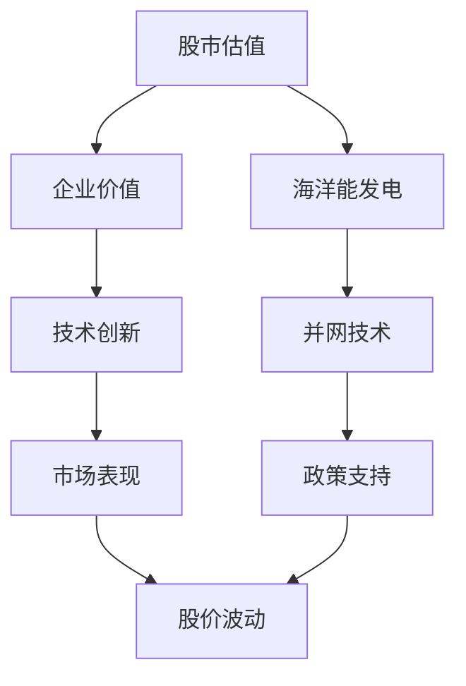

                 


# 全球股市估值与海洋能发电并网技术的关系

> 关键词：全球股市估值、海洋能发电、并网技术、技术进步、市场表现、政策支持

> 摘要：本文探讨了全球股市估值与海洋能发电并网技术之间的关系，分析了技术进步对股市估值的影响，以及政策与市场环境对两者关系的调节作用。通过建立数学模型和系统架构，本文深入研究了海洋能发电技术如何通过并网技术推动股市估值的变化，并提出了具体的算法和系统设计方案。

---

## 第一部分: 全球股市估值与海洋能发电并网技术的背景与概念

### 第1章: 全球股市估值的基本概念

#### 1.1 股市估值的定义与作用

股票市场的估值是衡量企业价值的重要指标，通常通过市盈率、市净率等指标来评估企业的市场价值。股市估值不仅反映了企业的财务状况，还体现了市场对企业的信心和预期。

股市估值的作用主要体现在以下几个方面：
1. 为企业提供融资渠道。
2. 为投资者提供投资回报。
3. 为市场提供价格信号。

#### 1.2 全球股市的运作机制

股票市场的运作机制包括以下几个关键环节：
1. **发行与上市**：企业通过首次公开募股（IPO）或其他方式进入股市。
2. **交易机制**：投资者通过买卖股票进行交易，市场供需关系影响股价波动。
3. **信息透明化**：企业定期披露财务报表和相关信息，帮助投资者做出决策。

#### 1.3 海洋能发电技术的概述

海洋能发电是利用海洋资源（如潮汐、波浪、温差等）发电的技术。海洋能发电并网技术是将海洋能发电系统与电网连接的关键技术，主要包括能量转换、功率调节和电网接入等环节。

### 第2章: 全球股市估值与海洋能发电并网技术的关系

#### 2.1 技术进步对股市估值的影响

技术创新是推动股市估值增长的重要因素。海洋能发电技术的突破和创新可以提高企业的竞争力，增强市场对企业的信心，从而推动股价上涨。

#### 2.2 海洋能发电并网技术的市场表现

海洋能发电企业的上市情况、技术创新和并网技术的成熟度直接影响其市场表现。例如，技术领先的海洋能发电企业通常会获得更高的估值。

#### 2.3 政策与市场环境对两者关系的调节作用

政策支持和技术进步对海洋能发电并网技术的发展至关重要。政府通过政策支持和资金投入可以推动技术进步，从而间接影响股市估值。

---

## 第二部分: 全球股市估值与海洋能发电并网技术的核心概念与联系

### 第3章: 全球股市估值与海洋能发电并网技术的核心概念与联系

#### 3.1 核心概念的原理分析

股市估值的核心模型包括市盈率（P/E）和市净率（P/B）等指标。海洋能发电并网技术的关键指标包括发电效率、成本和可靠性。

#### 3.2 核心概念的属性特征对比

| 属性 | 股市估值 | 海洋能发电并网技术 |
|------|----------|------------------|
| 定义 | 企业价值的市场评估 | 将海洋能转化为电能并接入电网的技术 |
| 影响因素 | 市场需求、企业盈利、政策环境 | 技术创新、成本、政策支持 |
| 作用 | 为企业融资、投资者收益 | 推动能源结构优化、减少碳排放 |

#### 3.3 ER实体关系图架构



---

## 第三部分: 全球股市估值与海洋能发电并网技术的算法原理

### 第4章: 全球股市估值与海洋能发电并网技术的算法原理

#### 4.1 算法原理概述

通过建立数学模型，分析海洋能发电技术进步对股市估值的影响。模型包括以下几个步骤：
1. 数据收集：收集海洋能发电企业的财务数据和股价数据。
2. 模型建立：使用回归分析等方法，建立技术进步与股价的关系模型。
3. 模型验证：通过历史数据验证模型的准确性。

#### 4.2 算法实现

以下是一个简单的回归分析模型：

$$ \text{股价} = \beta_0 + \beta_1 \times \text{技术进步指标} + \epsilon $$

其中，$\beta_0$是截距，$\beta_1$是技术进步指标的回归系数，$\epsilon$是误差项。

#### 4.3 算法实现代码

```python
import pandas as pd
import numpy as np
from sklearn.linear_model import LinearRegression

# 数据准备
data = pd.DataFrame({
    '技术进步指标': [0.1, 0.2, 0.3, 0.4, 0.5],
    '股价': [100, 110, 120, 130, 140]
})

# 建立回归模型
model = LinearRegression()
model.fit(data[['技术进步指标']], data['股价'])

# 预测股价
predicted_prices = model.predict(data[['技术进步指标']])

print("回归系数：", model.coef_)
print("截距：", model.intercept_)
print("预测股价：", predicted_prices)
```

---

## 第四部分: 全球股市估值与海洋能发电并网技术的系统分析与架构设计

### 第5章: 全球股市估值与海洋能发电并网技术的系统分析与架构设计

#### 5.1 系统功能设计

系统功能包括数据采集、模型建立、预测分析和结果展示。

#### 5.2 系统架构设计


---

## 第五部分: 全球股市估值与海洋能发电并网技术的项目实战

### 第6章: 全球股市估值与海洋能发电并网技术的项目实战

#### 6.1 项目环境安装

安装必要的工具和库，如Python、Pandas、NumPy、Scikit-learn等。

#### 6.2 项目核心实现源代码

```python
import pandas as pd
import numpy as np
from sklearn.linear_model import LinearRegression
from sklearn.metrics import mean_squared_error

# 数据准备
data = pd.DataFrame({
    '技术进步指标': [0.1, 0.2, 0.3, 0.4, 0.5],
    '股价': [100, 110, 120, 130, 140]
})

# 建立回归模型
model = LinearRegression()
model.fit(data[['技术进步指标']], data['股价'])

# 预测股价
predicted_prices = model.predict(data[['技术进步指标']])

# 计算均方误差
mse = mean_squared_error(data['股价'], predicted_prices)
print("均方误差：", mse)
```

#### 6.3 代码应用解读与分析

以上代码通过回归分析模型，展示了技术进步指标对股价的影响。模型预测的股价与实际股价之间的误差反映了模型的准确性。

---

## 第六部分: 全球股市估值与海洋能发电并网技术的最佳实践

### 第7章: 全球股市估值与海洋能发电并网技术的最佳实践

#### 7.1 小结

通过本文的分析，可以得出以下结论：
1. 技术进步是推动股市估值增长的重要因素。
2. 海洋能发电并网技术的成熟度直接影响企业的市场表现。
3. 政策支持和技术创新是推动海洋能发电技术发展的关键。

#### 7.2 注意事项

在实际应用中，需要注意以下几点：
1. 数据的准确性和完整性。
2. 模型的适用性和可扩展性。
3. 政策和技术环境的变化对模型的影响。

#### 7.3 拓展阅读

建议读者进一步阅读以下内容：
1. 海洋能发电技术的最新发展。
2. 股市估值的其他影响因素。
3. 其他可再生能源技术的市场表现。

---

## 作者

作者：AI天才研究院/AI Genius Institute & 禅与计算机程序设计艺术/Zen And The Art of Computer Programming

