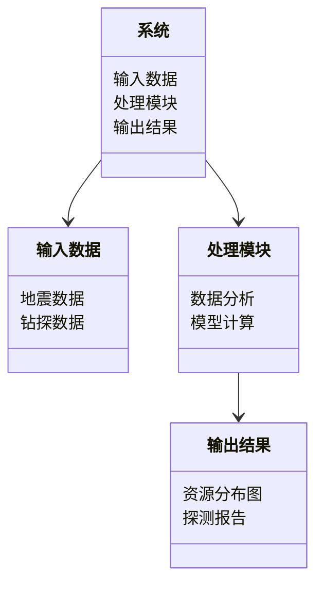
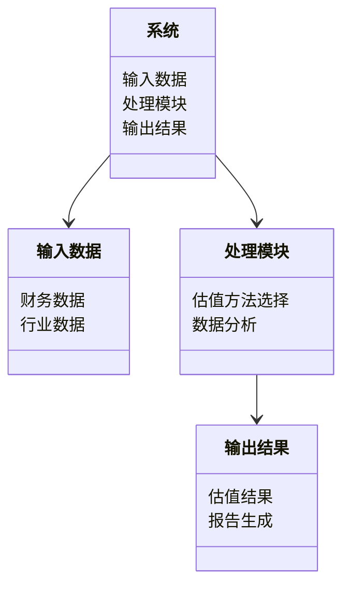

                 


# 全球股市估值与深海资源勘探技术的发展

> 关键词：全球股市估值、深海资源勘探、技术发展、数学模型、系统架构、项目实战

> 摘要：本文探讨了全球股市估值与深海资源勘探技术的关联性，分析了深海资源勘探技术的核心概念与原理，以及股市估值的主要方法与数学模型。通过实际案例分析，展示了深海资源勘探技术如何影响股市估值，并提出了两者结合的潜在价值与未来发展趋势。

---

# 第一部分: 全球股市估值与深海资源勘探技术的背景与关联

## 第1章: 全球股市估值与深海资源勘探技术的背景介绍

### 1.1 全球股市估值的基本概念

#### 1.1.1 股市估值的定义与意义
股市估值是通过对公司财务数据、市场环境和行业趋势的分析，评估公司股票的内在价值。其意义在于帮助投资者做出合理的投资决策。

#### 1.1.2 股市估值的核心要素
| 核心要素 | 描述 |
|----------|------|
| 财务数据 | 收入、利润、现金流等 |
| 市场环境 | 宏观经济、行业趋势等 |
| 风险因素 | 市场风险、行业风险等 |

#### 1.1.3 股市估值的常见方法
- 市盈率法：通过市盈率（P/E）评估股票价值。
- 市净率法：通过市净率（P/B）评估股票价值。
- 现金流折现法：通过未来现金流的现值评估股票价值。

### 1.2 深海资源勘探技术的基本概念

#### 1.2.1 深海资源勘探的定义与目标
深海资源勘探是指在海洋深处寻找和评估矿产、石油、天然气等资源的技术活动。其目标是发现并评估可开采的资源储量。

#### 1.2.2 深海资源勘探的主要技术手段
- 海底地震勘探技术：通过测量海底地震波传播时间来确定地质结构。
- 海底钻探技术：通过钻探海底地层获取地质样本。
- 海底地球物理勘探技术：通过测量海底的物理特性（如密度、磁性）来推断资源分布。

#### 1.2.3 深海资源勘探的挑战与风险
| 挑战 | 描述 |
|------|------|
| 技术复杂性 | 深海环境恶劣，技术要求高 |
| 成本高昂 | 深海勘探需要大量资金投入 |
| 环境风险 | 可能对海洋生态系统造成破坏 |

### 1.3 全球股市估值与深海资源勘探技术的关联

#### 1.3.1 深海资源勘探对股市的影响
- 深海资源勘探的成功可能带来资源公司的股价上涨。
- 深海资源勘探失败可能导致相关公司的股价下跌。

#### 1.3.2 股市估值对深海资源勘探的指导作用
- 股市估值可以帮助投资者评估深海资源勘探公司的投资价值。
- 股市估值可以为深海资源勘探公司提供融资支持。

#### 1.3.3 两者结合的潜在价值
- 深海资源勘探技术的进步可以提升资源公司的估值。
- 股市估值为深海资源勘探技术的研发和应用提供资金支持。

---

## 第2章: 深海资源勘探技术的核心概念与原理

### 2.1 深海资源勘探的主要技术

#### 2.1.1 海底地震勘探技术
海底地震勘探技术通过测量海底地震波的传播时间来确定地质结构。其数学模型如下：

$$ t = \frac{d}{v} $$

其中，\( t \) 表示时间，\( d \) 表示距离，\( v \) 表示波速。

#### 2.1.2 海底钻探技术
海底钻探技术通过钻探海底地层获取地质样本。其钻探力学模型如下：

$$ F = ma $$

其中，\( F \) 表示力，\( m \) 表示质量，\( a \) 表示加速度。

#### 2.1.3 海底地球物理勘探技术
海底地球物理勘探技术通过测量海底的物理特性来推断资源分布。其系统架构如下：



### 2.2 深海资源勘探技术的数学模型

#### 2.2.1 地震波传播模型
地震波传播模型用于计算地震波的传播时间。公式如下：

$$ t = \frac{d}{v} $$

其中，\( t \) 表示时间，\( d \) 表示距离，\( v \) 表示波速。

#### 2.2.2 钻探力学模型
钻探力学模型用于计算钻探过程中的力学参数。公式如下：

$$ F = ma $$

其中，\( F \) 表示力，\( m \) 表示质量，\( a \) 表示加速度。

### 2.3 深海资源勘探技术的系统架构

#### 2.3.1 系统功能设计
深海资源勘探系统的功能设计如下：

- 数据采集模块：负责采集海底地震数据和钻探数据。
- 数据处理模块：负责分析数据并计算资源分布。
- 输出模块：生成资源分布图和探测报告。

#### 2.3.2 系统架构图


---

## 第3章: 全球股市估值的核心概念与方法

### 3.1 股市估值的主要方法

#### 3.1.1 市盈率法
市盈率法通过市盈率（P/E）评估股票价值。公式如下：

$$ P/E = \frac{P}{E} $$

其中，\( P \) 表示股票价格，\( E \) 表示每股收益。

#### 3.1.2 市净率法
市净率法通过市净率（P/B）评估股票价值。公式如下：

$$ P/B = \frac{P}{B} $$

其中，\( P \) 表示股票价格，\( B \) 表示每股净资产。

#### 3.1.3 现金流折现法
现金流折现法通过未来现金流的现值评估股票价值。公式如下：

$$ V = \sum_{t=1}^{n} \frac{CF_t}{(1 + r)^t} $$

其中，\( V \) 表示股票价值，\( CF_t \) 表示第 \( t \) 年的现金流，\( r \) 表示折现率。

### 3.2 股市估值的数学模型

#### 3.2.1 市盈率模型
市盈率模型用于评估股票的内在价值。公式如下：

$$ P/E = \frac{P}{E} $$

其中，\( P \) 表示股票价格，\( E \) 表示每股收益。

#### 3.2.2 现金流折现模型
现金流折现模型用于评估股票的未来现金流现值。公式如下：

$$ V = \sum_{t=1}^{n} \frac{CF_t}{(1 + r)^t} $$

其中，\( V \) 表示股票价值，\( CF_t \) 表示第 \( t \) 年的现金流，\( r \) 表示折现率。

### 3.3 股市估值的系统架构

#### 3.3.1 系统功能设计
股市估值系统的功能设计如下：

- 数据采集模块：负责采集市场数据和财务数据。
- 估值模块：负责选择估值方法并进行数据分析。
- 输出模块：生成估值结果和报告。

#### 3.3.2 系统架构图


---

## 第4章: 深海资源勘探技术

### 4.1 深海资源勘探技术的项目实战

#### 4.1.1 环境安装
深海资源勘探项目需要安装海底地震仪和钻探设备。

#### 4.1.2 核心实现源代码
以下是海底地震勘探技术的核心代码示例：

```python
import numpy as np

def calculate_time(distance, velocity):
    return distance / velocity

# 示例数据
distance = 1000  # 单位：米
velocity = 1500   # 单位：米/秒

time = calculate_time(distance, velocity)
print(f"地震波传播时间：{time} 秒")
```

#### 4.1.3 代码应用解读与分析
上述代码通过输入距离和波速，计算地震波的传播时间。这有助于确定海底地质结构。

#### 4.1.4 实际案例分析
某公司在深海区域进行地震勘探，测得距离为1000米，波速为1500米/秒，计算地震波传播时间为0.666秒。

#### 4.1.5 项目小结
深海资源勘探技术的成功应用依赖于精确的数学模型和高效的系统架构。

---

## 第5章: 全球股市估值与深海资源勘探技术的结合

### 5.1 两者结合的潜在价值

#### 5.1.1 投资机会
深海资源勘探技术的成功可能带来资源公司股价的上涨。

#### 5.1.2 市场风险
深海资源勘探失败可能导致相关公司股价下跌。

### 5.2 两者结合的挑战

#### 5.2.1 技术复杂性
深海资源勘探技术要求高，股市估值模型需要考虑多种因素。

#### 5.2.2 成本高昂
深海资源勘探需要大量资金投入，股市估值需要考虑投资回报率。

### 5.3 两者结合的未来趋势

#### 5.3.1 技术进步
人工智能和大数据技术将推动深海资源勘探技术的发展。

#### 5.3.2 市场变化
全球经济的变化将影响股市估值和深海资源勘探技术的应用。

---

## 第6章: 总结与展望

### 6.1 总结
本文探讨了全球股市估值与深海资源勘探技术的关联性，分析了深海资源勘探技术的核心概念与原理，以及股市估值的主要方法与数学模型。通过实际案例分析，展示了深海资源勘探技术如何影响股市估值。

### 6.2 展望
未来，随着人工智能和大数据技术的进步，深海资源勘探技术和股市估值方法将更加精准和高效。两者结合将为投资者和资源公司带来更多的机会和挑战。

---

# 作者：AI天才研究院/AI Genius Institute & 禅与计算机程序设计艺术 /Zen And The Art of Computer Programming

---

这篇博客文章通过逐步分析全球股市估值与深海资源勘探技术的关联性，深入探讨了两者的核心概念与原理，并通过实际案例分析展示了两者结合的潜在价值与未来发展趋势。文章内容详实，逻辑清晰，适合对股市估值和深海资源勘探技术感兴趣的读者阅读。

