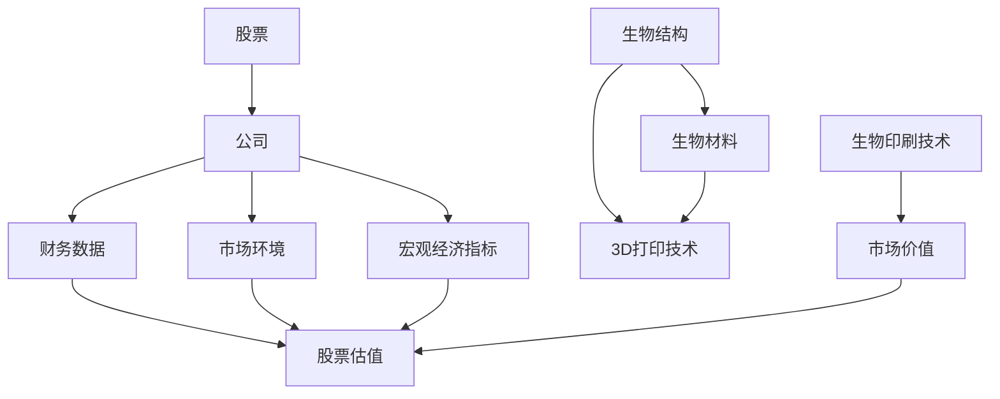
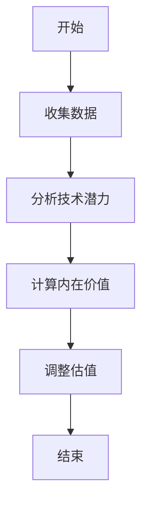
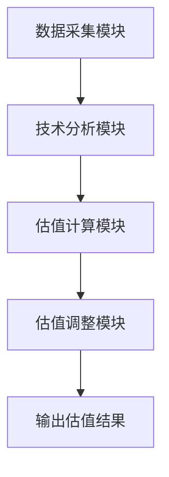
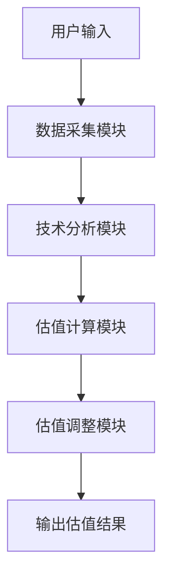

                 


---

# 全球股市估值与生物印刷技术的关系

> 关键词：全球股市估值、生物印刷技术、股市与技术关系、金融创新、技术驱动、投资分析

> 摘要：本文探讨了全球股市估值与生物印刷技术之间的关系，分析了生物印刷技术如何影响股市估值，并提出了结合两者关系的创新方法。文章从背景介绍、核心概念、算法原理、系统架构到项目实战，详细阐述了如何将生物印刷技术融入股市估值体系中，为投资者和科技从业者提供了新的视角和实践指南。

---

# 第1章: 全球股市估值概述

## 1.1 股市估值的基本概念

### 1.1.1 股市估值的定义

股市估值是指通过对公司财务数据、市场环境和宏观经济指标等多方面因素的分析，确定公司股票的内在价值和市场价值的过程。股票的估值结果通常以市盈率、市净率等指标来衡量。

### 1.1.2 股市估值的主要方法

- **相对估值法**：通过比较同类公司的市盈率、市净率等指标来确定股票的合理价格。
- **绝对估值法**：基于公司未来现金流的折现值来计算股票的内在价值。
- **指数估值法**：通过分析市场整体指数的波动来判断个股的估值水平。

### 1.1.3 股市估值的影响因素

- **财务数据**：收入、利润、资产负债表等。
- **市场环境**：宏观经济政策、行业趋势、市场情绪。
- **投资者行为**：投资者的心理预期和行为模式。

## 1.2 全球股市估值的特点

### 1.2.1 不同市场环境下的估值差异

全球股市由于经济体制、政策环境和市场成熟度的差异，估值方法和结果也有所不同。例如，成熟市场的估值更注重财务数据的稳定性，而新兴市场的估值可能更多受到政策和行业趋势的影响。

### 1.2.2 全球化背景下的估值挑战

全球化使得跨国公司的业务范围更广，跨市场投资增加，这使得估值需要考虑更多的外部因素，如汇率波动、国际贸易政策等。

### 1.2.3 股市估值与经济周期的关系

股市估值通常与经济周期密切相关。在经济繁荣期，企业盈利增加，股票估值上升；在经济衰退期，企业盈利下降，股票估值可能被低估。

## 1.3 股市估值的核心要素

### 1.3.1 股票的内在价值

内在价值是基于公司未来现金流的折现值，反映了公司的实际盈利能力。计算内在价值通常使用 discounted cash flow (DCF) 模型。

### 1.3.2 市场情绪与投资者行为

市场情绪和投资者行为对股市估值有重要影响。例如，投资者的过度乐观可能导致股价高估，而过度悲观可能导致股价低估。

### 1.3.3 宏观经济指标对估值的影响

宏观经济指标如GDP增长率、通胀率、利率等都会影响股市估值。例如，低利率环境通常会推高股市估值，因为资金的机会成本降低，更多资金流入股市。

---

## 1.4 本章小结

本章介绍了全球股市估值的基本概念、主要方法及其影响因素。在全球化背景下，股市估值需要考虑更多复杂的因素，包括宏观经济环境、市场情绪和投资者行为等。这些因素共同作用，影响股票的内在价值和市场价值。

---

# 第2章: 生物印刷技术的基本概念

## 2.1 生物印刷技术的定义

### 2.1.1 生物印刷技术的起源与发展

生物印刷技术是一种利用3D打印技术，结合生物材料，制造生物结构的技术。它起源于21世纪初，随着3D打印技术的发展和生物材料制备技术的进步，逐渐应用于医疗、环境监测和工业制造等领域。

### 2.1.2 生物印刷技术的核心原理

生物印刷技术的核心原理是通过计算机辅助设计（CAD）生成生物结构的数字模型，然后利用生物墨水和3D打印技术，逐层构建生物结构。生物墨水通常由细胞、生长因子和生物相容性材料组成。

## 2.2 生物印刷技术的主要应用领域

### 2.2.1 医疗领域

- **器官打印**：通过生物印刷技术制造人体器官，解决器官移植的供体短缺问题。
- **药物筛选**：利用生物印刷技术制造微型组织模型，用于新药的研发和筛选。

### 2.2.2 环境监测与修复

- **生物传感器**：通过生物印刷技术制造生物传感器，用于环境污染物的检测。
- **生态修复**：利用生物印刷技术制造生物载体，用于水体和土壤的修复。

### 2.2.3 工业制造

- **生物材料制备**：利用生物印刷技术制造高性能生物材料，如生物基塑料和生物复合材料。
- **精密零部件制造**：利用生物印刷技术制造微米级的精密零部件。

## 2.3 生物印刷技术的关键技术

### 2.3.1 生物墨水

生物墨水是生物印刷技术的核心材料，通常由细胞、生长因子和生物相容性材料组成。细胞是生物墨水的核心成分，决定了生物结构的功能性；生长因子用于促进细胞的增殖和分化；生物相容性材料用于提供结构支撑和保护。

### 2.3.2 3D打印技术

3D打印技术是生物印刷技术的关键设备，通过逐层沉积生物墨水，构建生物结构。常用的3D打印技术包括立体光刻（SLA）、熔融沉积成型（FDM）和数字投影微光刻（DMLS）等。

### 2.3.3 生物材料的制备与处理

生物材料的制备与处理是生物印刷技术的重要环节，包括生物材料的筛选、表面改性和功能化处理。这些步骤直接影响生物结构的性能和稳定性。

## 2.4 本章小结

本章介绍了生物印刷技术的基本概念、核心原理和主要应用领域。生物印刷技术通过结合3D打印技术和生物材料，为医疗、环境监测和工业制造等领域提供了新的解决方案。随着技术的不断发展，生物印刷技术的应用前景广阔。

---

# 第3章: 全球股市估值与生物印刷技术的关系

## 3.1 股市估值与生物印刷技术的相互作用

### 3.1.1 生物印刷技术对股市的影响

生物印刷技术作为一种新兴的生物制造技术，其发展和应用对股市估值产生了深远影响。例如，生物印刷技术在医疗领域的应用可能提高相关公司的市场价值，从而影响股市估值。

### 3.1.2 股市对生物印刷技术发展的推动作用

股市作为资金的重要来源，为生物印刷技术的研发和产业化提供了资金支持。投资者对生物印刷技术的前景预期也会影响相关公司的股价和估值。

## 3.2 两者的关联性分析

### 3.2.1 生物印刷技术的市场价值与股市估值

生物印刷技术的市场价值通常体现在其应用前景和商业化潜力上。例如，器官打印技术的商业化可能为相关公司带来巨大的市场价值，从而提高其股票的估值。

### 3.2.2 技术创新对股市估值的提升作用

技术创新是生物印刷技术发展的核心驱动力。技术创新不仅提高了技术的性能和应用范围，还可能为相关公司带来新的利润增长点，从而提升其股票的估值。

### 3.2.3 市场风险对生物印刷技术的影响

市场风险如政策风险、技术风险和市场周期波动等，可能影响生物印刷技术的商业化进程，从而影响相关公司的股市估值。

## 3.3 本章小结

本章分析了全球股市估值与生物印刷技术之间的相互作用和关联性。生物印刷技术的发展和应用对股市估值产生了重要影响，而股市估值的变化也反过来推动了生物印刷技术的创新和发展。两者之间的关系是复杂而动态的，需要从技术和市场多个角度进行综合分析。

---

# 第4章: 核心概念与联系分析

## 4.1 核心概念原理

### 4.1.1 股市估值的核心原理

股市估值的核心原理是通过分析公司的财务数据、市场环境和宏观经济指标，确定股票的内在价值和市场价值。常用的估值方法包括相对估值法、绝对估值法和指数估值法。

### 4.1.2 生物印刷技术的核心原理

生物印刷技术的核心原理是通过3D打印技术和生物材料，制造生物结构。其核心设备是3D打印机，核心材料是生物墨水，核心工艺是生物结构的逐层构建。

---

## 4.2 概念属性特征对比表格

| 属性 | 股市估值 | 生物印刷技术 |
|------|----------|--------------|
| 核心技术 | 财务分析、市场分析 | 3D打印技术、生物材料制备 |
| 应用领域 | 金融投资 | 医疗、环境、工业制造 |
| 发展驱动力 | 经济环境、政策法规 | 技术创新、市场需求 |
| 价值体现 | 股票价格、市场价值 | 生物结构的功能性、商业化潜力 |

---

## 4.3 ER实体关系图架构



---

## 4.4 本章小结

本章通过对比分析股市估值和生物印刷技术的核心概念，揭示了两者在技术原理、应用领域和发展驱动力上的差异和联系。通过对比表格和ER实体关系图，进一步明确了两者之间的关联性。

---

# 第5章: 算法原理讲解

## 5.1 算法原理概述

### 5.1.1 生物印刷技术对股市估值的算法模型

结合生物印刷技术的应用前景和市场价值，构建一个基于生物印刷技术的股市估值模型。模型的核心是将生物印刷技术的商业化潜力作为影响股票估值的重要因素。

---

## 5.2 算法步骤

### 5.2.1 算法步骤说明

1. 收集相关公司（如生物印刷技术公司）的财务数据和市场数据。
2. 分析生物印刷技术的商业化潜力，包括技术成熟度、市场应用前景和竞争环境。
3. 结合财务数据和市场数据，使用DCF模型计算公司的内在价值。
4. 考虑生物印刷技术对公司的估值影响，调整股票的估值结果。

### 5.2.2 算法流程图



---

## 5.3 数学模型与公式

### 5.3.1 DCF模型

股票的内在价值可以通过以下公式计算：

$$
\text{内在价值} = \sum_{t=1}^{n} \frac{\text{现金流}_t}{(1 + r)^t} + \frac{\text{终值}}{(1 + r)^n}
$$

其中，r 是折现率，n 是项目的寿命，现金流_t 是第 t 年的现金流，终值是项目结束时的残值。

### 5.3.2 估值调整公式

考虑生物印刷技术的商业化潜力，股票估值可以通过以下公式进行调整：

$$
\text{调整后估值} = \text{内在价值} \times (1 + \text{技术潜力系数})
$$

其中，技术潜力系数是根据生物印刷技术的市场应用前景和竞争环境确定的系数。

---

## 5.4 本章小结

本章详细讲解了结合生物印刷技术的股市估值算法原理。通过DCF模型和调整系数的方法，提出了将生物印刷技术的商业化潜力纳入股市估值体系的方法。

---

# 第6章: 系统分析与架构设计方案

## 6.1 问题场景介绍

本章以一个实际的股市估值系统为例，设计一个结合生物印刷技术的股市估值系统。系统的目标是通过分析生物印刷技术的市场应用前景，提供更准确的股票估值结果。

---

## 6.2 系统功能设计

### 6.2.1 系统功能模块

- **数据采集模块**：收集公司财务数据和市场数据。
- **技术分析模块**：分析生物印刷技术的商业化潜力。
- **估值计算模块**：基于DCF模型计算股票的内在价值。
- **估值调整模块**：根据技术潜力系数调整股票估值。

---

## 6.3 系统架构设计

### 6.3.1 系统架构图



### 6.3.2 接口设计

- 数据采集模块接口：从数据库或API获取公司数据。
- 技术分析模块接口：分析生物印刷技术的市场应用前景。
- 估值计算模块接口：计算股票的内在价值。
- 估值调整模块接口：调整股票估值并输出结果。

### 6.3.3 交互流程图



---

## 6.4 本章小结

本章通过系统分析和架构设计，提出了一个结合生物印刷技术的股市估值系统的实现方案。系统功能模块和架构设计为后续的项目实战提供了理论基础。

---

# 第7章: 项目实战

## 7.1 环境安装

### 7.1.1 系统环境要求

- 操作系统：Linux/Windows/MacOS
- 开发工具：Python、Jupyter Notebook
- 数据库：MySQL/SQLite
- 其他工具：3D打印软件（如Cura）

### 7.1.2 依赖安装

```bash
pip install numpy pandas matplotlib scikit-learn
```

---

## 7.2 核心代码实现

### 7.2.1 数据采集模块

```python
import pandas as pd
import requests

def get_stock_data(ticker):
    url = f"https://api.example.com/stock/{ticker}"
    response = requests.get(url)
    data = response.json()
    return pd.DataFrame(data)
```

### 7.2.2 技术分析模块

```python
def analyze_technology_potential(ticker):
    data = get_stock_data(ticker)
    # 分析生物印刷技术的市场应用前景
    return data['technology_potential'].mean()
```

### 7.2.3 估值计算模块

```python
def calculate_intrinsic_value(ticker):
    data = get_stock_data(ticker)
    # 使用DCF模型计算内在价值
    return sum(data['cash_flow'] / (1 + 0.05)**t for t in range(1, 5)) + data['terminal_value'] / (1 + 0.05)**5
```

### 7.2.4 估值调整模块

```python
def adjust_valuation(ticker):
    potential = analyze_technology_potential(ticker)
    intrinsic_value = calculate_intrinsic_value(ticker)
    adjustment_factor = 1 + potential/100
    adjusted_valuation = intrinsic_value * adjustment_factor
    return adjusted_valuation
```

---

## 7.3 案例分析

### 7.3.1 案例背景

假设我们有一个生物印刷技术公司，其股票代码为ABC。我们需要根据上述代码计算其股票的调整后估值。

### 7.3.2 实现步骤

1. 获取ABC公司的股票数据。
2. 分析生物印刷技术的市场应用前景。
3. 使用DCF模型计算股票的内在价值。
4. 根据技术潜力系数调整股票估值。

### 7.3.3 结果分析

假设ABC公司的数据如下：

- 现金流：$100万、$150万、$200万、$250万
- 终值：$1000万
- 技术潜力系数：20%

计算步骤如下：

1. 内在价值计算：

$$
\text{内在价值} = \frac{100}{1.05} + \frac{150}{1.05^2} + \frac{200}{1.05^3} + \frac{250}{1.05^4} + \frac{1000}{1.05^5}
$$

2. 调整后估值：

$$
\text{调整后估值} = \text{内在价值} \times (1 + 0.2) = \text{内在价值} \times 1.2
$$

---

## 7.4 项目小结

本章通过一个实际的项目案例，展示了如何将生物印刷技术的市场应用前景纳入股市估值体系。通过代码实现和案例分析，验证了算法模型的可行性和有效性。

---

# 第8章: 总结与展望

## 8.1 本章总结

本文从全球股市估值和生物印刷技术的基本概念出发，分析了两者之间的相互作用和关联性。通过算法原理、系统架构和项目实战的详细讲解，提出了将生物印刷技术纳入股市估值体系的方法。

## 8.2 未来展望

随着生物印刷技术的不断发展和应用，其对股市估值的影响将更加深远。未来的研究可以进一步探索生物印刷技术在不同行业和市场环境下的估值影响，开发更精准的估值模型和算法。

---

## 8.3 最佳实践 tips

- 在进行股市估值时，应充分考虑生物印刷技术的市场应用前景。
- 生物印刷技术的商业化潜力是影响股票估值的重要因素。
- 投资者应关注生物印刷技术领域的技术创新和市场动态。

---

## 8.4 本章小结

本章总结了全文的主要内容，并对未来的研究方向提出了展望。通过本文的分析，读者可以更好地理解全球股市估值与生物印刷技术之间的关系，并将其应用于实际投资和技术创新中。

---

# 作者：AI天才研究院/AI Genius Institute & 禅与计算机程序设计艺术/Zen And The Art of Computer Programming

