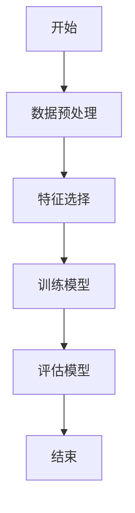

                 

# 全球股市估值与生物塑料在航空航天中的应用

## 关键词：
全球股市估值、生物塑料、航空航天、投资分析、可持续材料

## 摘要：
本文探讨了全球股市估值与生物塑料在航空航天中的应用之间的关系。首先，文章介绍了全球股市估值的基础知识，包括其定义、重要性及影响因素。接着，详细分析了生物塑料的基本概念、分类及其在航空航天领域的潜在应用。然后，从数学模型和算法的角度，阐述了股市估值的方法，以及如何利用大数据和人工智能技术进行股市预测。随后，文章深入探讨了生物塑料的制备技术、性能分析及其在航空航天中的实际应用案例。最后，结合具体案例，分析了生物塑料行业对股市估值的影响，并展望了生物塑料技术的未来发展趋势。

---

## 第1章：全球股市估值的基础知识

### 1.1 股市估值的定义与重要性

#### 1.1.1 股市估值的基本概念
股市估值是指对上市公司股票的内在价值进行评估的过程。其目的是帮助投资者确定股票的合理价格区间，从而做出明智的投资决策。股市估值的核心在于分析公司的财务状况、行业地位、市场前景等因素，以预测其未来盈利能力。

#### 1.1.2 股市估值在投资决策中的作用
股市估值是投资者进行资产配置和风险管理的重要工具。通过准确的估值，投资者可以识别低估或高估的股票，从而优化投资组合的收益与风险比。

#### 1.1.3 股市估值的常见方法
- **相对估值法**：通过比较公司与行业平均水平的市盈率（P/E）、市净率（P/B）等指标，评估股票的估值水平。
- **绝对估值法**：基于公司的基本面数据，如净利润、现金流等，使用DCF（Discounted Cash Flow）模型计算股票的内在价值。

### 1.2 影响股市估值的关键因素

#### 1.2.1 宏观经济环境的影响
宏观经济指标（如GDP增长率、利率水平、通货膨胀率）直接影响股市的整体表现。例如，低利率环境通常会推高股市估值，因为投资者寻求更高的收益。

#### 1.2.2 行业发展趋势的影响
行业周期和技术创新是影响股市估值的重要因素。例如，科技行业的快速发展通常会提高相关企业的估值水平。

#### 1.2.3 公司基本面分析
公司的财务状况、盈利能力、管理团队等因素直接决定了其股票的估值。例如，高成长性的公司通常享有较高的市盈率。

---

## 第2章：生物塑料的基本概念与应用领域

### 2.1 生物塑料的定义与分类

#### 2.1.1 生物塑料的定义
生物塑料是指以可再生生物质（如植物纤维、淀粉、脂肪酸等）为原料，通过生物或化学方法制备的塑料。与传统石油基塑料相比，生物塑料具有可降解、低碳排放等优点。

#### 2.1.2 生物塑料的分类与特点
生物塑料主要分为可降解生物塑料和不可降解生物塑料两类：
- **可降解生物塑料**：如聚乳酸（PLA）、聚羟基脂肪酸酯（PHA）等，能够在自然环境中降解。
- **不可降解生物塑料**：如聚乙烯（PE）的生物基替代品，性能与传统塑料相似，但原材料来自生物质。

#### 2.1.3 生物塑料的优势与挑战
- **优势**：减少对石油资源的依赖，降低碳排放，改善环境污染问题。
- **挑战**：生产成本较高，性能有待提升，市场需求有限。

### 2.2 生物塑料在航空航天中的潜在应用

#### 2.2.1 航空航天材料的基本要求
航空航天材料需要满足轻量化、高强度、耐高温、抗疲劳等性能要求。传统塑料因密度高、性能不足，难以满足这些要求。

#### 2.2.2 生物塑料在航空航天中的应用前景
生物塑料的轻量化和可降解特性使其在航空航天领域具有潜力。例如，生物基复合材料可用于飞机内饰、航空器部件等。

#### 2.2.3 生物塑料与传统塑料的性能对比
| 性能指标 | 生物塑料 | 传统塑料 |
|----------|----------|----------|
| 密度     | 较低     | 较高     |
| 可降解性 | 可降解   | 不可降解 |
| 环境影响 | 低碳排放 | 高碳排放 |

---

## 第3章：全球股市估值的数学模型与算法

### 3.1 股市估值的数学模型

#### 3.1.1 市盈率模型
市盈率（P/E）是衡量股票估值的重要指标之一，计算公式为：
$$ P/E = \frac{股票价格}{每股净利润} $$

#### 3.1.2 市净率模型
市净率（P/B）用于评估股票相对于其账面价值的高低，计算公式为：
$$ P/B = \frac{股票价格}{每股净资产} $$

#### 3.1.3 现金流折现模型
DCF模型通过将未来现金流折现为当前价值，计算股票的内在价值：
$$ V = \sum_{t=1}^{n} \frac{CF_t}{(1+r)^t} $$

### 3.2 基于大数据的股市预测算法

#### 3.2.1 数据挖掘与机器学习在股市预测中的应用
- **数据挖掘**：通过分析历史数据，发现市场规律和趋势。
- **机器学习**：使用算法（如随机森林、支持向量机）进行预测。

#### 3.2.2 常见的股市预测算法
- **线性回归**：用于预测股票价格的趋势。
- **随机森林**：通过集成学习提高预测准确性。
- **神经网络**：用于处理复杂的非线性关系。

#### 3.2.3 算法实现的步骤与流程图
以下是随机森林算法的流程图：

---

## 第4章：生物塑料的制备技术与性能分析

### 4.1 生物塑料的制备技术

#### 4.1.1 生物基单体的合成
生物基单体的合成是生物塑料制备的关键步骤，常用的技术包括：
- **发酵法**：利用微生物发酵生产单体。
- **化学合成法**：通过化学反应合成单体。

#### 4.1.2 生物塑料的加工成型技术
加工成型技术包括注塑成型、挤出成型等，具体选择取决于材料的特性和应用需求。

#### 4.1.3 生物塑料的改性处理
改性处理（如添加增塑剂、稳定剂）可以提高生物塑料的性能，使其满足航空航天等领域的使用要求。

### 4.2 生物塑料的性能测试与优化

#### 4.2.1 力学性能测试
- **拉伸强度**：测试材料在拉伸过程中的最大承受力。
- **断裂伸长率**：测试材料断裂时的伸长比例。

#### 4.2.2 热稳定性分析
- **热变形温度**：测试材料在高温下的形状稳定性。
- **分解温度**：测试材料在高温下的分解特性。

#### 4.2.3 生物降解性能评估
通过标准测试方法（如ASTM D6400）评估生物塑料的降解速率和降解程度。

---

## 第5章：生物塑料在航空航天中的实际应用

### 5.1 航空航天材料的选择标准

#### 5.1.1 材料的轻量化要求
航空航天领域对材料的密度要求严格，轻量化是提高燃油效率的关键因素。

#### 5.1.2 材料的耐高温性能
航空航天设备在运行过程中会产生高温，材料必须具备良好的耐高温性能。

#### 5.1.3 材料的抗疲劳特性
材料在长期使用中必须抵抗疲劳断裂，确保飞行安全。

### 5.2 生物塑料在航空中的实际应用

#### 5.2.1 飞机内饰材料
生物塑料可用于制造飞机座椅、扶手、行李架等内饰部件，减少材料重量并降低碳排放。

#### 5.2.2 航空器部件材料
生物塑料的高强度和轻量化特性使其适用于制造飞机的结构部件。

---

## 第6章：生物塑料与股市估值的关联性分析

### 6.1 生物塑料行业的投资机会

#### 6.1.1 生物塑料企业的市场前景
随着环保意识的增强和政策支持，生物塑料行业具有广阔的发展前景。

#### 6.1.2 生物塑料企业的竞争优势
生产成本的降低、技术进步、市场需求增长等因素将提升生物塑料企业的估值。

### 6.2 生物塑料企业的股市估值模型

#### 6.2.1 基于市盈率的估值模型
使用生物塑料企业的历史净利润和行业平均市盈率进行估值。

#### 6.2.2 基于现金流的估值模型
通过DCF模型预测企业的未来现金流，计算其内在价值。

---

## 第7章：案例分析与未来展望

### 7.1 案例分析：某生物塑料企业的股市表现

#### 7.1.1 企业概况
某生物塑料企业专注于生物基聚乳酸（PLA）的研发和生产。

#### 7.1.2 企业财务数据
- 净利润增长率：15%
- 市盈率：20倍

#### 7.1.3 股市估值分析
通过市盈率模型和DCF模型，计算该企业的目标股价区间。

### 7.2 生物塑料技术的未来发展趋势

#### 7.2.1 技术创新
未来，生物塑料的技术将更加注重材料的性能优化和成本降低。

#### 7.2.2 市场扩展
随着环保政策的加强，生物塑料在航空航天、汽车、包装等领域的应用将逐渐扩大。

---

## 作者：AI天才研究院/AI Genius Institute & 禅与计算机程序设计艺术 /Zen And The Art of Computer Programming

---

以上是关于《全球股市估值与生物塑料在航空航天中的应用》的完整博客文章内容。

