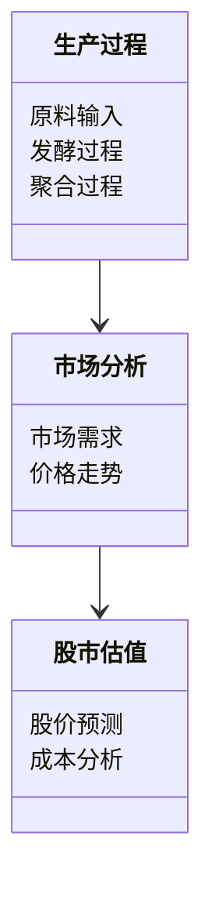
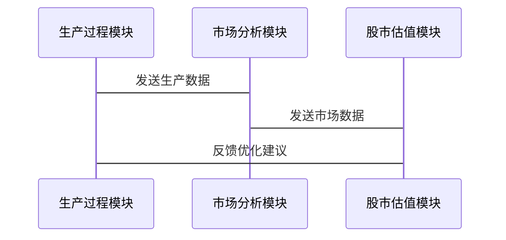

                 


# 全球股市估值与生物塑料规模化生产技术的关联

## 关键词
全球股市估值, 生物塑料, 规模化生产, 技术关联, 数学模型, 可持续发展, 经济影响

## 摘要
本文探讨了全球股市估值与生物塑料规模化生产技术之间的复杂关联。通过分析股市估值的核心概念、生物塑料生产的技术挑战，以及两者之间的直接和间接影响，构建了数学模型，并通过案例分析验证了模型的有效性。本文还提出了系统架构设计方案和项目实战指导，为投资者和技术创新者提供了理论支持和实践指导。

---

# 第一部分: 全球股市估值与生物塑料规模化生产技术的背景与关联

## 第1章: 全球股市估值的现状与挑战

### 1.1 全球股市估值的核心概念

#### 1.1.1 股市估值的基本定义
股市估值是指通过对公司财务数据和市场信息的分析，估算公司股票的合理价格。其核心在于将公司的未来盈利能力转化为当前的股价。

#### 1.1.2 股市估值的主要指标
- 市盈率（P/E）：股价与每股收益的比率。
- 市净率（P/B）：股价与每股净资产的比率。
- 股息率：股息与股价的比率。

#### 1.1.3 全球股市估值的现状分析
全球股市估值受经济周期、政策变化和技术进步的影响，呈现出波动性与不确定性。近年来，可持续发展和环保技术成为影响股市估值的重要因素。

### 1.2 全球股市估值的挑战

#### 1.2.1 经济波动对股市估值的影响
经济衰退可能导致企业盈利下降，进而影响股市估值。

#### 1.2.2 技术创新对股市估值的推动
技术创新（如生物塑料技术）可能提升企业的市场竞争力，从而提高股市估值。

#### 1.2.3 环境与政策因素对股市估值的压力
环保政策的收紧或补贴政策的出台可能影响企业的生产成本，进而影响股市估值。

### 1.3 全球股市估值的未来趋势

#### 1.3.1 数字经济对股市估值的影响
数字经济的崛起可能导致传统行业估值的下降，而新兴技术行业的估值可能上升。

#### 1.3.2 可持续发展对股市估值的重塑
随着环保意识的增强，具有可持续发展潜力的企业可能获得更高的估值。

#### 1.3.3 全球化与本地化对股市估值的双重影响
全球化可能导致跨国企业的估值波动，而本地化政策可能影响区域市场的估值。

## 第2章: 生物塑料规模化生产技术的现状与挑战

### 2.1 生物塑料的基本概念

#### 2.1.1 生物塑料的定义与分类
生物塑料是指以可再生资源为原料生产的塑料，主要包括聚乳酸（PLA）、聚羟基脂肪酸酯（PHAs）等。

#### 2.1.2 生物塑料的生产原料与工艺
- 原料：淀粉、纤维素等。
- 工艺：发酵、聚合等。

#### 2.1.3 生物塑料的环境优势与局限性
优势：可降解、减少化石燃料使用；局限：生产成本高、技术难度大。

### 2.2 生物塑料规模化生产的挑战

#### 2.2.1 生产成本与技术瓶颈
生物塑料的生产成本较高，技术尚未完全成熟。

#### 2.2.2 市场需求与供应链的匹配
市场需求增长与供应链能力之间存在不平衡。

#### 2.2.3 环境与政策对生物塑料生产的双重影响
环保政策的出台可能增加生产成本，而环保需求又推动了生物塑料的市场需求。

### 2.3 生物塑料规模化生产的未来趋势

#### 2.3.1 技术创新对生物塑料生产的推动
通过技术创新降低成本，提高生产效率。

#### 2.3.2 可持续发展对生物塑料生产的重塑
绿色生产、循环经济将成为生物塑料生产的重要方向。

#### 2.3.3 全球化与本地化对生物塑料生产的双重影响
全球化有助于扩大市场，本地化则有助于降低物流成本。

## 第3章: 全球股市估值与生物塑料规模化生产的关联性分析

### 3.1 股市估值与生物塑料生产的直接关联

#### 3.1.1 生物塑料企业对股市估值的影响
生物塑料企业的技术创新和市场扩展可能提升其股票估值。

#### 3.1.2 生物塑料技术创新对股市估值的推动
技术创新可能提升企业的市场竞争力，从而提高股市估值。

#### 3.1.3 生物塑料市场需求对股市估值的反馈
市场需求的增长可能推动股价上涨，反之亦然。

### 3.2 股市估值与生物塑料生产的间接关联

#### 3.2.1 经济环境对股市估值与生物塑料生产的双重影响
经济波动可能同时影响股市估值和生物塑料生产。

#### 3.2.2 政策环境对股市估值与生物塑料生产的共同作用
环保政策可能同时影响股市估值和生物塑料生产。

#### 3.2.3 技术创新对股市估值与生物塑料生产的协同效应
技术创新可能同时提升股市估值和生物塑料生产效率。

### 3.3 股市估值与生物塑料生产关联的综合分析

#### 3.3.1 综合因素对股市估值与生物塑料生产的系统性影响
经济、政策、技术等多方面因素共同作用于股市估值和生物塑料生产。

#### 3.3.2 关联性分析的数学模型构建
通过回归分析等方法，建立股市估值与生物塑料生产的关系模型。

#### 3.3.3 关联性分析的实证研究与案例分析
通过具体案例分析，验证模型的有效性。

---

# 第二部分: 全球股市估值与生物塑料规模化生产技术的数学模型与算法原理

## 第4章: 股市估值的数学模型与算法原理

### 4.1 股市估值的核心算法

#### 4.1.1 股市估值的回归模型
$$ \text{股价} = \beta_0 + \beta_1 \times \text{盈利} + \beta_2 \times \text{成长性} + \epsilon $$

#### 4.1.2 股市估值的机器学习模型
使用随机森林或神经网络模型进行预测。

#### 4.1.3 股市估值的动态调整算法
通过实时数据调整模型参数。

### 4.2 生物塑料生产技术的数学模型

#### 4.2.1 生物塑料生产成本模型
$$ \text{成本} = \alpha_0 + \alpha_1 \times \text{原料价格} + \alpha_2 \times \text{生产规模} + \epsilon $$

#### 4.2.2 生物塑料市场需求模型
$$ \text{需求} = \gamma_0 + \gamma_1 \times \text{价格} + \gamma_2 \times \text{环保政策} + \epsilon $$

### 4.3 股市估值与生物塑料生产的关联模型

#### 4.3.1 关联模型的构建
通过回归分析，将股市估值与生物塑料生产的技术参数和市场数据关联起来。

#### 4.3.2 关联模型的验证
使用历史数据验证模型的准确性。

---

## 第5章: 生物塑料生产技术的数学模型与算法原理

### 5.1 生物塑料生产技术的核心算法

#### 5.1.1 发酵过程的优化算法
通过优化控制变量（如温度、pH值）来提高产量。

#### 5.1.2 聚合过程的模拟算法
使用分子动力学模拟聚合过程。

#### 5.1.3 成本优化算法
通过线性规划优化生产成本。

### 5.2 生物塑料生产技术的数学模型

#### 5.2.1 发酵过程模型
$$ \frac{dC}{dt} = k_1 C - k_2 C^2 $$

#### 5.2.2 聚合过程模型
$$ \frac{dM}{dt} = k_3 M - k_4 M^2 $$

### 5.3 生物塑料生产技术的算法实现

#### 5.3.1 发酵过程的实时优化
通过反馈控制算法实时调整发酵条件。

#### 5.3.2 聚合过程的模拟与预测
使用数值模拟算法预测聚合过程的性能。

---

## 第6章: 系统分析与架构设计方案

### 6.1 问题场景介绍

#### 6.1.1 系统目标
建立一个实时监测和优化的生物塑料生产系统。

#### 6.1.2 系统范围
涵盖生产过程、市场分析和股市估值三个模块。

### 6.2 系统功能设计

#### 6.2.1 领域模型


### 6.3 系统架构设计

#### 6.3.1 系统架构图


#### 6.3.2 系统接口设计
- 生产过程模块与市场分析模块的接口：数据共享接口。
- 市场分析模块与股市估值模块的接口：数据传递接口。

#### 6.3.3 系统交互设计


---

## 第7章: 项目实战

### 7.1 环境安装

#### 7.1.1 安装Python
使用Anaconda安装Python 3.8及以上版本。

#### 7.1.2 安装依赖库
安装NumPy、Pandas、Scikit-learn等库。

### 7.2 核心代码实现

#### 7.2.1 股市估值预测代码
```python
import numpy as np
from sklearn.linear_model import LinearRegression

# 数据准备
X = np.array([[100, 20], [150, 25], [200, 30]])
y = np.array([50, 75, 100])

# 模型训练
model = LinearRegression()
model.fit(X, y)

# 预测
predicted = model.predict([[250, 35]])
print(predicted)
```

#### 7.2.2 生物塑料生产优化代码
```python
import numpy as np

# 定义目标函数
def cost(x):
    return x[0]**2 + x[1]**2

# 定义约束条件
def constraint(x):
    return x[0] + x[1] - 1 <= 0

# 使用数值优化算法
from scipy.optimize import minimize

result = minimize(cost, [1, 1], constraints={'type': 'ineq', 'fun': constraint})
print(result.x)
```

### 7.3 案例分析与结果解读

#### 7.3.1 股市估值预测案例
通过历史数据训练模型，预测某生物塑料企业的股价走势。

#### 7.3.2 生物塑料生产优化案例
通过优化算法，降低生产成本，提高生产效率。

### 7.4 项目总结

#### 7.4.1 项目成果
建立了实时监测和优化的生物塑料生产系统。

#### 7.4.2 项目经验
数据质量和模型选择对系统性能有重要影响。

#### 7.4.3 项目展望
未来可以进一步优化算法，提高系统的实时性和准确性。

---

# 第三部分: 总结与展望

## 第8章: 总结与展望

### 8.1 关键点回顾

#### 8.1.1 股市估值的核心概念
强调了财务数据和市场信息对股市估值的影响。

#### 8.1.2 生物塑料生产的挑战
指出了生产成本和技术瓶颈对规模化生产的制约。

#### 8.1.3 两者关联的数学模型
构建了回归模型和优化算法，为关联分析提供了理论支持。

### 8.2 展望

#### 8.2.1 技术创新
未来可以通过人工智能和大数据技术进一步优化生产和估值模型。

#### 8.2.2 可持续发展
可持续发展将继续推动生物塑料生产和绿色金融的发展。

#### 8.2.3 全球化与本地化
全球化与本地化的结合将为生物塑料生产和股市估值带来新的机遇和挑战。

---

# 作者：AI天才研究院/AI Genius Institute & 禅与计算机程序设计艺术 /Zen And The Art of Computer Programming

