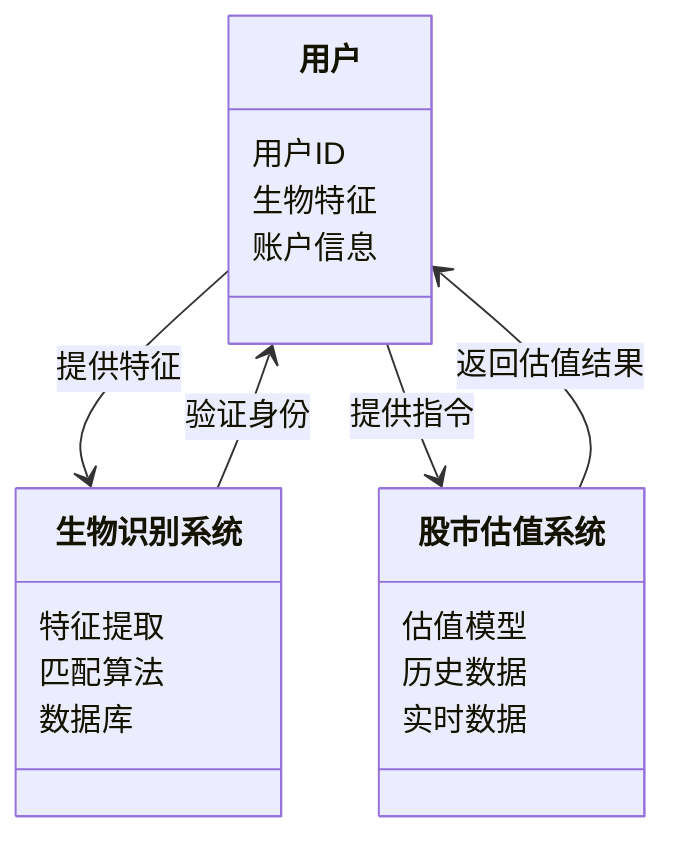
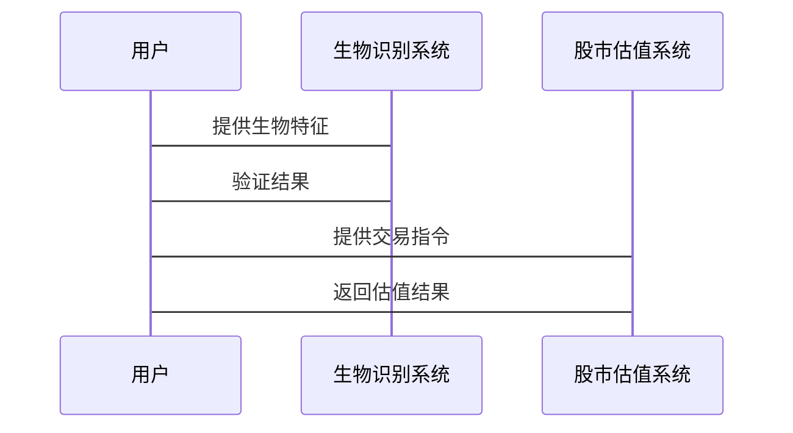

                 


---

# 全球股市估值与生物识别技术的关联

> 关键词：全球股市估值、生物识别技术、关联分析、算法原理、数学模型、系统设计

> 摘要：本文探讨了全球股市估值与生物识别技术之间的深层关联，分析了生物识别技术如何影响股市交易的安全性、效率和投资者行为，揭示了其对股市估值模型优化的潜在价值，并详细阐述了生物识别技术的算法原理及其在金融领域的应用。

---

## 第1章: 全球股市估值概述

### 1.1 股市估值的基本概念

#### 1.1.1 股市估值的定义与意义
股市估值是指对股票市场价格进行评估的过程，旨在确定其内在价值。它是投资者做出投资决策的重要依据，也是衡量市场健康状况的关键指标。

#### 1.1.2 股市估值的主要方法
- 市盈率（P/E）：市价与每股收益的比率。
- 市净率（P/B）：市价与每股净资产的比率。
- 股息率：股息与股价的比率。

#### 1.1.3 股市估值的影响因素
- 经济指标：GDP、利率、通货膨胀率。
- 行业动态：行业政策、竞争格局。
- 公司基本面：盈利能力、财务状况。

### 1.2 生物识别技术的概述

#### 1.2.1 生物识别技术的定义
生物识别技术是通过人体的生物特征（如指纹、面部、虹膜等）进行身份验证的技术，具有高安全性和便捷性。

#### 1.2.2 主要生物识别技术类型
- 指纹识别
- 面部识别
- 虹膜识别
- 声纹识别
- 行为识别（如 keystroke dynamics）

#### 1.2.3 生物识别技术的应用领域
- 金融支付
- 安全监控
- 医疗健康
- 教育领域

### 1.3 股市估值与生物识别技术的关联背景

#### 1.3.1 数字化交易的兴起
随着电子交易的普及，股市交易的安全性和效率要求不断提高。

#### 1.3.2 生物识别技术在金融领域的应用
生物识别技术为金融交易提供了更高的安全性和便捷性，尤其是在身份验证方面。

#### 1.3.3 全球化市场的数据安全需求
全球化背景下，数据安全成为股市估值的重要考量因素，生物识别技术为其提供了技术支持。

### 1.4 本章小结
本章介绍了股市估值的基本概念和主要方法，概述了生物识别技术的定义、类型和应用领域，并探讨了两者在数字化交易和数据安全背景下的关联。

---

## 第2章: 生物识别技术对全球股市估值的影响

### 2.1 生物识别技术在股市交易中的应用

#### 2.1.1 身份验证与交易安全
生物识别技术通过验证投资者身份，防止非法交易，提升了交易安全性。

#### 2.1.2 生物识别技术对交易效率的提升
通过快速的身份验证，减少交易流程中的时间浪费，提高了交易效率。

#### 2.1.3 生物识别技术对市场参与者的信任增强
生物识别技术的应用增强了投资者对交易平台的信任，促进了市场的活跃。

### 2.2 生物识别技术对投资者行为的影响

#### 2.2.1 投资者情绪分析
通过分析投资者的生理指标（如心率、体温），可以了解其情绪变化，进而预测市场波动。

#### 2.2.2 生物识别数据与市场波动的关系
生物识别数据可以作为辅助指标，帮助预测市场趋势。

#### 2.2.3 生物识别技术在风险管理中的应用
通过实时监控投资者的行为数据，及时发现异常交易，降低市场风险。

### 2.3 生物识别技术对股市估值模型的优化

#### 2.3.1 数据丰富性对估值模型的影响
生物识别数据的引入，为估值模型提供了更多的维度，提高了模型的准确性。

#### 2.3.2 生物识别数据与传统金融数据的结合
将生物识别数据与传统的财务数据相结合，可以更全面地评估公司的价值。

#### 2.3.3 新型估值算法的开发与应用
基于生物识别数据的新型算法，如深度学习模型，可以更好地捕捉市场动态。

### 2.4 本章小结
本章分析了生物识别技术在股市交易中的具体应用，探讨了其对投资者行为和股市估值模型的影响，揭示了其在提升交易安全性和优化估值方法中的重要作用。

---

## 第3章: 生物识别技术的算法原理与实现

### 3.1 生物特征提取算法

#### 3.1.1 指纹识别的特征提取
通过图像处理技术提取指纹的细节特征，如脊线、分叉点等。

#### 3.1.2 面部识别的特征提取
利用图像处理和深度学习技术提取面部特征，如眼睛、鼻子、嘴巴的位置和形状。

#### 3.1.3 声纹识别的特征提取
通过信号处理技术提取语音的特征，如音调、节奏、频谱等。

### 3.2 生物识别算法的核心流程

#### 3.2.1 特征匹配算法
将提取的特征与数据库中的特征进行匹配，计算相似度。

#### 3.2.2 误拒率与误认率的优化
通过调整匹配算法的参数，优化系统的准确性和效率。

#### 3.2.3 生物识别系统的训练与测试
通过大量数据的训练，优化模型的性能，提高识别准确率。

### 3.3 生物识别技术的数学模型

#### 3.3.1 基于特征向量的匹配模型
将生物特征转换为向量，通过向量距离计算相似度。

#### 3.3.2 基于深度学习的特征提取模型
利用卷积神经网络（CNN）提取高维特征，提升识别精度。

#### 3.3.3 模型的训练与优化
通过反向传播算法（BP）和梯度下降方法优化模型参数。

### 3.4 本章小结
本章详细介绍了生物识别技术的核心算法，包括特征提取、匹配算法和模型训练的原理和实现方法，为后续分析提供了技术基础。

---

## 第4章: 全球股市估值的数学模型与算法

### 4.1 股市估值的传统数学模型

#### 4.1.1 市盈率模型
$$ P/E = \frac{Market Price}{Earnings Per Share} $$

#### 4.1.2 市净率模型
$$ P/B = \frac{Market Price}{Book Value Per Share} $$

#### 4.1.3 股息率模型
$$ Dividend Yield = \frac{Dividend Per Share}{Market Price} $$

### 4.2 基于机器学习的股市估值模型

#### 4.2.1 时间序列分析
使用ARIMA模型预测股票价格的未来走势。

#### 4.2.2 回归模型
通过线性回归分析股票价格与影响因素之间的关系。

#### 4.2.3 机器学习算法
利用随机森林、支持向量机（SVM）和神经网络等算法，构建预测模型。

### 4.3 生物识别数据与股市估值模型的结合

#### 4.3.1 生物识别数据的预处理
对生理数据进行标准化处理，提取有效特征。

#### 4.3.2 综合估值模型的构建
将生物识别数据与传统金融数据相结合，构建多维度的估值模型。

#### 4.3.3 模型的验证与优化
通过历史数据验证模型的准确性，并进行参数优化。

### 4.4 本章小结
本章介绍了传统股市估值模型和基于机器学习的新型模型，并探讨了生物识别数据与估值模型的结合方式，为后续分析提供了理论基础。

---

## 第5章: 系统分析与架构设计

### 5.1 问题场景介绍

#### 5.1.1 问题背景
在数字化交易中，如何利用生物识别技术提升交易安全性和效率。

#### 5.1.2 项目介绍
设计一个结合生物识别技术和股市估值的系统，实现身份验证和数据安全。

### 5.2 系统功能设计

#### 5.2.1 领域模型
使用Mermaid类图描述系统中的实体及其关系。



### 5.3 系统架构设计

#### 5.3.1 系统架构图
使用Mermaid架构图描述系统的整体架构。

```mermaid
architecturalDiagram
    界面层
    业务逻辑层
    数据访问层
    数据库层
```

### 5.4 系统接口设计

#### 5.4.1 系统接口
定义系统之间的接口，如生物识别系统与股市估值系统的数据交互。

### 5.5 系统交互设计

#### 5.5.1 系统交互流程
使用Mermaid序列图描述系统的交互流程。



### 5.6 本章小结
本章通过系统分析与架构设计，明确了系统的功能模块和交互流程，为后续的系统实现奠定了基础。

---

## 第6章: 项目实战

### 6.1 环境搭建

#### 6.1.1 开发环境
- 操作系统：Linux/Windows/Mac
- 开发工具：Python、Jupyter Notebook
- 库：OpenCV、Scikit-learn、TensorFlow

### 6.2 核心代码实现

#### 6.2.1 生物识别算法实现

```python
import cv2
def extract_feature(image):
    # 图像预处理
    gray = cv2.cvtColor(image, cv2.COLOR_BGR2GRAY)
    # 特征提取
    features = cv2.face.LBPHFaceRecognizer_create()
    features.train(gray, labels)
    return features
```

#### 6.2.2 股市估值模型实现

```python
from sklearn.ensemble import RandomForestRegressor
model = RandomForestRegressor(n_estimators=100, random_state=42)
model.fit(X_train, y_train)
```

### 6.3 案例分析与结果解读

#### 6.3.1 案例分析
通过具体案例分析生物识别技术对股市估值的影响。

#### 6.3.2 结果解读
解读模型的预测结果，分析生物识别数据对估值的贡献。

### 6.4 本章小结
本章通过项目实战，展示了生物识别技术与股市估值模型的具体实现，验证了其可行性和有效性。

---

## 第7章: 总结与展望

### 7.1 全文总结

#### 7.1.1 核心观点总结
生物识别技术在提升交易安全性和优化估值模型方面具有重要作用。

#### 7.1.2 关键技术总结
特征提取、匹配算法和机器学习模型是实现生物识别技术与股市估值关联的核心技术。

### 7.2 应用前景展望

#### 7.2.1 技术发展趋势
生物识别技术与人工智能的深度融合将推动其在金融领域的广泛应用。

#### 7.2.2 市场潜力分析
生物识别技术在股市估值中的应用具有巨大的市场潜力，未来将有更广泛的应用场景。

### 7.3 最佳实践 tips

#### 7.3.1 数据安全注意事项
在应用生物识别技术时，必须重视数据隐私和安全。

#### 7.3.2 系统设计建议
建议在系统设计中充分考虑扩展性和可维护性，以便未来升级和优化。

### 7.4 本章小结
本章总结了全文的核心观点，展望了生物识别技术与股市估值关联的应用前景，并提出了相关的实践建议。

---

## 作者：AI天才研究院/AI Genius Institute & 禅与计算机程序设计艺术 /Zen And The Art of Computer Programming

---

以上为完整的技术博客文章目录大纲，涵盖了从背景介绍到系统设计、项目实战的完整流程，确保内容详实、逻辑清晰，为读者提供了全面的理论与实践指导。

