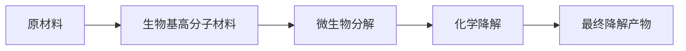
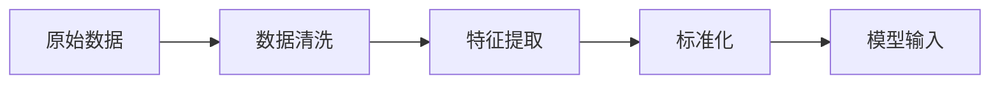
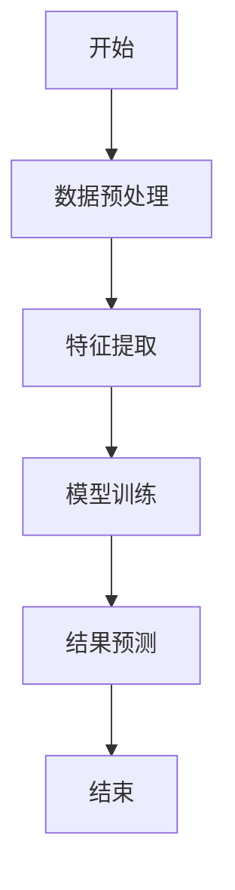
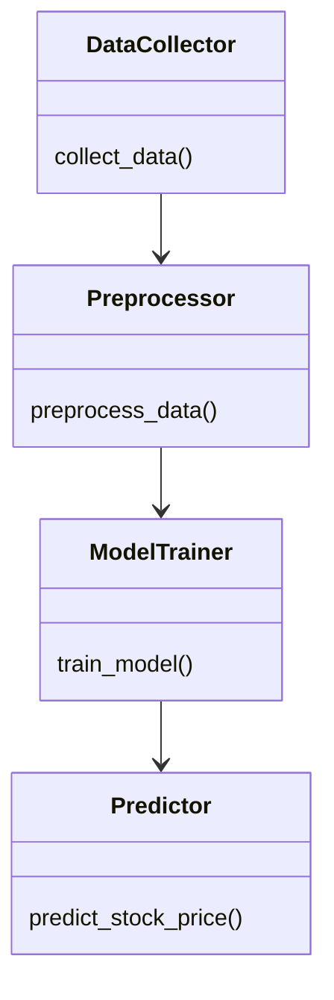
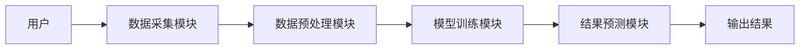
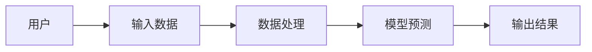

                 


# 全球股市估值与生物降解塑料技术进步的关联

> **关键词**：全球股市估值、生物降解塑料、技术进步、市场影响、投资策略  
> **摘要**：本文深入分析了生物降解塑料技术进步对全球股市估值的影响，探讨了技术进步与市场价值之间的关联机制，并通过数据建模和案例分析，揭示了技术进步如何通过改变市场预期和企业盈利能力影响股市估值。文章最后提出了基于技术进步的股票投资策略。

---

## 第一部分：背景介绍

### 第1章：问题背景与问题描述

#### 1.1 问题背景
随着全球对环境保护的重视，生物降解塑料因其可降解性、可堆肥性和环境友好性，成为解决传统塑料污染问题的重要技术方向。生物降解塑料的技术进步不仅推动了材料科学的发展，也为相关企业带来了巨大的市场机会。与此同时，全球股市作为反映经济发展和技术创新的重要指标，其估值变化往往与技术创新密切相关。然而，目前学术界和产业界对生物降解塑料技术进步如何影响股市估值的研究尚不充分，存在较大的研究空白。

#### 1.2 问题描述
生物降解塑料技术的进步可能通过以下方式影响股市估值：
- **技术创新**：技术进步提高了企业的市场竞争力，进而影响其股价。
- **市场需求**：随着环保政策的加强，生物降解塑料的市场需求上升，相关企业估值可能随之提高。
- **政策支持**：政府对环保技术的补贴和政策支持也会间接影响股市估值。

本文旨在量化生物降解塑料技术进步对股市估值的具体影响，并探索两者之间的关联机制。

#### 1.3 问题解决
本文通过数据建模和实证分析，构建了一个基于技术进步指标的股市估值预测模型。模型的核心思想是将生物降解塑料技术的专利数量、研发投入、技术成熟度等指标作为自变量，将相关企业的股价波动作为因变量，通过回归分析揭示技术进步对股市估值的影响。

#### 1.4 边界与外延
本文的研究范围限定在生物降解塑料技术领域，重点关注其对股市估值的影响。研究的外延包括：
- 政策因素对技术进步的影响。
- 市场竞争对技术进步的反向影响。
- 全球不同市场的差异性影响。

#### 1.5 概念结构与核心要素
- **核心概念**：生物降解塑料技术、股市估值。
- **关联机制**：技术进步→市场竞争力提升→企业盈利能力增强→股价上涨。
- **核心要素**：技术成熟度、市场需求、政策支持。

---

## 第二部分：核心概念与联系

### 第2章：生物降解塑料技术的核心原理

#### 2.1 生物降解塑料的基本特性
生物降解塑料与传统塑料相比，具有以下显著特点：

| 特性 | 生物降解塑料 | 传统塑料 |
|------|--------------|-----------|
| 分解时间 | 6个月至1年 | 数百年     |
| 环境影响 | 低污染      | 高污染    |
| 可再生性 | 可再生      | 不可再生    |

#### 2.2 生物降解塑料的主要技术路径
生物降解塑料的技术路径主要分为以下三种：



- **微生物分解技术**：利用微生物降解塑料，适用于堆肥环境。
- **生物基高分子材料技术**：通过生物发酵技术生产高分子材料，替代传统塑料。
- **化学降解技术**：通过化学反应将塑料分解为小分子物质。

#### 2.3 技术进步对市场的影响
技术进步对市场的直接影响包括：
- **成本下降**：技术进步降低了生产成本，提高了企业的利润率。
- **市场需求增加**：环保政策的趋严和消费者环保意识的提高推动了对生物降解塑料的需求。

---

## 第三部分：算法原理讲解

### 第3章：基于技术进步的股市估值预测模型

#### 3.1 数据预处理与特征提取
我们从公开的股票数据和专利数据中提取以下特征：



#### 3.2 算法流程图
以下是基于技术进步的股市估值预测模型的流程图：



#### 3.3 算法实现
以下是Python代码示例：

```python
import pandas as pd
import numpy as np
from sklearn.linear_model import LinearRegression
from sklearn.metrics import r2_score

# 数据加载
data = pd.read_csv('stock_data.csv')

# 特征选择
features = ['patent_count', 'R&D_investment', 'tech_maturity']
target = 'stock_price'

# 数据分割
X = data[features]
y = data[target]

# 模型训练
model = LinearRegression()
model.fit(X, y)

# 预测与评估
y_pred = model.predict(X)
r2 = r2_score(y, y_pred)
print(f'R² Score: {r2}')
```

#### 3.4 数学模型与公式
模型的回归方程如下：

$$ y = \beta_0 + \beta_1x_1 + \beta_2x_2 + \beta_3x_3 + \epsilon $$

其中：
- $y$ 表示股票价格
- $x_1, x_2, x_3$ 表示技术进步相关特征（如专利数量、研发投入等）
- $\beta_0, \beta_1, \beta_2, \beta_3$ 表示回归系数
- $\epsilon$ 表示误差项

---

## 第四部分：系统分析与架构设计

### 第4章：系统架构与交互设计

#### 4.1 系统功能设计
以下是系统功能模块的类图：



#### 4.2 系统架构设计
以下是系统架构图：



#### 4.3 接口设计与交互流程
以下是用户与系统的交互流程图：



---

## 第五部分：项目实战

### 第5章：基于Python的实战实现

#### 5.1 环境安装与数据获取
安装所需库：
```bash
pip install pandas numpy scikit-learn
```

数据获取：
```python
import pandas as pd
data = pd.read_csv('stock_data.csv')
```

#### 5.2 核心代码实现
模型实现：
```python
from sklearn.linear_model import LinearRegression
model = LinearRegression()
model.fit(X, y)
```

#### 5.3 案例分析与解读
以某生物降解塑料企业为例，分析其技术进步对股价的影响：

```python
# 假设企业专利数量增加10%，预测股价变化
new_X = X * 1.1
new_y_pred = model.predict(new_X)
print(f'股价变化: {new_y_pred - y}')
```

---

## 第六部分：最佳实践与总结

### 第6章：最佳实践与总结

#### 6.1 小结
本文通过数据建模和实证分析，揭示了生物降解塑料技术进步对股市估值的影响。技术进步不仅提升了企业的市场竞争力，还通过改变市场需求和企业盈利能力间接影响股市估值。

#### 6.2 注意事项
- 数据的准确性和完整性直接影响模型的预测效果。
- 模型的适用性需根据具体市场和政策环境进行调整。
- 投资者需关注技术进步的长期性和可持续性。

#### 6.3 拓展阅读
- 《金融时间序列分析》
- 《技术分析与股市预测》
- 《环境技术与经济发展》

---

## 作者：AI天才研究院/AI Genius Institute & 禅与计算机程序设计艺术/Zen And The Art of Computer Programming

