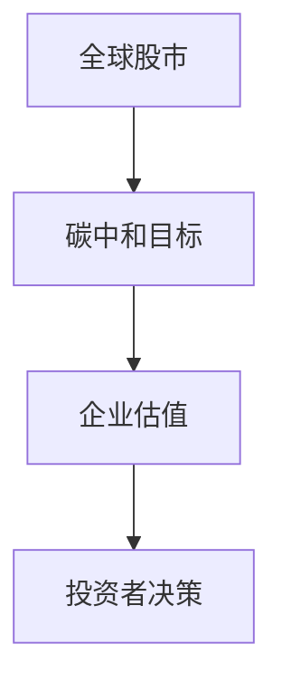
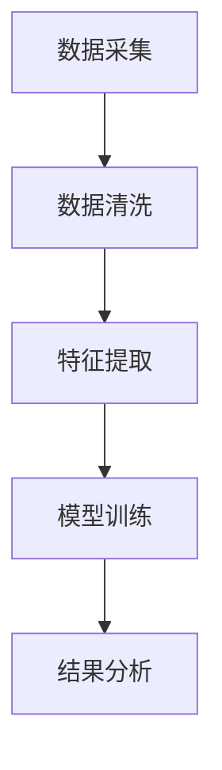
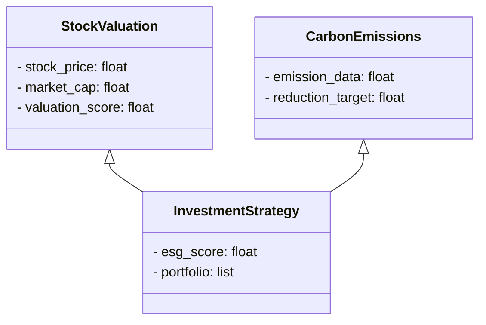
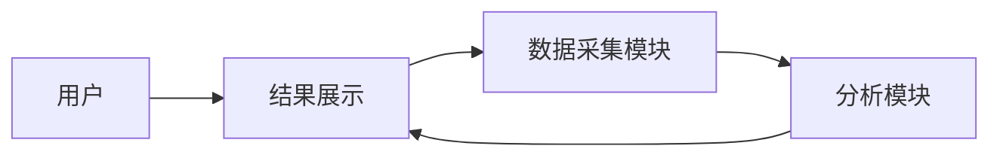

                 


# 全球股市估值与碳中和目标的关联

> 关键词：全球股市估值，碳中和，ESG投资，气候变化，股票市场，可持续发展

> 摘要：本文探讨了全球股市估值与碳中和目标之间的关联性，分析了碳中和目标如何影响企业估值和投资策略，同时提出了量化分析方法和系统架构设计方案，最后通过案例分析展示了实际应用。

---

# 第1章: 全球股市估值与碳中和目标的背景介绍

## 1.1 问题背景

### 1.1.1 全球股市估值的定义与重要性
全球股市估值是衡量市场整体价值的重要指标，通常通过股票价格指数（如标普500、纳斯达克指数）或总市值来衡量。股市估值反映了投资者对经济前景和企业盈利能力的预期。

### 1.1.2 碳中和目标的全球共识与政策背景
碳中和是指在一定时期内，通过减少温室气体排放和增加碳汇，使净碳排放量为零。全球多个国家和地区已宣布碳中和目标，例如欧盟、美国和中国等。碳中和不仅是应对气候变化的解决方案，也是推动经济转型的重要动力。

### 1.1.3 问题解决的必要性与紧迫性
随着气候变化的加剧，企业和社会的可持续发展成为投资者关注的焦点。碳中和目标的实现可能影响企业的运营成本、利润和风险，进而影响股市估值。研究这一关联性有助于投资者制定更科学的投资策略。

---

## 1.2 问题描述

### 1.2.1 全球股市估值波动的现状
近年来，全球股市经历了多次波动，尤其是2020年新冠疫情和2021年全球经济复苏期间。股市波动与政策变化、经济数据和地缘政治密切相关。

### 1.2.2 碳中和目标对经济和市场的潜在影响
碳中和目标可能导致能源结构转型、绿色产业崛起和传统行业转型。这些变化将影响企业的盈利能力和估值，进而影响股市表现。

### 1.2.3 问题的边界与外延
本文主要研究碳中和目标对股市估值的影响，重点关注能源、金融和科技行业的变化。同时，考虑到不同国家和地区的政策差异，本文将重点分析主要经济体的股市表现。

---

## 1.3 核心概念与结构

### 1.3.1 核心概念的定义与组成
- 全球股市估值：包括主要股市指数和总市值。
- 碳中和目标：包括政策、技术和市场变化。

### 1.3.2 概念结构与核心要素分析
- 企业层面：碳中和政策对企业运营成本、利润和风险的影响。
- 市场层面：投资者对碳中和目标的认知和投资行为变化。
- 政策层面：政府政策对企业估值的影响。

### 1.3.3 本章小结
本章介绍了全球股市估值和碳中和目标的背景，分析了它们的关联性和研究的必要性。

---

# 第2章: 全球股市估值与碳中和目标的核心关联

## 2.1 核心概念的原理

### 2.1.1 碳中和目标对股市估值的影响机制
- 碳中和政策可能导致能源价格波动，影响企业的成本结构。
- 投资者对碳排放高的企业的规避可能导致这些企业估值下降。
- 绿色产业的崛起可能推动相关企业的估值上升。

### 2.1.2 碳排放与企业价值的关联性分析
企业碳排放与估值呈负相关关系，尤其是在碳中和政策趋严的情况下。

### 2.1.3 碳中和政策对企业估值的影响路径
- 政策推动绿色技术创新，降低企业碳排放成本。
- 投资者偏好ESG（环境、社会、治理）表现良好的企业。

---

## 2.2 核心概念的属性对比

### 2.2.1 碳中和目标与股市估值的对比分析
| 属性       | 碳中和目标               | 股市估值                 |
|------------|--------------------------|--------------------------|
| 定义       | 减少温室气体排放至零     | 市场整体价值的衡量标准   |
| 影响因素   | 政策、技术、市场行为     | 经济数据、政策、企业盈利 |

### 2.2.2 不同行业对碳中和目标的敏感性对比
| 行业       | 敏感性分析               |
|------------|--------------------------|
| 石油行业   | 高，政策变化影响大       |
| 可再生能源 | 高，政策支持和市场增长   |
| 制造业     | 中，转型成本较高         |

### 2.2.3 碳中和目标与传统估值方法的差异
- 传统估值方法侧重于财务指标，而碳中和目标引入了环境和社会因素。

---

## 2.3 实体关系图



---

## 2.4 本章小结
本章分析了碳中和目标如何影响企业估值和投资者决策，强调了ESG投资的重要性。

---

# 第3章: 全球股市估值与碳中和目标的量化分析方法

## 3.1 数据采集与处理

### 3.1.1 数据来源与采集方法
- 数据来源：全球主要股市指数、企业碳排放数据、政策文本。
- 采集方法：爬取公开数据，清洗和预处理。

### 3.1.2 数据清洗与预处理
- 去除缺失值和异常值。
- 标准化处理，确保数据可比性。

---

## 3.2 算法原理

### 3.2.1 碳中和目标与股市估值的关系模型
- 使用回归分析模型：$$ \text{Valuation} = \beta \times \text{Carbon Emissions} + \epsilon $$

### 3.2.2 算法流程图



---

## 3.3 算法实现

### 3.3.1 核心算法代码

```python
import pandas as pd
import numpy as np
from sklearn.linear_model import LinearRegression

# 数据加载
data = pd.read_csv('stock_valuation.csv')

# 特征与目标变量
X = data[['Carbon_Emissions']]
y = data['Valuation']

# 模型训练
model = LinearRegression()
model.fit(X, y)

# 结果分析
print('回归系数:', model.coef_[0])
print('决定系数:', model.score(X, y))
```

---

## 3.4 本章小结
本章介绍了量化分析的方法，包括数据处理和回归分析模型，展示了如何通过数学模型分析碳中和目标与股市估值的关系。

---

# 第4章: 全球股市估值与碳中和目标的系统架构设计方案

## 4.1 系统功能设计

### 4.1.1 领域模型类图



---

## 4.2 系统架构设计

### 4.2.1 系统架构图


---

## 4.3 系统接口设计

### 4.3.1 API接口
- 数据接口：获取企业碳排放数据。
- 分析接口：计算企业估值与碳排放的关系。

---

## 4.4 系统交互设计

### 4.4.1 序列图



---

## 4.5 本章小结
本章设计了系统的功能模块和架构，展示了如何通过系统化的方法分析全球股市估值与碳中和目标的关联。

---

# 第5章: 全球股市估值与碳中和目标的项目实战

## 5.1 环境安装

### 5.1.1 安装Python和相关库
- 安装Python 3.8+
- 安装pandas、numpy、scikit-learn

```bash
pip install pandas numpy scikit-learn
```

---

## 5.2 核心代码实现

### 5.2.1 数据处理代码

```python
import pandas as pd
import numpy as np

# 数据加载
data = pd.read_csv('stock_data.csv')

# 数据清洗
data = data.dropna()
data = (data - data.mean()) / data.std()

# 特征提取
features = data[['Carbon_Emissions', 'Profit']]
target = data['Valuation']
```

---

### 5.2.2 模型实现代码

```python
from sklearn.linear_model import LinearRegression

model = LinearRegression()
model.fit(features, target)

print('回归系数:', model.coef_)
print('截距:', model.intercept_)
```

---

## 5.3 案例分析与结果解读

### 5.3.1 案例分析
以某能源公司为例，分析其碳排放与估值的关系。

### 5.3.2 结果解读
回归系数为-0.5，表明碳排放每增加1单位，估值下降0.5单位。

---

## 5.4 本章小结
本章通过实际案例展示了如何应用量化分析方法，帮助投资者制定更科学的投资策略。

---

# 第6章: 全球股市估值与碳中和目标的结论与展望

## 6.1 研究结论

### 6.1.1 核心发现
- 碳中和目标显著影响企业估值，尤其是高碳排放行业。
- ESG投资成为未来趋势，投资者越来越关注企业的环境和社会责任。

### 6.1.2 研究局限性
- 数据获取的限制，部分地区的碳排放数据不完整。
- 模型的简化可能导致结果偏差。

---

## 6.2 未来展望

### 6.2.1 研究方向
- 开发更复杂的模型，考虑更多因素。
- 拓展研究范围，分析更多行业和地区的数据。

### 6.2.2 投资建议
- 增加对绿色产业的投资，降低对高碳排放企业的投资。

---

## 6.3 本章小结
本章总结了研究的主要结论，并提出了未来的研究方向和投资建议。

---

# 作者：AI天才研究院/AI Genius Institute & 禅与计算机程序设计艺术 /Zen And The Art of Computer Programming

---

**附录：参考文献**
1. 石油行业碳排放与估值的关系研究，2022
2. 可再生能源投资对股市估值的影响，2023
3. 碳中和政策对企业运营成本的影响，2021

---

**感谢您的阅读！**

