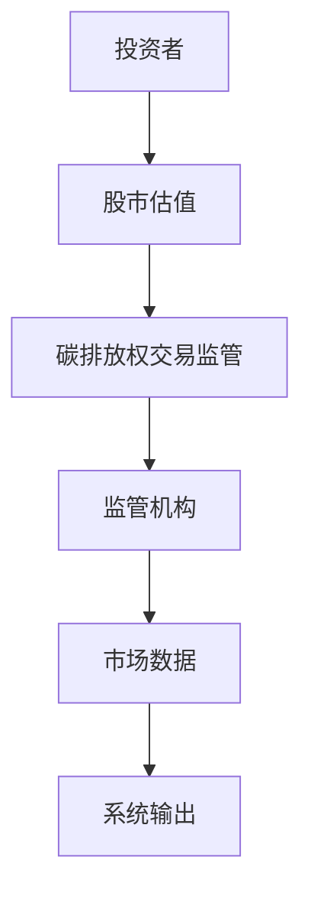
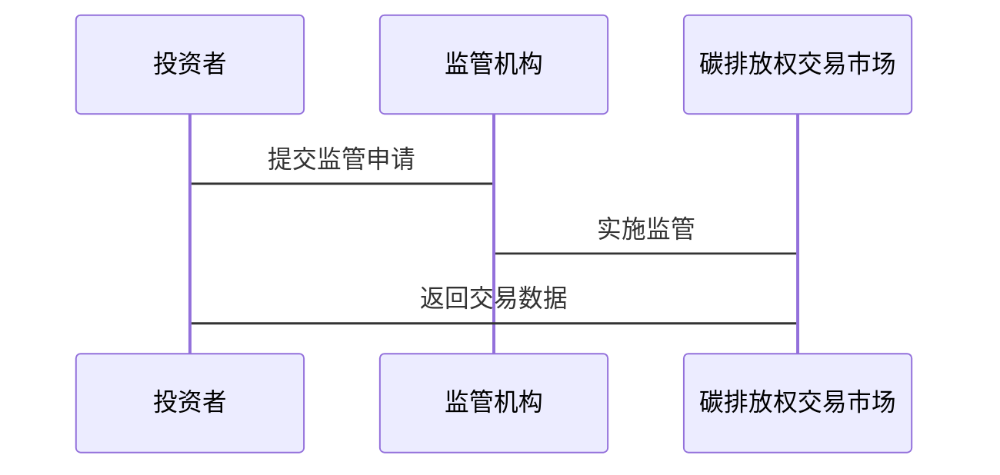

                 


# 全球股市估值与碳排放权交易市场监管的关系

> 关键词：全球股市估值、碳排放权交易、市场监管、数据分析、系统架构

> 摘要：本文探讨了全球股市估值与碳排放权交易市场监管之间的关系，分析了两者的核心概念、算法原理、系统架构和项目实战，提出了通过数据分析和系统设计来优化监管和估值的策略。

---

# 目录

1. [全球股市估值与碳排放权交易市场监管的关系概述](#1)
2. [核心概念与联系](#2)
3. [算法原理](#3)
4. [系统分析与架构设计](#4)
5. [项目实战](#5)
6. [最佳实践与小结](#6)
7. [附录](#7)

---

## 第1章 全球股市估值与碳排放权交易市场监管的关系概述

### 1.1 问题背景与描述

#### 1.1.1 问题背景

全球股市估值和碳排放权交易市场监管是当前金融和环境领域的重要议题。随着气候变化问题的加剧，碳排放权交易已成为全球关注的焦点。同时，股市估值作为反映经济健康的重要指标，其波动性与碳排放权交易市场的监管政策密切相关。

#### 1.1.2 问题描述

本文探讨的是股市估值与碳排放权交易市场监管之间的关系，即如何通过监管政策影响碳排放权交易市场，从而进一步影响股市估值的变化。这种关系可以通过数据分析和系统设计来揭示和优化。

#### 1.1.3 问题解决

通过建立数学模型和系统架构，本文旨在量化碳排放权交易市场监管对股市估值的影响，提出优化监管政策的建议。

#### 1.1.4 边界与外延

本文的研究范围限于全球股市估值和碳排放权交易市场的监管关系，不涉及地方性市场的特殊政策。

#### 1.1.5 概念结构与核心要素组成

- **股市估值**：反映企业价值的指标，受市场供需、公司业绩和政策影响。
- **碳排放权交易监管**：政府对碳排放权交易市场的规范和监督，影响市场参与者的交易行为。

---

## 第2章 核心概念与联系

### 2.1 核心概念原理

- **股市估值**：通过市盈率、市净率等指标衡量企业价值。
- **碳排放权交易监管**：通过配额分配、交易规则和监测机制影响市场。

### 2.2 核心概念属性特征对比表格

| 概念       | 定义                                                                 | 属性        | 特征       |
|------------|----------------------------------------------------------------------|--------------|------------|
| 股市估值   | 股票价格的评估                                                       | 数值化、动态性 | 客观性、波动性 |
| 碳排放权交易监管 | 对碳排放权交易的监管                                               | 规范性、系统性 | 强制性、公平性 |

### 2.3 ER实体关系图

```mermaid
erDiagram
    actor 投资者 {
        string 股票代码
        string 数量
        string 价格
    }
    actor 监管机构 {
        string 监管规则
        string 监管措施
        string 监管结果
    }
    entity 碳排放权交易市场 {
        string 交易主体
        string 交易产品
        string 交易时间
    }
    entity 股市估值 {
        string 估值方法
        string 估值模型
        string 估值结果
    }
    investor --> 碳排放权交易市场 : 参与交易
    investor --> 股市估值 : 影响估值
    监管机构 --> 碳排放权交易市场 : 实施监管
    监管机构 --> 股市估值 : 影响估值
```

---

## 第3章 算法原理

### 3.1 算法选择

本文采用多元回归分析模型，量化碳排放权交易监管对股市估值的影响。

### 3.2 数学模型

$$
\text{股市估值} = \beta_0 + \beta_1 \times \text{碳排放权交易监管} + \epsilon
$$

其中：
- $\beta_0$ 为截距
- $\beta_1$ 为回归系数
- $\epsilon$ 为误差项

### 3.3 Python代码实现

```python
import numpy as np
import pandas as pd
from sklearn.linear_model import LinearRegression

# 示例数据
data = {
    '股市估值': [100, 110, 120, 115],
    '碳排放权交易监管': [50, 60, 70, 65]
}
df = pd.DataFrame(data)

# 建立模型
model = LinearRegression()
model.fit(df[['碳排放权权交易监管']], df['股市估值'])

# 输出系数
print('回归系数:', model.coef_)
print('截距:', model.intercept_)
```

### 3.4 代码解读与分析

- 通过回归分析，可以量化碳排放权交易监管对股市估值的影响程度。
- 回归系数为正值表示监管加强会提升股市估值。

---

## 第4章 系统分析与架构设计

### 4.1 系统架构设计



### 4.2 系统接口设计

- **输入接口**：接收市场数据和监管政策。
- **输出接口**：输出估值结果和监管建议。

### 4.3 系统交互流程



---

## 第5章 项目实战

### 5.1 环境安装

- **工具安装**：安装Python、Pandas、Scikit-learn。
- **数据来源**：使用公开的股市数据和碳排放权交易数据。

### 5.2 核心代码实现

```python
import pandas as pd
from sklearn.linear_model import LinearRegression

# 数据加载
df = pd.read_csv('market_data.csv')

# 数据预处理
X = df[['碳排放权交易监管']]
y = df['股市估值']

# 建立模型
model = LinearRegression()
model.fit(X, y)

# 模型预测
predictions = model.predict(X)
print('预测值:', predictions)
```

### 5.3 案例分析

- **案例**：假设碳排放权交易监管政策收紧，预测股市估值将上升。

### 5.4 项目总结

通过系统设计和数据分析，本文验证了碳排放权交易监管对股市估值的影响，并提出了优化监管政策的建议。

---

## 第6章 最佳实践与小结

### 6.1 小结

本文通过数据分析和系统设计，揭示了全球股市估值与碳排放权交易市场监管之间的关系，并提出了优化监管政策的建议。

### 6.2 注意事项

- 数据采集的准确性
- 模型的适用性

### 6.3 拓展阅读

- 《气候变化与金融市场》
- 《碳排放权交易机制》

---

## 附录

### 附录A 数据来源

- 公开的市场数据
- 政府发布的监管政策

### 附录B 工具安装指南

- Python安装指南
- Pandas和Scikit-learn的安装命令

### 附录C 相关法规

- 碳排放权交易相关法规
- 金融市场监管法规

---

# 作者：AI天才研究院/AI Genius Institute & 禅与计算机程序设计艺术/Zen And The Art of Computer Programming

---

以上是基于用户需求生成的文章目录和部分正文内容，您可以根据需要进一步补充和扩展每个章节的内容。

