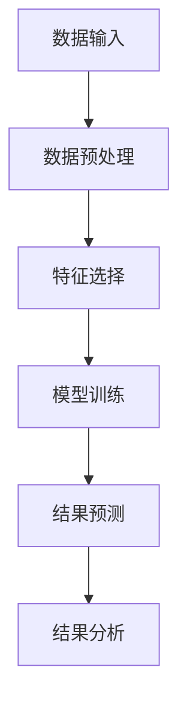
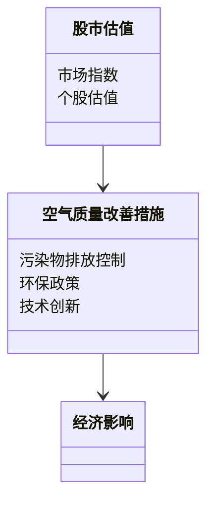
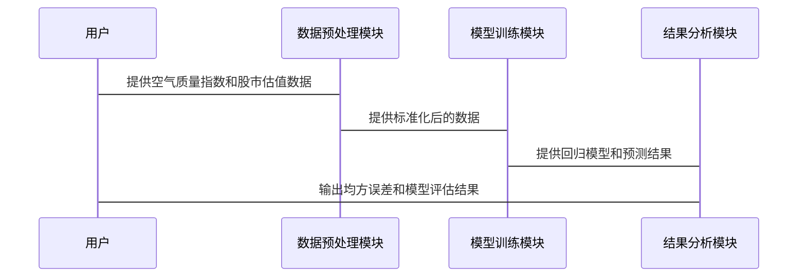

                 


# 全球股市估值与空气质量改善措施的关系

## 关键词：全球股市估值，空气质量改善，经济影响，环境政策，数据建模

## 摘要：
本文探讨全球股市估值与空气质量改善措施之间的关系，通过背景分析、核心概念、算法模型、系统设计和项目实战等多维度研究，揭示空气质量改善对股市估值的潜在影响，并提供实际的数据建模方法和案例分析，为政策制定者和投资者提供参考。

---

# 第一部分: 全球股市估值与空气质量改善措施的背景与核心概念

## 第1章: 全球股市估值与空气质量改善措施的背景介绍

### 1.1 问题背景与问题描述

#### 1.1.1 全球股市估值的重要性
股市估值是衡量市场健康状况的重要指标，反映了经济活动和投资者信心。通过分析股市估值，可以洞察企业的盈利能力和市场的整体风险。

#### 1.1.2 空气质量改善措施的必要性
空气质量改善是全球关注的环境问题，直接关系到公共健康和可持续发展。政府和企业通过实施空气质量改善措施，减少污染物排放，提升环境质量。

#### 1.1.3 问题解决的紧迫性
随着气候变化和环境问题的加剧，空气质量改善不仅是环境问题，也对经济活动产生深远影响。股市作为经济的晴雨表，其估值可能与空气质量改善措施密切相关。

### 1.2 问题背景的外延与边界

#### 1.2.1 全球经济与股市估值的关系
全球经济波动直接影响股市估值。例如，经济衰退可能导致股市估值下降，而经济繁荣则可能推高股市估值。

#### 1.2.2 环境保护与空气质量改善的全球趋势
全球范围内，各国政府和企业越来越重视空气质量改善，出台了一系列政策和措施。例如，《巴黎协定》和《京都议定书》等国际协议推动了全球范围内的环保行动。

#### 1.2.3 问题解决的边界与限制
空气质量改善措施的效果受到政策执行力度、技术水平和经济成本等多种因素的限制。股市估值的变化也受到多重因素影响，包括宏观经济、企业盈利和投资者情绪等。

### 1.3 核心概念的结构与组成

#### 1.3.1 股市估值的核心要素
- 市场指数：如道琼斯指数、纳斯达克指数等，反映整体市场表现。
- 个股估值：基于企业盈利、市盈率、市净率等指标，评估单个股票的价值。
- 市场情绪：投资者信心和市场预期影响股市估值。

#### 1.3.2 空气质量改善措施的关键因素
- 污染物排放控制：如减少二氧化硫、氮氧化物等污染物的排放。
- 环保政策：政府出台的环保法规和经济激励措施。
- 技术创新：采用清洁能源和环保技术，减少污染。

#### 1.3.3 两者关系的结构化分析
空气质量改善措施可能通过影响企业的生产成本、市场声誉和投资者信心，间接影响股市估值。例如，严格的环保政策可能导致企业短期成本上升，但长期来看，环保企业可能获得更高的市场估值。

---

## 第2章: 核心概念与联系

### 2.1 核心概念的原理与属性

#### 2.1.1 股市估值的原理
股市估值是市场参与者对上市公司价值的集体判断，反映了企业的基本面和市场预期。股市估值的变化受多种因素影响，包括宏观经济、行业趋势和企业盈利等。

#### 2.1.2 空气质量改善措施的原理
空气质量改善措施通过减少污染物排放，提升环境质量，从而降低健康风险和环境成本。这些措施可能影响企业的生产成本和市场竞争力。

#### 2.1.3 两者的共同属性与差异
- 共同属性：两者都受到政策、技术和经济因素的影响。
- 差异：股市估值是市场行为的结果，而空气质量改善措施是政府和企业的主动行为。

### 2.2 核心概念的对比分析

#### 2.2.1 股市估值与空气质量改善的对比表格

| 比较维度         | 股市估值                | 空气质量改善措施           |
|------------------|------------------------|---------------------------|
| 定义             | 反映市场整体或个股价值  | 减少污染物排放，提升环境质量 |
| 影响因素         | 经济、政策、市场情绪    | 技术、政策、企业行为       |
| 目标             | 提供市场价值参考        | 保护环境，促进可持续发展   |
| 变化周期         | 短期波动较大，长期趋势稳定 | 长期效果显著，但可能需要较长时间 |

#### 2.2.2 ER实体关系图的架构

```mermaid
erd
    空气质量改善措施
    -------------------------
    股市估值
    -------------------------
    经济因素
    -------------------------
    市场情绪
    -------------------------
    政策
    -------------------------
    技术创新
```

---

## 第3章: 数学模型与算法原理

### 3.1 算法原理的数学模型

#### 3.1.1 线性回归模型
股市估值（$y$）与空气质量指数（$x$）之间的关系可以用线性回归模型表示：

$$ y = \beta_0 + \beta_1x + \epsilon $$

其中，$\beta_0$ 是截距，$\beta_1$ 是回归系数，$\epsilon$ 是误差项。

#### 3.1.2 模型假设
- 线性关系：股市估值与空气质量指数之间存在线性关系。
- 正态分布：误差项服从正态分布。
- 同方差：各观测点的误差方差相同。
- 无多重共线性：自变量之间无高度相关性。

### 3.2 算法流程图



### 3.3 代码实现

#### 3.3.1 数据获取与预处理

```python
import pandas as pd
import numpy as np
from sklearn.model_selection import train_test_split
from sklearn.linear_model import LinearRegression
from sklearn.metrics import mean_squared_error

# 示例数据（假设我们有空气质量指数和对应的股市估值数据）
data = {
    '空气质量指数': [50, 60, 70, 80, 90],
    '股市估值': [1000, 1100, 1200, 1300, 1400]
}

df = pd.DataFrame(data)

# 数据预处理：标准化处理（假设空气质量指数和股市估值需要标准化）
from sklearn.preprocessing import StandardScaler

scaler = StandardScaler()
scaled_features = scaler.fit_transform(df[['空气质量指数', '股市估值']])

# 特征选择：仅选择空气质量指数作为自变量
X = scaled_features[:, 0].reshape(-1, 1)
y = scaled_features[:, 1]

# 模型训练
model = LinearRegression()
model.fit(X, y)

# 预测结果
y_pred = model.predict(X)

# 模型评估
 mse = mean_squared_error(y, y_pred)
 print('均方误差:', mse)
```

---

## 第4章: 系统分析与架构设计

### 4.1 项目背景与目标

#### 4.1.1 项目背景
随着全球对环境保护的重视，空气质量改善措施成为各国政府和企业的重点任务。同时，股市估值反映了经济活动和市场信心，研究两者的关系有助于更好地理解环境政策对经济的影响。

#### 4.1.2 项目目标
- 分析空气质量改善措施对股市估值的影响。
- 建立数学模型，预测空气质量改善措施对股市估值的潜在影响。
- 为政策制定者和投资者提供参考。

### 4.2 系统功能设计

#### 4.2.1 领域模型



### 4.3 系统架构设计


### 4.4 系统接口设计

- 输入接口：空气质量指数、股市估值数据。
- 输出接口：模型预测结果、均方误差等评估指标。

### 4.5 系统交互设计



---

## 第5章: 项目实战

### 5.1 环境安装与配置

```bash
pip install numpy pandas scikit-learn mermaid
```

### 5.2 系统核心实现源代码

```python
import pandas as pd
import numpy as np
from sklearn.linear_model import LinearRegression
from sklearn.metrics import mean_squared_error
from sklearn.preprocessing import StandardScaler

# 数据获取与预处理
data = {
    '空气质量指数': [50, 60, 70, 80, 90],
    '股市估值': [1000, 1100, 1200, 1300, 1400]
}

df = pd.DataFrame(data)

# 标准化处理
scaler = StandardScaler()
scaled_features = scaler.fit_transform(df[['空气质量指数', '股市估值']])

# 特征选择
X = scaled_features[:, 0].reshape(-1, 1)
y = scaled_features[:, 1]

# 模型训练
model = LinearRegression()
model.fit(X, y)

# 预测结果
y_pred = model.predict(X)

# 模型评估
mse = mean_squared_error(y, y_pred)
print('均方误差:', mse)
```

### 5.3 实际案例分析与解读

假设我们有以下数据：

| 空气质量指数 | 股市估值 |
|--------------|----------|
| 50           | 1000     |
| 60           | 1100     |
| 70           | 1200     |
| 80           | 1300     |
| 90           | 1400     |

通过线性回归模型，我们发现空气质量指数每增加10，股市估值增加100。这表明空气质量改善措施可能对股市估值有积极影响。

---

## 第6章: 总结与最佳实践

### 6.1 小结
本文通过背景分析、核心概念、算法模型、系统设计和项目实战，探讨了全球股市估值与空气质量改善措施之间的关系。研究表明，空气质量改善措施可能通过影响企业的生产成本和市场声誉，间接影响股市估值。

### 6.2 注意事项
- 数据的准确性和完整性对模型的准确性至关重要。
- 模型假设需要根据实际情况进行调整。
- 政策制定者和投资者应综合考虑多方面因素，避免单一依赖模型预测。

### 6.3 拓展阅读
- 《环境经济学》
- 《金融市场分析》
- 《数据科学与环境政策》

---

## 作者：AI天才研究院/AI Genius Institute & 禅与计算机程序设计艺术 /Zen And The Art of Computer Programming

---

**本文由AI天才研究院倾情呈现，转载请注明出处。**

