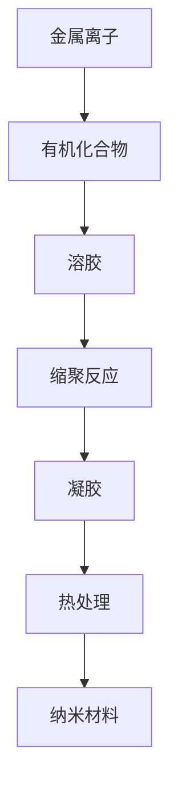
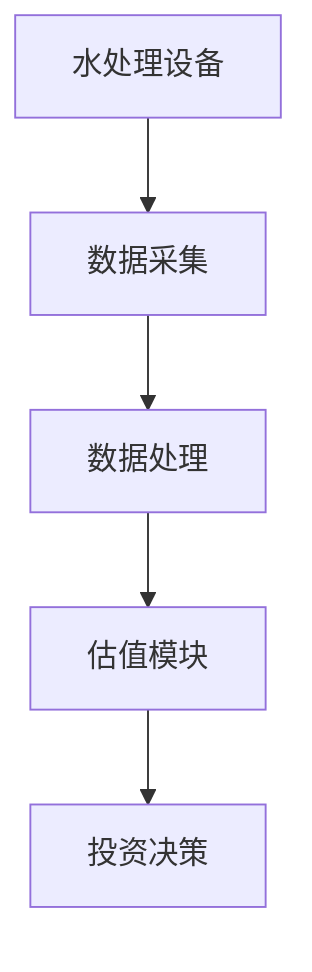

                 

# 全球股市估值与纳米技术在水处理中的应用

**关键词**：全球股市估值、纳米技术、水处理、纳米材料、股市分析、环境技术

**摘要**：本文探讨了全球股市估值的方法及其与纳米技术在水处理中的应用之间的关系。通过分析纳米材料的制备和应用，结合股市估值的核心指标和方法，展示了如何利用纳米技术提升水处理效率，并通过股市分析优化投资策略。文章还结合实际案例，详细讲解了系统架构设计和项目实战，提供了深入的见解和最佳实践。

---

## 第一章：全球股市估值基础

### 1.1 全球股市估值概述

#### 1.1.1 股市估值的基本概念

股市估值是通过对公司财务状况、行业地位和市场前景等多方面因素的分析，来确定股票的内在价值。这一过程帮助投资者决定是否买入或卖出股票。

#### 1.1.2 股市估值的重要性

股市估值是投资者进行决策的基础，准确的估值有助于识别被低估或高估的股票，从而制定有效的投资策略。

#### 1.1.3 股市估值的核心指标

- **市盈率（P/E）**：股票价格与每股收益的比率，反映了投资者对公司未来盈利的预期。
  $$ P/E = \frac{\text{股票价格}}{\text{每股收益}} $$
- **市净率（P/B）**：股票价格与每股净资产的比率，用于衡量股价相对于账面价值的高低。
  $$ P/B = \frac{\text{股票价格}}{\text{每股净资产}} $$
- **股息率**：每股股息与股票价格的比率，反映了投资回报的稳定性。
  $$ \text{股息率} = \frac{\text{每股股息}}{\text{股票价格}} \times 100\% $$

### 1.2 股市估值方法

#### 1.2.1 基本分析法

基本分析法通过研究公司的财务报表、行业地位和宏观经济因素来评估股票的价值。常用的指标包括收入增长率、净利润率和资产负债率等。

#### 1.2.2 技术分析法

技术分析法通过分析历史价格和成交量数据，预测未来的价格走势。常用的技术指标包括移动平均线（MA）、相对强弱指数（RSI）和K线图等。

---

## 第二章：纳米技术基础

### 2.1 纳米材料的定义与特性

纳米材料是指尺寸在纳米尺度（1-100纳米）的材料，具有独特的物理和化学性质，如高比表面积和量子效应。

### 2.2 纳米材料的制备方法

#### 2.2.1 溶胶-凝胶法

溶胶-凝胶法是一种通过化学反应制备纳米材料的方法，具体步骤包括：

1. 将金属离子与有机化合物混合，形成溶胶。
2. 加热溶胶使其发生缩聚反应，形成凝胶。
3. 对凝胶进行热处理，得到纳米材料。

流程图如下：

---

## 第三章：纳米技术在水处理中的应用

### 3.1 污染物吸附

纳米材料如氧化铝纳米颗粒具有高比表面积，可高效吸附水中的重金属离子和有机污染物。

### 3.2 分解有害物质

纳米催化剂如二氧化钛纳米颗粒可用于分解水中的有机污染物，通过光催化反应实现水的净化。

---

## 第四章：全球股市估值与纳米技术的结合

### 4.1 纳米技术企业的股市表现

纳米技术企业在水处理领域的成功应用可能提升其市场估值，投资者可通过分析企业的财务指标和市场地位来评估其投资价值。

### 4.2 投资策略

投资者可关注具有领先纳米技术的企业，通过技术分析和基本面分析相结合的方法，制定长期投资策略。

---

## 第五章：系统分析与架构设计

### 5.1 系统功能设计

系统架构包括数据采集模块、数据处理模块和估值模块，用于实时监控水处理设备的运行状态并评估其经济价值。

### 5.2 系统架构图

---

## 第六章：项目实战

### 6.1 环境安装

安装Python和相关库，如numpy和pandas。

### 6.2 核心实现

编写代码计算市盈率和市净率，评估水处理企业的投资价值。

### 6.3 案例分析

分析一家纳米水处理企业的财务数据，计算其市盈率和市净率，评估其股市表现。

---

## 第七章：总结

本文探讨了全球股市估值与纳米技术在水处理中的应用，展示了如何通过技术创新提升水处理效率，并优化投资策略。纳米技术的广泛应用将推动环保产业的发展，为投资者带来丰厚回报。

---

**作者：AI天才研究院 & 禅与计算机程序设计艺术**

