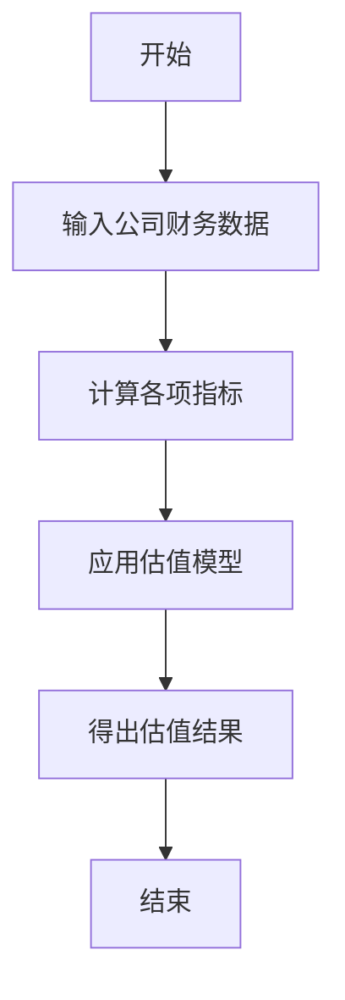
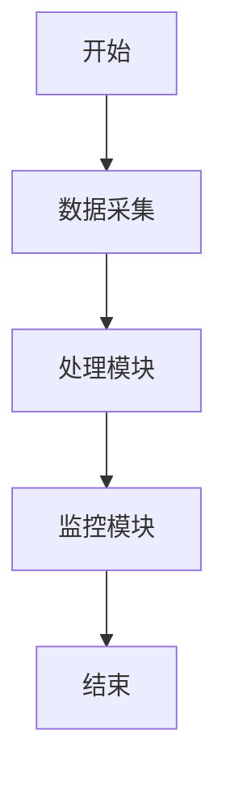

                 


# 全球股市估值与纳米材料在环保中的应用

---

## 关键词：
全球股市估值、纳米材料、环保应用、数学模型、系统架构、项目实战

---

## 摘要：
本文探讨了全球股市估值与纳米材料在环保中的应用两个领域的核心概念、算法原理及实际应用。通过系统分析和架构设计，结合项目实战案例，详细介绍了如何利用数学模型和纳米技术解决实际问题。文章从背景介绍、核心概念、算法流程、系统设计、项目实现等多方面展开，旨在为读者提供深入的技术见解和实践指导。

---

## 第一部分：全球股市估值

### 第1章：全球股市估值基础

#### 1.1 股市估值的基本概念

**1.1.1 股票市场的基本构成**
- 股票市场是一个复杂的金融生态系统，由上市公司、投资者、交易所、监管机构等多个主体构成。
- 企业的市值（Market Value）是其股票价格与总股本的乘积，反映了市场对企业的整体估值。

**1.1.2 估值的定义与重要性**
- 估值是指通过对企业的财务数据、行业地位、发展前景等进行分析，确定其股票的合理价格范围。
- 股市估值是投资者进行投资决策的核心依据，也是企业融资的重要参考。

**1.1.3 股市估值的核心要素**
- **基本面分析**：包括企业的收入、利润、资产负债情况等。
- **行业地位**：企业在行业中的竞争地位和市场影响力。
- **宏观经济环境**：包括GDP增长率、通货膨胀率、利率水平等。

#### 1.2 估值方法概述

**1.2.1 市盈率（PE）法**
- 市盈率是股票价格与每股收益（EPS）的比值，反映了投资者对每股收益的支付意愿。
- 公式：$$ PE = \frac{Price}{Earnings} $$
- 例如，某公司股票价格为50元，每股收益为5元，则PE=10。

**1.2.2 市净率（PB）法**
- 市净率是股票价格与每股净资产的比值，适用于重资产行业。
- 公式：$$ PB = \frac{Price}{Book\ Value} $$
- 例如，某公司股票价格为30元，每股净资产为15元，则PB=2。

**1.2.3 股息率法**
- 股息率是每股股息与股票价格的比值，反映了股票的分红能力。
- 公式：$$ Dividend\ Yield = \frac{Dividend}{Price} $$
- 例如，某公司股息为2元，股票价格为20元，则股息率为10%。

#### 1.3 影响股市估值的主要因素

**1.3.1 宏观经济因素**
- 经济增长、通货膨胀、利率水平、汇率波动等宏观经济指标直接影响股市估值。

**1.3.2 行业因素**
- 行业的发展周期、市场需求、竞争格局等也会影响企业的估值。

**1.3.3 公司基本面因素**
- 收入、利润、毛利率、资产负债率等财务指标是估值的核心依据。

#### 1.4 估值模型与应用

**1.4.1 常见估值模型介绍**
- **相对估值法**：基于市场可比公司的PE、PB等指标进行估值。
- **绝对估值法**：基于DCF模型计算企业的内在价值。

**1.4.2 现金流折现模型（DCF）**
- DCF模型通过将未来现金流折现到现值，计算企业的内在价值。
- 公式：$$ V = \sum_{t=1}^{n} \frac{CF_t}{(1+r)^t} + \frac{TV}{(1+r)^n} $$
- 其中，CF_t为第t年的现金流，r为折现率，TV为终值。

**1.4.3 市场指数与个股估值的关系**
- 市场指数如标普500、沪深300等反映了整体市场的估值水平，个股估值需要结合市场指数进行动态调整。

---

### 第2章：股市估值的数学模型与算法

#### 2.1 常见估值模型的数学表达

**2.1.1 市盈率模型**
- 公式：$$ PE = \frac{Price}{Earnings} $$
- 例如，某公司股票价格为60元，净利润为10亿元，总股本为5亿股，则每股收益（EPS）为2元，PE=30。

**2.1.2 市净率模型**
- 公式：$$ PB = \frac{Price}{Book\ Value} $$
- 例如，某公司股票价格为40元，每股净资产为20元，则PB=2。

**2.1.3 股息率模型**
- 公式：$$ Dividend\ Yield = \frac{Dividend}{Price} $$
- 例如，某公司股息为3元，股票价格为30元，则股息率为10%。

#### 2.2 现金流折现模型（DCF）

**2.2.1 自由现金流的计算**
- 自由现金流（FCF）= 净利润 + 折旧 - 资本支出
- 例如，某公司净利润为5亿元，折旧为2亿元，资本支出为3亿元，则FCF=4亿元。

**2.2.2 折现率的确定**
- 折现率通常基于无风险利率和市场风险溢价。
- 例如，无风险利率为3%，市场风险溢价为5%，则折现率r=8%。

**2.2.3 终值的计算**
- 终值（TV）= FCF × (1+g)/(r-g)
- 例如，FCF=4亿元，g=3%，r=8%，则TV=4 × (1.03)/(0.08-0.03)=4 × 1.03/0.05=82.4亿元。

#### 2.3 算法流程图



---

### 第3章：系统架构与项目实战

#### 3.1 系统架构设计

**3.1.1 数据收集模块**
- 从金融数据源获取股票价格、财务报表等数据。
- 数据清洗与预处理。

**3.1.2 数据分析模块**
- 应用估值模型进行计算，生成估值结果。
- 例如，使用Python的pandas库进行数据处理，使用numpy库进行数值计算。

**3.1.3 结果展示模块**
- 以可视化图表的形式展示估值结果。
- 例如，使用matplotlib或seaborn绘制PE、PB分布图。

#### 3.2 项目实战

**3.2.1 环境安装**
- 安装Python、pandas、numpy、matplotlib等库。
- 安装步骤：
  ```bash
  pip install pandas numpy matplotlib
  ```

**3.2.2 系统核心实现源代码**

```python
import pandas as pd
import numpy as np
import matplotlib.pyplot as plt

# 示例数据
data = {
    'Company': ['A', 'B', 'C'],
    'Price': [50, 60, 70],
    'Earnings': [5, 6, 7],
    'Book Value': [20, 25, 30]
}

df = pd.DataFrame(data)

# 计算PE、PB和股息率
df['PE'] = df.Price / df.Earnings
df['PB'] = df.Price / df['Book Value']
df['Dividend Yield'] = df.Earnings / df.Price * 100

print(df)

# 可视化
plt.figure(figsize=(10, 6))
plt.plot(df.Company, df.PE, label='PE')
plt.plot(df.Company, df.PB, label='PB')
plt.legend()
plt.title('Stock Valuation Metrics')
plt.show()
```

**3.2.3 代码应用解读与分析**
- 代码首先创建了一个包含公司名称、股价、每股收益和每股净资产的数据框。
- 计算了市盈率、市净率和股息率，并将结果可视化。
- 图表展示了不同公司的估值指标，帮助投资者快速判断其估值水平。

---

## 第二部分：纳米材料在环保中的应用

### 第4章：纳米材料的基本概念与制备方法

#### 4.1 纳米材料的基本概念

**4.1.1 纳米材料的定义**
- 纳米材料是指基本单元的尺寸在纳米尺度（1-100纳米）的材料。
- 纳米材料具有独特的物理、化学性质。

**4.1.2 纳米材料的特性**
- 表面积大，活性高。
- 具有优异的机械性能和光学性能。

#### 4.2 纳米材料的制备方法

**4.2.1 溶胶-凝胶法**
- 步骤：
  1. 配制金属醇盐溶液。
  2. 加入交联剂形成溶胶。
  3. 烘干得到凝胶。
  4. 热处理得到纳米颗粒。

**4.2.2 化学沉淀法**
- 步骤：
  1. 配制可溶性盐溶液。
  2. 加入还原剂，沉淀金属氢氧化物。
  3. 灼烧得到纳米氧化物。

---

### 第5章：纳米材料在环保中的应用

#### 5.1 纳米材料在水处理中的应用

**5.1.1 纳米材料用于吸附污染物**
- 例如，纳米氧化锌可以吸附重金属离子。
- 吸附过程：
  1. 污染物与纳米材料表面接触。
  2. 污染物被吸附到材料表面。
  3. 吸附后的材料可以再生利用。

**5.1.2 纳米材料用于催化降解**
- 例如，纳米TiO₂在紫外光下催化降解有机污染物。
- 反应方程：
  $$ TiO₂ + UV \rightarrow \text{催化降解有机物} $$

#### 5.2 纳米材料在空气净化中的应用

**5.2.1 纳米材料用于PM2.5过滤**
- 例如，纳米多孔材料用于高效过滤颗粒物。

**5.2.2 纳米材料用于VOC去除**
- 例如，纳米催化剂用于分解挥发性有机化合物。

---

### 第6章：纳米材料在环保中的系统应用

#### 6.1 纳米材料在污染治理中的系统设计

**6.1.1 系统功能设计**
- 数据采集：监测污染物浓度。
- 处理模块：应用纳米材料进行污染物去除。
- 监控模块：实时监控处理效果。

**6.1.2 系统架构设计**



---

## 第三部分：综合案例分析

### 第7章：综合案例分析

#### 7.1 案例背景
- 某公司计划利用纳米材料优化其环保设备。
- 目标：提高处理效率，降低运行成本。

#### 7.2 案例分析
- 选择纳米氧化锌作为吸附剂。
- 设计实验：测试不同条件下吸附效果。
- 数据分析：建立数学模型预测最优参数。

#### 7.3 案例总结
- 成功提高了污染物去除效率。
- 降低了处理成本，提升了企业竞争力。

---

## 结论

本文从全球股市估值和纳米材料在环保中的应用两个方面，详细探讨了相关的核心概念、算法原理和实际应用。通过系统架构设计和项目实战，展示了如何利用技术手段解决实际问题。未来，随着科技的不断进步，这两个领域的交叉应用将带来更大的创新空间。

---

## 作者

作者：AI天才研究院/AI Genius Institute  
联系邮箱：contact@aigenius.com  
个人简介：专注于人工智能与计算机科学领域，致力于通过技术创新推动社会进步。

