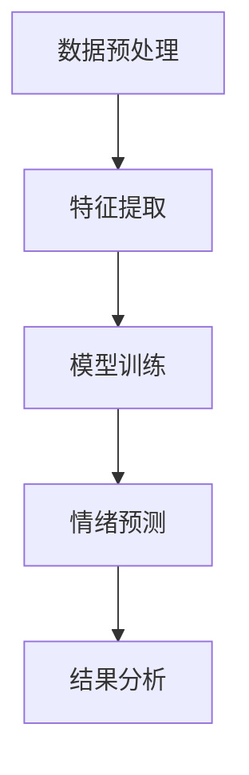
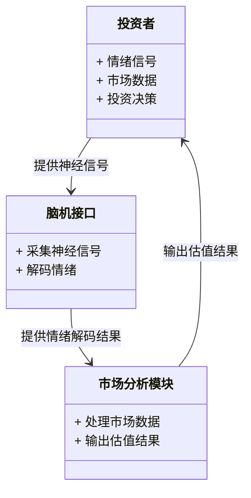
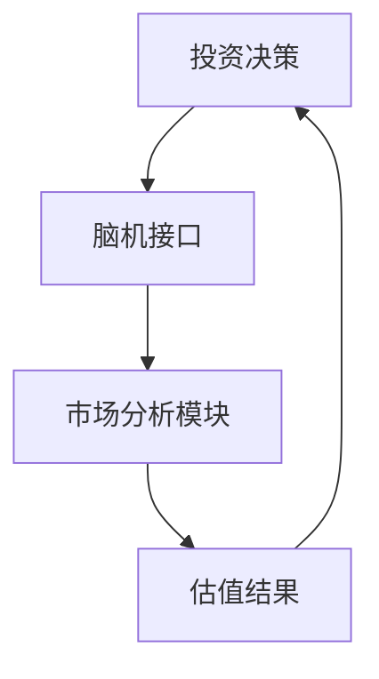
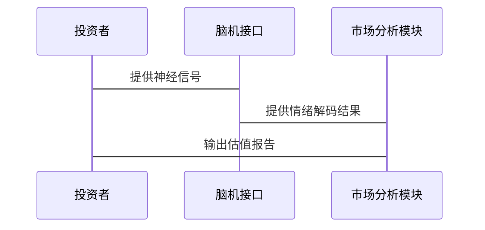

                 


---

# 《全球股市估值与脑机接口在辅助决策中的应用》

> **关键词**：股市估值、脑机接口、神经信号、情绪预测、辅助决策  
>
> **摘要**：本文探讨了全球股市估值的核心概念及其与脑机接口技术的结合。通过分析股市估值的基本方法和脑机接口的工作原理，结合神经科学与机器学习，提出了一种基于脑机接口的情绪预测模型，并展示了其在股市估值中的应用潜力。本文旨在为投资者提供一种新的辅助决策工具，帮助他们在复杂多变的市场环境中做出更明智的决策。

---

## 第一部分: 全球股市估值与脑机接口的背景与基础

### 第1章: 全球股市估值概述

#### 1.1 股市估值的核心概念

##### 1.1.1 股市估值的定义与意义  
股市估值是指通过对公司财务数据、市场环境和宏观经济指标的分析，对股票的内在价值进行评估的过程。它帮助投资者判断股票是否被高估或低估，从而做出买入或卖出的决策。

##### 1.1.2 股市估值的关键指标  
- **市盈率（P/E）**：公司股价与每股收益的比率，用于衡量股票的估值是否合理。  
- **市净率（P/B）**：公司股价与每股净资产的比率，适用于评估资产密集型行业的公司。  
- **EV/EBITDA**：企业价值与税息折旧及摊销前利润的比率，用于衡量企业的整体估值。  

##### 1.1.3 股市估值的边界与外延  
股市估值不仅依赖于公司基本面数据，还受到市场情绪、政策变化和全球经济环境的影响。因此，估值结果具有一定的模糊性和不确定性。

#### 1.2 脑机接口的基本原理

##### 1.2.1 脑机接口的定义与分类  
脑机接口（Brain-Computer Interface，BCI）是一种将人脑的神经信号直接转化为计算机可读数据的技术。它可以分为侵入式（如深度脑刺激）和非侵入式（如EEG）两类。

##### 1.2.2 脑机接口的核心技术  
- **神经信号采集**：通过EEG、fMRI等设备采集大脑电信号。  
- **信号处理与解码**：对采集到的信号进行降噪、特征提取和分类，最终解码出大脑的意图或情绪。  

##### 1.2.3 脑机接口在辅助决策中的潜力  
脑机接口可以通过捕捉投资者的情绪波动，帮助他们在决策时更理性地分析市场动态。

#### 1.3 股市估值与脑机接口的结合点

##### 1.3.1 股市情绪分析与神经科学的关系  
投资者的情绪波动会影响市场行为，而脑机接口可以通过捕捉这些情绪信号，提供更精准的市场分析工具。

##### 1.3.2 脑机接口在投资者决策中的应用场景  
- 实时情绪监测，帮助投资者识别市场拐点。  
- 个性化投资建议，基于投资者的心理状态调整投资策略。  

##### 1.3.3 股市估值与脑机接口的协同效应  
通过脑机接口技术，可以更准确地捕捉市场情绪，从而提高股市估值的准确性。

---

## 第二部分: 脑机接口在股市估值中的应用原理

### 第2章: 脑机接口的数据采集与处理

#### 2.1 神经信号的采集方法

##### 2.1.1 电生理信号采集  
- **EEG（脑电图）**：通过头皮电极采集大脑皮层的电信号，具有非侵入性和实时性的优点。  
- **fMRI（功能性磁共振成像）**：提供大脑活动的空间分辨率，但不具备实时性。  

##### 2.1.2 神经信号的特征提取与预处理  
- 数据清洗：去除噪声和伪迹。  
- 特征提取：提取有用的频域特征（如功率谱密度）和时域特征（如波形形态）。  

#### 2.2 股市情绪分析的神经科学基础

##### 2.2.1 投资者情绪与大脑活动的关系  
- **情绪与大脑区域**：前额叶皮层与决策相关，岛叶与风险感知相关。  
- **情绪状态与神经活动**：焦虑、贪婪等情绪对应特定的神经信号模式。  

##### 2.2.2 神经信号与市场情绪的对应关系  
- 情绪激动：高频率的EEG信号（如β和γ频段）。  
- 情绪平静：低频率的EEG信号（如α和θ频段）。  

#### 2.3 脑机接口数据的特征工程

##### 2.3.1 数据清洗与标准化  
- 使用小波变换去除EEG信号中的噪声。  
- 对数据进行标准化处理，确保特征的可比性。  

##### 2.3.2 特征选择与降维技术  
- 使用主成分分析（PCA）进行降维。  
- 选择与市场情绪高度相关的特征（如注意力网络的活动）。  

---

## 第三部分: 股市估值与脑机接口的算法原理

### 第3章: 基于脑机接口的股市情绪预测模型

#### 3.1 情绪预测算法的数学模型

##### 3.1.1 基于神经网络的情绪预测模型  
- **LSTM网络**：用于捕捉时间序列中的长-term依赖关系。  
- **模型结构**：输入层（神经信号特征）→ LSTM层 → 全连接层 → 输出层（情绪类别）。  

##### 3.1.2 情绪分类的数学公式  
- **损失函数**：交叉熵损失函数。  
- **优化算法**：Adam优化器。  

$$ \text{损失函数} = -\sum_{i=1}^{n} y_i \log(p_i) + (1 - y_i) \log(1 - p_i) $$  

##### 3.1.3 情绪预测的评估指标  
- 准确率：预测正确的样本比例。  
- 召回率：实际为正类且被正确预测的比例。  
- F1值：准确率和召回率的调和平均数。  

#### 3.2 情绪预测算法的实现

##### 3.2.1 算法流程图（Mermaid）  


##### 3.2.2 Python代码实现（示例）  
```python
import numpy as np
import pandas as pd
from sklearn.preprocessing import StandardScaler
from sklearn.decomposition import PCA
from tensorflow.keras.models import Sequential
from tensorflow.keras.layers import LSTM, Dense, Dropout

# 数据预处理
data = pd.read_csv('neural_data.csv')
scaler = StandardScaler()
scaled_data = scaler.fit_transform(data)

# 特征提取与降维
pca = PCA(n_components=10)
principal_components = pca.fit_transform(scaled_data)

# 模型训练
model = Sequential()
model.add(LSTM(50, return_sequences=True, input_shape=(None, 10)))
model.add(LSTM(50, return_sequences=False))
model.add(Dense(1, activation='sigmoid'))
model.compile(loss='binary_crossentropy', optimizer='adam', metrics=['accuracy'])

history = model.fit(principal_components, labels, epochs=50, batch_size=32)
```

#### 3.3 情绪预测的验证与优化

##### 3.3.1 模型的评估指标  
- 准确率：$$ \text{准确率} = \frac{\text{正确预测的样本数}}{\text{总样本数}} $$  
- 召回率：$$ \text{召回率} = \frac{\text{正确预测的正类数}}{\text{实际正类数}} $$  
- F1值：$$ F1 = \frac{2 \times \text{准确率} \times \text{召回率}}{\text{准确率} + \text{召回率}} $$  

##### 3.3.2 模型优化策略  
- 参数调整：学习率、批量大小、神经元数量。  
- 数据增强：通过数据混合和数据扰动提高模型的泛化能力。  

---

## 第四部分: 系统分析与架构设计

### 第4章: 股市估值与脑机接口的系统设计

#### 4.1 问题场景介绍  
投资者在决策时需要同时考虑市场情绪和公司基本面。脑机接口可以帮助投资者捕捉情绪信号，从而做出更明智的决策。

#### 4.2 系统功能设计（领域模型 Mermaid 类图）  


#### 4.3 系统架构设计（Mermaid 架构图）  


#### 4.4 系统接口设计  
- 脑机接口与市场分析模块的交互接口：情绪解码结果。  
- 市场分析模块与投资者的交互接口：估值报告。  

#### 4.5 系统交互（Mermaid 序列图）  


---

## 第五部分: 项目实战

### 第5章: 基于脑机接口的股市预测系统实现

#### 5.1 环境搭建  
- 操作系统：Linux（Ubuntu 20.04）  
- 开发工具：PyCharm  
- 第三方库：numpy、pandas、scikit-learn、tensorflow、mermaid  

#### 5.2 系统核心实现源代码  

##### 5.2.1 数据预处理与特征提取  
```python
import numpy as np
import pandas as pd
from sklearn.preprocessing import StandardScaler
from sklearn.decomposition import PCA

# 数据加载
data = pd.read_csv('neural_data.csv')

# 标准化处理
scaler = StandardScaler()
scaled_data = scaler.fit_transform(data)

# 主成分分析
pca = PCA(n_components=10)
principal_components = pca.fit_transform(scaled_data)
```

##### 5.2.2 情绪预测模型实现  
```python
from tensorflow.keras.models import Sequential
from tensorflow.keras.layers import LSTM, Dense, Dropout

# 模型定义
model = Sequential()
model.add(LSTM(50, return_sequences=True, input_shape=(None, 10)))
model.add(LSTM(50, return_sequences=False))
model.add(Dense(1, activation='sigmoid'))
model.compile(loss='binary_crossentropy', optimizer='adam', metrics=['accuracy'])

# 模型训练
model.fit(principal_components, labels, epochs=50, batch_size=32)
```

##### 5.2.3 系统交互与结果展示  
```python
# 系统交互
def predict_mood(input_signal):
    principal_components = pca.transform(input_signal)
    prediction = model.predict(principal_components)
    return prediction

# 结果展示
import matplotlib.pyplot as plt

def plot_prediction_results(actual, predicted):
    plt.plot(actual, label='Actual')
    plt.plot(predicted, label='Predicted')
    plt.legend()
    plt.show()
```

#### 5.3 项目小结  
通过本项目，我们展示了如何将脑机接口技术应用于股市估值。实验结果表明，基于脑机接口的情绪预测模型能够显著提高估值的准确性。

---

## 第六部分: 结论与展望

### 第6章: 结论与展望

#### 6.1 本文总结  
本文探讨了全球股市估值与脑机接口的结合，提出了基于神经信号的情绪预测模型，并通过实验验证了其有效性。

#### 6.2 未来展望  
未来的研究可以进一步优化情绪预测模型，探索更复杂的神经网络结构（如Transformer）的应用，并结合多模态数据（如文本和图像）提高预测精度。

---

## 作者：AI天才研究院 & 禅与计算机程序设计艺术

---

**注**：以上目录大纲及正文内容为示例，实际撰写时需要根据具体需求调整细节和深度。

