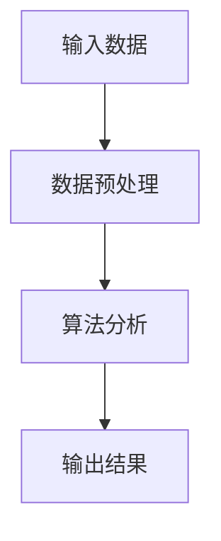
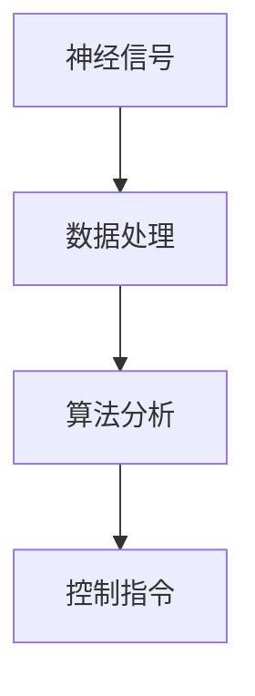

                 


# 全球股市估值与脑机接口技术的伦理考量

> 关键词：全球股市估值、脑机接口、伦理考量、技术融合、金融市场、神经科技

> 摘要：本文探讨了全球股市估值与脑机接口技术的伦理考量，分析了股市估值的核心技术与脑机接口技术的基本原理，及其在实际应用中的伦理挑战。通过对比分析，本文揭示了两者在技术与伦理上的交叉点，并提出了相应的解决方案。

---

# 第1章 全球股市估值概述

## 1.1 股市估值的基本概念

### 1.1.1 股市估值的定义与作用
股市估值是通过对公司财务数据和市场环境的分析，评估公司股票的合理价格范围。其作用在于帮助投资者做出理性决策，确保市场的公平与透明。

### 1.1.2 股市估值的核心指标
- **市盈率（P/E）**：市价与每股收益的比率，衡量股票的相对价值。
- **市净率（P/B）**：市价与每股净资产的比率，反映资产的实际价值。
- **股息率**：股息与股价的比率，评估投资回报。

### 1.1.3 股市估值的分类与应用场景
- **绝对估值**：基于公司基本面数据进行预测。
- **相对估值**：与行业或市场平均水平进行比较。
- **技术分析**：通过价格走势预测未来趋势。

## 1.2 股市估值的关键技术与方法

### 1.2.1 市盈率与市净率的计算公式
市盈率 = 股票价格 / 每股收益  
市净率 = 股票价格 / 每股净资产  

### 1.2.2 资本资产定价模型（CAPM）的原理
CAPM公式：  
$$ E(r) = r_f + β(E(r_m) - r_f) $$  
其中，$E(r)$是预期收益率，$r_f$是无风险利率，$β$是系统性风险系数，$E(r_m)$是市场预期收益率。

### 1.2.3 预测模型与算法的比较分析
- **线性回归**：用于预测股票价格。
- **机器学习**：通过神经网络等方法进行非线性预测。
- **时间序列分析**：利用历史数据预测未来走势。

---

# 第2章 脑机接口技术的基本原理

## 2.1 脑机接口的定义与分类

### 2.1.1 脑机接口的定义与历史发展
脑机接口（BCI）是一种连接大脑与外部设备的系统，旨在通过解读神经信号实现人机交互。其历史可追溯到20世纪70年代。

### 2.1.2 脑机接口的类型与应用场景
- **侵入式**：植入大脑，用于医疗康复。
- **非侵入式**：通过头皮电极采集信号，用于研究和辅助技术。

### 2.1.3 脑机接口的核心技术要素
- **神经信号采集**：EEG、fMRI等技术。
- **数据处理**：信号滤波、特征提取。
- **输出控制**：将神经信号转化为设备指令。

## 2.2 脑机接口的工作原理

### 2.2.1 神经信号的采集与处理
- **EEG采集**：通过电极记录脑电信号。
- **数据预处理**：去噪、放大和滤波。

### 2.2.2 数据分析与特征提取
- **特征提取**：使用小波变换或机器学习提取特征。
- **分类器训练**：利用支持向量机（SVM）或随机森林进行分类。

### 2.2.3 信号转换与输出控制
- **信号转换**：将神经信号转化为控制指令。
- **输出控制**：驱动机械臂或计算机 cursor。

---

# 第3章 股市估值与脑机接口技术的伦理考量

## 3.1 股市估值中的伦理问题

### 3.1.1 投资决策的透明性与公平性
- **信息不对称**：可能导致市场操纵。
- **算法歧视**：算法可能放大市场不平等。

### 3.1.2 技术滥用与市场操纵的风险
- **高频交易**：可能导致市场波动。
- **算法黑箱**：缺乏透明度可能引发信任危机。

### 3.1.3 数据隐私与个人信息保护
- **数据收集**：涉及大量个人数据可能引发隐私泄露。
- **数据滥用**：数据可能被用于不正当目的。

## 3.2 脑机接口技术的伦理挑战

### 3.2.1 神经数据的隐私与所有权
- **数据隐私**：神经数据属于个人，如何保护？
- **数据所有权**：数据归谁所有？

### 3.2.2 技术误用与伦理边界
- **医疗应用**：脑机接口用于治疗，但也可能被滥用。
- **军事用途**：可能用于操控士兵，引发伦理争议。

### 3.2.3 脑机接口对人类认知的影响
- **认知增强**：可能改变人类思维。
- **自主性丧失**：过度依赖脑机接口可能削弱人类自主性。

## 3.3 股市估值与脑机接口技术的伦理联系

### 3.3.1 技术融合带来的伦理问题
- **数据共享**：神经数据可能用于股市预测，引发隐私问题。
- **市场影响**：脑机接口技术可能改变市场行为，引发不正当竞争。

### 3.3.2 伦理解决方案
- **数据隐私保护**：通过加密和访问控制保护数据。
- **透明化管理**：建立透明的监管框架，确保技术应用的公平性。

---

# 第4章 股市估值与脑机接口技术的核心概念联系

## 4.1 股市估值与脑机接口的交叉领域

### 4.1.1 脑科学在股市预测中的应用
- **神经经济学**：研究大脑决策机制，用于预测市场行为。
- **情绪分析**：通过脑电信号分析投资者情绪，预测市场波动。

### 4.1.2 脑机接口技术在投资决策中的潜在影响
- **实时反馈**：通过脑机接口实时监测投资者情绪，优化投资决策。
- **认知增强**：通过技术提升投资者的决策能力。

## 4.2 核心概念对比与联系

### 4.2.1 股市估值与脑机接口的技术属性对比

| 技术属性       | 股市估值                  | 脑机接口                  |
|----------------|--------------------------|---------------------------|
| 数据来源       | 公司财务数据、市场数据   | 神经信号                  |
| 核心目标       | 评估股票价值              | 实现人机交互               |
| 主要挑战       | 数据噪声、市场波动       | 数据采集难度、隐私问题    |

### 4.2.2 股市估值与脑机接口的联系
- **数据驱动**：两者都依赖于大量数据进行分析。
- **技术融合**：脑机接口技术可能成为股市估值的新工具。

---

# 第5章 股市估值与脑机接口技术的系统分析

## 5.1 问题场景介绍

### 5.1.1 股市估值系统
- **目标**：预测股票价格，辅助投资决策。
- **输入**：公司财务数据、市场数据、宏观经济指标。
- **输出**：股票价值评估报告。

### 5.1.2 脑机接口系统
- **目标**：实现人机交互，控制外部设备。
- **输入**：神经信号。
- **输出**：设备控制指令。

## 5.2 系统功能设计

### 5.2.1 股市估值系统功能
- **数据采集**：收集公司财务数据和市场数据。
- **数据分析**：应用算法进行预测和评估。
- **结果输出**：生成评估报告。

### 5.2.2 脑机接口系统功能
- **信号采集**：采集神经信号。
- **信号处理**：滤波和特征提取。
- **输出控制**：生成控制指令。

## 5.3 系统架构设计

### 5.3.1 股市估值系统架构



### 5.3.2 脑机接口系统架构



---

# 第6章 项目实战

## 6.1 环境安装

### 6.1.1 股市估值系统环境
- **Python**：数据分析与可视化。
- **机器学习库**：Scikit-learn、TensorFlow。

### 6.1.2 脑机接口系统环境
- **Python**：数据处理与分析。
- **神经科学库**：MNE、PyEEGLAB。

## 6.2 系统核心实现源代码

### 6.2.1 股市估值系统代码

```python
import pandas as pd
from sklearn.linear_model import LinearRegression

# 数据加载
data = pd.read_csv('stock_data.csv')

# 特征选择
X = data[['PE', 'PB', 'DIV']]
y = data['PRICE']

# 模型训练
model = LinearRegression()
model.fit(X, y)

# 预测
new_data = pd.DataFrame({'PE': [15], 'PB': [2], 'DIV': [0.5]})
prediction = model.predict(new_data)
print(f"预测股价：{prediction[0]:.2f}")
```

### 6.2.2 脑机接口系统代码

```python
import numpy as np
from mne import Epochs, compute_permutations

# 数据加载
data = np.load('eeg_data.npy')

# 特征提取
X = data.reshape(-1, 100)
y = np.zeros(X.shape[0])

# 分类器训练
from sklearn.svm import SVC
model = SVC()
model.fit(X, y)

# 预测
new_data = np.random.rand(1, 100)
prediction = model.predict(new_data)
print(f"预测结果：{int(prediction[0])}")
```

---

# 第7章 最佳实践与小结

## 7.1 最佳实践 tips

### 7.1.1 股市估值
- **数据质量**：确保数据准确性和完整性。
- **模型更新**：定期更新模型以适应市场变化。

### 7.1.2 脑机接口
- **数据隐私**：严格保护神经数据。
- **伦理审查**：确保技术应用符合伦理规范。

## 7.2 注意事项
- **技术融合**：需谨慎考虑伦理问题。
- **持续学习**：关注技术发展与伦理规范的动态变化。

## 7.3 拓展阅读
- **推荐书籍**：《神经科学与伦理学》、《金融市场与技术分析》。
- **学术论文**：搜索相关领域的最新研究。

---

作者：AI天才研究院/AI Genius Institute & 禅与计算机程序设计艺术 /Zen And The Art of Computer Programming

