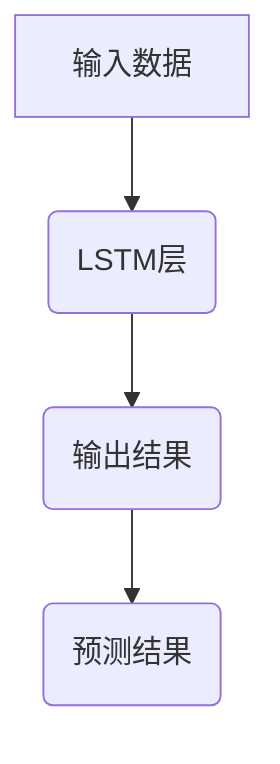
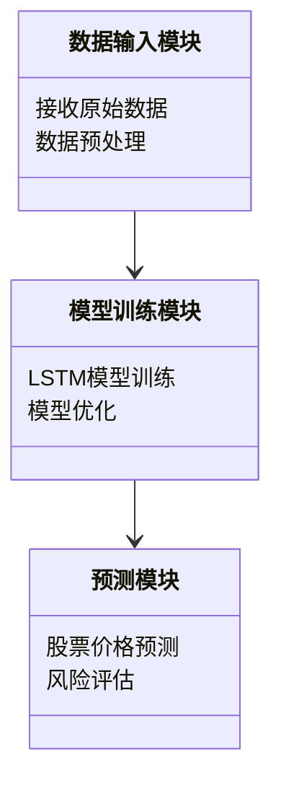
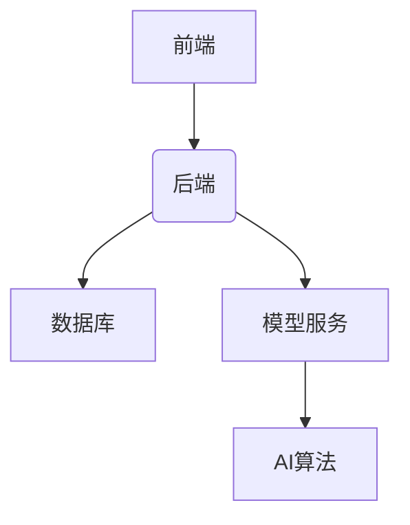

                 


# 全球股市估值与脑科学在人工智能伦理中的应用

---

## 关键词

- 人工智能伦理  
- 股市估值  
- 脑科学  
- 神经科学  
- 人工智能算法  

---

## 摘要

本文探讨了人工智能技术在全球股市估值中的应用，以及脑科学在人工智能伦理中的潜在作用。我们从股市估值的基本概念出发，分析了人工智能算法在预测和优化投资决策中的应用。同时，我们结合脑科学的研究成果，探讨了人工智能系统在伦理决策中的局限性与改进方向。通过跨学科的视角，我们试图为未来的人工智能伦理设计提供新的思路。

---

## 第一部分：全球股市估值的基础与应用

### 第1章：全球股市估值概述

#### 1.1 股市估值的核心概念

##### 1.1.1 股市估值的基本定义

股市估值是通过对企业的财务数据、市场环境和行业趋势进行分析，评估企业股票的内在价值。传统的估值方法包括市盈率（P/E）、市净率（P/B）和股息率等指标。然而，随着人工智能技术的发展，基于机器学习的估值模型逐渐成为研究热点。

##### 1.1.2 股市估值的关键指标

| 指标名称       | 定义与作用                                   |
|----------------|--------------------------------------------|
| 市盈率（P/E）   | 用于衡量股票价格是否合理，反映市场对企业的盈利能力预期。 |
| 市净率（P/B）   | 用于评估股票价格相对于账面价值的高低，适用于重资产行业。 |
| 股息率         | 用于衡量股票的分红能力，反映企业的盈利能力和分红意愿。 |

##### 1.1.3 股市估值的分类与应用场景

股票估值可以分为绝对估值和相对估值两类。绝对估值基于企业的基本面数据，计算其内在价值；相对估值则通过比较同类股票的估值水平，寻找投资机会。

---

#### 1.2 全球股市估值的背景与现状

##### 1.2.1 全球股市的多样性与复杂性

全球股市的多样性体现在不同国家的经济结构、市场环境和政策法规上。例如，美国股市以科技股为主导，而新兴市场如中国和印度则以制造业和服务业为主。这种多样性使得全球股市估值需要结合地域特点和行业特性。

##### 1.2.2 当前股市估值的主要方法与工具

传统的股市估值工具包括基本面分析和趋势分析。然而，随着大数据和人工智能技术的发展，越来越多的投资者开始采用机器学习模型进行预测和决策。

##### 1.2.3 数字化与智能化对股市估值的影响

人工智能技术的应用使得股市估值更加精准和高效。例如，通过自然语言处理技术，投资者可以实时分析新闻、社交媒体和公司公告，从而捕捉市场情绪的变化。

---

#### 1.3 AI在股市估值中的应用前景

##### 1.3.1 AI技术在股市估值中的优势

- 数据处理能力：AI可以处理海量的非结构化数据，如新闻、社交媒体和公司财报。
- 模型复杂性：AI可以通过深度学习模型捕捉复杂的市场规律。
- 实时性：AI可以实时更新模型，适应市场的快速变化。

##### 1.3.2 AI驱动的股市预测与投资决策

通过训练深度学习模型，AI可以预测股票价格的变化趋势，并为投资者提供投资建议。例如，基于长短期记忆网络（LSTM）的股票价格预测模型已经在实际应用中取得了不错的效果。

##### 1.3.3 股市估值的未来发展趋势

未来，随着量子计算和边缘计算技术的发展，股市估值将更加依赖于实时数据和动态模型。同时，AI算法的透明性和可解释性也将成为投资者关注的重点。

---

## 第二部分：脑科学与人工智能伦理的结合

### 第2章：脑科学基础与人工智能伦理

#### 2.1 脑科学的基本概念

##### 2.1.1 脑科学的研究领域与核心概念

脑科学是研究人脑结构和功能的科学，包括神经科学、认知科学和行为科学。神经科学主要研究脑的结构和功能，认知科学关注人类的认知过程，而行为科学则研究人类的行为模式。

##### 2.1.2 神经科学与认知科学的关系

神经科学为认知科学提供了生理基础，而认知科学则通过实验和理论分析揭示人类的认知过程。

##### 2.1.3 脑科学在人工智能中的应用潜力

脑科学的研究成果可以为人工智能系统的伦理设计提供启发。例如，神经科学可以揭示人类的决策过程，从而帮助AI系统做出更符合人类伦理的决策。

---

#### 2.2 人工智能伦理的核心问题

##### 2.2.1 人工智能伦理的基本概念

人工智能伦理研究AI系统的行为是否符合伦理规范，包括隐私保护、公平性和透明性等方面。

##### 2.2.2 人工智能的伦理挑战与风险

- 数据隐私：AI系统可能滥用用户的个人数据。
- 公平性：AI算法可能存在偏见，导致不公平的结果。
- 责任归属：当AI系统出现问题时，责任归属尚不明确。

##### 2.2.3 伦理决策在人工智能系统中的重要性

伦理决策是确保AI系统符合人类价值观的关键。例如，在自动驾驶汽车面临紧急情况时，如何做出符合伦理的决策是一个重要问题。

---

#### 2.3 脑科学与人工智能伦理的关联

##### 2.3.1 脑科学对人工智能伦理的启示

神经科学研究表明，人类的决策过程受到情感和认知的双重影响。因此，AI系统需要考虑这些因素，才能做出更符合人类伦理的决策。

##### 2.3.2 人工智能伦理中的脑科学研究方法

通过脑科学研究，可以揭示人类的决策过程，从而为AI系统的伦理设计提供参考。例如，通过脑成像技术，可以研究人类在面对道德选择时的神经活动。

##### 2.3.3 脑科学在伦理决策中的应用价值

脑科学可以为AI系统的伦理决策提供生理基础。例如，研究人类在面对道德选择时的神经活动，可以帮助设计更符合人类伦理的AI决策系统。

---

## 第三部分：AI伦理与全球股市估值的结合

### 第3章：AI伦理对全球股市估值的影响

#### 3.1 AI伦理在股市估值中的应用

##### 3.1.1 AI伦理对股市预测的指导作用

AI伦理可以指导AI系统在股市预测中做出更公平和透明的决策。例如，AI系统需要避免滥用非公开信息，确保预测的公平性。

##### 3.1.2 伦理驱动的股市投资决策

通过考虑伦理因素，AI系统可以为投资者提供更负责任的投资建议。例如，AI系统可以避免推荐那些涉及不公平贸易或环境破坏的投资标的。

##### 3.1.3 人工智能伦理对股市风险的评估

AI伦理可以帮助评估股市中的风险，例如，通过分析公司的社会责任表现，评估其长期投资价值。

---

#### 3.2 全球股市估值中的伦理挑战

##### 3.2.1 数据隐私与伦理问题

AI系统在股市估值中需要处理大量的个人数据，如何保护这些数据的隐私是一个重要问题。

##### 3.2.2 AI算法的公平性与透明性

AI算法可能存在偏见，导致不公平的估值结果。因此，确保算法的公平性和透明性是股市估值中的一个重要问题。

##### 3.2.3 伦理决策在股市投资中的实际应用

在实际投资中，伦理决策可以帮助投资者规避那些涉及不道德行为的企业，从而降低投资风险。

---

#### 3.3 脑科学视角下的股市估值伦理

##### 3.3.1 脑科学对股市估值伦理的解释

脑科学可以帮助我们理解人类在股市估值中的决策过程，从而为AI系统的伦理设计提供参考。

##### 3.3.2 神经科学在伦理决策中的应用

通过神经科学研究，可以揭示人类在面对道德选择时的神经活动，从而帮助设计更符合人类伦理的AI决策系统。

##### 3.3.3 脑科学视角下的股市估值优化

通过脑科学的研究，可以优化AI系统的估值模型，使其更符合人类的伦理价值观。

---

## 第四部分：技术实现与系统设计

### 第4章：全球股市估值的AI模型设计

#### 4.1 股市估值AI模型的算法原理

##### 4.1.1 基于LSTM的股票价格预测模型

LSTM（长短期记忆网络）是一种常用的深度学习模型，适用于时间序列预测。以下是LSTM的基本结构：



##### 4.1.2 模型的数学公式

LSTM的计算公式如下：

$$
f_t = \sigma(W_f \cdot [h_{t-1}, x_t] + b_f)
$$

$$
i_t = \sigma(W_i \cdot [h_{t-1}, x_t] + b_i)
$$

$$
o_t = \sigma(W_o \cdot [h_{t-1}, x_t] + b_o)
$$

$$
c_t = f_t \cdot c_{t-1} + i_t \cdot tanh(W_c \cdot [h_{t-1}, x_t] + b_c)
$$

$$
h_t = o_t \cdot tanh(c_t)
$$

##### 4.1.3 模型的训练与优化

通过反向传播算法（Backpropagation）和梯度下降（Gradient Descent）优化模型参数。常用的优化算法包括Adam和SGD。

---

#### 4.2 系统架构设计

##### 4.2.1 系统功能设计

以下是系统的功能模块设计：



##### 4.2.2 系统架构设计

以下是系统的架构设计：



---

#### 4.3 项目实战

##### 4.3.1 环境安装

安装所需的Python库：

```bash
pip install numpy pandas keras tensorflow matplotlib
```

##### 4.3.2 系统核心实现源代码

以下是LSTM模型的实现代码：

```python
import numpy as np
from tensorflow.keras.layers import LSTM, Dense, Dropout
from tensorflow.keras.models import Sequential

# 模型定义
model = Sequential()
model.add(LSTM(64, input_shape=(timesteps, features)))
model.add(Dropout(0.5))
model.add(Dense(1))

# 模型编译
model.compile(loss='mean_squared_error', optimizer='adam')
```

##### 4.3.3 代码应用解读与分析

上述代码定义了一个简单的LSTM模型，用于股票价格预测。模型包含一个LSTM层、一个Dropout层和一个全连接层。模型的损失函数是均方误差，优化器是Adam。

---

## 第五部分：总结与展望

### 第5章：总结与展望

#### 5.1 总结

本文探讨了人工智能技术在全球股市估值中的应用，以及脑科学在人工智能伦理中的潜在作用。我们从股市估值的基本概念出发，分析了人工智能算法在预测和优化投资决策中的应用。同时，我们结合脑科学的研究成果，探讨了人工智能系统在伦理决策中的局限性与改进方向。

#### 5.2 展望

未来，随着人工智能技术的不断发展，股市估值将更加依赖于实时数据和动态模型。同时，脑科学的研究成果将为人工智能系统的伦理设计提供更多的启发。我们期待，通过跨学科的研究，可以设计出更符合人类价值观的AI系统。

---

## 作者

作者：AI天才研究院/AI Genius Institute & 禅与计算机程序设计艺术 /Zen And The Art of Computer Programming

