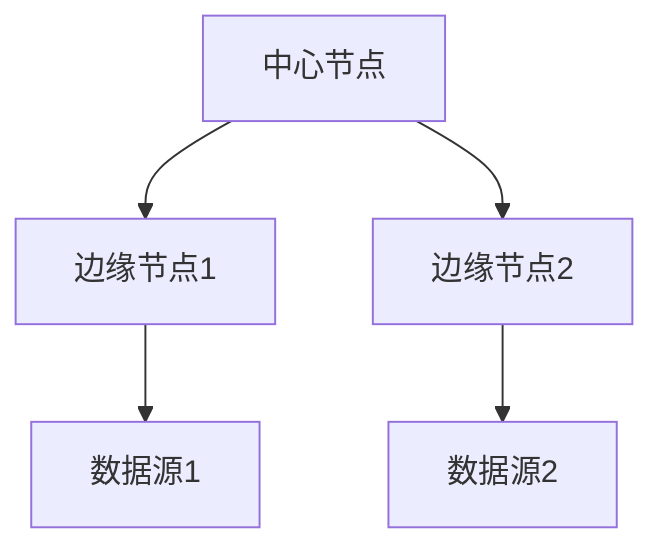
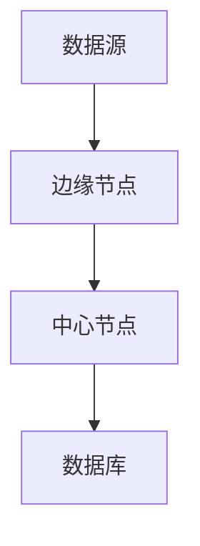

                 


# 全球股市估值与边缘计算技术的关联

> **关键词**: 全球股市估值、边缘计算、金融技术、实时数据分析、分布式计算

> **摘要**: 本文探讨了全球股市估值与边缘计算技术之间的关联，分析了边缘计算技术如何提升股市估值的效率和准确性。通过详细讲解边缘计算的核心原理、算法实现、系统架构设计以及实际案例分析，本文展示了边缘计算在金融领域的广泛应用前景。

---

## 目录

### 第1章 全球股市估值与边缘计算技术的背景介绍

#### 1.1 股市估值的基本概念
- 1.1.1 股市估值的定义与核心要素
- 1.1.2 股市估值的常见方法与挑战
- 1.1.3 股市估值对实时性的需求

#### 1.2 边缘计算技术的基本概念
- 1.2.1 边缘计算的定义与特点
- 1.2.2 边缘计算的优势与应用场景
- 1.2.3 边缘计算与传统云计算的对比

#### 1.3 全球股市估值与边缘计算技术的关联性
- 1.3.1 边缘计算对股市估值的潜在影响
- 1.3.2 两者的结合对金融行业的影响
- 1.3.3 未来发展趋势与挑战

### 第2章 边缘计算技术的核心原理与实现

#### 2.1 边缘计算的体系结构
- 2.1.1 边缘计算的层次结构
- 2.1.2 边缘节点的类型与功能
- 2.1.3 边缘计算的通信机制

#### 2.2 边缘计算的关键技术
- 2.2.1 边缘智能：实时数据分析与决策
- 2.2.2 边缘存储：高效数据管理
- 2.2.3 边缘计算的安全性与隐私保护

#### 2.3 边缘计算的算法实现
- 2.3.1 分布式计算算法
- 2.3.2 实时数据处理算法
- 2.3.3 边缘节点的优化算法

### 第3章 全球股市估值的数学模型与分析

#### 3.1 股市估值的数学模型
- 3.1.1 常用估值方法：市盈率、市净率与股息率
- 3.1.2 数据流的实时处理模型
- 3.1.3 高频交易算法的数学基础

#### 3.2 边缘计算在股市估值中的应用
- 3.2.1 实时数据分析模型
- 3.2.2 基于边缘计算的预测模型
- 3.2.3 高频交易算法的优化与实现

#### 3.3 数学模型与边缘计算的结合
- 3.3.1 数据流的实时处理与分布式计算
- 3.3.2 高效计算的实现与优化
- 3.3.3 模型优化与边缘计算的结合

### 第4章 边缘计算在金融领域的系统架构设计

#### 4.1 系统架构概述
- 4.1.1 系统整体架构
- 4.1.2 边缘节点的分布与功能
- 4.1.3 中心节点的功能与作用

#### 4.2 系统功能设计
- 4.2.1 数据采集模块：实时数据获取与处理
- 4.2.2 数据分析模块：边缘智能与预测模型
- 4.2.3 交易执行模块：高频交易与自动化决策

#### 4.3 系统架构图


#### 4.4 数据流设计


### 第5章 项目实战：基于边缘计算的全球股市估值系统

#### 5.1 项目背景与目标
- 5.1.1 项目背景
- 5.1.2 项目目标
- 5.1.3 项目范围与约束条件

#### 5.2 环境配置与工具安装
- 5.2.1 开发环境配置
- 5.2.2 边缘计算框架的安装与部署
- 5.2.3 数据采集工具的安装与配置

#### 5.3 系统核心实现
- 5.3.1 数据采集模块实现
- 5.3.2 数据分析模块实现
- 5.3.3 交易执行模块实现

#### 5.4 代码实现与解读
- 5.4.1 数据采集模块代码
```python
import requests
from kafka import KafkaProducer

def collect_data():
    # 数据源接口
    response = requests.get("http://api.stock.com/quote")
    data = response.json()
    producer = KafkaProducer(bootstrap_servers='localhost:9092')
    producer.send('stock_topic', value=str(data))
```
- 5.4.2 数据分析模块代码
```python
from kafka import KafkaConsumer
import pandas as pd

def analyze_data():
    consumer = KafkaConsumer('stock_topic', bootstrap_servers='localhost:9092')
    for message in consumer:
        data = eval(message.value)
        df = pd.DataFrame(data)
        # 数据分析与预测
        print("实时数据分析完成")
```

#### 5.5 实际案例分析与结果展示
- 5.5.1 案例背景
- 5.5.2 案例分析过程
- 5.5.3 案例结果与优化建议

### 第6章 总结与展望

#### 6.1 全文总结
- 6.1.1 全球股市估值的核心要素
- 6.1.2 边缘计算技术的核心优势
- 6.1.3 两者的结合对金融行业的影响

#### 6.2 未来展望
- 6.2.1 边缘计算在金融领域的潜在应用
- 6.2.2 技术发展的趋势与挑战
- 6.2.3 未来研究方向与建议

#### 6.3 最佳实践 tips
- 6.3.1 技术选型建议
- 6.3.2 开发注意事项
- 6.3.3 运维与维护建议

---

作者：AI天才研究院 / AI Genius Institute & 禅与计算机程序设计艺术 / Zen And The Art of Computer Programming

