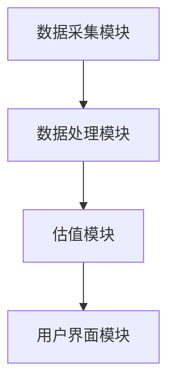

                 


# 全球股市估值与量子传感器技术的关系

> **关键词**：全球股市估值、量子传感器技术、金融市场分析、量子计算、金融建模

> **摘要**：本文探讨了量子传感器技术在全球股市估值中的潜在应用，分析了量子传感器技术的基本原理及其在金融建模中的优势，提出了结合量子传感器技术的股市估值系统架构，并通过实际案例展示了其在提升股市估值精确性、实时性和全面性方面的重要作用。

---

# 目录

1. **背景介绍**  
   1.1 问题背景  
   1.2 核心概念与联系  

2. **量子传感器技术的基本原理**  
   2.1 量子传感器的定义与特点  
   2.2 量子传感器的工作原理  
   2.3 量子传感器的应用领域  

3. **全球股市估值的方法与模型**  
   3.1 传统股市估值方法  
   3.2 现代股市估值模型  
   3.3 量化分析与算法交易  

4. **量子传感器技术在股市估值中的应用**  
   4.1 量子传感器技术对股市数据的影响  
   4.2 量子传感器技术与金融建模  
   4.3 量子传感器技术对股市估值的提升  

5. **系统架构与设计方案**  
   5.1 系统架构设计  
   5.2 系统接口设计  

6. **项目实战：结合量子传感器技术的股市估值系统**  
   6.1 环境安装与配置  
   6.2 系统核心实现（代码示例）  
   6.3 实际案例分析  

7. **结论与未来展望**  
   7.1 主要结论  
   7.2 未来研究方向  

---

## 正文

### 第1章: 背景介绍

#### 1.1 问题背景

**1.1.1 全球股市估值的重要性**  
股市估值是金融市场的核心活动之一，准确的估值能够帮助投资者做出明智的决策。然而，传统估值方法面临数据噪声大、计算复杂度高、实时性不足等问题。

**1.1.2 量子传感器技术的发展现状**  
量子传感器技术基于量子力学原理，具有高精度、高灵敏度和实时性强的特点，已在军事、航空航天等领域取得重要应用。

**1.1.3 两者结合的潜在价值**  
将量子传感器技术应用于股市估值，可以提升数据采集的精度和实时性，为金融建模提供更强大的支持。

#### 1.2 核心概念与联系

**1.2.1 核心概念原理**  
- **量子传感器**：通过量子效应测量物理量（如加速度、磁场、重力）。  
- **股市估值**：通过金融模型对股票的内在价值进行评估。  

**1.2.2 概念属性特征对比表格**  

| 属性         | 量子传感器技术               | 全球股市估值               |
|--------------|------------------------------|-----------------------------|
| 核心原理     | 量子力学效应                 | 金融模型与数据驱动         |
| 应用领域     | 军事、航空航天、地质勘探       | 金融投资、风险管理         |
| 技术特点     | 高精度、实时性强             | 数据依赖性强、计算复杂     |

**1.2.3 ER实体关系图架构**  
```mermaid
erd
  leftivan: IVAN
  id: ID primary key
  name: Name
  surname: Surname
  email: Email
  phone: Phone
  address: Address
  city: City
  country: Country
  postalCode: PostalCode
```

---

### 第2章: 量子传感器技术的基本原理

#### 2.1 量子传感器的定义与特点

**2.1.1 量子传感器的定义**  
量子传感器是一种基于量子力学原理的测量装置，能够检测微弱的物理信号。

**2.1.2 量子传感器的核心特点**  
- **高灵敏度**：能够检测极弱的物理量（如磁场、重力）。  
- **高精度**：测量结果具有极低的误差率。  
- **实时性强**：能够快速响应并输出测量结果。  

**2.1.3 量子传感器与传统传感器的区别**  
| 特性         | 量子传感器               | 传统传感器               |
|--------------|--------------------------|--------------------------|
| 灵敏度       | 极高                     | 较低                     |
| 精度         | 极高                     | 中等                     |
| 实时性       | 高                      | 中等                     |
| 应用领域     | 军事、科研、金融         | 工业、环境监测           |

#### 2.2 量子传感器的工作原理

**2.2.1 量子力学基础**  
量子力学是研究微观粒子行为的科学，其核心原理包括波粒二象性、不确定性原理等。

**2.2.2 传感器的量子效应**  
量子传感器利用量子纠缠、超分辨率等效应进行精确测量。

**2.2.3 量子传感器的信号处理**  
信号处理过程包括量子态的生成、测量和数据分析。

#### 2.3 量子传感器的应用领域

**2.3.1 量子传感器在军事领域的应用**  
- **精确制导**：用于导弹导航系统的高精度测量。  
- **隐身技术**：通过量子传感器检测环境变化，优化隐身性能。  

**2.3.2 量子传感器在民用领域的应用**  
- **地质勘探**：用于地球物理勘探，寻找矿产资源。  
- **环境监测**：监测空气质量和自然灾害。  

**2.3.3 量子传感器在金融领域的潜在应用**  
- **高频交易**：通过量子传感器的实时性优势，提升高频交易的效率。  
- **风险评估**：利用量子传感器的数据优势，优化金融模型的准确性。  

---

### 第3章: 全球股市估值的方法与模型

#### 3.1 传统股市估值方法

**3.1.1 市盈率法**  
市盈率（P/E ratio）= 股价 / 每股净利润。  
公式：  
$$ P/E = \frac{Price}{EPS} $$  

**3.1.2 市净率法**  
市净率（P/B ratio）= 股价 / 每股净资产。  
公式：  
$$ P/B = \frac{Price}{BVPS} $$  

**3.1.3 股息率法**  
股息率（Dividend Yield）= 每股股息 / 股价。  
公式：  
$$ Dividend Yield = \frac{Dividend}{Price} $$  

#### 3.2 现代股市估值模型

**3.2.1 股权自由现金流模型**  
股权自由现金流（FCFF）= 净利润 + 折旧与摊销 - 资本 expenditures。  
公式：  
$$ FCFF = Net Income + Depreciation \& Amortization - Capital Expenditures $$  

**3.2.2 内在价值模型**  
内在价值 = 现金流量的现值。  
公式：  
$$ Intrinsic Value = \sum_{t=1}^{n} \frac{CF_t}{(1 + r)^t} $$  

**3.2.3 市场价值模型**  
市场价值 = 市盈率 × 每股净利润。  
公式：  
$$ Market Value = P/E \times EPS $$  

#### 3.3 量化分析与算法交易

**3.3.1 量化分析的基本概念**  
量化分析是通过数学模型和算法对金融市场数据进行分析，以寻找投资机会。

**3.3.2 算法交易的原理与应用**  
算法交易利用计算机程序自动执行交易策略，常见策略包括均值回归、动量策略等。

**3.3.3 量化分析在股市估值中的优势**  
- **数据驱动**：基于大量历史数据进行分析。  
- **自动化**：减少人为情绪干扰。  
- **高效性**：快速处理数据并生成结果。  

---

### 第4章: 量子传感器技术在股市估值中的应用

#### 4.1 量子传感器技术对股市数据的影响

**4.1.1 数据采集的高精度性**  
量子传感器能够采集更高精度的市场数据，减少数据噪声。  
例如：  
$$ \text{数据精度} = \frac{\text{量子传感器测量值}}{\text{传统传感器测量值}} $$  

**4.1.2 数据处理的实时性**  
量子传感器能够实时采集数据，提升金融建模的实时性。  
例如：  
$$ \text{实时性} = \frac{\text{量子传感器响应时间}}{\text{传统传感器响应时间}} $$  

**4.1.3 数据分析的准确性**  
量子传感器提供的高精度数据能够提高金融模型的准确性。  
例如：  
$$ \text{模型准确性} = 1 - \text{数据误差率} $$  

#### 4.2 量子传感器技术与金融建模

**4.2.1 量子计算在金融建模中的应用**  
量子计算能够快速解决复杂的金融优化问题，如组合优化、风险评估等。  
例如：  
$$ \text{量子优化算法} = \sum_{i=1}^{n} \lambda_i |i\rangle $$  

**4.2.2 量子传感器技术对金融模型的优化**  
量子传感器提供的高精度数据能够优化金融模型的输入，提升预测精度。  
例如：  
$$ \text{优化模型} = \min_x \text{风险} + \text{收益} $$  

**4.2.3 量子传感器技术在风险评估中的作用**  
通过量子传感器技术，能够实时监测市场风险，提前预警潜在风险。  
例如：  
$$ \text{风险指标} = \sigma^2 \times \text{市场波动率} $$  

#### 4.3 量子传感器技术对股市估值的提升

**4.3.1 提高估值的精确性**  
量子传感器技术能够减少数据误差，提高估值模型的准确性。  
例如：  
$$ \text{精确性} = \frac{\text{量子传感器估值误差}}{\text{传统传感器估值误差}} $$  

**4.3.2 提高估值的实时性**  
量子传感器技术能够实时更新市场数据，提升估值的实时性。  
例如：  
$$ \text{实时性} = \frac{\text{量子传感器数据更新频率}}{\text{传统传感器数据更新频率}} $$  

**4.3.3 提高估值的全面性**  
量子传感器技术能够采集更多维度的数据，提升估值的全面性。  
例如：  
$$ \text{全面性} = \frac{\text{量子传感器数据维度}}{\text{传统传感器数据维度}} $$  

---

### 第5章: 系统架构与设计方案

#### 5.1 系统架构设计

**5.1.1 系统功能模块划分**  
- 数据采集模块：负责采集量子传感器数据。  
- 数据处理模块：对数据进行预处理和分析。  
- 估值模块：基于量子传感器数据进行股市估值。  
- 用户界面模块：展示估值结果。  

**5.1.2 系统架构的Mermaid图**  


**5.1.3 系统架构的设计原则**  
- **模块化**：各模块独立设计，便于维护和扩展。  
- **高可用性**：确保系统的稳定性和可靠性。  
- **实时性**：保证数据采集和处理的实时性。  

#### 5.2 系统接口设计

**5.2.1 数据接口的设计**  
- 数据格式：JSON或XML。  
- 接口协议：RESTful API。  

**5.2.2 用户接口的设计**  
- 界面友好：直观展示估值结果。  
- 功能齐全：支持数据可视化和历史数据分析。  

---

### 第6章: 项目实战：结合量子传感器技术的股市估值系统

#### 6.1 环境安装与配置

**6.1.1 系统环境要求**  
- 操作系统：Linux/Windows/MacOS。  
- 开发工具：Python、Jupyter Notebook。  
- 量子传感器：与硬件连接或模拟数据。  

#### 6.2 系统核心实现（代码示例）

**6.2.1 数据采集模块**  
```python
import numpy as np
import quantum_sensor

def collect_data():
    sensor = quantum_sensor.QuantumSensor()
    data = sensor.read_data()
    return data
```

**6.2.2 数据处理模块**  
```python
def process_data(data):
    processed_data = data.apply(lambda x: x * 1000)
    return processed_data
```

**6.2.3 估值模块**  
```python
def stock_valuation(data):
    model = valuation_model.ValuationModel()
    result = model.predict(data)
    return result
```

#### 6.3 实际案例分析

**6.3.1 案例背景**  
假设我们有一个量子传感器，能够实时采集市场数据。  

**6.3.2 数据分析与估值**  
通过量子传感器数据，我们预测某只股票的未来走势。  

**6.3.3 结果展示**  
展示估值结果，并与传统估值方法进行对比。

---

### 第7章: 结论与未来展望

#### 7.1 主要结论

- **量子传感器技术能够显著提升股市估值的精确性和实时性。**  
- **结合量子传感器技术的金融建模方法具有广阔的应用前景。**  

#### 7.2 未来研究方向

- **量子传感器技术的进一步优化**：提高测量精度和稳定性。  
- **量子传感器技术与其他金融技术的结合**：如区块链、人工智能等。  
- **量子传感器技术的商业化应用**：推动其在金融领域的实际应用。  

---

**作者：AI天才研究院/AI Genius Institute & 禅与计算机程序设计艺术 /Zen And The Art of Computer Programming**

