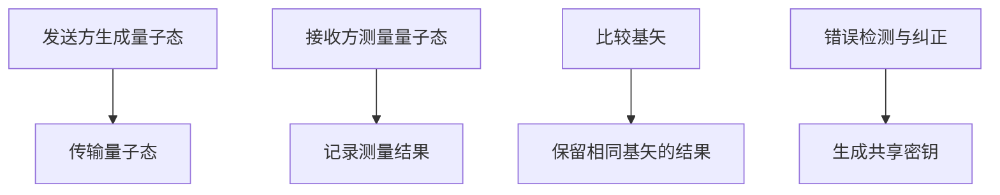
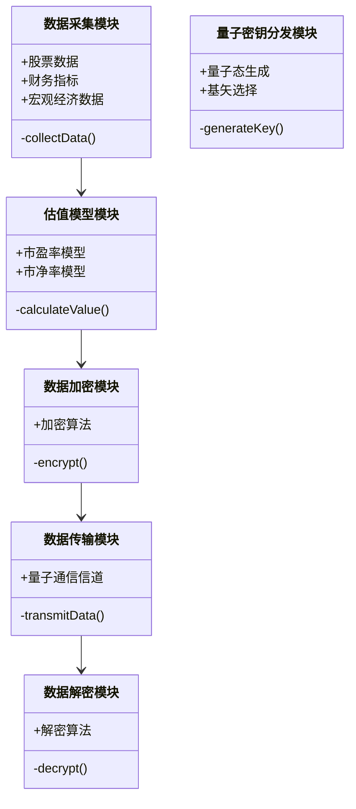

                 


# 全球股市估值与量子密钥分发在网络安全中的应用

## 关键词：全球股市估值、量子密钥分发、网络安全、量子加密、金融数据安全、股票估值模型、量子通信

## 摘要：  
本文深入探讨了全球股市估值与量子密钥分发在网络安全中的应用，分析了量子密钥分发技术在金融数据加密和传输中的重要性。文章从股市估值的基本概念出发，结合量子密钥分发的核心原理，详细阐述了如何利用量子通信技术提升金融数据的安全性。通过数学模型和算法分析，文章展示了量子密钥分发在网络安全中的实际应用，并提出了基于量子通信的股市估值系统设计方案。

---

## 正文

### 第一部分：全球股市估值与量子密钥分发的背景介绍

#### 1.1 全球股市估值概述

股市估值是金融领域的重要组成部分，涉及对股票内在价值的评估。通过分析财务数据、市场趋势和宏观经济指标，投资者可以判断股票的合理价格区间。传统的估值方法包括市盈率（P/E）、市净率（P/B）和股息率等指标。然而，这些方法在实际操作中面临数据获取延迟、市场波动剧烈以及人为干预等问题，导致估值结果的不准确性。

#### 1.2 量子密钥分发的基本原理

量子密钥分发是一种基于量子力学原理的加密技术，通过量子态的不可克隆性和测量扰动性确保密钥的安全传输。其核心思想是利用量子态的性质，使得任何未经授权的窃听都会被发现。量子密钥分发的主要步骤包括量子态生成、传输、基矢选择和密钥提取。这种方法在金融领域的应用可以有效防止数据篡改和未经授权的访问。

---

### 第二部分：量子密钥分发的数学模型与算法原理

#### 2.1 量子密钥分发的数学模型

量子密钥分发的数学模型基于量子态的叠加和纠缠性质。例如，使用单光子的偏振态作为量子态，通过极化滤光片实现基矢选择。数学上，量子态的表示为：

$$ | \psi \rangle = \alpha |0\rangle + \beta |1\rangle $$

其中，$\alpha$ 和 $\beta$ 是复数系数，满足归一化条件：

$$ |\alpha|^2 + |\beta|^2 = 1 $$

在量子密钥分发中，发送方和接收方通过随机选择基矢进行测量，只有在相同基矢下才能正确提取密钥。测量结果的统计分布决定了密钥的有效性和安全性。

#### 2.2 量子密钥分发的算法流程

量子密钥分发的流程可以分为以下几个步骤：

1. **量子态生成**：发送方生成随机的量子态序列。
2. **量子态传输**：通过量子通信信道传输量子态。
3. **基矢选择**：接收方随机选择测量基矢。
4. **密钥提取**：双方比较测量基矢，保留相同基矢的结果作为初步密钥。
5. **错误检测与纠正**：通过公开通信信道检测错误并进行纠错。
6. **密钥生成**：最终生成共享密钥。

以下是一个简化的量子密钥分发流程图（使用mermaid）：



通过上述流程，双方可以安全地生成共享密钥，用于后续的加密通信。

---

### 第三部分：全球股市估值的数学模型与技术分析

#### 3.1 全球股市估值的数学模型

股市估值模型是投资者评估股票价值的重要工具。以下是几种常见的股市估值模型：

1. **市盈率模型（P/E）**：  
   $$ \text{市盈率} = \frac{\text{股价}}{\text{每股收益}} $$

2. **市净率模型（P/B）**：  
   $$ \text{市净率} = \frac{\text{股价}}{\text{每股净资产}} $$

3. **股息率模型（Dividend Yield）**：  
   $$ \text{股息率} = \frac{\text{每股股息}}{\text{股价}} \times 100\% $$

这些模型可以帮助投资者判断股票的相对估值，但它们也有局限性，例如忽略了宏观经济因素和公司治理问题。

---

### 第四部分：量子密钥分发在网络安全中的应用

#### 4.1 量子密钥分发在网络安全中的核心作用

量子密钥分发在网络安全中的应用主要体现在以下几个方面：

1. **金融数据加密**：通过量子密钥分发生成一次性加密密钥，确保金融数据在传输过程中的安全性。
2. **数据完整性验证**：利用量子密钥分发的特性，检测数据传输过程中是否遭受篡改。
3. **金融交易保护**：在高安全要求的金融交易中，量子密钥分发可以提供更高的安全性保障。

#### 4.2 量子密钥分发在股市估值中的应用

量子密钥分发在股市估值中的应用主要体现在以下几个方面：

1. **金融数据传输的安全性**：通过量子密钥分发加密的数据传输，确保估值模型的数据来源可靠。
2. **金融数据分析的安全性**：利用量子密钥分发保护敏感的金融数据，防止数据泄露和篡改。
3. **金融风险管理**：结合量子密钥分发和风险评估模型，提升金融风险管理的效率和准确性。

---

### 第五部分：全球股市估值与量子密钥分发的系统架构设计

#### 5.1 系统功能设计

系统功能设计包括以下几个模块：

1. **数据采集模块**：收集全球股市数据，包括股价、财务指标等。
2. **估值模型模块**：基于数学模型进行股票估值。
3. **量子密钥分发模块**：生成并传输加密密钥。
4. **数据加密模块**：利用量子密钥对数据进行加密。
5. **数据传输模块**：通过量子通信信道传输加密数据。
6. **数据解密模块**：接收方利用密钥解密数据。

系统功能模块之间的关系可以通过mermaid类图表示：



---

### 第六部分：项目实战与案例分析

#### 6.1 项目实战

以下是一个基于量子密钥分发的股市估值系统实现案例：

1. **环境配置**：搭建量子通信实验平台，配置量子态生成和传输设备。
2. **核心代码实现**：编写量子密钥分发算法和股市估值模型的代码。

以下是量子密钥分发的核心代码示例：

```python
import random
import math

def generate_quantum_states(n):
    states = []
    for _ in range(n):
        alpha = random.uniform(0, 1)
        beta = math.sqrt(1 - alpha**2)
        states.append((alpha, beta))
    return states

def measure_states(states, basis):
    results = []
    for i in range(len(states)):
        alpha, beta = states[i]
        if basis == 'z':
            result = int(round(alpha**2 > beta**2))
        else:
            # 简化处理，实际实现中需考虑量子测量的复杂性
            result = random.choice([0, 1])
        results.append(result)
    return results

def correct_errors(measured_results, expected_results):
    errors = []
    for i in range(len(measured_results)):
        if measured_results[i] != expected_results[i]:
            errors.append(i)
    return errors

# 示例用法
n = 100  # 生成100个量子态
states = generate_quantum_states(n)
basis_choice = [random.choice(['x', 'z']) for _ in range(n)]
received_basis = basis_choice.copy()
measured_results = measure_states(states, received_basis)
corrected_errors = correct_errors(measured_results, basis_choice)
```

---

### 结论

本文详细探讨了全球股市估值与量子密钥分发在网络安全中的应用，分析了量子密钥分发技术在金融数据加密和传输中的重要性。通过数学模型和算法分析，展示了如何利用量子通信技术提升金融数据的安全性。未来的研究方向包括量子密钥分发的优化算法、多模态数据的安全传输以及量子安全的金融应用系统设计。

---

**作者：AI天才研究院 & 禅与计算机程序设计艺术**

