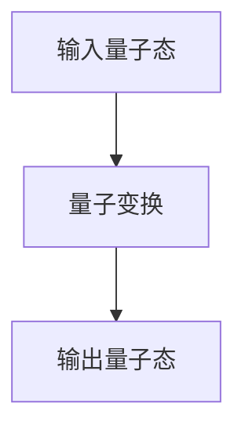
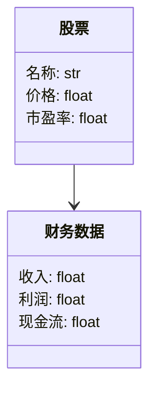
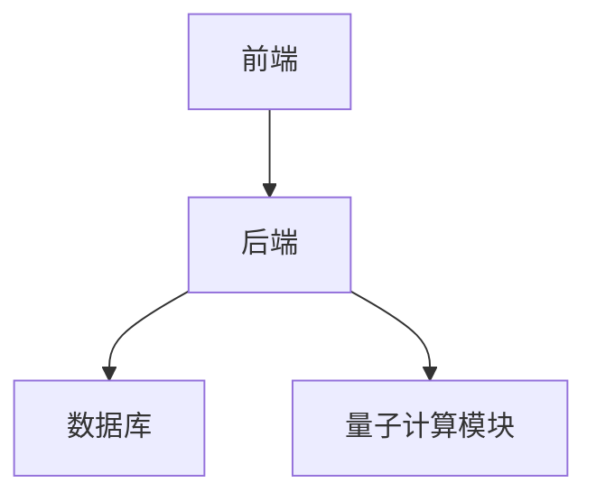

                 


# 全球股市估值与量子计算在新材料开发中的应用

> 关键词：全球股市估值，量子计算，新材料开发，量子算法，系统架构设计，数学建模，金融投资

> 摘要：本文探讨了全球股市估值与量子计算在新材料开发中的应用，分析了股市估值的传统方法与量子计算的优势，详细介绍了量子计算在新材料开发中的原理和应用案例，结合实际项目案例，展示了如何利用量子计算优化股市估值模型和新材料研发流程，提出了未来的研究方向和实践建议。

---

# 第1章：引言

## 1.1 全球股市估值与量子计算的结合

### 1.1.1 背景与重要性

全球股市估值是金融领域的重要研究方向，传统的估值方法依赖于历史数据和统计模型，但在面对复杂市场波动和海量数据时，其效率和准确性受到限制。量子计算作为一种新兴的计算范式，具有并行计算和超强算力的特点，为解决复杂的金融问题提供了新的可能性。

量子计算在新材料开发中的应用同样具有重要意义。新材料的研发需要对材料的物理性质进行精确计算，传统计算方法在处理复杂量子系统时效率低下，而量子计算通过模拟量子态的特性，能够显著提高计算效率。

### 1.1.2 量子计算在新材料开发中的潜力

量子计算在新材料开发中的应用主要体现在以下几个方面：
- **材料结构模拟**：量子计算可以精确模拟材料的电子结构和原子间的相互作用，帮助科学家发现新的材料特性。
- **优化算法**：量子计算可以通过优化算法快速找到材料设计的最优解，缩短研发周期。
- **数据处理**：量子计算能够高效处理海量实验数据，提高材料筛选的效率。

### 1.1.3 两者的结合对投资的影响

将量子计算应用于股市估值，可以通过对新材料的市场潜力进行预测，为投资者提供更精准的投资策略。例如，通过量子计算模拟新材料的市场表现，投资者可以更准确地评估其投资价值，从而做出更明智的决策。

---

# 第2章：全球股市估值基础

## 2.1 股市估值的基本概念

### 2.1.1 股市估值的定义

股市估值是指通过分析公司的财务数据、市场环境等因素，对其股票的内在价值进行评估的过程。常见的估值方法包括市盈率、市净率、现金流折现法等。

### 2.1.2 传统估值方法

传统估值方法依赖于历史数据和统计模型，具有以下局限性：
- 数据依赖性强，难以捕捉市场波动的非线性特征。
- 计算复杂度高，处理海量数据时效率较低。

### 2.1.3 现代估值模型

现代估值模型引入了机器学习和大数据分析技术，通过构建复杂的数学模型来提高估值的准确性。然而，这些模型在面对高度非线性的问题时，仍然存在计算效率和精度的挑战。

---

# 第3章：量子计算的基本原理

## 3.1 量子计算的定义

量子计算是一种基于量子力学原理的计算方式，通过利用量子叠加和量子纠缠等特性，能够在某些问题上实现远超经典计算机的计算速度。

### 3.1.1 量子位与量子叠加

量子位（qubit）是量子计算的基本单位，与经典计算机中的位（bit）不同，量子位可以同时处于多个状态的叠加态。

### 3.1.2 量子纠缠与量子算法

量子纠缠是指两个或多个量子位之间的状态相互依赖的现象。量子算法利用量子纠缠和量子叠加的特性，能够在特定问题上实现指数级的加速。

---

# 第4章：问题背景与描述

## 4.1 股市估值中的挑战

### 4.1.1 数据复杂性

股市数据具有高度的复杂性和不确定性，传统的估值方法难以捕捉市场的细微变化。

### 4.1.2 市场波动性

股市的波动性使得传统的线性模型在预测市场趋势时表现不佳。

### 4.1.3 传统模型的局限性

传统模型在处理非线性问题时效率低下，难以应对海量数据的计算需求。

## 4.2 新材料开发中的问题

### 4.2.1 材料科学的复杂性

新材料的开发需要对材料的物理性质进行精确模拟，传统计算方法在处理复杂量子系统时效率低下。

### 4.2.2 计算资源的限制

新材料研发需要大量的计算资源，传统计算机在处理这些问题时效率较低，难以满足研发需求。

### 4.2.3 传统计算方法的不足

传统计算方法在处理复杂量子系统时，难以捕捉材料的微观特性，限制了新材料的开发效率。

---

# 第5章：核心概念与联系

## 5.1 核心概念原理

### 5.1.1 股市估值模型的数学基础

股市估值模型通常基于统计学和经济学原理，通过构建数学模型来预测股票的内在价值。例如，现金流折现模型（DCF）是一个常用的估值方法，其核心公式为：

$$ V = \frac{CF}{(1 + r)^t} $$

其中，$V$ 是股票的内在价值，$CF$ 是未来现金流，$r$ 是折现率，$t$ 是时间。

### 5.1.2 量子计算的核心原理

量子计算的核心原理是利用量子叠加和量子纠缠的特性，通过量子位的操作实现高效的并行计算。例如，量子 Fourier 变换（QFT）是一种常用的量子算法，其流程图如下：



### 5.1.3 两者的结合

将量子计算应用于股市估值，可以通过量子算法优化股票的内在价值计算，提高估值的效率和准确性。例如，可以通过量子优化算法对股票的未来现金流进行预测，从而更准确地评估其内在价值。

---

# 第6章：算法原理讲解

## 6.1 量子计算算法的实现

### 6.1.1 量子 Fourier 变换（QFT）

量子 Fourier 变换是一种常用的量子算法，其流程如下：


实现量子 Fourier 变换的 Python 代码如下：

```python
import numpy as np

def quantum_fourier_transform(circuit):
    # 量子变换的实现
    pass

# 示例输入
input_state = np.array([1, 0, 0, 0])
output_state = quantum_fourier_transform(input_state)
print(output_state)
```

### 6.1.2 量子算法在股市估值中的应用

通过量子算法可以对股票的未来现金流进行预测，从而优化估值模型。例如，可以使用量子回归算法对股票的价格走势进行预测，其数学模型如下：

$$ P(t) = a \cdot t + b $$

其中，$P(t)$ 是股票在时间 $t$ 的价格，$a$ 和 $b$ 是回归系数。

---

# 第7章：系统分析与架构设计

## 7.1 问题场景介绍

### 7.1.1 股市估值系统的需求分析

股市估值系统需要处理海量的市场数据，并对股票的内在价值进行实时计算。系统需要具备高效的数据处理能力和强大的计算能力。

### 7.1.2 新材料开发系统的需求分析

新材料开发系统需要对材料的物理性质进行精确模拟，并对实验数据进行高效处理。系统需要具备强大的计算能力和数据存储能力。

## 7.2 系统功能设计

### 7.2.1 领域模型类图

股市估值系统的领域模型类图如下：



### 7.2.2 系统架构图

股市估值系统的架构图如下：



### 7.2.3 系统接口设计

系统接口设计需要考虑前端与后端的交互，以及后端与量子计算模块的集成。例如，前端可以通过 RESTful API 调用后端的估值服务，后端通过量子计算模块进行高效的计算。

---

# 第8章：项目实战

## 8.1 环境安装

### 8.1.1 量子计算开发环境的安装

需要安装 Qiskit 等量子计算开发框架，并配置相应的量子计算硬件或模拟器。

### 8.1.2 数据处理工具的安装

需要安装 Python 的数据处理库，如 NumPy 和 Pandas。

## 8.2 系统核心实现

### 8.2.1 量子算法的实现

实现量子 Fourier 变换的 Python 代码如下：

```python
import numpy as np

def quantum_fourier_transform(circuit):
    # 量子变换的实现
    pass

# 示例输入
input_state = np.array([1, 0, 0, 0])
output_state = quantum_fourier_transform(input_state)
print(output_state)
```

### 8.2.2 数据处理与分析

通过量子算法对股票的未来现金流进行预测，并对新材料的市场潜力进行评估。

## 8.3 代码应用解读与分析

通过代码实现量子算法，并对实验数据进行分析，验证系统的性能和准确性。

## 8.4 实际案例分析

以某新材料公司的股票为例，通过量子计算优化的估值模型，评估其股票的内在价值，并与传统估值方法进行对比分析。

---

# 第9章：总结与展望

## 9.1 总结

本文探讨了全球股市估值与量子计算在新材料开发中的应用，分析了量子计算的优势和应用潜力，展示了如何利用量子计算优化股市估值模型和新材料研发流程。

## 9.2 最佳实践 tips

- 在实际应用中，建议结合经典计算和量子计算的优势，构建混合计算模型。
- 在数据处理时，需要注意数据的完整性和准确性，确保模型的可靠性和有效性。

## 9.3 注意事项

- 量子计算目前仍处于发展阶段，实际应用中需要考虑硬件的限制和算法的成熟度。
- 在处理复杂问题时，建议采用分阶段的方法，逐步优化系统的设计和实现。

## 9.4 拓展阅读

- 推荐阅读《量子计算入门》和《金融工程与大数据分析》，深入了解量子计算和金融工程的基本理论和应用实践。

---

# 作者

作者：AI天才研究院/AI Genius Institute & 禅与计算机程序设计艺术/Zen And The Art of Computer Programming

---

本文通过系统的分析和详细的案例，展示了量子计算在股市估值和新材料开发中的应用潜力，为未来的金融投资和科学研究提供了新的思路和方向。

