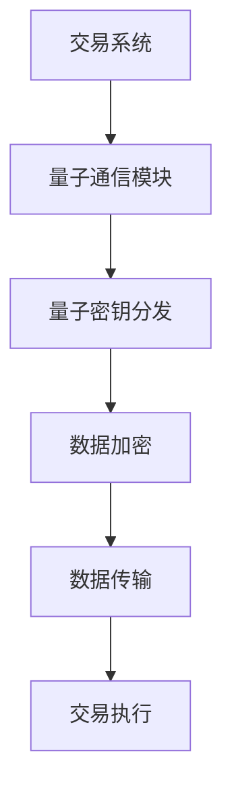

                 


# 全球股市估值与量子通信在金融交易中的应用

> 关键词：全球股市估值、量子通信、金融交易、量子计算、金融数据安全

> 摘要：本文深入探讨了全球股市估值的核心方法及其与量子通信技术的结合。通过分析量子通信在金融交易中的应用潜力，揭示了其在提升交易效率和数据安全性方面的独特优势。结合实际案例，详细阐述了量子通信技术在金融交易系统中的实现方案，为未来金融行业的技术发展提供了新的思路。

---

## 第一部分: 全球股市估值与量子通信的背景与基础

### 第1章: 全球股市估值概述

#### 1.1 股市估值的核心概念
- **1.1.1 股市估值的定义与作用**  
  股市估值是通过分析企业的财务数据和市场环境，对其股票价格进行合理评估的过程。其作用在于帮助投资者做出明智的投资决策，避免因信息不对称导致的市场失灵。
  
- **1.1.2 股市估值的主要方法**  
  常见的估值方法包括市盈率（P/E）模型、市净率（P/B）模型和现金流折现模型（DCF）。每种方法都有其适用场景和局限性。

- **1.1.3 股市估值的指标体系**  
  主要指标包括市盈率、市净率、股息率、ROE（净资产收益率）等。这些指标能够从不同维度反映企业的财务状况和市场价值。

#### 1.2 量子通信的基本原理
- **1.2.1 量子通信的定义与特点**  
  量子通信是利用量子力学原理进行信息传递的技术，其特点是高安全性、高效率和抗干扰能力。

- **1.2.2 量子通信的核心技术**  
  包括量子密钥分发（QKD）、量子中继和量子隐形传态等。其中，QKD是目前应用最广泛的技术之一。

- **1.2.3 量子通信与经典通信的对比**  
  通过对比表格展示两种通信方式在安全性、传输速度和抗干扰能力方面的差异。

| 对比维度 | 量子通信 | 经典通信 |
|----------|----------|----------|
| 安全性    | 绝对安全（基于量子力学原理） | 可能被破解（依赖数学算法） |
| 传输速度  | 高（理论上可达光速） | 受限于物理介质 |
| 抗干扰能力 | 强（量子态不易受干扰） | 较弱（易受电磁干扰） |

#### 1.3 股市估值与量子通信的结合背景
- **1.3.1 全球化背景下的股市特点**  
  全球股市的联动性增强，高频交易的普及使得数据传输和处理的实时性要求不断提高。

- **1.3.2 量子通信在金融领域的潜力**  
  通过量子通信技术，可以实现金融数据的安全传输和高效处理，提升交易系统的可靠性和安全性。

---

### 第2章: 股市估值的核心算法与模型

#### 2.1 股市估值的经典算法
- **2.1.1 市盈率模型**  
  $$ P/E = \frac{\text{股价}}{\text{每股收益}} $$
  通过比较实际P/E与行业平均P/E，判断股票的估值是否合理。

- **2.1.2 市净率模型**  
  $$ P/B = \frac{\text{股价}}{\text{每股净资产}} $$
  适用于银行、房地产等资产密集型行业的估值。

- **2.1.3 现金流折现模型（DCF）**  
  $$ V = \sum_{t=1}^{n} \frac{CF_t}{(1 + r)^t} + \frac{TV}{(1 + r)^n} $$
  通过预测未来现金流的现值，评估企业内在价值。

#### 2.2 量子通信在估值模型中的潜在应用
- **2.2.1 量子计算在复杂模型中的应用**  
  量子计算机可以快速处理海量数据，优化复杂的金融模型，如蒙特卡洛模拟。

- **2.2.2 量子通信对数据安全的保障**  
  通过量子密钥分发技术，确保估值模型中的敏感数据在传输过程中不被窃取。

- **2.2.3 量子算法在金融预测中的优势**  
  量子算法可以在更短的时间内完成大规模数据的分析和处理，提升金融预测的准确性。

---

### 第3章: 量子通信在金融交易中的技术实现

#### 3.1 量子通信的技术架构
- **3.1.1 量子态传输**  
  通过量子纠缠实现信息的瞬间传递，无需物理介质。

- **3.1.2 量子密钥分发（QKD）**  
  使用BB84协议或EPR协议生成共享密钥，确保通信双方的密钥安全。

- **3.1.3 量子中继站**  
  在长距离通信中，通过量子中继站实现量子信号的中继和放大。

#### 3.2 量子通信的协议与标准
- **3.2.1 BB84协议**  
  通过量子态编码和基的选择，实现密钥分发的安全性。

- **3.2.2 EPR协议**  
  利用量子纠缠原理，实现密钥分发和验证。

- **3.2.3 量子通信的国际标准**  
  包括ITU（国际电信联盟）和ISO（国际标准化组织）的相关标准。

---

## 第4章: 量子通信在金融交易中的系统设计

#### 4.1 金融交易中的数据传输需求
- **4.1.1 高频交易的实时性要求**  
  金融交易需要毫秒级的响应速度，对数据传输的延迟要求极高。

- **4.1.2 数据传输的安全性要求**  
  防止数据被篡改或窃取，确保交易的安全性和准确性。

- **4.1.3 交易系统的可靠性要求**  
  系统需要具备高可用性和容错能力，确保交易过程的连续性。

#### 4.2 量子通信在金融交易中的系统设计
- **4.2.1 量子通信模块的集成**  
  在传统金融交易系统中嵌入量子通信模块，实现关键数据的量子传输。

- **4.2.2 量子密钥分发的应用**  
  使用QKD技术生成共享密钥，加密交易数据，确保数据传输的安全性。

- **4.2.3 量子通信与传统交易系统的结合**  
  通过接口设计，实现量子通信模块与传统交易系统的无缝对接。

---

## 第5章: 量子通信在金融交易中的算法实现

#### 5.1 量子密钥分发的实现
- **5.1.1 BB84协议的实现步骤**  
  1. 通信双方分别生成随机密钥并编码量子态。  
  2. 通过公开渠道交换基的选择。  
  3. 比较基相同的部分，提取共享密钥。

- **5.1.2 EPR协议的实现步骤**  
  1. 通信双方生成纠缠态的量子比特。  
  2. 通过测量和比较结果，验证密钥的安全性。  
  3. 使用共享密钥加密数据。

- **5.1.3 量子密钥分发的安全性分析**  
  通过数学证明，量子密钥分发的密钥是完全随机且不可被窃取的。

#### 5.2 量子通信在金融预测中的应用
- **5.2.1 量子计算在金融数据处理中的优势**  
  量子计算机可以同时处理大量数据，显著提高金融预测的效率。

- **5.2.2 量子算法在金融预测中的实现**  
  使用量子模拟算法，对金融市场数据进行建模和预测。

- **5.2.3 量子通信对金融交易效率的提升**  
  通过量子通信技术，实现金融数据的实时传输和处理，提升交易的效率和准确性。

---

## 第6章: 量子通信在金融交易中的实际应用与案例分析

#### 6.1 案例背景介绍
- **6.1.1 案例选择的依据**  
  选择高频交易场景，展示量子通信在金融交易中的实际应用。

- **6.1.2 案例的行业特点**  
  高频交易需要极高的数据处理速度和安全性，对通信技术要求极高。

- **6.1.3 案例的目标与意义**  
  通过量子通信技术，提升高频交易的效率和安全性，降低交易成本。

#### 6.2 案例分析与实现
- **6.2.1 案例的系统设计**  
  使用mermaid图展示系统的组成部分、功能模块和交互流程。



- **6.2.2 案例的量子通信模块实现**  
  通过编写Python代码实现量子密钥分发的模拟。

```python
import random

def generate_key(length):
    key = []
    for _ in range(length):
        bit = random.choice([0, 1])
        key.append(bit)
    return key

def compare_bases(alice_bases, bob_bases):
    same_bases = [i for i in range(len(alice_bases)) if alice_bases[i] == bob_bases[i]]
    key = [alice_bases[i] for i in same_bases]
    return key

# 示例代码
alice_bases = [random.choice(['H', 'V']) for _ in range(100)]
bob_bases = [random.choice(['H', 'V']) for _ in range(100)]
shared_key = compare_bases(alice_bases, bob_bases)
print("Shared Key:", shared_key)
```

- **6.2.3 案例的股市估值模型实现**  
  使用量子算法优化传统的估值模型，提升计算效率和准确性。

---

## 第7章: 量子通信在金融交易中的总结与展望

### 7.1 总结
- 量子通信技术在金融交易中的应用前景广阔，尤其是在数据安全和交易效率方面具有显著优势。
- 通过量子通信技术，可以显著提升金融交易的可靠性和安全性，为金融行业的发展注入新的活力。

### 7.2 展望
- 随着量子通信技术的进一步发展，其在金融交易中的应用将更加广泛，涵盖更多领域，如智能投顾、风险管理等。
- 未来，量子通信与人工智能、大数据等技术的结合，将推动金融行业进入一个全新的智能化时代。

---

## 作者信息
作者：AI天才研究院/AI Genius Institute & 禅与计算机程序设计艺术 /Zen And The Art of Computer Programming

---

通过以上目录大纲，我们可以清晰地看到，量子通信技术在金融交易中的应用不仅是技术发展的必然趋势，更是提升金融行业效率和安全性的关键。希望本文能为读者提供一个全面的视角，深入理解量子通信与股市估值的结合及其在实际应用中的潜力。

