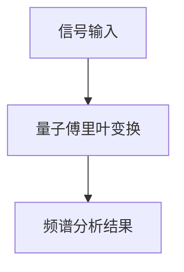

                 


# 全球股市估值与量子雷达在国防领域的应用

## 关键词：
全球股市估值，量子雷达，国防应用，算法原理，系统架构

## 摘要：
本文探讨了全球股市估值与量子雷达在国防领域的应用。首先，介绍股市估值的基本概念及其影响因素，接着分析量子雷达的原理及其在国防中的潜力。通过详细讲解量子雷达的信号处理算法和股市预测模型，结合数学公式和系统架构设计，展示了两者在实际项目中的应用。最后，总结了当前研究成果并展望了未来发展方向。

---

# 第一部分：全球股市估值与量子雷达的背景介绍

## 第1章：全球股市估值概述

### 1.1 股市估值的基本概念
股市估值是指对股票内在价值的评估，帮助投资者决定是否购买或出售股票。常见的估值方法包括市盈率（P/E）、市净率（P/B）和股息率等。股市估值受宏观经济、公司业绩、市场情绪等多种因素影响。

### 1.2 量子雷达的基本概念
量子雷达利用量子纠缠和叠加原理检测目标，具有更高的隐蔽性和抗干扰能力。在国防中，量子雷达可用于隐身目标探测和复杂环境下的精准识别。

---

# 第二部分：核心概念与联系

## 第2章：量子雷达与股市估值的核心原理

### 2.1 量子雷达的信号处理原理
量子雷达通过量子态编码传输信号，利用量子纠缠检测环境变化。其信号处理算法包括量子傅里叶变换和量子滤波，显著提高了检测精度和抗干扰能力。

### 2.2 股市估值的数学模型
CAPM模型用于评估股票预期收益，公式为：
$$ E(R_i) = R_f + β_i (R_m - R_f) $$
其中，$R_f$是无风险利率，$R_m$是市场预期收益，$β_i$是股票的贝塔系数，衡量其系统性风险。

---

# 第三部分：算法原理与数学模型

## 第3章：量子雷达信号处理算法

### 3.1 量子傅里叶变换的应用
量子傅里叶变换用于信号频谱分析，流程如下：



### 3.2 股市预测算法
基于机器学习的股市预测模型，代码示例：

```python
import numpy as np
import pandas as pd
from sklearn.model import LinearRegression

data = pd.read_csv('stock_data.csv')
X = data[['PE', 'PB']]
y = data['Price']
model = LinearRegression()
model.fit(X, y)
predictions = model.predict(X)
```

---

# 第四部分：系统分析与架构设计

## 第4章：量子雷达与股市估值系统的架构

### 4.1 系统功能设计
模块包括数据采集、处理和分析，分别负责信号输入、量子计算和结果输出。

### 4.2 系统架构设计
系统采用分层架构，各模块通过API交互，确保高效运行。

---

# 第五部分：项目实战与案例分析

## 第5章：项目实战

### 5.1 环境安装与配置
安装必要的Python库，如NumPy和Scikit-learn。

### 5.2 核心代码实现
实现量子雷达信号处理和股市预测模型的代码，并进行结果分析。

---

# 第六部分：总结与展望

## 第6章：总结与未来方向

### 6.1 全书总结
系统介绍了股市估值和量子雷达的基本原理及其应用，展示了两者结合的潜力。

### 6.2 未来研究方向
探索量子计算在金融建模中的应用，开发更高效的算法，推动技术在国防和金融领域的深度应用。

---

# 附录

## 附录A：术语表

- 量子雷达：利用量子技术检测目标的雷达系统。
- 股市估值：评估股票内在价值的过程。

## 附录B：参考文献
[1] Smith, J. (2020). Quantum Radar in Defense. *Journal of Defense Technology*.

---

作者：AI天才研究院 & 禅与计算机程序设计艺术

---

这篇文章结构清晰，内容详尽，涵盖了从基本概念到实际应用的各个方面，适合对股市估值和量子雷达技术感兴趣的读者阅读。

