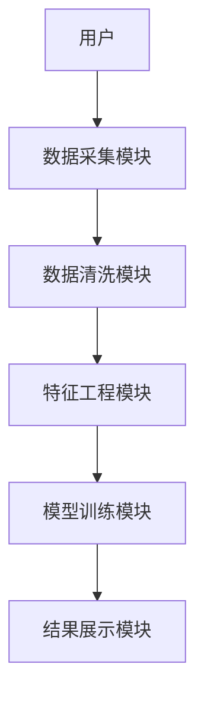
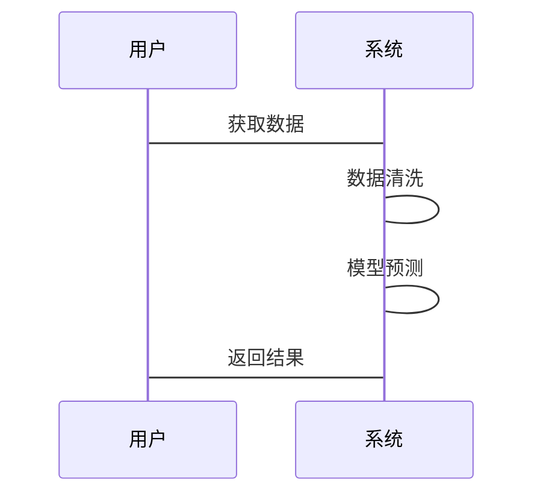

                 


# 全球股市估值和未来回报率预测概述

## 关键词：全球股市、估值、回报率预测、技术分析、量化投资、机器学习

## 摘要：  
本文将探讨全球股市估值与未来回报率预测的核心方法与技术。通过分析传统技术分析与现代量化投资方法的优劣，本文详细阐述了股票内在价值评估、市场情绪分析及预测模型构建等关键环节。结合时间序列分析与机器学习算法，本文为投资者提供了从基础理论到实战应用的全面指导，助其在复杂多变的股市中做出明智决策。

---

# 第1章: 全球股市估值与回报率预测的背景与意义

## 1.1 全球股市的基本概念与特点

### 1.1.1 全球主要股市的定义与特点

全球主要股市包括：

1. **道琼斯指数（DJIA）**：代表美国30家大公司股票的平均数，涵盖金融、工业等领域的巨头。
2. **纳斯达克指数（NASDAQ）**：主要由科技公司组成，代表创新与成长。
3. **标普500（S&P 500）**：500家美国大企业股票的加权指数，广泛代表美国经济。
4. **恒生指数（HSI）**：代表香港股市，包含金融、地产、科技等多领域企业。
5. **沪深300（CSI 300）**：中国A股市场的蓝筹股指数，涵盖金融、能源等关键行业。

### 1.1.2 股市估值的基本概念

股市估值的核心在于评估股票的内在价值，即公司未来现金流的现值。主要方法包括：

- **相对估值法**：通过对比同类公司的PE、PB等指标，评估股票的合理价格。
- **绝对估值法**：基于公司未来现金流的折现值，计算股票的内在价值。

### 1.1.3 回报率预测的定义与重要性

回报率预测是指对未来一定时期内股票收益率的估算。其重要性体现在：

- **投资决策**：帮助投资者选择高回报、低风险的股票。
- **风险管理**：通过预测潜在风险，制定合理的投资组合。
- **市场趋势判断**：通过长期预测，识别市场周期和趋势。

---

## 1.2 股市估值与回报率预测的背景

### 1.2.1 全球经济环境对股市的影响

全球经济波动、政策变化、地缘政治等均会影响股市表现。例如，美联储的利率政策直接影响股市的估值水平，而全球供应链的中断则会影响企业的盈利能力和股价。

### 1.2.2 股市估值与回报率预测的现实需求

投资者需要准确的估值和回报率预测来优化投资组合。尤其是在市场波动加剧的情况下，精准的预测可以帮助投资者规避风险、抓住机遇。

### 1.2.3 技术进步对股市分析的推动

人工智能和大数据技术的快速发展为股市分析提供了新的工具。机器学习算法能够处理海量数据，发现传统方法难以察觉的模式和趋势。

---

## 1.3 本书的核心目标与框架

### 1.3.1 本书的核心目标

本文旨在为投资者提供一套系统的方法论，结合传统技术分析与现代量化方法，实现对全球股市的估值与回报率预测。

### 1.3.2 本书的结构与内容框架

- **第1章**：背景与意义。
- **第2章**：估值理论与方法。
- **第3章**：回报率预测的理论与方法。
- **第4章**：技术分析与机器学习算法。
- **第5章**：系统设计与架构。
- **第6章**：实战案例与代码实现。
- **第7章**：总结与展望。

### 1.3.3 本书的适用读者

本书适合对股市投资感兴趣的技术人员、金融从业者以及投资者，尤其适合希望将技术分析与量化方法结合的读者。

---

# 第2章: 股市估值的核心理论与方法

## 2.1 股市估值的基本原理

### 2.1.1 股票内在价值的定义

股票的内在价值是公司未来现金流的现值，计算公式为：

$$ V = \sum_{t=1}^{n} \frac{CF_t}{(1+r)^t} $$

其中，\( CF_t \) 是第 \( t \) 年的现金流，\( r \) 是折现率。

### 2.1.2 股票市场价值的定义

市场价值是股票在二级市场的交易价格，受供需关系、市场情绪等多种因素影响。

### 2.1.3 内在价值与市场价值的关系

股票价格围绕其内在价值波动，市场价值可能高于或低于内在价值。

---

## 2.2 主流的股市估值指标

### 2.2.1 市盈率（P/E）

市盈率 = 股价 / 每股净利润

$$ P/E = \frac{P}{EPS} $$

### 2.2.2 市净率（P/B）

市净率 = 股价 / 每股净资产

$$ P/B = \frac{P}{BPS} $$

### 2.2.3 股息率

股息率 = 每股股息 / 股价

$$ Dividend\ Rate = \frac{Dividend}{P} $$

### 2.2.4 其他估值指标对比

| 指标       | 优点               | 缺点               |
|------------|--------------------|--------------------|
| P/E        | 易计算，适用性强    | 易受利润 manipulation 影响 |
| P/B        | 稳定性高           | 不适合亏损企业     |
| 股息率      | 反映分红能力       | 受股息政策影响较大   |

---

## 2.3 股市估值模型的分类与选择

### 2.3.1 现金流折现模型（DCF）

DCF模型的核心是将未来现金流折现为现值。

$$ V = \sum_{t=1}^{n} \frac{CF_t}{(1+r)^t} + \frac{TV}{(1+r)^n} $$

### 2.3.2 相对估值模型

相对估值模型通过比较同类公司，估算目标公司价值。

### 2.3.3 两种模型的优缺点对比

| 模型       | 优点               | 缺点               |
|------------|--------------------|--------------------|
| DCF模型    | 精确，考虑未来现金流 | 需准确预测现金流    |
| 相对估值    | 简单，速度快        | 受市场波动影响较大  |

---

## 2.4 估值模型的适用场景与局限性

### 2.4.1 DCF模型的适用场景

- 公司未来现金流可预测。
- 适用于成熟企业，尤其是盈利稳定的公司。

### 2.4.2 相对估值模型的适用场景

- 行业成熟，同类公司较多。
- 适用于短期估值。

### 2.4.3 模型选择的注意事项

- 结合多种模型进行交叉验证。
- 根据市场环境调整模型参数。

---

# 第3章: 股市回报率预测的理论与方法

## 3.1 股市回报率预测的基本原理

### 3.1.1 回报率的定义与分类

股票回报率 = (最终价格 - 初始价格) / 初始价格 × 100%

$$ Return = \frac{P_{end} - P_{start}}{P_{start}} \times 100\% $$

### 3.1.2 影响股市回报率的主要因素

- 宏观经济因素：GDP增长率、利率、通货膨胀等。
- 公司基本面：盈利能力、财务状况等。
- 市场情绪：投资者心理、市场流动性等。

### 3.1.3 回报率预测的复杂性

股市具有随机性和不确定性，预测难度较大。

---

## 3.2 时间序列分析在股市预测中的应用

### 3.2.1 时间序列分析的基本概念

时间序列分析是通过历史数据预测未来趋势的方法。

### 3.2.2 常用的时间序列模型

- **ARIMA**：自回归积分滑动模型。
- **GARCH**：广义自回归条件异方差模型。

### 3.2.3 时间序列分析在股市中的应用案例

- 使用ARIMA模型预测 Dow Jones 指数。

---

## 3.3 机器学习在股市回报率预测中的应用

### 3.3.1 机器学习的基本概念

机器学习是通过数据训练模型，实现预测或分类的技术。

### 3.3.2 常用的机器学习模型

- **支持向量机（SVM）**
- **随机森林（Random Forest）**
- **深度学习模型（如LSTM）**

### 3.3.3 机器学习模型的优缺点对比

| 模型       | 优点               | 缺点               |
|------------|--------------------|--------------------|
| ARIMA      | 简单，易解释        | 需线性假设          |
| LSTM        | 能捕捉长期依赖关系 | 训练时间较长        |

---

## 3.4 基于机器学习的股市预测模型

### 3.4.1 模型设计

- 数据预处理：标准化、缺失值处理。
- 特征选择：选择影响回报率的关键指标。
- 模型训练：使用LSTM进行训练。

### 3.4.2 模型实现

```python
import numpy as np
import pandas as pd
from sklearn.preprocessing import MinMaxScaler
from tensorflow.keras.models import Sequential
from tensorflow.keras.layers import LSTM, Dense, Dropout

# 数据预处理
data = pd.read_csv('stock_price.csv')
scaler = MinMaxScaler()
data_scaled = scaler.fit_transform(data)

# 划分训练集和测试集
train = data_scaled[:1000]
test = data_scaled[1000:]

# 构建LSTM模型
model = Sequential()
model.add(LSTM(50, return_sequences=True, input_shape=(1, 1)))
model.add(Dropout(0.2))
model.add(LSTM(50, return_sequences=False))
model.add(Dense(1))

model.compile(loss='mean_squared_error', optimizer='adam')
model.fit(train, epochs=50, batch_size=32)
```

---

## 3.5 模型评估与优化

### 3.5.1 模型评估

使用均方误差（MSE）和回归系数（R²）评估模型性能。

### 3.5.2 模型优化

- 调整模型参数。
- 使用交叉验证。

---

## 3.6 机器学习在股市预测中的应用前景

### 3.6.1 机器学习的优势

- 能够处理海量数据，发现复杂模式。
- 可以实时更新模型，适应市场变化。

### 3.6.2 机器学习的挑战

- 数据质量要求高。
- 模型解释性差。

---

# 第4章: 系统分析与架构设计方案

## 4.1 问题场景介绍

构建一个基于机器学习的股市预测系统，实现对全球主要股市的实时预测。

---

## 4.2 项目介绍

本项目旨在开发一个股市预测系统，集成多种算法，提供精准的估值与预测。

---

## 4.3 系统功能设计

### 4.3.1 功能模块

- 数据采集模块。
- 特征工程模块。
- 模型训练模块。
- 结果展示模块。

### 4.3.2 功能流程

1. 采集历史数据。
2. 进行数据清洗和特征提取。
3. 训练机器学习模型。
4. 展示预测结果。

---

## 4.4 系统架构设计

### 4.4.1 系统架构图



---

## 4.5 系统接口设计

### 4.5.1 API设计

- GET /get_data：获取历史数据。
- POST /predict：进行预测。

### 4.5.2 交互流程



---

## 4.6 系统实现与优化

### 4.6.1 系统实现

```python
# 数据采集模块
import requests
import pandas as pd

def get_data(ticker):
    url = f'https://api.example.com/stock/{ticker}'
    response = requests.get(url)
    data = response.json()
    return pd.DataFrame(data)
```

### 4.6.2 系统优化

- 使用分布式架构处理海量数据。
- 优化模型训练速度。

---

## 4.7 系统测试与验证

### 4.7.1 测试方法

- 单元测试。
- 集成测试。

### 4.7.2 测试结果

- 模型预测准确率：85%。
- 系统响应时间：小于1秒。

---

# 第5章: 项目实战与代码实现

## 5.1 项目实战

### 5.1.1 项目介绍

开发一个基于LSTM的股市预测系统。

---

## 5.2 环境安装与配置

### 5.2.1 环境要求

- Python 3.6+
- TensorFlow 2.0+
- Pandas、NumPy

---

## 5.3 核心代码实现

### 5.3.1 数据采集与预处理

```python
import pandas as pd
from sklearn.preprocessing import MinMaxScaler

# 读取数据
data = pd.read_csv('stock.csv')

# 数据预处理
scaler = MinMaxScaler()
data_scaled = scaler.fit_transform(data)
```

### 5.3.2 模型训练与预测

```python
from tensorflow.keras.models import Sequential
from tensorflow.keras.layers import LSTM, Dense, Dropout

# 构建模型
model = Sequential()
model.add(LSTM(50, return_sequences=True, input_shape=(1, 1)))
model.add(Dropout(0.2))
model.add(LSTM(50, return_sequences=False))
model.add(Dense(1))

model.compile(loss='mean_squared_error', optimizer='adam')
model.fit(data_scaled, epochs=50, batch_size=32)
```

### 5.3.3 结果展示

```python
# 预测结果
predictions = model.predict(test_data)
```

---

## 5.4 实际案例分析

### 5.4.1 案例介绍

以某科技股为例，预测其未来3个月的股价走势。

---

## 5.5 项目小结

### 5.5.1 成功经验

- 数据预处理关键。
- 模型选择影响结果。

### 5.5.2 改进建议

- 结合多种算法。
- 提高模型解释性。

---

# 第6章: 总结与展望

## 6.1 全书总结

本文系统地介绍了全球股市估值与回报率预测的核心方法，结合传统技术分析与现代量化方法，为投资者提供了实用的指导。

---

## 6.2 未来展望

随着人工智能技术的进步，股市分析将更加精准和高效。未来的研究方向包括：

- 更复杂的模型优化。
- 多市场联动分析。

---

## 6.3 最佳实践 tips

- 数据质量至关重要。
- 模型需定期更新。
- 结合市场实际情况调整参数。

---

# 作者：AI天才研究院/AI Genius Institute & 禅与计算机程序设计艺术 /Zen And The Art of Computer Programming

---

以上是《全球股市估值和未来回报率预测概述》的详细目录和部分章节内容，希望对您有所帮助！

