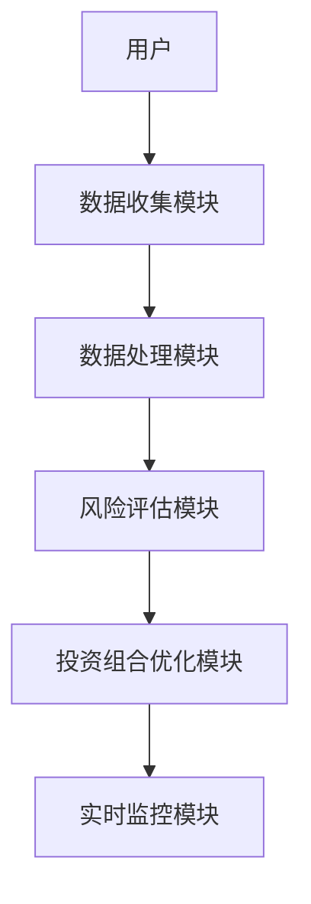

                 


# 全球资产配置：分散投资降低国别风险

## 关键词：全球资产配置，分散投资，国别风险，投资组合，风险管理

## 摘要：本文深入探讨了全球资产配置的核心原理，重点分析了通过分散投资降低国别风险的策略。结合现代投资组合理论（MPT）和风险评估模型，本文详细阐述了如何构建高效的投资组合以应对全球经济波动和国别风险。通过实际案例和系统架构设计，本文为读者提供了从理论到实践的全面指导。

---

# 第一部分: 全球资产配置的背景与重要性

## 第1章: 全球资产配置概述

### 1.1 全球资产配置的重要性

#### 1.1.1 全球经济一体化的背景

全球经济的深度融合使得投资者能够通过跨国投资来分散风险。现代金融市场的全球化特征使得资产配置的地理范围不断扩大，投资者可以通过投资不同国家的资产来降低单一市场的风险。

#### 1.1.2 投资分散化的基本原理

分散化是投资的基本原则之一。通过将资金分配到不同的资产类别和地理区域，投资者可以降低特定资产或市场波动带来的风险。资产配置的核心在于平衡风险与收益。

#### 1.1.3 国别风险的定义与影响

国别风险是指由于经济、政治或社会因素导致某一国家或地区的资产价值下降或无法收回投资的风险。国别风险是全球资产配置中的重要考虑因素，因为不同国家的经济周期、政策环境和市场稳定性差异显著。

#### 1.1.4 资产配置的基本框架

资产配置通常包括以下步骤：
1. 确定投资目标和风险承受能力。
2. 分析不同资产类别的风险和收益特征。
3. 构建最优投资组合以实现目标。

### 1.2 国别风险的来源与特征

#### 1.2.1 经济、政治与社会风险的分类

国别风险可以分为经济风险、政治风险和社会风险三类。经济风险包括通货膨胀、汇率波动等；政治风险包括政策变化、政权更迭等；社会风险包括社会动荡、自然灾害等。

#### 1.2.2 不同国家风险的评估指标

常用的国别风险评估指标包括：
- 债务负担率
- 外汇储备充足性
- 经济增长稳定性
- 政治稳定性

#### 1.2.3 国别风险的相互关联性

国别风险并非孤立存在，不同国家的风险可能相互影响。例如，全球经济衰退可能导致多个国家的资产价值下降。

### 1.3 分散投资降低国别风险的原理

#### 1.3.1 投资组合的分散化效应

通过将资金分配到不同国家和资产类别，投资者可以降低特定国家风险的影响。分散化的效果取决于资产之间的相关性。

#### 1.3.2 资产配置与风险分担的关系

资产配置是实现分散化的核心工具。通过合理配置资产，投资者可以在不同市场中分担风险，从而降低整体投资组合的风险。

#### 1.3.3 全球资产配置的策略框架

全球资产配置的策略框架包括：
1. 确定投资目标和风险承受能力。
2. 分析不同国家的经济和政治风险。
3. 构建最优投资组合以实现目标。

### 1.4 资产配置的基本原则与框架

#### 1.4.1 资产配置的三大原则

1. **风险分散原则**：通过投资不同资产和市场来降低风险。
2. **收益最大化原则**：在给定风险下追求最大收益。
3. **动态调整原则**：根据市场变化和投资目标调整配置。

#### 1.4.2 不同投资目标的配置策略

- **保守型投资者**：注重本金安全，配置比例较高的固定收益资产。
- **平衡型投资者**：在风险和收益之间寻求平衡。
- **进取型投资者**：追求高收益，配置较高比例的股票和风险资产。

#### 1.4.3 资产配置的动态调整机制

根据市场变化和投资目标的调整，定期重新评估和优化投资组合。

---

# 第二部分: 资产配置的核心概念与联系

## 第2章: 资产配置的核心概念

### 2.1 资产类别与风险收益特征

#### 2.1.1 主要资产类别

1. **股票**：高风险、高收益。
2. **债券**：低风险、稳定收益。
3. **房地产**：中等风险、中等收益。
4. **商品**：抗通胀能力较强。

#### 2.1.2 不同资产类别的相关性

资产之间的相关性影响分散化的效果。低相关性的资产可以有效降低整体风险。

### 2.2 资产配置的策略与框架

#### 2.2.1 基于现代投资组合理论（MPT）的配置策略

MPT由Harry Markowitz提出，旨在通过优化投资组合的收益和风险比。

#### 2.2.2 风险调整后的收益评估

通过夏普比率等指标评估不同资产的收益风险比。

#### 2.2.3 动态调整与再平衡

根据市场变化和投资目标调整投资组合。

---

# 第三部分: 资产配置的算法原理

## 第3章: 现代投资组合理论（MPT）的应用

### 3.1 MPT的核心原理

#### 3.1.1 投资组合理论的基本假设

1. 资产收益服从正态分布。
2. 投资者是理性的，追求效用最大化。

#### 3.1.2 优化模型

- 最大化收益
- 最小化风险
- 给定风险下最大化收益
- 给定收益下最小化风险

#### 3.1.3 优化算法

- 均值-方差优化
- 黑-拉普拉斯优化
- 其他优化方法

### 3.2 风险调整后的收益评估

#### 3.2.1 夏普比率

夏普比率衡量投资组合的超额收益相对于其风险的程度。

$$ \text{夏普比率} = \frac{E[r_p] - r_f}{\sigma_p} $$

其中：
- \( E[r_p] \) 是投资组合的期望收益。
- \( r_f \) 是无风险利率。
- \( \sigma_p \) 是投资组合的波动率。

#### 3.2.2 特雷诺比率

特雷诺比率衡量投资组合在市场风险下的超额收益。

$$ \text{特雷诺比率} = \frac{E[r_p] - E[r_m]}{\sigma_p} $$

其中：
- \( E[r_p] \) 是投资组合的期望收益。
- \( E[r_m] \) 是市场指数的期望收益。
- \( \sigma_p \) 是投资组合的波动率。

### 3.3 算法实现

#### 3.3.1 代码实现

```python
import numpy as np
import pandas as pd
from scipy.optimize import minimize

# 示例数据：资产收益矩阵
returns = pd.DataFrame({
    '资产1': [0.1, 0.12, 0.08],
    '资产2': [0.15, 0.08, 0.1],
    '资产3': [0.05, 0.15, 0.12]
})

# 定义优化目标函数
def portfolio_variance(weights, returns):
    return (weights.T @ returns @ weights)  # 方差

# 定义约束条件
cons = ({'type': 'eq', 'fun': lambda w: np.sum(w) - 1})

# 优化问题：最小化方差，权重非负
result = minimize(portfolio_variance, np.ones(3)/3, method='SLSQP', constraints=cons, bounds=[(0, None), (0, None), (0, None)])

print("最优权重:", result.x)
print("最小方差:", result.fun)
```

---

# 第四部分: 资产配置的系统分析与架构设计

## 第4章: 资产配置系统的架构设计

### 4.1 系统功能设计

#### 4.1.1 系统功能模块

1. 数据收集与处理模块
2. 风险评估模块
3. 投资组合优化模块
4. 实时监控与调整模块

#### 4.1.2 系统功能流程

1. 数据收集：获取各资产的历史收益和风险数据。
2. 风险评估：计算各资产的风险指标。
3. 投资组合优化：基于MPT构建最优投资组合。
4. 实时监控：跟踪市场变化，动态调整投资组合。

### 4.2 系统架构设计

#### 4.2.1 系统架构图



#### 4.2.2 接口设计

- 数据输入接口：接收各资产的历史数据。
- 风险评估接口：返回各资产的风险指标。
- 投资组合优化接口：返回最优权重。
- 监控接口：返回市场变化信号。

### 4.3 系统交互设计

#### 4.3.1 交互流程

1. 用户输入投资目标。
2. 系统收集相关资产数据。
3. 系统计算各资产的风险和收益。
4. 系统优化投资组合。
5. 系统实时监控市场变化并调整投资组合。

---

# 第五部分: 资产配置的项目实战

## 第5章: 全球资产配置的实战案例

### 5.1 项目环境配置

#### 5.1.1 工具安装

1. 安装Python环境。
2. 安装必要的库（如pandas、numpy、scipy）。

### 5.2 数据收集与处理

#### 5.2.1 数据来源

1. 股票指数数据：标普500、道琼斯指数等。
2. 债券数据：美国国债收益率、德国国债收益率等。
3. 商品数据：黄金、原油价格等。

#### 5.2.2 数据预处理

1. 数据清洗：处理缺失值和异常值。
2. 数据标准化：将不同资产的收益和风险指标标准化。

### 5.3 投资组合优化

#### 5.3.1 模型构建

使用MPT构建最优投资组合。

#### 5.3.2 代码实现

```python
import numpy as np
import pandas as pd
from scipy.optimize import minimize

# 示例数据：资产收益矩阵
returns = pd.DataFrame({
    '资产1': [0.1, 0.12, 0.08],
    '资产2': [0.15, 0.08, 0.1],
    '资产3': [0.05, 0.15, 0.12]
})

# 定义优化目标函数
def portfolio_variance(weights, returns):
    return (weights.T @ returns @ weights)  # 方差

# 定义约束条件
cons = ({'type': 'eq', 'fun': lambda w: np.sum(w) - 1})

# 优化问题：最小化方差，权重非负
result = minimize(portfolio_variance, np.ones(3)/3, method='SLSQP', constraints=cons, bounds=[(0, None), (0, None), (0, None)])

print("最优权重:", result.x)
print("最小方差:", result.fun)
```

### 5.4 优化结果分析

通过优化得到的投资组合权重可以分散风险，提高收益。

---

# 第六部分: 资产配置的最佳实践与总结

## 第6章: 最佳实践与总结

### 6.1 小结

本文详细探讨了全球资产配置的核心原理，分析了分散投资降低国别风险的策略，并通过实际案例展示了如何构建高效的投资组合。

### 6.2 注意事项

- 定期监控和调整投资组合。
- 选择合适的资产类别和地域分布。
- 考虑市场波动和经济周期的影响。

### 6.3 拓展阅读

- Harry Markowitz的《Portfolio Selection》
-《投资学》（书籍推荐）

---

# 作者：AI天才研究院/AI Genius Institute & 禅与计算机程序设计艺术/Zen And The Art of Computer Programming

---

通过以上思考过程，我们可以系统地理解全球资产配置的核心原理和实践方法，从而更好地进行投资决策和风险管理。

