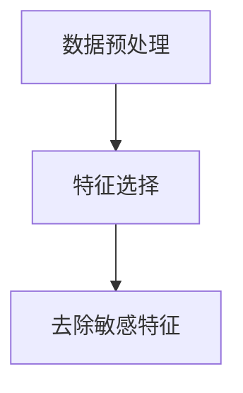
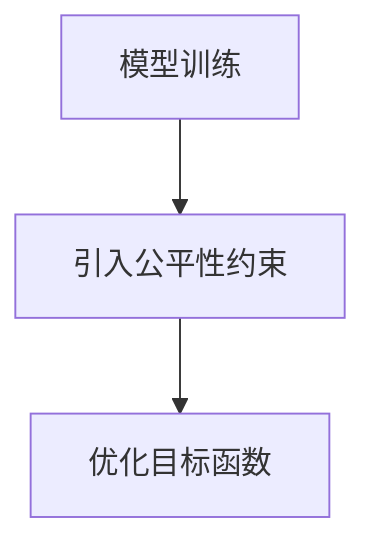
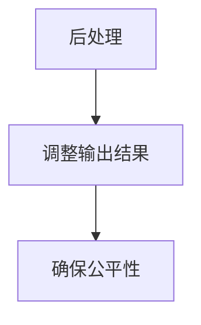
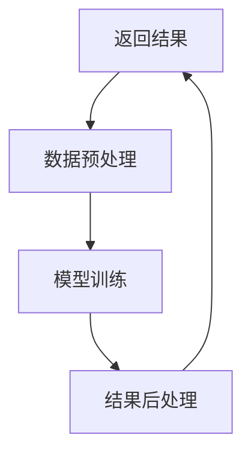

                 


# 公平性评估：确保AI Agent无歧视偏见

## 关键词：公平性评估，AI Agent，无歧视偏见，算法公平性，数据预处理

## 摘要：本文深入探讨了AI Agent中的公平性评估，分析了偏见与歧视的定义、来源及其对AI系统的潜在影响。文章详细讲解了公平性评估的核心概念，包括数据、模型和输出层面的公平性，并通过数学模型和算法原理，介绍了如何检测和消除AI Agent中的偏见。最后，结合实际案例，展示了公平性评估的系统架构设计和项目实现过程，为构建无偏见的AI系统提供了理论和实践指导。

---

## 第1章：公平性评估的背景与问题描述

### 1.1 公平性评估的定义与重要性

#### 1.1.1 公平性评估的定义
公平性评估是通过分析和测试AI系统，确保其在决策过程中不产生歧视或偏见的过程。它涉及对数据、模型和输出的全面检查，以识别和消除不公平的模式。

#### 1.1.2 公平性评估的重要性
在AI技术广泛应用的今天，确保AI系统的公平性至关重要。不公平的AI系统可能导致对特定群体的歧视，影响用户体验，甚至引发法律和伦理问题。通过公平性评估，可以提升系统的可信度和道德合规性。

#### 1.1.3 公平性评估的边界与外延
公平性评估不仅关注算法本身，还包括数据收集、模型训练和结果输出的全过程。其外延涉及法律、伦理和社会影响等多个方面。

### 1.2 AI Agent中的偏见与歧视问题

#### 1.2.1 AI Agent中的偏见来源
- 数据偏见：训练数据中的历史偏见，例如招聘广告中性别比例失衡。
- 算法偏见：算法设计时的主观假设，可能导致对某些群体的不公平处理。
- 数据分布不均衡：某些群体的数据较少，导致模型学习不充分。

#### 1.2.2 偏见对AI Agent的影响
- 不公平的推荐：例如，AI推荐系统对某些用户群体的就业机会较少。
- 损害用户体验：用户可能因不公平的决策而感到被忽视或歧视。
- 法律风险：不公平的AI决策可能引发法律诉讼。

#### 1.2.3 偏见与歧视的定义与区别
- 偏见：基于主观判断的不公平态度。
- 歧视：基于客观行为的不公平对待。
- 区别：偏见是内在的态度，歧视是外在的行为。

### 1.3 公平性评估的目标与意义

#### 1.3.1 公平性评估的目标
- 识别和消除系统中的偏见。
- 确保AI决策的公平性。

#### 1.3.2 公平性评估的意义
- 提升用户体验。
- 遵守伦理规范。
- 增强社会信任。

## 第2章：公平性评估的核心概念与联系

### 2.1 公平性评估的核心原理

#### 2.1.1 数据公平性
- 数据预处理：去除敏感特征或重新加权数据。
- 数据增强：增加少数群体样本，平衡数据分布。

#### 2.1.2 模型公平性
- 模型训练：引入公平性约束，修改损失函数。
- 模型评估：使用公平性指标，如平等分配率（PDR）和差异率（DR）。

#### 2.1.3 输出公平性
- 后处理：调整输出结果，确保公平性。
- 重新评分：根据公平性指标调整预测结果。

### 2.2 公平性评估的维度与特征

#### 2.2.1 数据维度的公平性评估
- 检查数据分布是否均衡。
- 确保数据集代表所有相关群体。

#### 2.2.2 模型维度的公平性评估
- 评估模型对不同群体的预测准确性。
- 确保模型不会对某些群体产生不公平的影响。

#### 2.2.3 输出维度的公平性评估
- 确保输出结果对所有用户公平。
- 检查结果是否因用户背景不同而有差异。

### 2.3 公平性评估的ER实体关系图

```mermaid
er
actor: 用户
agent: AI Agent
data: 数据集
model: 模型
output: 输出结果
```

## 第3章：公平性评估的算法原理

### 3.1 偏见检测算法

#### 3.1.1 数据预处理方法



#### 3.1.2 模型训练方法



#### 3.1.3 后处理方法



### 3.2 偏见消除算法

#### 3.2.1 数据增强方法
- 增加少数群体样本，平衡数据分布。

#### 3.2.2 模型调整方法
- 引入对抗训练，确保模型对所有群体公平。

## 第4章：公平性评估的数学模型

### 4.1 偏见检测的数学模型

#### 4.1.1 数据分布模型

$$P(x) = \text{数据的联合分布}$$

#### 4.1.2 公平性指标

$$\text{平等分配率（PDR）}= \frac{\text{目标群体的预测准确率}}{\text{所有群体的平均预测准确率}}$$

#### 4.1.3 模型训练的数学优化

$$\min L(\theta) + \lambda \cdot \text{公平性约束}$$

### 4.2 偏见消除的数学模型

#### 4.2.1 对抗训练模型

$$\min \mathbb{E}_{x,y}[f(x,y)] + \lambda \cdot \mathbb{E}_{x,y,a}[g(x,y,a)]$$

#### 4.2.2 模型校正

$$\theta' = \theta - \eta \cdot \nabla_{\theta}(\text{损失函数} + \lambda \cdot \text{公平性约束})$$

## 第5章：系统分析与架构设计

### 5.1 系统架构设计

#### 5.1.1 模块划分
- 数据预处理模块：去除敏感特征或重新加权数据。
- 模型训练模块：引入公平性约束，优化目标函数。
- 结果后处理模块：调整输出结果，确保公平性。

#### 5.1.2 交互设计
- 用户输入请求，系统处理并返回公平结果。

### 5.2 系统架构图



### 5.3 接口设计
- 输入接口：接收用户请求和数据。
- 输出接口：返回处理后的公平结果。

### 5.4 交互流程图

```mermaid
sequence
    actor -> agent: 请求处理
    agent -> data: 获取数据
    data -> model: 训练模型
    model -> output: 输出结果
    output -> actor: 返回结果
```

## 第6章：项目实战

### 6.1 项目环境安装
安装必要的库，如Python的scikit-learn、TensorFlow、Keras等。

### 6.2 核心代码实现

```python
from sklearn.metrics import confusion_matrix
from aif360.algorithms.preprocessing import Preprocessing
import pandas as pd
import numpy as np

# 数据预处理
def preprocess_data(data, sensitive_features):
    preprocessor = Preprocessing(sensitive_features=sensitive_features)
    processed_data = preprocessor.fit_transform(data)
    return processed_data

# 模型训练
def train_model(processed_data):
    # 使用公平性约束训练模型
    model = ...  # 具体模型实现
    return model

# 后处理
def postprocess_output(output, threshold):
    return output >= threshold
```

### 6.3 代码解读与分析
- 数据预处理部分：去除敏感特征或重新加权数据。
- 模型训练部分：引入公平性约束，确保模型预测的公平性。
- 后处理部分：调整输出结果，确保公平性。

### 6.4 实际案例分析
使用真实数据集，如Adult数据集，进行实验，对比有无公平性评估的结果。

## 第7章：总结与展望

### 7.1 本章总结
- 总结公平性评估的核心内容和实现方法，强调其重要性。

### 7.2 当前挑战与未来展望
- 挑战：数据隐私问题，动态偏见检测，模型可解释性。
- 展望：引入更先进的算法，如对抗学习，强化学习，提升公平性评估的效果。

### 7.3 最佳实践建议
- 定期进行公平性评估，保持数据和模型的更新。
- 结合领域知识，制定适合的公平性指标。
- 加强模型的可解释性，确保用户信任。

## 作者信息

作者：AI天才研究院/AI Genius Institute & 禅与计算机程序设计艺术 /Zen And The Art of Computer Programming

---

**本文通过系统性的分析和实际案例，详细讲解了如何确保AI Agent的公平性，帮助读者理解并实施相关技术。**

