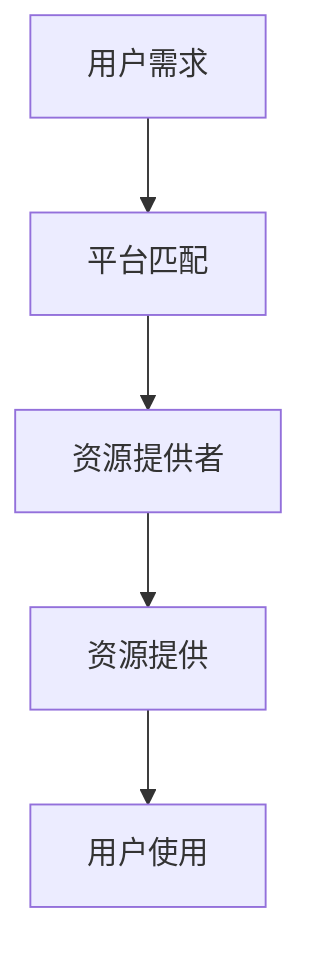
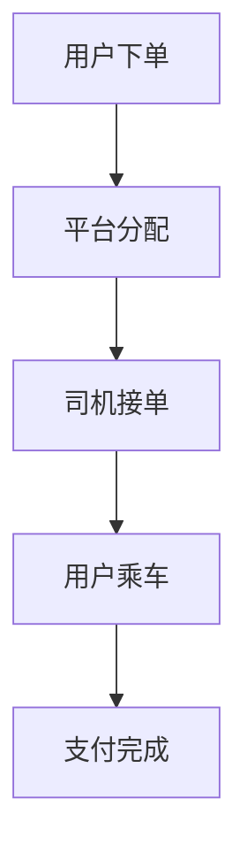
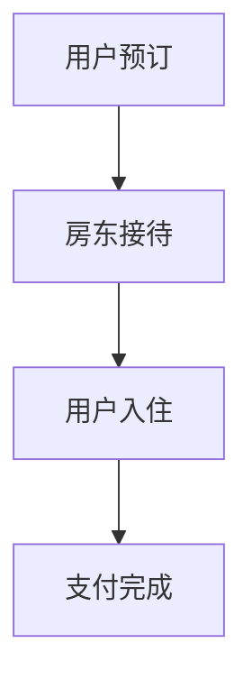

                 

# 共享经济模式对传统行业的影响与投资机会

> 关键词：共享经济，传统行业，投资机会，经济模式，技术创新，市场变革

> 摘要：共享经济作为一种新兴的经济模式，正在逐步改变传统行业的运作方式。本文将从共享经济的核心概念出发，分析其对交通、住宿、金融等多个传统行业的深远影响，并探讨其中的投资机会。通过详细的技术分析和案例研究，本文旨在为读者提供一个全面的视角，理解共享经济如何通过技术创新和模式创新重塑传统产业。

---

# 引言

共享经济作为一种基于互联网技术的新兴经济模式，通过闲置资源的高效利用，正在改变传统行业的运作方式。本文将从共享经济的基本概念出发，分析其对传统行业的颠覆性影响，并探讨其中的投资机会。

---

# 第一部分：共享经济的核心概念与运作模式

## 第1章：共享经济的定义与特征

### 1.1 共享经济的基本概念

共享经济是一种通过互联网平台，将闲置资源（如闲置物品、时间和技能）进行共享利用的经济模式。其核心在于通过技术手段实现资源的高效匹配和利用，从而降低资源浪费，提高经济效率。

### 1.2 共享经济的核心特征

共享经济具有以下核心特征：
1. **去中心化**：通过平台连接供需双方，减少中间环节。
2. **闲置资源利用**：充分利用闲置资源，创造经济价值。
3. **技术创新驱动**：依赖互联网、大数据和人工智能等技术实现高效匹配。

### 1.3 共享经济与传统经济模式的区别

| 特征 | 共享经济 | 传统经济 |
|------|----------|----------|
| 资源利用 | 高效利用闲置资源 | 依赖新增资源 |
| 中心化程度 | 去中心化 | 高度中心化 |
| 交易方式 | 点对点 | 通过中间商 |

---

## 第2章：共享经济的运作模式

### 2.1 共享经济的供需匹配机制

共享经济通过平台实现供需双方的精准匹配。以下是其运作流程：

### 2.2 共享经济的信任机制

为了解决陌生人之间的信任问题，共享经济平台通常采用以下信任机制：

1. **用户评分系统**：通过用户的评分和评价建立信任。
2. **区块链技术**：利用区块链技术确保交易记录的透明性和不可篡改性。

### 2.3 共享经济的定价策略

共享经济的定价通常基于市场供需和用户行为数据。以下是常用的定价模型：

1. 动态定价：根据供需变化实时调整价格。
2. 用户定价：基于用户行为数据个性化定价。

---

# 第二部分：共享经济对传统行业的影响

## 第3章：共享经济对交通出行行业的影响

### 3.1 滴滴出行对传统出租车行业的冲击

滴滴出行通过共享闲置车辆和司机资源，显著降低了出行成本。以下是滴滴出行与传统出租车行业的对比：

| 指标 | 滴滴出行 | 传统出租车 |
|------|----------|------------|
| 资源利用 | 高效利用闲置车辆 | 资源浪费 |
| 价格 | 动态定价，价格更低 | 固定价格，较高 |

### 3.2 汽车共享模式的兴起

汽车共享模式（如宝马的ReachNow）通过共享闲置车辆，降低用户的用车成本，同时减少交通拥堵和污染。

---

## 第4章：共享经济对住宿与旅游行业的影响

### 4.1 Airbnb对传统酒店业的挑战

Airbnb通过共享闲置房源，提供更灵活和个性化的住宿选择，显著降低了用户的住宿成本。

| 指标 | Airbnb | 传统酒店 |
|------|--------|----------|
| 资源利用 | 高效利用闲置房源 | 资源利用率低 |
| 价格 | 更低价格 | 较高价格 |

### 4.2 共享住宿的模式创新

共享住宿不仅提供住宿服务，还提供独特的旅游体验，如民宿、短租公寓等。

---

## 第5章：共享经济对金融行业的影响

### 5.1 P2P借贷对传统银行业的冲击

P2P借贷平台（如Lending Club）通过共享闲置资金，直接连接借款人和投资人，显著降低了融资成本。

| 指标 | P2P借贷 | 传统银行 |
|------|---------|----------|
| 资源利用 | 高效利用闲置资金 | 资源利用率低 |
| 利息成本 | 更低 | 较高 |

### 5.2 共享金融的模式创新

共享金融通过区块链技术实现透明化和去中心化，降低金融交易的成本和风险。

---

# 第三部分：共享经济的投资机会

## 第6章：共享经济的投资逻辑

### 6.1 共享经济的市场潜力

共享经济的市场规模正在快速增长。根据市场研究，到2030年，全球共享经济市场规模将超过10万亿美元。

### 6.2 共享经济的商业模式

共享经济的商业模式主要包括：
1. 平台佣金模式：通过收取交易佣金获利。
2. 广告与增值服务模式：通过广告和增值服务获利。

### 6.3 共享经济的竞争格局

共享经济领域的竞争主要集中在以下方面：
1. 用户获取成本。
2. 平台技术能力。
3. 品牌影响力。

---

## 第7章：共享经济的投资机会分析

### 7.1 交通出行领域的投资机会

#### 案例分析：滴滴出行

滴滴出行通过移动互联网技术，实现了城市交通的智能化调度。以下是滴滴出行的商业模式：

### 7.2 住宿与旅游领域的投资机会

#### 案例分析：Airbnb

Airbnb通过共享闲置房源，提供个性化的住宿服务。以下是Airbnb的商业模式：

### 7.3 金融领域的投资机会

#### 案例分析：P2P借贷

P2P借贷通过区块链技术实现透明化和去中心化，降低融资成本和风险。

---

## 第8章：共享经济的投资策略

### 8.1 投资前的市场分析

投资者需要对共享经济的市场需求、竞争格局和政策环境进行深入分析。

### 8.2 投资中的风险管理

共享经济的投资风险主要来自政策风险、市场风险和技术风险。投资者需要制定有效的风险管理策略。

### 8.3 投资后的价值创造

投资者可以通过优化平台技术、提升用户体验和拓展市场等方式，持续创造价值。

---

# 结论

共享经济作为一种新兴的经济模式，正在通过技术创新和模式创新重塑传统行业。本文从共享经济的核心概念、对传统行业的影响和投资机会三个方面进行了详细分析。未来，随着技术的进步和市场的成熟，共享经济将继续在全球范围内扩张，为投资者带来巨大的机遇。

---

# 附录

## 附录1：共享经济术语表

- **共享经济**：通过互联网平台，将闲置资源进行共享利用的经济模式。
- **供需匹配**：通过平台实现供需双方的精准匹配。
- **信任机制**：通过用户评分和区块链技术确保交易的透明性和安全性。

## 附录2：案例分析

- **滴滴出行**：通过移动互联网技术实现城市交通的智能化调度。
- **Airbnb**：通过共享闲置房源，提供个性化的住宿服务。

## 附录3：数据图表

- 图1：共享经济市场规模增长趋势图。
- 图2：共享经济用户数量增长趋势图。

---

# 作者

作者：AI天才研究院/AI Genius Institute & 禅与计算机程序设计艺术 /Zen And The Art of Computer Programming

