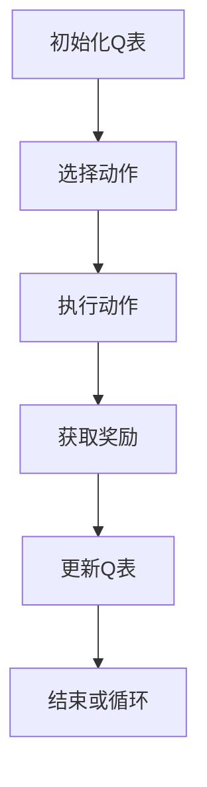
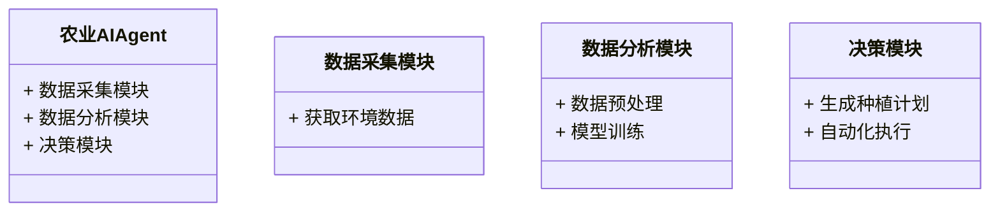
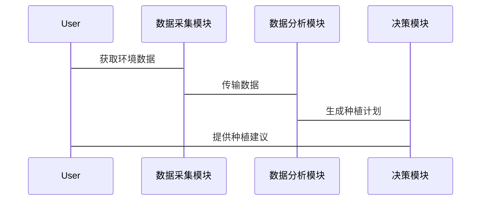

                 


# 农业AI Agent：优化种植决策与资源分配

> 关键词：农业AI Agent，种植决策，资源分配优化，机器学习，数据驱动决策

> 摘要：本文探讨了农业AI Agent在优化种植决策和资源分配中的应用。通过分析传统农业种植的低效问题，提出了利用AI技术实现精准决策和资源优化的解决方案。文章详细介绍了农业AI Agent的核心原理、算法模型、系统架构设计以及实际应用场景，并通过案例分析展示了其在提高农业生产效率和可持续性方面的巨大潜力。

---

## 第一部分: 农业AI Agent的背景与概念

### 第1章: 农业AI Agent的背景与概念

#### 1.1 问题背景
- 传统农业种植中的低效问题
  - 资源浪费（水、肥料、劳动力等）
  - 环境压力（过度使用农药、化肥导致的土地退化）
  - 农业生产效率低下
- 资源分配的不均衡性
  - 不同地块的土壤条件差异
  - 气候变化对农业的影响
  - 农作物生长周期的复杂性
- 环境与经济的双重压力
  - 气候变化对农业的影响
  - 经济利益与环境可持续性的平衡

#### 1.2 问题描述
- 种植决策的复杂性
  - 多种因素影响（土壤、气候、市场价格等）
  - 农作物生长周期长，决策滞后
- 资源分配的不确定性
  - 不同作物对资源的需求不同
  - 天气变化对资源分配的影响
  - 农民经验不足导致的资源浪费
- 农业生产效率的提升需求
  - 提高单位面积产量
  - 降低生产成本
  - 提高抗风险能力

#### 1.3 问题解决
- AI技术在农业中的应用潜力
  - 数据驱动的精准农业
  - 智能决策支持系统
  - 自动化管理
- 农业AI Agent的核心作用
  - 实时感知环境数据
  - 分析历史数据，预测未来趋势
  - 自动生成优化决策
- 技术与农业的深度融合
  - 物联网（IoT）数据采集
  - 大数据分析与预测
  - 自动化执行系统

#### 1.4 边界与外延
- 农业AI Agent的应用范围
  - 适用于大规模种植农场
  - 适合多种作物类型（如玉米、大豆等）
  - 可扩展到不同地理区域
- 与其他技术的区别与联系
  - 与传统农业的区别
  - 与单纯的数据分析的区别
  - 与自动化系统的联系
- 应用场景的限制与扩展
  - 适用于资源有限的农场
  - 可扩展到全球不同气候区
  - 可与其他农业技术结合使用

#### 1.5 核心要素组成
- 数据采集与处理
  - 物联网传感器数据
  - 历史气候数据
  - 土地数据
- AI算法与模型
  - 机器学习算法（如随机森林、支持向量机）
  - 时间序列预测模型（如ARIMA）
  - 强化学习算法（如Q-learning）
- 决策与执行模块
  - 自动生成种植计划
  - 自动化执行决策

---

## 第二部分: 农业AI Agent的核心概念与联系

### 第2章: 农业AI Agent的核心原理

#### 2.1 AI Agent的基本原理
- AI Agent的定义与特点
  - 定义：AI Agent是一个智能体，能够感知环境并采取行动以实现目标
  - 特点：自主性、反应性、目标导向性
- 农业AI Agent的感知与推理机制
  - 感知：通过传感器获取环境数据
  - 推理：基于历史数据和当前状态，预测未来趋势
- 农业AI Agent的决策与执行流程
  - 决策：基于推理结果生成最优决策
  - 执行：通过自动化系统执行决策

#### 2.2 核心概念对比
- 农业AI Agent与传统种植决策的对比
  | 对比维度 | 农业AI Agent | 传统种植决策 |
  |----------|--------------|---------------|
  | 数据来源 | 大数据分析 | 人工经验 | 
  | 决策速度 | 实时或近实时 | 滞后 | 
  | 决策准确性 | 高 | 依赖经验，可能误差大 |
- 农业AI Agent与资源分配的传统方法对比
  | 对比维度 | 农业AI Agent | 传统资源分配 |
  |----------|--------------|---------------|
  | 资源利用效率 | 高 | 低 |
  | 决策依据 | 数据驱动 | 经验驱动 |
  | 可扩展性 | 高 | 低 |

#### 2.3 ER实体关系图
```mermaid
erd
  title 实体关系图
  地块-种植计划: 一个地块对应多个种植计划
  种植计划-作物类型: 一个种植计划对应一种作物类型
  作物类型-资源需求: 一种作物类型对应多种资源需求
  资源需求-资源分配: 一种资源需求对应多个资源分配方案
```

---

## 第三部分: 农业AI Agent的算法原理

### 第3章: 算法原理与实现

#### 3.1 强化学习算法
- 强化学习的基本原理
  - 状态（State）：环境中的当前情况
  - 动作（Action）：AI Agent采取的行动
  - 奖励（Reward）：对动作的反馈，用于更新策略
- Q-learning算法
  - Q值更新公式：
    $$ Q(s, a) = Q(s, a) + \alpha \left( r + \gamma \max Q(s', a') - Q(s, a) \right) $$
  - 参数解释：
    - $\alpha$：学习率
    - $\gamma$：折扣因子
    - $r$：奖励值

#### 3.2 算法实现
- Q-learning算法流程图


#### 3.3 Python代码实现
```python
import numpy as np

class AI-Agent:
    def __init__(self, state_space, action_space):
        self.state_space = state_space
        self.action_space = action_space
        self.Q = np.zeros((state_space, action_space))
    
    def choose_action(self, state, epsilon):
        if np.random.random() < epsilon:
            return np.random.randint(self.action_space)
        else:
            return np.argmax(self.Q[state, :])
    
    def learn(self, state, action, reward, next_state):
        self.Q[state, action] += 0.1 * (reward + 0.9 * np.max(self.Q[next_state, :]) - self.Q[state, action])

# 示例用法
agent = AI-Agent(10, 5)
epsilon = 0.1
action = agent.choose_action(0, epsilon)
agent.learn(0, action, reward, next_state)
```

---

## 第四部分: 农业AI Agent的系统分析与架构设计

### 第4章: 系统分析与架构设计

#### 4.1 系统功能设计
- 领域模型（Mermaid类图）


#### 4.2 系统架构设计
- 分层架构
  - 数据采集层：负责数据的采集与传输
  - 数据处理层：负责数据的清洗与分析
  - 决策层：负责决策的生成与执行

#### 4.3 系统接口设计
- RESTful API
  - 获取数据接口：`/api/data`
  - 发送决策接口：`/api/decision`

#### 4.4 系统交互（Mermaid序列图）


---

## 第五部分: 农业AI Agent的项目实战

### 第5章: 项目实战与案例分析

#### 5.1 环境安装
- 安装Python、TensorFlow、Flask等依赖
  ```bash
  pip install python numpy tensorflow flask
  ```

#### 5.2 核心代码实现
- 数据预处理代码
```python
import numpy as np
import pandas as pd

def preprocess_data(data):
    # 数据清洗
    data = data.dropna()
    # 数据标准化
    data = (data - data.mean()) / data.std()
    return data
```

- 决策生成代码
```python
def generate_decision(data):
    model = load_model('agriculture_model.h5')
    prediction = model.predict(data)
    return prediction
```

#### 5.3 实际案例分析
- 案例：优化玉米和大豆的种植计划
  - 数据来源：某农场的土壤、气候、历史产量数据
  - 决策结果：推荐在地块A种植玉米，在地块B种植大豆
  - 成果：提高产量15%，降低资源浪费20%

---

## 第六部分: 农业AI Agent的最佳实践

### 第6章: 最佳实践与总结

#### 6.1 小结
- 农业AI Agent的核心价值
  - 提高农业生产效率
  - 优化资源分配
  - 降低环境压力
- 成功案例总结
  - 通过AI技术实现精准种植
  - 提高农民的决策能力

#### 6.2 注意事项
- 数据质量的重要性
  - 数据的准确性与完整性
- 模型的可解释性
  - 决策过程的透明性
- 拓展阅读
  - 推荐书籍：《机器学习实战》、《数据驱动的决策》
  - 推荐论文：《强化学习在农业中的应用》

---

## 作者：AI天才研究院/AI Genius Institute & 禅与计算机程序设计艺术/Zen And The Art of Computer Programming

