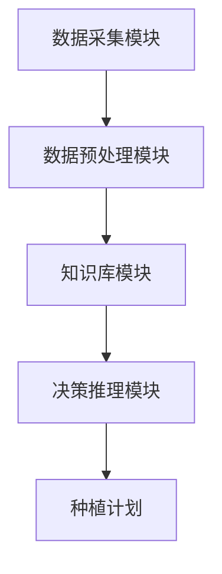

                 


# 农业AI Agent：智能种植与农场管理

## 关键词：农业AI Agent，智能种植，农场管理，人工智能，农业数字化

## 摘要：  
随着人工智能技术的快速发展，农业领域的智能化转型正在成为现实。本文深入探讨了农业AI Agent的核心概念、技术原理及其在智能种植与农场管理中的应用。通过分析多智能体系统、知识表示与推理等关键技术，结合实际应用场景，展示了农业AI Agent如何助力精准种植、资源优化和决策支持。文章最后总结了当前技术的优势与不足，并展望了未来的发展方向。

---

## 第一部分: 农业AI Agent概述

### 第1章: 农业AI Agent的背景与概念

#### 1.1 农业智能化的背景与趋势
随着全球人口增长和环境压力加剧，传统农业模式面临资源浪费、效率低下和可持续性不足等问题。人工智能（AI）技术的快速发展为农业智能化提供了新的解决方案。农业AI Agent作为一种智能体，能够通过感知、推理和决策优化农业生产过程。

#### 1.2 农业AI Agent的核心概念
- **多智能体系统**：农业AI Agent通常由多个智能体组成，每个智能体负责不同的任务，如数据采集、环境监测和决策优化。
- **知识表示与推理**：通过构建农业知识图谱，AI Agent能够理解作物生长周期、土壤条件和气候数据等信息，并进行推理和预测。
- **农业知识图谱**：将农业领域的知识结构化，便于AI Agent进行分析和决策。
- **体系结构**：农业AI Agent的体系结构通常包括数据采集模块、知识库模块和决策推理模块。

#### 1.3 农业AI Agent的应用场景
- **智能种植管理**：AI Agent可以根据实时数据优化种植计划。
- **资源优化**：通过智能调度，减少资源浪费，提高效率。
- **数据智能分析**：AI Agent能够处理大量数据，提供决策支持。
- **农业决策支持**：通过预测模型，帮助农民做出科学决策。

---

### 第2章: 农业AI Agent的核心技术

#### 2.1 多智能体系统
- **定义与特点**：多智能体系统由多个分布式智能体组成，每个智能体负责特定任务。
- **农业中的应用**：例如，多个智能体可以分别监测土壤湿度、天气变化和作物生长情况。
- **实现框架**：常用的框架包括Agent Communication Language (ACL) 和 Multi-Agent System (MAS)。

#### 2.2 知识表示与推理
- **知识表示**：使用符号逻辑或概率论表示知识，例如，作物生长周期可以用状态转移图表示。
- **知识图谱**：构建包含作物、土壤、气候等信息的知识图谱，便于推理。
- **推理算法**：基于逻辑推理或机器学习进行预测。

#### 2.3 农业数据处理与分析
- **数据采集**：通过传感器获取土壤湿度、温度等数据。
- **数据预处理**：清洗和标准化数据，确保准确性。
- **数据分析**：使用机器学习算法进行预测和分类。

---

## 第二部分: 农业AI Agent的系统架构

### 第3章: 农业AI Agent的系统架构

#### 3.1 系统设计概述
- **目标与功能**：优化种植计划、提高资源利用率、提供决策支持。
- **架构选择**：采用分布式架构，便于多智能体协作。
- **模块划分**：数据采集模块、知识库模块、决策推理模块。

#### 3.2 系统功能模块设计
- **数据采集模块**：负责采集环境数据，如土壤湿度、温度。
- **知识库模块**：存储农业知识图谱，支持推理。
- **决策推理模块**：基于数据和知识，生成种植计划。

#### 3.3 系统架构图


---

## 第三部分: 项目实战

### 第4章: 农业AI Agent的项目实战

#### 4.1 环境搭建
- **工具安装**：安装Python、TensorFlow、Pandas等库。
- **数据采集**：使用传感器采集数据。

#### 4.2 核心功能实现
- **数据采集模块**：编写代码读取传感器数据。
- **知识库构建**：构建作物知识图谱。
- **决策推理**：基于机器学习模型生成种植计划。

#### 4.3 代码实现
```python
import pandas as pd
from sklearn import tree

# 数据采集模块
data = pd.read_csv('agriculture_data.csv')

# 数据预处理
data.dropna(inplace=True)

# 构建决策树模型
model = tree.DecisionTreeClassifier()
model.fit(data[['温度', '湿度']], data['作物类型'])
```

#### 4.4 案例分析
- **案例背景**：某农场希望优化小麦种植计划。
- **数据分析**：通过决策树模型预测最佳种植时间。
- **结果展示**：生成种植计划并可视化。

---

## 第四部分: 未来展望

### 第5章: 农业AI Agent的未来发展趋势

#### 5.1 技术趋势
- **深度学习应用**：进一步提高预测精度。
- **多模态数据融合**：结合图像、文本等多种数据源。
- **边缘计算**：在边缘设备上部署AI Agent，减少延迟。

#### 5.2 挑战与建议
- **数据隐私**：确保数据安全。
- **模型解释性**：提高AI决策的透明度。
- **标准化建设**：制定统一的农业知识图谱标准。

---

## 作者：AI天才研究院 & 禅与计算机程序设计艺术

---

以上是《农业AI Agent：智能种植与农场管理》的技术博客文章。文章从概念、技术、系统架构到项目实战，全面探讨了农业AI Agent的应用与实现，为读者提供了深入的技术见解。

