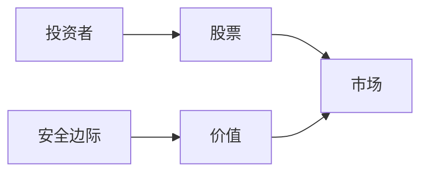

                 


# 净净股票策略：格雷厄姆理论的现代演绎

> 关键词：净净股票策略，格雷厄姆理论，价值投资，内在价值，安全边际，现代投资

> 摘要：本文通过分析净净股票策略的核心概念、算法原理和系统架构，展示了格雷厄姆理论在现代股票投资中的应用。我们从价值投资的背景出发，深入探讨了净净收益与内在价值的关系，结合现金流贴现模型和安全边际的计算方法，构建了一个完整的投资策略系统，并通过实际案例进行了验证。

---

# 第一部分：净净股票策略的背景与核心概念

## 第1章：股票投资的背景与问题背景

### 1.1 股票投资的传统问题
#### 1.1.1 传统股票投资的局限性
传统的股票投资方法往往依赖于市场趋势和短期波动，这种方法在市场环境稳定时表现良好，但在市场波动加剧的现代金融市场中，投资者常常面临以下问题：
- **信息过载**：投资者需要处理海量的市场数据，但缺乏有效的筛选和分析工具。
- **情绪化决策**：市场波动容易导致投资者情绪化，从而做出错误的投资决策。
- **缺乏长期视角**：短期波动往往掩盖了企业的长期价值，导致投资者忽视基本面分析。

#### 1.1.2 现代股票市场的复杂性
现代股票市场具有以下特点：
- **高频交易**：算法交易和高频交易使得市场更加复杂和不稳定。
- **全球化**：企业的业务和市场分布越来越全球化，增加了分析的难度。
- **大数据时代**：投资者需要处理来自社交媒体、新闻媒体等非传统数据源的信息。

#### 1.1.3 投资者面临的挑战与困惑
在现代股票市场中，投资者面临以下挑战：
- **如何在噪声中发现价值**：大量的市场信息中，真正影响企业价值的信息往往被掩盖。
- **如何平衡短期波动与长期价值**：投资者需要在短期收益和长期价值之间找到平衡点。
- **如何应对市场情绪的影响**：市场情绪的波动常常影响股票价格，但情绪本身是不可预测的。

### 1.2 格雷厄姆理论的现代挑战
#### 1.2.1 格雷厄姆理论的核心思想
本杰明·格雷厄姆是价值投资的鼻祖，他提出的“安全边际”和“内在价值”概念奠定了现代价值投资的基础。格雷厄姆认为，股票的价格波动围绕其内在价值展开，投资者应该在价格显著低于内在价值时买入，并在价格显著高于内在价值时卖出。

#### 1.2.2 现代市场环境的变化
与格雷厄姆所处的时代相比，现代市场发生了以下变化：
- **信息透明度提高**：投资者可以更容易地获取企业的财务数据和市场信息。
- **市场参与者多样化**：机构投资者和个人投资者的比例发生了变化，机构投资者在市场中占据更大的比重。
- **技术进步**：大数据和人工智能技术的应用改变了投资方式和决策过程。

#### 1.2.3 理论与实践的脱节问题
尽管格雷厄姆的理论在理论上非常完善，但在实践中，投资者常常面临以下问题：
- **如何快速计算内在价值**：格雷厄姆的方法需要大量的计算，但在现代高频交易中，投资者需要快速决策。
- **如何应对市场的非理性波动**：格雷厄姆的理论假设市场是理性的，但在现实中，市场常常出现非理性波动。
- **如何在复杂环境下应用理论**：现代市场环境的复杂性使得格雷厄姆的理论难以直接应用。

---

## 第2章：净净股票策略的核心目标
### 2.1 净净股票策略的定义
净净股票策略是一种结合了格雷厄姆价值投资理论和现代技术的投资策略。它通过计算企业的内在价值和市场价格之间的差异，帮助投资者在市场中找到被低估的投资机会。

### 2.2 策略的核心目标
- **发现低估股票**：通过计算企业的内在价值，找到市场价格低于内在价值的股票。
- **控制投资风险**：通过安全边际的概念，降低投资风险。
- **实现长期收益**：通过长期持有优质股票，实现资本增值。

### 2.3 策略的适用场景与边界
- **适用场景**：适用于那些具有稳定财务状况和良好成长性的企业。
- **不适用场景**：不适用于那些财务状况不稳定或行业前景不明朗的企业。

---

# 第二部分：净净股票策略的核心概念与联系

## 第3章：价值投资与安全边际
### 3.1 价值投资的定义与特点
- **定义**：价值投资是一种以企业内在价值为基础的投资策略，强调以低于内在价值的价格买入股票。
- **特点**：注重基本面分析，强调长期投资。

### 3.2 安全边际的概念与计算
- **概念**：安全边际是指股票的市场价格与内在价值之间的差额。计算公式为：
$$ 安全边际 = 市场价格 - 内在价值 $$

- **计算步骤**：
  1. 计算企业的内在价值。
  2. 找出股票的市场价格。
  3. 计算两者之间的差额。

### 3.3 格雷厄姆理论与现代价值投资的对比
通过对比分析，我们可以发现：
- **传统价值投资**：注重企业内在价值的计算，强调安全边际。
- **现代价值投资**：结合大数据和人工智能技术，提高内在价值计算的效率和准确性。

---

## 第4章：净净收益与内在价值
### 4.1 净净收益的计算方法
- **定义**：净利润是企业在一定时期内实现的利润，计算公式为：
$$ 净利润 = 收入 - 成本 - 费用 $$

- **步骤**：
  1. 计算企业的收入。
  2. 计算企业的成本和费用。
  3. 计算净利润。

### 4.2 内在价值的数学模型
- **现金流贴现模型**：通过将未来现金流折现到现值，计算企业的内在价值。公式为：
$$ 内在价值 = \sum_{t=1}^{n} \frac{CF_t}{(1+r)^t} + \frac{TV}{(1+r)^n} $$
其中，\( CF_t \) 是第 \( t \) 年的现金流，\( r \) 是折现率，\( TV \) 是终值。

### 4.3 净净收益与内在价值的关系
- **关系**：净利润是计算内在价值的重要组成部分，内在价值是净利润的未来现值。

---

## 第5章：核心概念对比分析
### 5.1 传统价值投资与现代策略的对比
通过对比分析，我们可以发现：
- **传统价值投资**：注重内在价值的计算，强调安全边际。
- **现代价值投资**：结合大数据和人工智能技术，提高内在价值计算的效率和准确性。

### 5.2 净净收益与市盈率的对比
- **市盈率**：市盈率是股票价格与每股收益的比值，计算公式为：
$$ 市盈率 = \frac{股票价格}{每股收益} $$

- **对比**：
  | 指标 | 净利润 | 市盈率 |
  |------|--------|--------|
  | 计算基础 | 净利润 | 每股收益 |
  | 用途 | 计算内在价值 | 评估股票估值 |

---

## 第6章：核心概念ER实体关系图
### 6.1 核心概念关系图


---

# 第三部分：净净股票策略的算法原理

## 第7章：净净收益计算算法
### 7.1 净净收益计算公式
$$ 净净收益 = 收入 - 成本 - 费用 $$

### 7.2 算法流程图


---

## 第8章：内在价值计算算法
### 8.1 现金流贴现模型
$$ 内在价值 = \sum_{t=1}^{n} \frac{CF_t}{(1+r)^t} + \frac{TV}{(1+r)^n} $$

### 8.2 算法流程图


---

## 第9章：安全边际计算算法
### 9.1 安全边际计算公式
$$ 安全边际 = 市场价格 - 内在价值 $$

### 9.2 算法流程图


---

# 第四部分：净净股票策略的系统架构与项目实战

## 第10章：系统架构设计
### 10.1 系统功能设计
- **模块化设计**：
  - 数据获取模块：从多个数据源获取股票数据。
  - 数据分析模块：计算净利润、内在价值和安全边际。
  - 投资决策模块：根据计算结果生成投资建议。

### 10.2 系统架构图


---

## 第11章：项目实战
### 11.1 环境安装
- **工具安装**：安装Python、Pandas、NumPy等工具。
- **数据源获取**：从Yahoo Finance获取股票数据。

### 11.2 核心代码实现
```python
import pandas as pd
import numpy as np

# 净利润计算
def calculate_net_profit(income, cost, expenses):
    return income - cost - expenses

# 内在价值计算
def calculate_intrinsic_value(cash_flows, discount_rate, terminal_value):
    intrinsic_value = 0
    for t in range(len(cash_flows)):
        intrinsic_value += cash_flows[t] / (1 + discount_rate) ** t
    intrinsic_value += terminal_value / (1 + discount_rate) ** len(cash_flows)
    return intrinsic_value

# 安全边际计算
def calculate_margin_of_safety market_price, intrinsic_value):
    return market_price - intrinsic_value
```

### 11.3 实际案例分析
假设某企业的财务数据如下：
- 收入：1000万元
- 成本：600万元
- 费用：200万元
- 折现率：10%
- 终值：2000万元

计算其内在价值：
$$ 内在价值 = \sum_{t=1}^{n} \frac{CF_t}{(1+r)^t} + \frac{TV}{(1+r)^n} $$

---

## 第12章：最佳实践与小结
### 12.1 最佳实践
- **定期复盘**：定期检查投资组合的表现，调整投资策略。
- **风险管理**：合理控制仓位，避免过度集中投资。
- **持续学习**：关注市场变化，学习新的投资知识。

### 12.2 小结
本文通过分析净净股票策略的核心概念、算法原理和系统架构，展示了格雷厄姆理论在现代股票投资中的应用。我们从价值投资的背景出发，深入探讨了净净收益与内在价值的关系，结合现金流贴现模型和安全边际的计算方法，构建了一个完整的投资策略系统，并通过实际案例进行了验证。

---

# 作者：AI天才研究院/AI Genius Institute & 禅与计算机程序设计艺术 /Zen And The Art of Computer Programming

