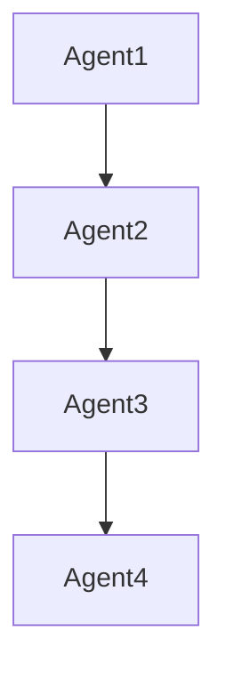
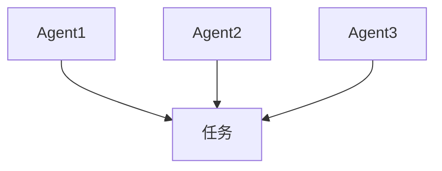
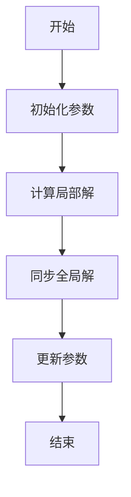
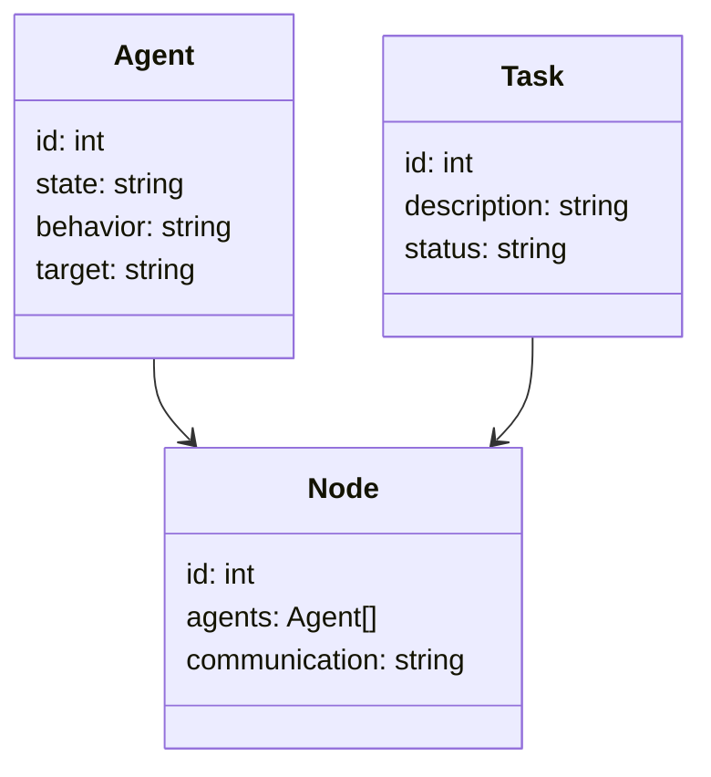
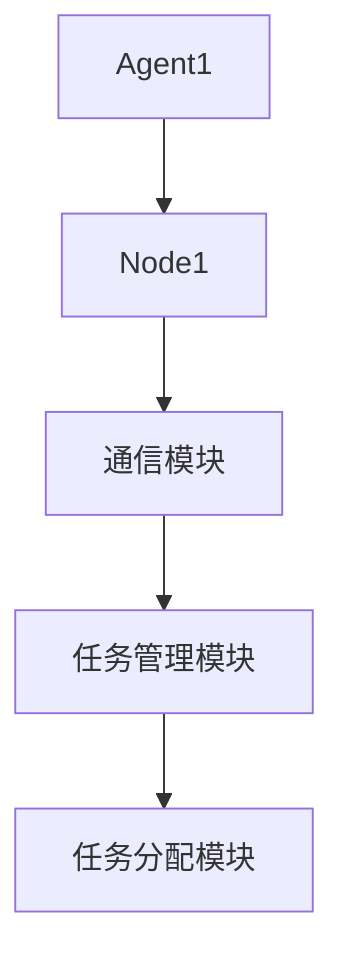
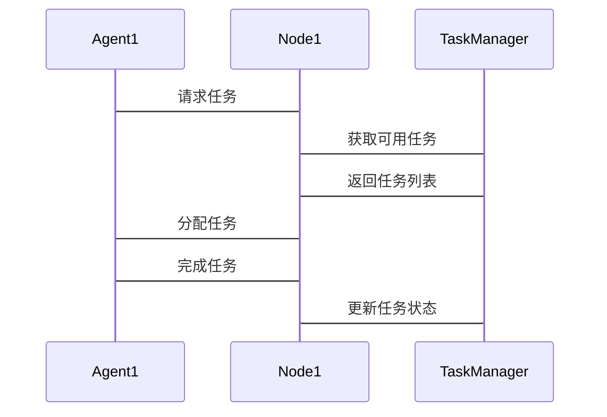

                 


# 分布式AI Agent系统：设计与实现

## 关键词：分布式系统、AI Agent、多智能体协作、系统架构、算法原理

## 摘要：  
本文将深入探讨分布式AI Agent系统的设计与实现。首先，我们介绍分布式AI Agent系统的背景、核心概念及其应用场景。接着，详细分析其核心算法原理，并通过数学模型和代码示例进行阐述。然后，我们从系统架构、接口设计、交互流程等多个维度对系统进行分析与设计。最后，通过项目实战的方式，展示如何实现一个典型的分布式AI Agent系统，并总结其实现过程中的最佳实践和注意事项。

---

# 第1章 分布式AI Agent系统概述

## 1.1 分布式AI Agent的背景与问题背景

### 1.1.1 分布式系统的发展与挑战
分布式系统是一种将计算资源分散到多个独立的计算节点上的系统设计方式。随着计算能力的提升和网络技术的发展，分布式系统在各个领域的应用越来越广泛。然而，分布式系统也面临诸多挑战，例如节点间的通信延迟、数据一致性、容错性以及系统扩展性等。

### 1.1.2 AI Agent的核心问题与边界
AI Agent（智能体）是一种能够感知环境并采取行动以实现目标的实体。AI Agent的核心问题包括感知、决策、规划和执行。在分布式系统中，AI Agent需要与其他Agent协同工作，这带来了复杂性，例如通信协议的选择、任务分配、冲突解决等。

### 1.1.3 分布式AI Agent的定义与外延
分布式AI Agent系统是指多个AI Agent分布在不同的计算节点上，通过网络通信协同工作的系统。其外延包括分布式计算、多智能体系统、分布式人工智能等。

---

## 1.2 分布式AI Agent系统的核心概念

### 1.2.1 分布式系统的特征
- **独立性**：各个节点独立运行，能够自主完成任务。
- **通信**：节点之间通过网络进行通信和协作。
- **一致性**：系统需要保证数据的一致性，避免冲突。

### 1.2.2 AI Agent的基本属性
- **感知**：通过传感器或接口获取环境信息。
- **决策**：基于感知信息做出决策。
- **执行**：通过执行机构或API实现操作。
- **学习**：通过经验优化自身的行为。

### 1.2.3 分布式AI Agent的组成要素
- **计算节点**：运行AI Agent的硬件或虚拟节点。
- **通信协议**：节点间通信的规则和格式。
- **任务分配机制**：如何将任务分配给不同的Agent。
- **协作机制**：Agent之间的协同策略。

---

## 1.3 分布式AI Agent系统应用场景

### 1.3.1 多智能体协作
例如，在机器人协作、分布式推荐系统等领域，多个AI Agent需要协同完成复杂任务。

### 1.3.2 分布式计算
在大数据处理、分布式训练等领域，AI Agent可以被用于任务分解和协同计算。

### 1.3.3 企业级系统
在企业信息化系统中，分布式AI Agent可以用于流程自动化、智能监控等场景。

---

## 1.4 本章小结
本章从背景、概念和应用三个角度介绍了分布式AI Agent系统，为后续章节的深入分析奠定了基础。

---

# 第2章 分布式AI Agent系统的核心概念与联系

## 2.1 分布式AI Agent系统的概念模型

### 2.1.1 分布式AI Agent的实体关系模型
通过Mermaid图展示分布式AI Agent系统的实体关系：
```mermaid
er
actor: 分布式AI Agent
attribute: 状态、行为、目标
```

### 2.1.2 分布式AI Agent的交互关系模型
展示Agent之间的交互关系：


### 2.1.3 分布式AI Agent的协作关系模型
展示Agent协作完成任务的关系：


---

## 2.2 分布式AI Agent系统的核心原理

### 2.2.1 分布式系统的核心原理
- **通信机制**：通过网络通信实现节点间的协作。
- **一致性协议**：如两阶段提交、RAFT等，确保数据一致性。

### 2.2.2 AI Agent的核心原理
- **感知与决策**：基于环境信息做出决策。
- **规划与执行**：通过规划算法制定行动方案并执行。

### 2.2.3 分布式AI Agent的协同机制
- **任务分配**：根据节点的负载和能力分配任务。
- **冲突解决**：通过协商或仲裁机制解决冲突。

---

## 2.3 分布式AI Agent系统的ER实体关系图
通过Mermaid图展示系统的核心实体关系：
```mermaid
er
actor: 分布式AI Agent
attribute: 状态、行为、目标
```

---

## 2.4 本章小结
本章通过概念模型和关系图展示了分布式AI Agent系统的核心概念及其联系。

---

# 第3章 分布式AI Agent系统的算法原理

## 3.1 分布式AI Agent算法的核心原理

### 3.1.1 分布式算法的基本概念
- **分布式计算**：任务分解到多个节点上完成。
- **同步与异步**：节点之间的同步与异步操作。

### 3.1.2 AI Agent算法的基本概念
- **感知算法**：如状态识别、模式识别。
- **决策算法**：如基于规则的决策、基于模型的决策。

### 3.1.3 分布式AI Agent算法的协同机制
- **任务分配算法**：如负载均衡算法。
- **协同算法**：如多智能体协同算法。

---

## 3.2 分布式AI Agent算法的数学模型

### 3.2.1 分布式系统的基本数学模型
$$ \text{状态} = \text{节点状态} \cup \text{通信状态} $$

### 3.2.2 AI Agent的基本数学模型
$$ \text{决策} = \text{感知} \rightarrow \text{动作} $$

### 3.2.3 分布式AI Agent算法的数学模型
$$ \text{任务分配} = \text{节点能力} \rightarrow \text{任务} $$

---

## 3.3 分布式AI Agent算法的实现流程

### 3.3.1 算法流程图


### 3.3.2 Python实现示例
```python
def distributed_ai_agent_algorithm():
    nodes = ['node1', 'node2', 'node3']
    tasks = ['task1', 'task2', 'task3']
    # 任务分配
    for node in nodes:
        assign_task(node, tasks)
    # 同步全局解
    sync_global_solution(nodes)
    return '任务完成'

def assign_task(node, tasks):
    # 任务分配逻辑
    pass

def sync_global_solution(nodes):
    # 同步全局解逻辑
    pass
```

---

## 3.4 本章小结
本章通过数学模型和流程图详细讲解了分布式AI Agent算法的核心原理和实现流程。

---

# 第4章 分布式AI Agent系统的系统分析与架构设计

## 4.1 问题场景介绍
假设我们正在设计一个分布式AI Agent系统，用于实现多智能体的协作任务处理。

---

## 4.2 系统功能设计

### 4.2.1 领域模型类图
通过Mermaid图展示系统的核心类及其关系：


---

## 4.3 系统架构设计

### 4.3.1 系统架构图
通过Mermaid图展示系统架构：


---

## 4.4 系统接口设计

### 4.4.1 系统接口
- **通信接口**：定义节点间通信的协议和API。
- **任务接口**：定义任务分配和状态查询的API。

### 4.4.2 系统交互序列图
展示系统交互的流程：


---

## 4.5 本章小结
本章通过系统架构图和交互图详细分析了分布式AI Agent系统的实现方案。

---

# 第5章 分布式AI Agent系统的项目实战

## 5.1 环境安装

### 5.1.1 系统需求
- 操作系统：Linux/Windows/MacOS
- Python版本：3.6+
- 依赖库：networkx、numpy、scipy

### 5.1.2 环境配置
安装必要的Python库：
```bash
pip install networkx numpy scipy
```

---

## 5.2 系统核心实现

### 5.2.1 通信模块实现
```python
import networkx as nx

class CommunicationModule:
    def __init__(self):
        self.graph = nx.Graph()
    
    def add_node(self, node_id):
        self.graph.add_node(node_id)
    
    def add_edge(self, node1, node2):
        self.graph.add_edge(node1, node2)
    
    def get_neighbors(self, node_id):
        return list(self.graph.neighbors(node_id))
```

### 5.2.2 任务分配模块实现
```python
class TaskAllocator:
    def __init__(self, nodes):
        self.nodes = nodes
    
    def allocate_task(self, task, nodes):
        # 简单的轮询分配
        return nodes[0]
```

---

## 5.3 实际案例分析

### 5.3.1 案例描述
假设我们有三个节点（Node1、Node2、Node3），每个节点上运行一个AI Agent，任务是协同完成数据分析。

### 5.3.2 代码实现
```python
from communication_module import CommunicationModule
from task_allocator import TaskAllocator

nodes = ['node1', 'node2', 'node3']
tasks = ['task1', 'task2', 'task3']

comm = CommunicationModule()
comm.add_node('node1')
comm.add_node('node2')
comm.add_node('node3')
comm.add_edge('node1', 'node2')
comm.add_edge('node2', 'node3')
comm.add_edge('node3', 'node1')

allocator = TaskAllocator(nodes)
for task in tasks:
    assigned_node = allocator.allocate_task(task, nodes)
    print(f"Task {task} assigned to {assigned_node}")
```

---

## 5.4 本章小结
本章通过实际案例和代码实现，展示了分布式AI Agent系统的实现过程。

---

# 第6章 分布式AI Agent系统的最佳实践

## 6.1 注意事项

### 6.1.1 系统设计
- 确保通信的可靠性和低延迟。
- 设计高效的任务分配机制。

### 6.1.2 系统实现
- 使用成熟的分布式计算框架（如Distributed、Spark）。
- 注意数据一致性和容错性设计。

---

## 6.2 小结
通过本文的分析与实践，我们可以看到分布式AI Agent系统的复杂性和挑战性。在实际应用中，需要结合具体场景选择合适的设计方案，并注意系统的可扩展性和可维护性。

---

# 作者信息

作者：AI天才研究院/AI Genius Institute & 禅与计算机程序设计艺术 /Zen And The Art of Computer Programming

---

感谢您的阅读，希望本文对您理解分布式AI Agent系统的设计与实现有所帮助！

