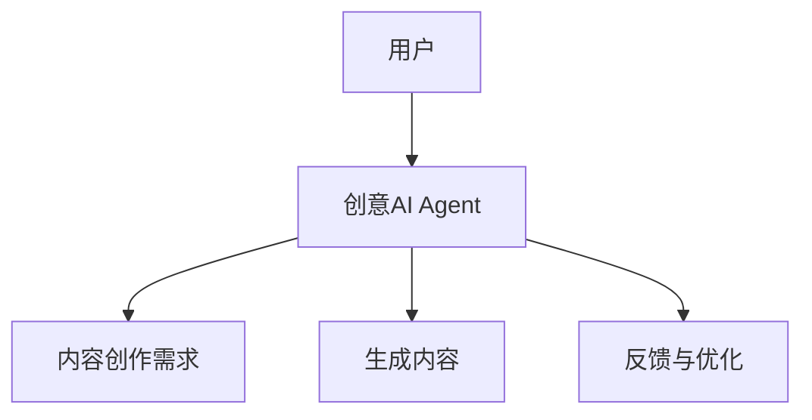
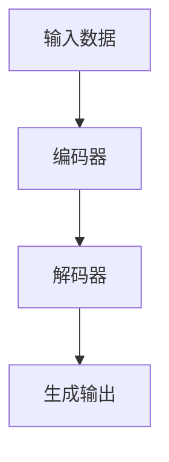
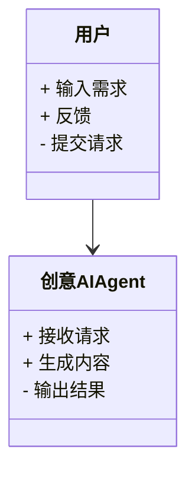
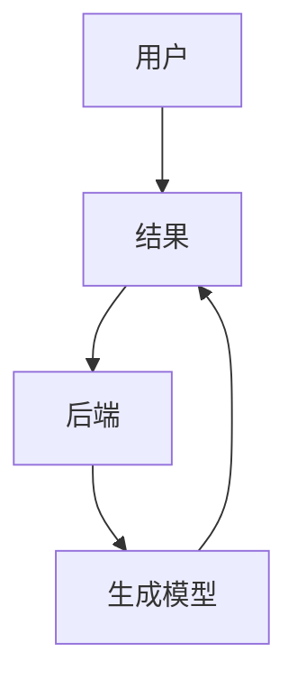
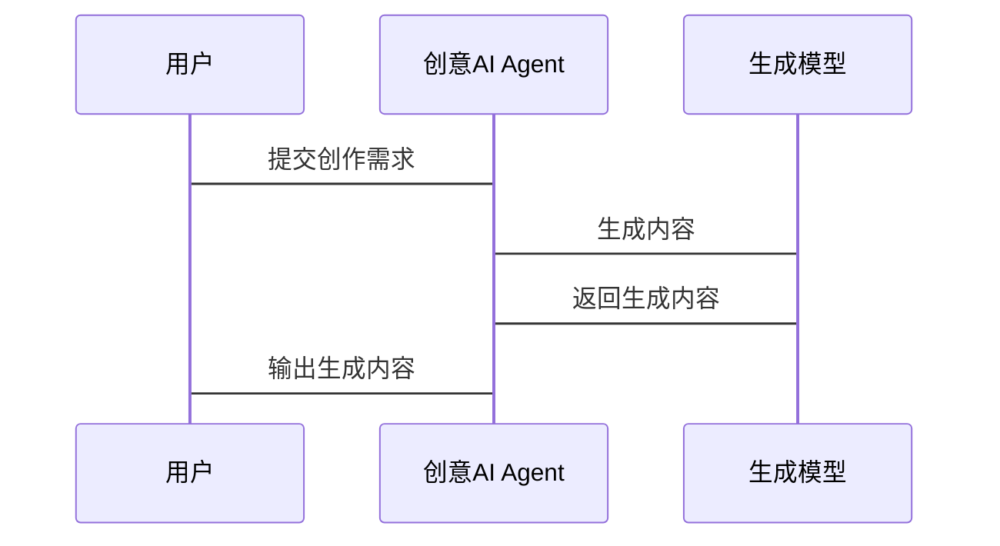

                 


# 创意AI Agent：辅助内容创作与设计

> **关键词**: 创意AI Agent, AI内容创作, 生成式AI, Transformer架构, 自然语言处理

> **摘要**: 创意AI Agent是一种结合生成式AI和自然语言处理技术的智能辅助工具，旨在帮助用户高效地进行内容创作与设计。本文将从创意AI Agent的核心概念、算法原理、系统架构设计、项目实战等多个方面进行详细阐述，深入剖析其技术本质和实际应用场景。

---

# 第一部分: 创意AI Agent的背景与核心概念

## 第1章: 创意AI Agent的背景与问题背景

### 1.1 创意AI Agent的定义与问题背景

#### 1.1.1 创意AI Agent的基本概念
创意AI Agent是一种基于生成式AI和自然语言处理技术的智能辅助工具，能够根据用户输入的需求生成高质量的内容，如文本、图像、音乐等。它通过学习海量数据，理解用户的创作意图，并生成符合要求的作品。

#### 1.1.2 创意AI Agent的应用场景
创意AI Agent的应用场景广泛，包括但不限于：
- **文本创作**: 生成文章、故事、诗歌等。
- **图像设计**: 生成图片、插画、海报等。
- **音乐创作**: 生成旋律、歌词等。
- **广告创意**: 生成广告文案、创意点子等。

#### 1.1.3 创意AI Agent的核心问题与挑战
创意AI Agent的核心问题在于如何平衡生成内容的创意性和多样性，同时确保生成内容与用户需求的高度契合。主要挑战包括：
- **创意多样性**: 生成的内容需要多样化，避免重复性。
- **用户需求理解**: 精准理解用户的创作意图。
- **生成效率**: 在保证内容质量的前提下，提高生成效率。

### 1.2 创意AI Agent的演进历程

#### 1.2.1 从传统内容创作到AI辅助创作的演变
传统内容创作依赖于人工创作，效率较低且成本较高。随着AI技术的发展，AI辅助创作逐渐成为趋势，尤其是在生成式AI和深度学习技术的推动下，创意AI Agent逐渐走向成熟。

#### 1.2.2 AI技术在内容创作中的应用现状
当前，AI技术在内容创作中的应用已经取得了显著成果，如OpenAI的GPT系列模型在文本生成领域的应用，以及各种AI绘画工具的普及。

#### 1.2.3 创意AI Agent的未来发展展望
创意AI Agent将朝着更智能化、个性化和多样化的方向发展，进一步提升生成内容的质量和效率。

### 1.3 创意AI Agent的核心要素与边界

#### 1.3.1 创意AI Agent的核心要素
创意AI Agent的核心要素包括：
- **用户输入**: 包括创作需求、风格偏好等。
- **生成模型**: 包括文本生成模型、图像生成模型等。
- **反馈机制**: 用户对生成内容的反馈用于优化生成过程。

#### 1.3.2 创意AI Agent的边界与外延
创意AI Agent的边界在于其生成内容的质量和多样性，外延则包括与之相关的AI技术、用户需求分析等。

#### 1.3.3 创意AI Agent与其他AI应用的对比
创意AI Agent与其他AI应用的主要区别在于其专注于内容创作，强调生成内容的创意性和个性化。

---

## 第2章: 创意AI Agent的核心概念与联系

### 2.1 创意AI Agent的核心概念原理

#### 2.1.1 创意AI Agent的定义与核心属性
创意AI Agent是一种智能系统，其核心属性包括创意生成能力、理解能力和学习能力。

#### 2.1.2 创意AI Agent的原理与技术基础
创意AI Agent的核心技术基础包括生成式AI、自然语言处理和深度学习。

#### 2.1.3 创意AI Agent的核心算法与模型
创意AI Agent的核心算法包括Transformer架构、GPT模型等。

### 2.2 创意AI Agent的概念属性特征对比

#### 2.2.1 创意AI Agent与传统内容创作工具的对比
创意AI Agent与传统内容创作工具的主要区别在于其智能化和自动化能力。

#### 2.2.2 创意AI Agent与AI绘画工具的对比
创意AI Agent与AI绘画工具的对比可以从功能、技术基础等方面进行分析。

#### 2.2.3 创意AI Agent与AI音乐生成工具的对比
创意AI Agent与AI音乐生成工具的对比可以分析其生成能力、用户交互方式等。

### 2.3 创意AI Agent的ER实体关系图



---

## 第3章: 创意AI Agent的算法原理与数学模型

### 3.1 创意AI Agent的核心算法

#### 3.1.1 生成式AI的基本原理
生成式AI通过学习数据分布，生成新的数据实例。其核心算法包括生成对抗网络（GAN）和变换器（Transformer）。

#### 3.1.2 Transformer架构在创意AI Agent中的应用
Transformer架构通过自注意力机制，实现对输入序列的高效处理，广泛应用于文本生成和图像生成。

#### 3.1.3 创意AI Agent的训练与推理过程
创意AI Agent的训练过程包括数据预处理、模型训练和评估。推理过程则基于训练好的模型生成内容。

### 3.2 创意AI Agent的数学模型与公式

#### 3.2.1 Transformer模型的数学公式
$$\text{Attention}(Q,K,V) = \text{softmax}\left(\frac{QK^T}{\sqrt{d_k}}\right)V$$

#### 3.2.2 创意AI Agent的损失函数
$$\mathcal{L} = -\sum_{i=1}^{n} \text{log}(p(y_i|x_i))$$

#### 3.2.3 创意AI Agent的训练过程


---

## 第4章: 创意AI Agent的系统架构设计

### 4.1 系统功能设计

#### 4.1.1 问题场景介绍
创意AI Agent需要解决的问题包括内容生成、用户交互等。

#### 4.1.2 系统功能设计
系统功能包括用户输入、内容生成、结果输出等。

#### 4.1.3 系统功能模块设计
系统功能模块包括输入模块、生成模块、输出模块等。

### 4.2 系统架构设计

#### 4.2.1 领域模型设计


#### 4.2.2 系统架构设计


#### 4.2.3 系统接口设计
系统接口包括用户输入接口、生成模型接口等。

#### 4.2.4 系统交互设计


---

## 第5章: 创意AI Agent的项目实战

### 5.1 环境安装与配置

#### 5.1.1 安装Python环境
```bash
python --version
pip install numpy torch
```

#### 5.1.2 安装深度学习框架
```bash
pip install tensorflow-gpu
```

### 5.2 系统核心实现

#### 5.2.1 生成模型的实现
```python
import torch
class Generator(torch.nn.Module):
    def __init__(self):
        super(Generator, self).__init__()
        self.fc = torch.nn.Linear(100, 512)
        self.relu = torch.nn.ReLU()
        self.sigmoid = torch.nn.Sigmoid()

    def forward(self, x):
        x = self.fc(x)
        x = self.relu(x)
        x = self.sigmoid(x)
        return x
```

#### 5.2.2 训练过程实现
```python
def train():
    model = Generator()
    criterion = torch.nn.MSELoss()
    optimizer = torch.optim.Adam(model.parameters(), lr=0.001)
    for epoch in range(num_epochs):
        for batch in dataloader:
            outputs = model(batch)
            loss = criterion(outputs, batch)
            optimizer.zero_grad()
            loss.backward()
            optimizer.step()
```

### 5.3 生成效果分析

#### 5.3.1 生成案例分析
通过训练好的模型生成内容，并分析其质量和多样性。

#### 5.3.2 案例对比分析
将生成内容与人工创作的内容进行对比，分析其优缺点。

### 5.4 项目总结

#### 5.4.1 项目成果
总结项目实现的效果和成果。

#### 5.4.2 经验总结
总结项目实施过程中的经验和教训。

---

## 第6章: 创意AI Agent的最佳实践

### 6.1 创意AI Agent的使用技巧

#### 6.1.1 确定创作需求
明确用户的创作需求和风格偏好。

#### 6.1.2 选择合适的模型
根据创作需求选择合适的生成模型。

#### 6.1.3 调整生成参数
根据生成效果调整模型参数，优化生成结果。

### 6.2 创意AI Agent的优化建议

#### 6.2.1 模型优化
优化模型结构和训练参数，提升生成效果。

#### 6.2.2 系统优化
优化系统架构，提升运行效率。

### 6.3 创意AI Agent的注意事项

#### 6.3.1 数据隐私问题
注意用户数据的隐私保护。

#### 6.3.2 生成内容的版权问题
明确生成内容的版权归属。

### 6.4 创意AI Agent的拓展阅读

#### 6.4.1 深度学习技术的最新进展
了解深度学习技术的最新进展，探索其在创意AI Agent中的应用。

#### 6.4.2 创意AI Agent的未来趋势
分析创意AI Agent的未来发展趋势。

---

## 第7章: 创意AI Agent的小结

### 7.1 创意AI Agent的核心概念回顾
回顾创意AI Agent的核心概念和技术原理。

### 7.2 创意AI Agent的未来展望
展望创意AI Agent的未来发展和应用前景。

---

## 第8章: 创意AI Agent的注意事项

### 8.1 创意AI Agent的使用注意事项
注意事项包括数据安全、生成内容的版权问题等。

### 8.2 创意AI Agent的维护与更新
定期维护和更新系统，确保其稳定性和先进性。

---

## 第9章: 创意AI Agent的拓展阅读

### 9.1 创意AI Agent的参考资料
推荐一些相关的参考资料和文献。

### 9.2 创意AI Agent的深入学习
建议进一步学习的方向和资源。

---

## 作者信息

**作者**: AI天才研究院/AI Genius Institute & 禅与计算机程序设计艺术/Zen And The Art of Computer Programming

