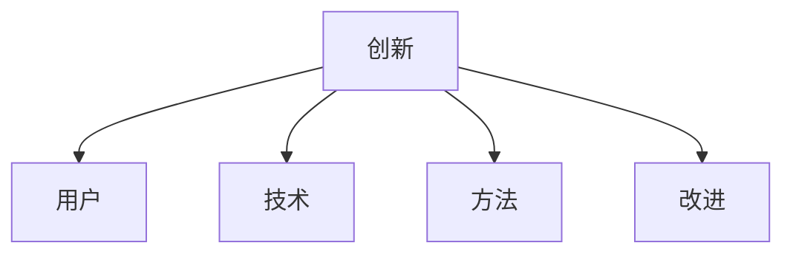
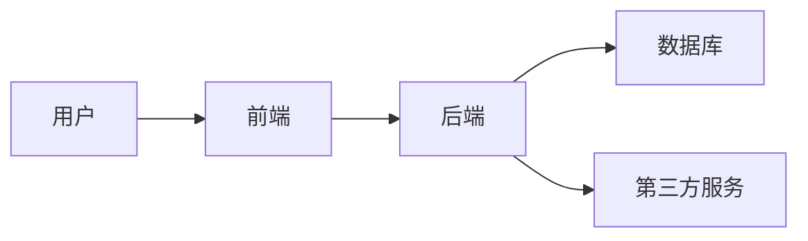
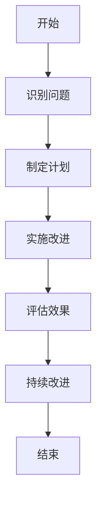

                 


# 创新与持续改进

> 关键词：创新，持续改进，技术博客，方法论，工具与技术，系统架构，项目实战

> 摘要：本文将探讨创新与持续改进在技术领域的重要性，从概念、方法、工具到实际案例，逐步分析如何在技术开发中实现创新与持续改进。通过系统化的分析和实际案例的剖析，本文旨在为技术开发者提供切实可行的建议和指导，帮助他们在技术开发中更好地实现创新与持续改进。

---

# 第一部分：创新与持续改进的核心概念

## 第1章：创新与持续改进的背景与意义

### 1.1 创新与持续改进的定义与特征

- **创新**：创新是指引入新的思想、方法、技术和产品，以满足市场需求或解决现有问题。其核心特征包括独特性、价值性和可行性。
- **持续改进**：持续改进是一种通过不断优化现有流程、产品或服务以提高效率和质量的方法。其核心特征包括系统性、渐进性和全员参与。

### 1.2 创新与持续改进的关系

- 创新是突破性改进，而持续改进是渐进性优化。
- 创新是持续改进的基础，持续改进是创新的延续。

### 1.3 创新与持续改进的背景

- **技术领域**：技术创新是推动技术进步的核心动力，而持续改进则是保持技术领先地位的关键。
- **管理领域**：现代企业管理中，创新与持续改进是提升竞争力的重要手段。
- **社会需求**：社会对技术的需求不断变化，创新与持续改进是满足这些变化的必要手段。

### 1.4 创新与持续改进的核心要素

- **创新**：包括创意产生、评估、实施和成果评估。
- **持续改进**：包括问题识别、目标设定、实施改进、评估效果和持续优化。

---

## 第2章：创新与持续改进的核心概念与联系

### 2.1 创新与持续改进的核心概念原理

- 创新是通过引入新技术或方法实现突破性进步。
- 持续改进是通过不断优化现有系统或流程实现渐进性进步。

### 2.2 创新与持续改进的概念属性特征对比

| 特征 | 创新 | 持续改进 |
|------|------|----------|
| 目标 | 推出新产品或服务 | 持续优化现有产品或服务 |
| 方法 | 突破性改进 | 微小渐进式改进 |
| 风险 | 较高 | 较低 |
| 周期 | 较短 | 较长 |

### 2.3 创新与持续改进的ER实体关系图



---

## 第3章：创新与持续改进的方法论

### 3.1 创新方法论

- **创意产生**：通过头脑风暴、用户调研等方式产生创意。
- **创意评估**：评估创意的可行性和市场潜力。
- **创意实施**：制定计划，分配资源，实施创意。
- **成果评估**：评估创新成果，总结经验。

### 3.2 持续改进方法论

- **PDCA循环**：计划、执行、检查、处理。
- **敏捷开发**：通过迭代开发实现持续改进。
- **Scrum框架**：通过Scrum ceremonies实现持续改进。

---

## 第4章：创新与持续改进的工具与技术

### 4.1 创新工具

- **头脑风暴**：用于产生创意。
- **SWOT分析**：用于评估创意的优劣势。
- **创新思维训练**：如设计思维（Design Thinking）。

### 4.2 持续改进工具

- **Kanban**：用于可视化流程，实现持续改进。
- **控制图**：用于监控过程稳定性，识别改进机会。
- **鱼骨图（因果图）**：用于分析问题原因，制定改进措施。

### 4.3 技术工具

- **版本控制系统**：如Git，用于代码版本管理。
- **自动化测试工具**：如Selenium，用于自动化测试，确保持续改进。
- **项目管理工具**：如Jira，用于项目管理，实现持续改进。

---

## 第5章：创新与持续改进的系统架构设计

### 5.1 系统功能设计

- **领域模型**：通过Mermaid类图描述系统功能模块。
- **系统架构设计**：通过Mermaid架构图描述系统整体架构。
- **系统接口设计**：通过Mermaid序列图描述系统接口交互。

### 5.2 系统架构图



---

## 第6章：创新与持续改进的项目实战

### 6.1 项目背景

- **项目目标**：通过创新与持续改进优化现有系统。
- **项目需求**：明确项目需求，制定项目计划。

### 6.2 项目环境安装

- **安装依赖**：如安装Python、Git、Jupyter Notebook等。
- **配置开发环境**：如配置IDE、安装必要的库。

### 6.3 核心代码实现

- **代码示例**：

```python
# 创新与持续改进的示例代码
def创新(创意):
    return 创意 + 改进

def持续改进(现有系统):
    while True:
        优化 = 评估(现有系统)
        if 优化完成:
            break
        return 优化
```

### 6.4 代码应用解读与分析

- **代码解读**：上述代码展示了创新与持续改进的实现方式。
- **代码分析**：创新函数通过引入改进实现创意的提升，持续改进函数通过不断优化现有系统实现持续改进。

---

## 第7章：创新与持续改进的数学模型与算法

### 7.1 数学模型

- 创新与持续改进的数学模型可以表示为：
$$ 创新 = f(创意, 改进) $$
$$ 持续改进 = g(现有系统, 优化) $$

### 7.2 算法流程图



---

## 第8章：创新与持续改进的最佳实践

### 8.1 小结

- 创新与持续改进是技术进步的双轮驱动。
- 创新带来突破性进步，持续改进带来稳定性优化。

### 8.2 注意事项

- 创新需要注重创意的可行性和市场潜力。
- 持续改进需要全员参与和系统性实施。

### 8.3 拓展阅读

- 推荐阅读《创新者的窘境》和《持续改进的实践》。

---

## 作者：AI天才研究院/AI Genius Institute & 禅与计算机程序设计艺术/Zen And The Art of Computer Programming

---

# 结语

创新与持续改进是技术领域中不可或缺的两个方面。通过创新，我们可以突破现有限制；通过持续改进，我们可以优化现有系统。只有将两者结合起来，才能实现技术的真正进步。希望本文能为技术开发者提供有价值的参考和启发。

