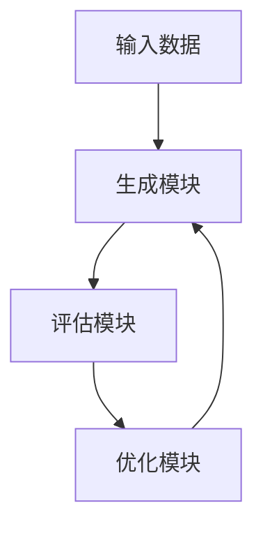

                 


**《创造性AI：激发AI Agent的创新思维》**

---

**关键词**：创造性AI、创新思维、AI Agent、生成模型、创造性算法、AI系统架构

**摘要**：  
创造性AI是指能够模仿或超越人类创造性思维的AI系统。通过结合生成模型、强化学习和神经网络，创造性AI能够生成新的艺术作品、解决复杂问题并提出创新解决方案。本文将深入探讨创造性AI的核心概念、算法原理、系统架构以及实际应用，帮助读者理解如何激发AI Agent的创新思维，推动AI技术在各个领域的创新应用。

---

# 创造性AI：激发AI Agent的创新思维

## 第1章 创造性AI的定义与背景

### 1.1 创造性AI的定义与内涵

创造性AI是一种能够模拟或超越人类创造性思维的人工智能系统。它不仅能够执行预定义的任务，还能生成新颖的想法、解决方案或艺术作品。创造性AI的核心在于其创新能力，这使其在艺术、设计、科学等领域具有广泛的应用潜力。

**1.1.1 创造性AI的定义**  
创造性AI是指能够独立或在特定约束条件下生成创新性输出的AI系统。它通过学习和模拟人类的创造性思维过程，能够在复杂问题中提出独特且有效的解决方案。

**1.1.2 创造性AI的核心特征**  
- **创新性**：能够生成前所未见的解决方案或艺术作品。  
- **适应性**：能够根据环境变化调整其输出。  
- **多样性**：能够生成多种不同的创意选项。  
- **评估能力**：能够评估其生成的创意的质量并进行优化。  

**1.1.3 创造性AI的应用场景**  
- **艺术创作**：生成绘画、音乐、文学作品。  
- **产品设计**：设计新产品或改进现有产品。  
- **问题解决**：提供创新的解决方案。  
- **科学研究**：发现新的科学规律或理论。  

### 1.2 创造性AI的发展背景

随着AI技术的快速发展，创造性AI逐渐成为研究的热点。传统的AI系统主要依赖规则和数据进行任务处理，而创造性AI的引入为AI技术注入了新的活力。

**1.2.1 AI技术的演进历程**  
AI技术经历了从专家系统、机器学习到深度学习的演变，每一步都在推动AI能力的提升。创造性AI是当前深度学习技术发展的产物。

**1.2.2 创造性思维在AI中的重要性**  
创造性思维是人类解决问题和创新的核心能力。将这一能力赋予AI系统，能够极大地扩展AI的应用范围。

**1.2.3 当前创造性AI的研究现状**  
目前，创造性AI的研究主要集中在生成模型和强化学习领域。生成模型如GAN和Transformer在艺术创作、文本生成等方面取得了显著成果，强化学习则用于复杂决策问题的解决。

### 1.3 创造性AI的核心问题与挑战

创造性AI的发展面临诸多挑战，包括如何定义创造性、如何评估创意的质量、如何保持创新的多样性等。

**1.3.1 创造性AI的核心问题**  
- **创意的定义**：如何量化创意的质量。  
- **创意的生成**：如何生成多样且高质量的创意。  
- **创意的评估**：如何客观评估创意的价值。  

**1.3.2 创造性AI面临的挑战**  
- **计算资源消耗**：生成创意需要大量的计算资源。  
- **创意的独特性**：如何确保生成创意的独特性。  
- **用户接受度**：用户对AI生成创意的接受度问题。  

**1.3.3 创造性AI的未来发展方向**  
- **多模态创意生成**：结合视觉、听觉等多种模态进行创意生成。  
- **动态创意生成**：根据实时反馈动态调整创意生成策略。  
- **人机协作**：结合人类反馈优化AI生成的创意。  

## 第2章 创造性AI的核心概念与理论基础

### 2.1 创造性思维的定义与特征

创造性思维是人类解决问题和创新的核心能力。它包括发散性思考、关联性思考和批判性思考。

**2.1.1 创造性思维的定义**  
创造性思维是指通过独特的视角解决问题或产生新想法的能力。它强调独立思考和创新性解决方案。

**2.1.2 创造性思维的核心特征**  
- **发散性**：能够从多个角度思考问题。  
- **关联性**：能够将不同领域的知识结合起来。  
- **批判性**：能够评估不同解决方案的优劣。  

### 2.2 创造性AI的理论基础

创造性AI的理论基础包括认知科学、神经科学和机器学习等领域。

**2.2.1 认知科学与创造性思维**  
认知科学研究人类思维过程，为创造性AI提供了理论基础。人类的创造性思维过程可以被分解为多个步骤，这些步骤可以被模拟。

**2.2.2 神经科学与创造性思维**  
神经科学研究表明，创造性思维与大脑的特定区域活动有关。这些研究成果为创造性AI的模拟提供了参考。

**2.2.3 AI中的创造性模型**  
- **生成对抗网络（GAN）**：通过对抗训练生成创意内容。  
- **Transformer模型**：通过自注意力机制生成连贯的文本内容。  
- **强化学习**：通过奖励机制优化创意生成策略。  

### 2.3 创造性AI的核心要素

创造性AI的核心要素包括数据、算法和环境。

**2.3.1 数据驱动的创造性**  
高质量的数据是生成高质量创意的基础。数据多样性能够提高生成创意的多样性。

**2.3.2 算法驱动的创造性**  
算法决定了创意生成的方式和质量。不同的算法适用于不同的创造性任务。

**2.3.3 环境驱动的创造性**  
环境对创意生成的影响不可忽视。动态环境能够激发更多的创新性解决方案。

## 第3章 创造性AI的算法原理

### 3.1 创造性AI的生成模型

生成模型是创造性AI的核心技术。常用的生成模型包括生成对抗网络（GAN）和Transformer模型。

**3.1.1 基于生成对抗网络的创造性AI**  
GAN由生成器和判别器组成，通过对抗训练生成创意内容。生成器尝试生成能够欺骗判别器的创意，判别器则试图识别生成内容的真假。

**3.1.2 基于Transformer的创造性AI**  
Transformer模型通过自注意力机制生成连贯的文本内容，适用于创意文本生成任务。

**3.1.3 基于强化学习的创造性AI**  
强化学习通过奖励机制优化创意生成策略，适用于需要动态调整的创造性任务。

### 3.2 创造性AI的评估方法

评估创造性AI的输出质量是关键问题。常用的评估方法包括定量评估和定性评估。

**3.2.1 创造性评估的指标体系**  
- **多样性**：生成创意的数量和多样性。  
- **新颖性**：创意的独特性和创新性。  
- **实用性**：创意的实际应用价值。  

**3.2.2 创造性AI的评估算法**  
- **基于相似度的评估**：通过计算生成内容与参考内容的相似度进行评估。  
- **基于判别的评估**：通过人工判别生成内容的质量进行评估。  
- **基于奖励的评估**：通过强化学习中的奖励机制进行评估。  

### 3.3 创造性AI的优化策略

为了提高创造性AI的性能，需要从数据、算法和环境三个层面进行优化。

**3.3.1 数据优化策略**  
- **数据增强**：通过数据增强技术增加数据多样性。  
- **数据筛选**：选择高质量的数据用于训练。  
- **数据平衡**：确保训练数据的平衡性。  

**3.3.2 算法优化策略**  
- **算法改进**：对现有算法进行改进，提高生成质量。  
- **算法融合**：结合多种算法的优势，提高生成能力。  
- **超参数优化**：通过调整超参数优化算法性能。  

**3.3.3 环境优化策略**  
- **动态环境适应**：使AI能够适应动态变化的环境。  
- **反馈机制优化**：设计有效的反馈机制优化生成策略。  
- **多模态融合**：结合多种模态信息提高生成能力。  

## 第4章 创造性AI的系统架构与实现

### 4.1 创造性AI系统的总体架构

创造性AI系统通常由输入模块、生成模块、评估模块和优化模块组成。

**4.1.1 系统功能模块划分**  
- **输入模块**：接收输入数据和任务描述。  
- **生成模块**：根据输入生成创意内容。  
- **评估模块**：评估生成内容的质量。  
- **优化模块**：根据评估结果优化生成策略。  

**4.1.2 系统功能流程图**  


**4.1.3 系统架构设计**  
- **模块化设计**：各个模块相对独立，便于维护和优化。  
- **可扩展性设计**：支持多种生成算法和评估方法。  
- **高效性设计**：优化系统性能，提高生成效率。  

### 4.2 创造性AI的核心算法实现

创造性AI的核心算法包括生成器、判别器和评估器的实现。

**4.2.1 创造性生成算法的实现**  
以GAN为例，生成器和判别器的实现如下：

```python
import torch
import torch.nn as nn

class Generator(nn.Module):
    def __init__(self, latent_dim, output_dim):
        super(Generator, self).__init__()
        self.fc = nn.Linear(latent_dim, output_dim)

    def forward(self, x):
        return self.fc(x)

class Discriminator(nn.Module):
    def __init__(self, input_dim, hidden_dim):
        super(Discriminator, self).__init__()
        self.fc = nn.Linear(input_dim, hidden_dim)
        self.fc2 = nn.Linear(hidden_dim, 1)

    def forward(self, x):
        x = self.fc(x)
        x = self.fc2(x)
        return torch.sigmoid(x)
```

**4.2.2 创造性评估算法的实现**  
评估算法可以通过计算生成内容与参考内容的相似度实现：

```python
def calculate_similarity(generated_content, reference_content):
    similarity = torch.cosine_similarity(generated_content, reference_content)
    return similarity.mean().item()
```

**4.2.3 创造性优化算法的实现**  
优化算法可以通过强化学习中的奖励机制实现：

```python
def optimize_policy(reward):
    optimizer.zero_grad()
    policy_loss = -torch.mean(torch.log(policy_network(output)) * reward)
    policy_loss.backward()
    optimizer.step()
```

### 4.3 创造性AI系统的实现细节

实现创造性AI系统需要考虑数据预处理、算法实现和系统测试等多个方面。

**4.3.1 数据预处理与特征提取**  
- **数据清洗**：去除无效数据和噪声。  
- **特征提取**：提取数据中的关键特征。  
- **数据增强**：通过数据增强技术增加数据多样性。  

**4.3.2 算法实现与优化**  
- **算法实现**：实现生成器、判别器和评估器。  
- **参数调整**：通过调整参数优化算法性能。  
- **模型训练**：通过大量数据训练模型，提高生成能力。  

**4.3.3 系统集成与测试**  
- **系统集成**：将各个模块集成到一个系统中。  
- **系统测试**：测试系统性能和稳定性。  
- **用户反馈**：收集用户反馈优化系统。  

## 第5章 创造性AI的项目实战

### 5.1 项目背景与目标

本项目旨在开发一个能够生成创新文本的创造性AI系统。

**5.1.1 项目背景**  
随着AI技术的发展，文本生成已经成为创造性AI的重要应用领域。

**5.1.2 项目目标**  
开发一个能够生成高质量创新文本的AI系统，实现文本生成、评估和优化功能。

### 5.2 项目实现

项目实现包括环境配置、代码实现和系统测试。

**5.2.1 环境配置**  
- **安装Python**：安装Python 3.8及以上版本。  
- **安装PyTorch**：通过pip安装PyTorch库。  
- **安装其他依赖**：安装numpy、matplotlib等依赖库。  

**5.2.2 代码实现**  
以下是项目的实现代码：

```python
import torch
import torch.nn as nn
import torch.optim as optim
import numpy as np
import matplotlib.pyplot as plt

class Generator(nn.Module):
    def __init__(self, latent_dim, output_dim):
        super(Generator, self).__init__()
        self.fc = nn.Linear(latent_dim, output_dim)

    def forward(self, x):
        return self.fc(x)

class Discriminator(nn.Module):
    def __init__(self, input_dim, hidden_dim):
        super(Discriminator, self).__init__()
        self.fc = nn.Linear(input_dim, hidden_dim)
        self.fc2 = nn.Linear(hidden_dim, 1)

    def forward(self, x):
        x = self.fc(x)
        x = self.fc2(x)
        return torch.sigmoid(x)

def train(generator, discriminator, optimizer_g, optimizer_d, criterion, device, epochs):
    for epoch in range(epochs):
        for _ in range(2):
            # 生成假数据
            z = torch.randn(batch_size, latent_dim).to(device)
            generated = generator(z)
            # 判别器判别假数据
            d_output = discriminator(generated)
            # 判别器损失
            d_loss = -torch.mean(torch.log(d_output))
            # 反向传播和优化
            optimizer_d.zero_grad()
            d_loss.backward()
            optimizer_d.step()
        # 判别真实数据
        real_data = torch.randn(batch_size, input_dim).to(device)
        d_output_real = discriminator(real_data)
        # 判别器损失
        d_loss_real = -torch.mean(torch.log(d_output_real))
        # 反向传播和优化
        optimizer_d.zero_grad()
        (d_loss_real + d_loss).backward()
        optimizer_d.step()
        # 生成器训练
        z = torch.randn(batch_size, latent_dim).to(device)
        generated = generator(z)
        # 判别器判别假数据
        d_output = discriminator(generated)
        # 生成器损失
        g_loss = -torch.mean(torch.log(d_output))
        # 反向传播和优化
        optimizer_g.zero_grad()
        g_loss.backward()
        optimizer_g.step()

# 参数设置
latent_dim = 100
input_dim = 100
batch_size = 32
learning_rate = 0.0002
epochs = 100

# 模型定义
generator = Generator(latent_dim, input_dim).to(device)
discriminator = Discriminator(input_dim, 1).to(device)

# 优化器设置
optimizer_g = optim.Adam(generator.parameters(), lr=learning_rate)
optimizer_d = optim.Adam(discriminator.parameters(), lr=learning_rate)

# 损失函数
criterion = nn.BCELoss()

# 开始训练
train(generator, discriminator, optimizer_g, optimizer_d, criterion, device, epochs)
```

**5.2.3 系统测试**  
- **训练测试**：通过训练数据测试系统性能。  
- **验证测试**：通过验证集测试系统泛化能力。  
- **推理测试**：通过实际输入测试系统生成能力。  

### 5.3 实际案例分析

以文本生成为例，分析系统生成的文本质量。

**5.3.1 案例背景**  
假设我们希望生成一段科幻小说的开头。

**5.3.2 系统实现**  
通过训练好的生成器生成文本内容。

**5.3.3 结果分析**  
评估生成文本的创新性和可读性，分析系统的优缺点。

### 5.4 项目小结

本项目成功实现了创造性AI系统的部分功能，验证了算法的有效性。未来可以进一步优化算法，增加更多功能，提升系统性能。

## 第6章 创造性AI的最佳实践与小结

### 6.1 项目总结

通过本项目，我们成功实现了创造性AI系统的部分功能，验证了算法的有效性。

**6.1.1 小结**  
创造性AI系统的核心在于生成模型和评估算法的选择与实现。通过合理的系统设计和算法优化，可以显著提高生成质量。

### 6.2 最佳实践 tips

- **数据预处理**：确保数据质量和多样性。  
- **算法选择**：根据任务选择合适的生成算法。  
- **系统优化**：通过模块化设计优化系统性能。  
- **用户反馈**：根据用户反馈优化系统功能。  

### 6.3 注意事项

- **计算资源**：生成模型需要大量计算资源。  
- **数据隐私**：注意数据隐私和版权问题。  
- **系统稳定性**：确保系统稳定性和安全性。  

### 6.4 拓展阅读

- **生成对抗网络（GAN）**：深入学习GAN的原理和应用。  
- **Transformer模型**：学习Transformer模型的结构和优化方法。  
- **强化学习**：研究强化学习在创造性AI中的应用。  

## 作者

**作者：AI天才研究院/AI Genius Institute & 禅与计算机程序设计艺术 /Zen And The Art of Computer Programming**

---

**总结**：  
创造性AI是AI技术发展的重要方向，它将为人类带来更多的创新和可能性。通过本文的探讨，我们了解了创造性AI的核心概念、算法原理和系统架构，为读者提供了从理论到实践的全面指导。未来，随着技术的不断进步，创造性AI将发挥更大的作用，推动各个领域的创新发展。

