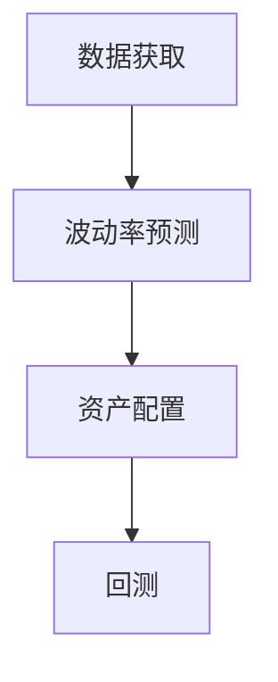

                 


```markdown
# 利用市场波动重新平衡资产配置的策略

## 关键词
市场波动、资产配置、动态调整、投资策略、风险管理、量化分析

## 摘要
本文深入探讨了如何利用市场波动重新平衡资产配置的策略，结合现代投资组合理论、统计套利和量化分析等方法，提出了基于波动率和趋势的动态资产配置模型。通过数学建模、算法设计和系统实现，展示了如何在实际投资中应用这些策略，并通过Python代码实现案例，帮助读者理解和掌握这一策略的核心思想。

---

# 第一部分: 利用市场波动重新平衡资产配置的背景与基础

## 第1章: 市场波动与资产配置概述

### 1.1 市场波动的定义与特征
#### 1.1.1 市场波动的定义
市场波动是指资产价格在短时间内出现显著变化的现象，通常由市场参与者的预期变化、经济数据发布或突发事件引发。波动率是衡量市场波动程度的重要指标，通常用标准差或方差来表示。

#### 1.1.2 市场波动的主要特征
- **随机性**：市场波动往往具有随机性，难以准确预测。
- **周期性**：市场波动通常表现出一定的周期性，如牛熊交替。
- **放大性**：市场波动可能会因杠杆效应而放大。

#### 1.1.3 市场波动的分类与度量
市场波动可以分为短期波动和长期波动。短期波动通常由交易情绪和市场参与者的短期行为引起，而长期波动则与经济基本面和结构性变化相关。波动率的度量方法包括历史波动率、隐含波动率和预测波动率。

### 1.2 资产配置的基本原理
#### 1.2.1 资产配置的定义
资产配置是指将资金分配到不同的资产类别（如股票、债券、 commodities等）中，以实现风险和收益的平衡。

#### 1.2.2 资产配置的主要类型
- **静态资产配置**：根据市场环境不变的假设，固定资产配置比例。
- **动态资产配置**：根据市场波动和经济环境的变化，实时调整资产配置比例。

#### 1.2.3 资产配置的目标与意义
资产配置的目标是通过分散投资降低风险，同时追求最大化的收益。动态资产配置能够根据市场波动进行调整，提高投资组合的适应性和收益能力。

### 1.3 市场波动对资产配置的影响
#### 1.3.1 市场波动对投资组合的影响
市场波动会导致投资组合的收益和风险发生变化。在波动率较高的市场环境下，投资组合的风险会显著增加，而收益的不确定性也会提高。

#### 1.3.2 资产配置在市场波动中的作用
资产配置通过分散投资可以降低市场波动对投资组合的影响。动态资产配置能够在市场波动加剧时降低风险敞口，在市场波动减弱时增加收益。

#### 1.3.3 动态资产配置的必要性
在市场波动剧烈的环境下，静态资产配置往往无法满足投资者的风险收益目标。动态资产配置能够根据市场环境的变化进行实时调整，提高投资组合的灵活性和适应性。

### 1.4 本章小结
本章介绍了市场波动的定义、特征和度量方法，以及资产配置的基本原理和目标。重点阐述了市场波动对资产配置的影响，强调了动态资产配置的必要性。

---

## 第2章: 市场波动的分析与预测

### 2.1 市场波动的分析方法
#### 2.1.1 技术分析方法
技术分析通过研究价格和成交量的历史数据，预测未来的价格走势。常用的技术指标包括移动平均线、相对强弱指数（RSI）、MACD等。

#### 2.1.2 基本面分析方法
基本面分析通过研究公司的财务状况、行业前景和宏观经济指标，评估资产的内在价值。常用的指标包括市盈率（P/E）、市净率（P/B）等。

#### 2.1.3 统计套利与量化分析
统计套利通过寻找资产价格的短期偏差，利用套利机会进行投资。量化分析则通过数学模型和算法，对市场波动进行预测和交易。

### 2.2 市场波动预测的理论基础
#### 2.2.1 时间序列分析
时间序列分析通过研究历史数据的序列特征，预测未来的市场波动。常用的方法包括ARIMA模型和GARCH模型。

#### 2.2.2 随机过程与概率论
市场波动可以看作是一个随机过程，概率论为预测市场波动提供了理论基础。常用的概率分布包括正态分布和t分布。

#### 2.2.3 预测模型的构建与评估
预测模型的构建需要选择合适的数据、模型和参数。评估模型的准确性通常使用均方误差（MSE）、平均绝对误差（MAE）等指标。

### 2.3 市场波动预测的实践应用
#### 2.3.1 常见的波动率预测模型
- **GARCH模型**：用于预测金融资产的波动率。
- **ARCH模型**：与GARCH模型类似，但仅考虑近期波动的影响。
- **SV模型**：通过状态空间模型预测波动率。

#### 2.3.2 模型的优缺点分析
GARCH模型能够捕捉到波动率的聚集性，但可能无法捕捉到极端市场波动。SV模型具有较高的灵活性，但参数估计较为复杂。

#### 2.3.3 实际案例分析
以股票市场为例，通过历史数据训练GARCH模型，预测未来的波动率，并根据波动率的变化调整资产配置比例。

### 2.4 本章小结
本章介绍了市场波动的分析方法，包括技术分析、基本面分析和量化分析。重点阐述了市场波动预测的理论基础和实践应用，分析了常见预测模型的优缺点。

---

## 第3章: 资产配置策略的核心概念

### 3.1 现代投资组合理论（MPT）
#### 3.1.1 MPT的基本假设
MPT假设投资者是理性的，市场是有效的，且资产收益服从正态分布。

#### 3.1.2 投资组合理论的数学模型
现代投资组合理论通过优化资产配置，使得在给定风险水平下收益最大化，或者在给定收益水平下风险最小化。其数学模型如下：

$$
\text{目标函数：} \min_w \sigma^2 \quad \text{约束条件：} \sum_{i=1}^n w_i = 1, \quad \sum_{i=1}^n w_i r_i = R
$$

其中，\( w_i \) 是资产 \( i \) 的权重，\( r_i \) 是资产 \( i \) 的预期收益，\( R \) 是目标收益。

#### 3.1.3 有效前沿的概念与应用
有效前沿是指在给定风险水平下，能够提供最高收益的所有资产组合的集合。投资者可以通过选择位于有效前沿上的组合来实现最优资产配置。

### 3.2 风险与收益的平衡
#### 3.2.1 风险的度量方法
风险通常通过标准差或最大回撤来衡量。标准差反映了资产收益的波动性，而最大回撤则衡量了资产在特定时间段内的最大损失。

#### 3.2.2 收益与风险的权衡
投资者需要在收益和风险之间进行权衡。通常，高风险资产能够提供更高的收益，而低风险资产的收益较低。

#### 3.2.3 夏普比率与特雷纳比率
夏普比率衡量的是资产组合的风险调整后收益，计算公式为：

$$
\text{夏普比率} = \frac{R_p - R_f}{\sigma_p}
$$

其中，\( R_p \) 是组合的预期收益，\( R_f \) 是无风险利率，\( \sigma_p \) 是组合收益的标准差。

特雷纳比率则是比较组合与市场收益的差异，计算公式为：

$$
\text{特雷纳比率} = \frac{R_p - R_m}{\beta_p}
$$

其中，\( R_m \) 是市场预期收益，\( \beta_p \) 是组合的贝塔系数。

### 3.3 资产配置的动态调整
#### 3.3.1 动态资产配置的定义
动态资产配置是指根据市场环境的变化，实时调整资产配置比例。

#### 3.3.2 动态调整的触发条件
通常，动态调整的触发条件包括市场波动加剧、经济指标变化、突发事件等。

#### 3.3.3 动态调整的实施步骤
动态资产配置的实施步骤包括：
1. 监测市场环境，识别波动加剧的信号。
2. 重新评估各资产类别的风险收益比。
3. 调整资产配置比例，降低高风险资产的权重，增加低风险资产的权重。

### 3.4 本章小结
本章重点介绍了现代投资组合理论的核心概念，包括有效前沿、夏普比率和特雷纳比率。同时，阐述了动态资产配置的定义、触发条件和实施步骤。

---

## 第4章: 利用市场波动进行资产配置的策略模型

### 4.1 基于波动率的资产配置模型
#### 4.1.1 波动率驱动的配置策略
基于波动率的配置策略通过调整资产权重来应对市场波动。在波动率上升时，降低高波动资产的权重；在波动率下降时，增加高波动资产的权重。

#### 4.1.2 波动率与资产权重的关系
资产权重通常与波动率呈负相关关系，即波动率越高，权重越低。

#### 4.1.3 波动率变化对配置的影响
波动率的变化会导致投资组合的风险变化，从而影响资产配置比例。

### 4.2 基于市场趋势的资产配置模型
#### 4.2.1 趋势识别的原理
趋势识别通过技术分析方法，识别市场的上升或下降趋势。常用的趋势指标包括移动平均线和相对强弱指数。

#### 4.2.2 趋势与资产配置的关系
在上升趋势中，增加高风险资产的权重；在下降趋势中，增加低风险资产的权重。

#### 4.2.3 趋势变化对配置的影响
趋势的变化会导致市场环境的变化，从而影响资产配置比例。

### 4.3 基于量化策略的资产配置模型
#### 4.3.1 均值-方差优化模型
均值-方差优化模型通过优化资产配置比例，使得在给定风险下收益最大化。其数学模型如下：

$$
\text{目标函数：} \max_w \mu^T w \quad \text{约束条件：} \sum_{i=1}^n w_i = 1, \quad w^T \Sigma w = \sigma^2
$$

其中，\( \mu \) 是资产收益的均值向量，\( \Sigma \) 是收益的协方差矩阵，\( \sigma^2 \) 是目标风险。

#### 4.3.2 风险平价模型
风险平价模型通过调整资产权重，使得各资产对组合风险的贡献相等。其权重计算公式为：

$$
w_i = \frac{\sigma_i}{\sum_{j=1}^n \sigma_j}
$$

其中，\( \sigma_i \) 是资产 \( i \) 的波动率。

#### 4.3.3 多因子模型
多因子模型通过考虑多个风险因子，进行资产配置。常用的风险因子包括市值因子、价值因子、动量因子等。

### 4.4 本章小结
本章介绍了几种基于市场波动的资产配置模型，包括波动率驱动模型、趋势驱动模型和量化策略模型。重点阐述了均值-方差优化和风险平价模型的原理和应用。

---

## 第5章: 系统设计与实现

### 5.1 系统架构设计
#### 5.1.1 系统功能模块
- 数据获取模块：从数据源获取历史价格和市场数据。
- 波动率预测模块：基于历史数据预测未来波动率。
- 资产配置模块：根据波动率和市场趋势，调整资产配置比例。
- 回测模块：对策略进行历史数据回测，评估策略的有效性。

#### 5.1.2 系统架构图


### 5.2 数据获取与预处理
#### 5.2.1 数据源选择
常用的数据源包括Yahoo Finance、Quandl和 Bloomberg。

#### 5.2.2 数据清洗与标准化
数据清洗包括处理缺失值和异常值。标准化通常采用Z-score标准化。

### 5.3 波动率预测与资产配置
#### 5.3.1 波动率预测模型实现
使用Python的scikit-learn库实现GARCH模型。

#### 5.3.2 资产配置策略实现
根据波动率预测结果，调整资产配置比例。例如，在波动率上升时，减少股票权重，增加债券权重。

### 5.4 系统实现代码
```python
import pandas as pd
import numpy as np
from sklearn.metrics import mean_squared_error

# 数据获取
def get_data(ticker, start, end):
    df = pd.read_csv(f'data/{ticker}.csv')
    df['Date'] = pd.to_datetime(df['Date'])
    df.set_index('Date', inplace=True)
    df = df.loc[start:end]
    return df

# 波动率预测
def predict_volatility(df, window=30):
    log_returns = np.log(df['Close'].pct_change().dropna())
    rolling_var = log_returns.rolling(window).var()
    predicted_vol = np.sqrt(rolling_var)
    return predicted_vol

# 资产配置
def dynamic_asset_allocation(predicted_vol, weights):
    # 根据波动率调整权重
    adjusted_weights = weights * (1 - predicted_vol)
    adjusted_weights = adjusted_weights / adjusted_weights.sum()
    return adjusted_weights

# 系统实现
def main():
    start_date = '2020-01-01'
    end_date = '2022-12-31'
    df_stock = get_data('AAPL', start_date, end_date)
    df_bond = get_data('TSLA', start_date, end_date)
    
    # 计算波动率
    vol_stock = predict_volatility(df_stock)
    vol_bond = predict_volatility(df_bond)
    
    # 初始权重
    initial_weights = [0.5, 0.5]
    
    # 动态调整权重
    adjusted_weights = dynamic_asset_allocation([vol_stock[-1], vol_bond[-1]], initial_weights)
    
    print("Adjusted Weights:", adjusted_weights)

if __name__ == "__main__":
    main()
```

### 5.5 系统测试与优化
通过历史数据回测，评估系统的表现。优化包括调整波动率预测模型和资产配置策略的参数。

### 5.6 本章小结
本章详细介绍了系统设计与实现，包括数据获取、波动率预测、资产配置和系统实现。通过Python代码展示了系统的具体实现过程。

---

## 第6章: 实战案例分析与策略优化

### 6.1 实战案例分析
#### 6.1.1 案例背景
以股票和债券为例，分析市场波动对资产配置的影响。

#### 6.1.2 数据分析与回测
使用历史数据回测波动率驱动的资产配置策略，评估其在不同市场环境下的表现。

#### 6.1.3 策略优化
通过调整权重和模型参数，优化策略的表现。

### 6.2 策略优化与改进
#### 6.2.1 参数优化
通过网格搜索或随机搜索优化波动率预测模型的参数。

#### 6.2.2 模型优化
引入机器学习方法，如支持向量机（SVM）和随机森林，提高波动率预测的准确性。

#### 6.2.3 策略组合优化
结合多种策略，如动量策略和价值策略，提高资产配置的收益风险比。

### 6.3 本章小结
本章通过实战案例分析，展示了如何利用市场波动进行资产配置。通过策略优化和改进，提高了策略的有效性。

---

## 第7章: 总结与展望

### 7.1 总结
本文深入探讨了如何利用市场波动重新平衡资产配置的策略，结合现代投资组合理论和量化分析方法，提出了基于波动率和趋势的动态资产配置模型。通过Python代码实现了系统的具体实现，展示了策略的有效性。

### 7.2 展望
未来的研究方向包括：
1. 引入机器学习方法，提高波动率预测的准确性。
2. 结合多因子模型，优化资产配置策略。
3. 研究市场的非理性行为，探索行为金融学对资产配置的影响。

### 7.3 注意事项
- 波动率预测模型的准确性直接影响资产配置的效果，需要定期更新和优化。
- 动态资产配置需要实时监测市场环境，及时调整配置比例。
- 投资者应根据自身的风险承受能力和收益目标，选择合适的资产配置策略。

### 7.4 拓展阅读
- 《投资学》（ Investments ）——理查德·A·阿斯沃斯
- 《算法交易：像量化投资一样思考》——罗德里克·凯贝

---

## 作者：AI天才研究院/AI Genius Institute & 禅与计算机程序设计艺术 /Zen And The Art of Computer Programming

---

**版权声明：**
本文版权归作者所有，未经授权，不得转载。如需转载请注明出处。
```

