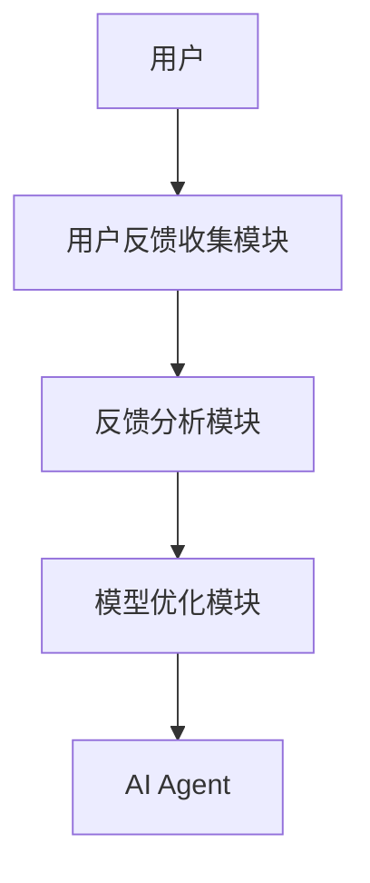
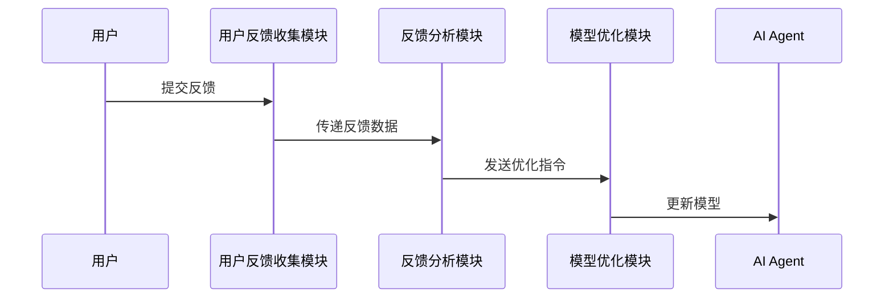
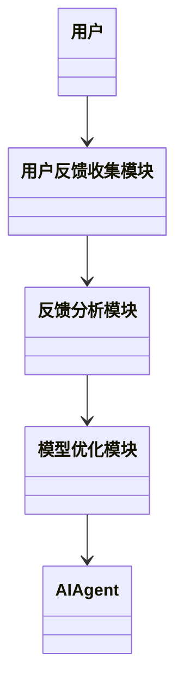

                 


# 利用用户反馈改进AI Agent的方法

## 关键词：用户反馈，AI Agent，强化学习，监督学习，系统架构，项目实战

## 摘要：本文探讨了如何利用用户反馈改进AI Agent的方法，涵盖反馈的类型与收集、分析与处理算法、系统架构设计、项目实战与案例分析。通过详细讲解强化学习和监督学习等算法，结合系统架构设计和实际项目案例，展示了如何有效利用用户反馈提升AI Agent的性能和用户体验。

---

# 第1章: 用户反馈与AI Agent概述

## 1.1 用户反馈的定义与分类
### 1.1.1 用户反馈的定义
用户反馈是指用户在与AI Agent交互过程中提供的意见、评价或行为数据，用于帮助AI Agent改进其性能和用户体验。

### 1.1.2 用户反馈的类型
用户反馈可以分为以下几类：
- **主动反馈**：用户主动提供的评价或意见，例如评分、评论。
- **被动反馈**：用户在使用过程中产生的行为数据，例如点击、停留时间。

### 1.1.3 用户反馈在AI Agent中的作用
用户反馈可以帮助AI Agent理解用户需求、优化算法、提升用户体验。

---

## 1.2 AI Agent的基本概念
### 1.2.1 AI Agent的定义
AI Agent是一种能够感知环境并采取行动以实现目标的智能实体。

### 1.2.2 AI Agent的核心功能
- 感知环境
- 采取行动
- 学习优化

### 1.2.3 AI Agent与传统程序的区别
AI Agent具有自主性、反应性、目标导向性和社会性。

---

## 1.3 用户反馈在AI Agent改进中的重要性
### 1.3.1 用户反馈对AI Agent性能的提升作用
用户反馈可以用于训练模型，提升AI Agent的准确性。

### 1.3.2 用户反馈对用户体验的影响
通过用户反馈，可以优化AI Agent的交互方式，提升用户满意度。

### 1.3.3 用户反馈在AI Agent迭代中的应用
用户反馈是AI Agent持续改进的重要依据。

---

## 1.4 本章小结
本章介绍了用户反馈的定义、分类及其在AI Agent改进中的重要性。

---

# 第2章: 用户反馈的类型与收集方法

## 2.1 主动反馈与被动反馈
### 2.1.1 主动反馈的定义与特点
主动反馈是指用户主动提供的意见或评价，例如通过问卷调查或直接评论。

### 2.1.2 被动反馈的定义与特点
被动反馈是指用户在使用过程中产生的行为数据，例如点击次数、停留时间。

### 2.1.3 主动反馈与被动反馈的对比分析
主动反馈更具主观性，而被动反馈更具客观性。

---

## 2.2 用户反馈的收集渠道
### 2.2.1 界面反馈
通过界面向用户收集反馈，例如评分按钮、反馈表单。

### 2.2.2 调查问卷
通过问卷调查的方式收集用户对AI Agent的评价。

### 2.2.3 用户日志
通过记录用户的行为数据，分析用户的使用习惯和偏好。

---

## 2.3 用户反馈的质量评估
### 2.3.1 反馈的完整性评估
确保反馈数据包含足够的信息。

### 2.3.2 反馈的准确性评估
确保反馈数据能够准确反映用户的真实需求。

### 2.3.3 反馈的相关性评估
确保反馈数据与AI Agent的改进目标相关。

---

## 2.4 本章小结
本章介绍了用户反馈的类型与收集方法，并探讨了如何评估反馈的质量。

---

# 第3章: 基于用户反馈的改进算法

## 3.1 反馈驱动的强化学习
### 3.1.1 强化学习的基本原理
强化学习是一种通过试错方式学习策略的方法，通过奖励机制优化行为。

### 3.1.2 反馈在强化学习中的应用
用户反馈可以作为奖励信号，指导AI Agent的学习方向。

### 3.1.3 基于反馈的Q-learning算法
- **Q-learning公式**：
  $$ Q(s, a) = Q(s, a) + \alpha (r + \gamma \max Q(s', a') - Q(s, a)) $$
- **反馈应用**：用户反馈作为奖励信号，用于更新Q值。

---

## 3.2 反馈驱动的监督学习
### 3.2.1 监督学习的基本原理
监督学习通过训练数据学习输入与输出之间的关系。

### 3.2.2 反馈在监督学习中的应用
用户反馈可以作为标签，用于训练模型。

### 3.2.3 基于反馈的线性回归模型
- **线性回归公式**：
  $$ y = \beta_0 + \beta_1 x + \epsilon $$
- **反馈应用**：通过用户反馈调整参数，优化模型预测。

---

## 3.3 反馈驱动的模型优化
### 3.3.1 模型优化的基本原理
模型优化通过调整参数，提升模型性能。

### 3.3.2 反馈在模型优化中的应用
用户反馈用于评估模型性能，指导优化方向。

### 3.3.3 基于反馈的梯度下降算法
- **梯度下降公式**：
  $$ \theta = \theta - \eta \nabla J(\theta) $$
- **反馈应用**：用户反馈用于计算损失函数，指导参数更新。

---

## 3.4 本章小结
本章介绍了基于用户反馈的强化学习、监督学习和梯度下降算法，并通过公式和示例详细讲解了其工作原理。

---

# 第4章: 系统架构设计

## 4.1 系统功能模块划分
### 4.1.1 用户反馈收集模块
负责收集用户的反馈数据。

### 4.1.2 反馈分析模块
对用户反馈进行分析，提取有用信息。

### 4.1.3 模型优化模块
根据反馈结果优化AI Agent的模型。

---

## 4.2 系统架构图


---

## 4.3 系统接口设计
### 4.3.1 用户反馈接口
定义用户反馈的输入格式和接口调用方式。

### 4.3.2 模型优化接口
定义模型优化的参数和接口调用方式。

---

## 4.4 系统交互流程


---

## 4.5 本章小结
本章详细介绍了系统架构设计，包括功能模块划分、系统架构图和系统交互流程。

---

# 第5章: 项目实战

## 5.1 项目需求分析
### 5.1.1 项目背景
以医疗咨询AI Agent为例，探讨如何利用用户反馈改进其性能。

### 5.1.2 项目目标
提升AI Agent的诊断准确性和用户体验。

---

## 5.2 系统功能设计
### 5.2.1 领域模型


---

## 5.3 系统架构设计
### 5.3.1 系统架构图
```mermaid
graph TD
    用户 --> 用户反馈收集模块
    用户反馈收集模块 --> 反馈分析模块
    反馈分析模块 --> 模型优化模块
    模型优化模块 --> AI Agent
```

---

## 5.4 代码实现与分析
### 5.4.1 环境安装
安装Python、TensorFlow等工具。

### 5.4.2 核心代码实现
```python
import tensorflow as tf

# 定义模型
model = tf.keras.Sequential([
    tf.keras.layers.Dense(64, activation='relu'),
    tf.keras.layers.Dense(1, activation='sigmoid')
])

# 定义损失函数和优化器
model.compile(loss='binary_crossentropy', optimizer='adam', metrics=['accuracy'])

# 训练模型
model.fit(X_train, y_train, epochs=10, batch_size=32)
```

---

## 5.5 项目小结
本章通过医疗咨询AI Agent的案例，展示了如何利用用户反馈改进AI Agent的性能和用户体验。

---

# 第6章: 总结与最佳实践

## 6.1 总结
用户反馈是改进AI Agent的重要手段，通过有效的反馈收集和分析，可以显著提升AI Agent的性能和用户体验。

## 6.2 最佳实践
- 定期收集用户反馈，持续优化AI Agent。
- 使用多种反馈收集渠道，确保数据的全面性。
- 在模型优化中，结合强化学习和监督学习，提升性能。

## 6.3 小结
本章总结了全文，并提出了几点最佳实践建议。

---

# 作者：AI天才研究院 & 禅与计算机程序设计艺术

