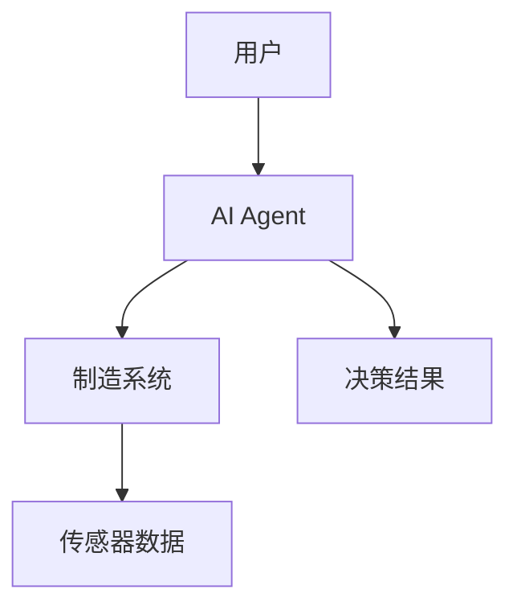
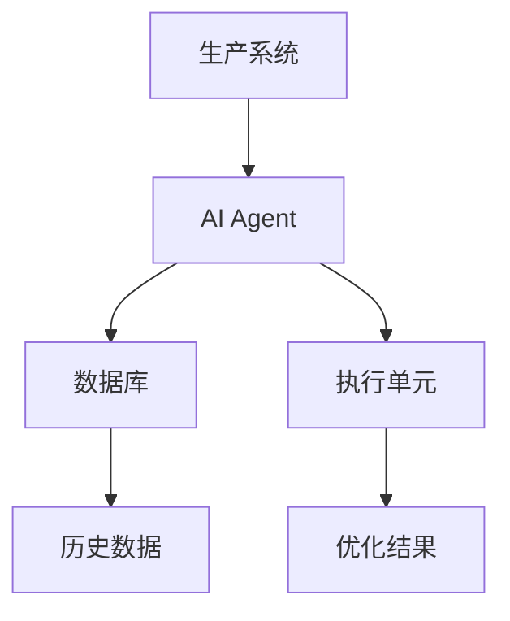
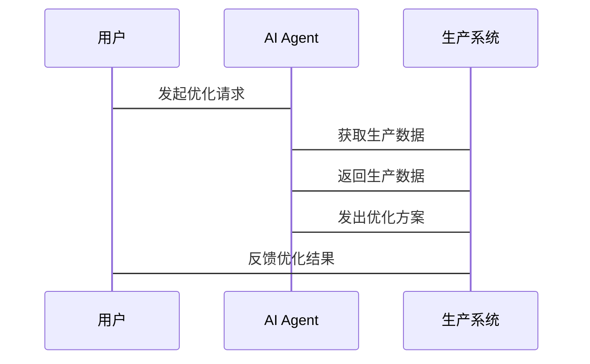

                 


---

# 制造业中AI Agent的实践案例

> **关键词**: AI Agent, 制造业, 强化学习, 监督学习, 系统架构, 实践案例

> **摘要**: 本文详细探讨了AI Agent在制造业中的应用，从背景介绍、核心概念到算法原理、系统架构，再到项目实战，全面分析了AI Agent在制造业中的实际应用场景和价值。通过具体案例和最佳实践，展示了如何将AI Agent技术应用于制造系统的优化与智能化转型。

---

# 第一部分: 制造业中AI Agent的背景与核心概念

## 第1章: 制造业中的AI Agent概述

### 1.1 AI Agent的基本概念

#### 1.1.1 什么是AI Agent

AI Agent（人工智能代理）是一种能够感知环境并采取行动以实现目标的智能实体。在制造业中，AI Agent可以是软件系统或物理设备，用于优化生产流程、提高效率并降低资源浪费。

#### 1.1.2 AI Agent的核心特征

AI Agent具有以下核心特征：

1. **自主性**: AI Agent能够自主决策和行动，无需人工干预。
2. **反应性**: 能够实时感知环境变化并做出反应。
3. **目标导向**: 具备明确的目标，并采取行动以实现这些目标。
4. **学习能力**: 能够通过经验或数据优化自身行为。

#### 1.1.3 制造业中的AI Agent应用场景

在制造业中，AI Agent可以应用于以下场景：

1. **生产优化**: 优化生产流程，减少资源浪费。
2. **质量控制**: 实时监控生产过程，检测并纠正缺陷。
3. **设备维护**: 预测设备故障，安排维护计划。
4. **供应链管理**: 优化供应链流程，确保物料及时供应。

---

### 1.2 制造业的现状与挑战

#### 1.2.1 制造业的传统生产模式

传统制造业以人工操作和固定流程为主，生产效率较低，且难以适应市场需求的变化。

#### 1.2.2 当前制造业面临的痛点

1. **生产效率低下**: 人工操作效率低，难以满足大规模生产需求。
2. **资源浪费**: 生产过程中材料、能源浪费严重。
3. **质量不稳定**: 人工操作可能导致产品质量波动。
4. **设备维护成本高**: 设备故障可能导致停产，维修成本高昂。

#### 1.2.3 AI技术在制造业中的潜力

AI技术可以帮助制造业实现智能化转型，通过AI Agent优化生产流程、降低成本、提高效率。

---

### 1.3 AI Agent在制造业中的问题背景

#### 1.3.1 制造业智能化转型的需求

随着市场竞争加剧，制造业需要通过智能化转型提高效率、降低成本。

#### 1.3.2 AI Agent在制造业中的问题描述

1. **数据孤岛**: 制造业各环节数据分散，难以整合。
2. **系统复杂性**: 制造业系统复杂，AI Agent需要与多种系统对接。
3. **实时性要求高**: AI Agent需要实时处理数据并做出决策。

#### 1.3.3 AI Agent如何解决这些问题

AI Agent可以通过整合数据、优化决策流程，解决制造业中的复杂问题。

---

### 1.4 AI Agent的核心概念与边界

#### 1.4.1 AI Agent的定义与核心要素

AI Agent是一种智能实体，具备以下核心要素：

1. **感知**: 通过传感器或数据源获取环境信息。
2. **决策**: 根据感知信息做出决策。
3. **行动**: 执行决策以实现目标。

#### 1.4.2 AI Agent的边界与外延

AI Agent的边界包括其感知范围、决策范围和行动范围。外延则包括与AI Agent交互的其他系统和设备。

#### 1.4.3 AI Agent与相关技术的对比

以下表格对比了AI Agent与其他相关技术的核心区别：

| 技术          | 核心特点               | 应用场景                     |
|---------------|-----------------------|------------------------------|
| AI Agent      | 自主决策、目标导向     | 制造业优化、质量控制         |
| 机器学习      | 数据驱动、模式识别     | 预测分析、分类任务           |
| 自动化系统     | 程序化操作             | 自动化生产、设备控制           |

---

## 第2章: AI Agent的核心原理

### 2.1 AI Agent的原理概述

#### 2.1.1 AI Agent的基本工作流程

AI Agent的工作流程包括以下步骤：

1. **感知环境**: 通过传感器或数据源获取环境信息。
2. **分析数据**: 对感知到的数据进行分析和处理。
3. **做出决策**: 根据分析结果制定行动方案。
4. **执行行动**: 执行决策以实现目标。

#### 2.1.2 AI Agent的感知与决策机制

AI Agent的感知机制包括传感器数据采集和数据分析。决策机制基于强化学习或监督学习算法。

#### 2.1.3 AI Agent的学习与优化

AI Agent通过强化学习或监督学习算法不断优化自身的决策能力。

---

### 2.2 AI Agent的核心算法与模型

#### 2.2.1 强化学习算法

强化学习是一种通过试错机制优化决策的算法。以下是强化学习的基本流程：

1. **环境感知**: 获取当前环境状态。
2. **决策选择**: 根据当前状态选择一个行动。
3. **执行行动**: 执行选择的行动。
4. **奖励反馈**: 根据行动结果获得奖励或惩罚。
5. **更新策略**: 根据奖励更新决策策略。

#### 2.2.2 监督学习算法

监督学习是一种基于标记数据进行分类或回归的算法。以下是监督学习的基本流程：

1. **数据收集**: 收集带标签的数据。
2. **特征提取**: 提取数据的特征。
3. **模型训练**: 使用训练数据训练模型。
4. **模型预测**: 使用模型对新数据进行预测。

#### 2.2.3 混合学习算法

混合学习算法结合了强化学习和监督学习的优势，适用于复杂环境下的决策问题。

---

### 2.3 AI Agent的实体关系图



---

## 2.4 本章小结

本章介绍了AI Agent的核心原理，包括其工作流程、感知与决策机制、学习与优化方法，以及核心算法与模型。

---

# 第二部分: AI Agent的算法原理与数学模型

## 第3章: AI Agent的核心算法

### 3.1 强化学习算法

#### 3.1.1 强化学习的基本原理

强化学习通过试错机制优化决策，主要由以下几个部分组成：

1. **状态空间**: 环境的所有可能状态。
2. **动作空间**: 可以执行的所有动作。
3. **奖励函数**: 衡量动作好坏的函数。
4. **策略**: 决策规则，将状态映射到动作。

#### 3.1.2 Q-Learning算法

Q-Learning是一种经典的强化学习算法，适用于离散状态和动作空间。其核心公式为：

$$ Q(s, a) = Q(s, a) + \alpha [r + \gamma \max Q(s', a) - Q(s, a)] $$

其中：
- \( Q(s, a) \) 表示状态 \( s \) 下执行动作 \( a \) 的价值。
- \( \alpha \) 是学习率。
- \( r \) 是奖励值。
- \( \gamma \) 是折扣因子。
- \( s' \) 是下一个状态。

#### 3.1.3 实际案例分析

假设我们有一个简单的生产优化问题，AI Agent的目标是通过调整生产参数来最小化生产成本。以下是具体步骤：

1. **状态空间**: 生产参数的当前值。
2. **动作空间**: 调整生产参数的可能动作。
3. **奖励函数**: 成本降低的幅度。
4. **策略**: 根据当前状态选择最优动作。

通过不断试错，AI Agent能够找到最优的生产参数组合，从而实现成本最小化。

---

### 3.2 监督学习算法

#### 3.2.1 监督学习的基本原理

监督学习基于标记数据进行分类或回归。以下是监督学习的基本流程：

1. **数据收集**: 收集带标签的数据。
2. **特征提取**: 提取数据的特征。
3. **模型训练**: 使用训练数据训练模型。
4. **模型预测**: 使用模型对新数据进行预测。

#### 3.2.2 线性回归模型

线性回归是一种常用的回归算法，其数学模型为：

$$ y = \beta_0 + \beta_1 x + \epsilon $$

其中：
- \( y \) 是目标变量。
- \( x \) 是自变量。
- \( \beta_0 \) 和 \( \beta_1 \) 是回归系数。
- \( \epsilon \) 是误差项。

#### 3.2.3 实际案例分析

假设我们有一个质量控制问题，AI Agent的目标是通过历史数据预测产品质量。以下是具体步骤：

1. **数据收集**: 收集生产过程中的各种参数和最终产品质量数据。
2. **特征提取**: 提取与产品质量相关的特征。
3. **模型训练**: 使用训练数据训练线性回归模型。
4. **模型预测**: 使用模型预测新产品的质量。

---

### 3.3 混合学习算法

#### 3.3.1 混合学习的基本原理

混合学习结合了强化学习和监督学习的优势，适用于复杂环境下的决策问题。

#### 3.3.2 混合学习的数学模型

混合学习模型可以通过以下公式表示：

$$ Q(s, a) = Q(s, a) + \alpha [r + \gamma \max Q(s', a) - Q(s, a)] $$

其中：
- \( Q(s, a) \) 表示状态 \( s \) 下执行动作 \( a \) 的价值。
- \( \alpha \) 是学习率。
- \( r \) 是奖励值。
- \( \gamma \) 是折扣因子。
- \( s' \) 是下一个状态。

---

## 3.4 本章小结

本章详细介绍了AI Agent的核心算法，包括强化学习、监督学习和混合学习的原理、数学模型和实际案例。

---

# 第三部分: AI Agent的系统分析与架构设计

## 第4章: AI Agent的系统分析

### 4.1 项目背景介绍

假设我们有一个汽车制造企业，希望优化其生产流程。AI Agent的目标是通过实时监控生产过程，优化生产参数，降低成本。

---

### 4.2 系统功能设计

以下是AI Agent系统的功能设计：

1. **数据采集**: 实时采集生产过程中的各种参数。
2. **数据分析**: 对采集到的数据进行分析和处理。
3. **决策制定**: 根据分析结果制定优化方案。
4. **执行控制**: 执行优化方案并实时反馈结果。

---

### 4.3 系统架构设计

以下是AI Agent系统的架构设计：



---

### 4.4 系统接口设计

以下是AI Agent系统的接口设计：

1. **数据接口**: 与传感器和数据库对接。
2. **决策接口**: 与生产系统对接。
3. **反馈接口**: 与执行单元对接。

---

### 4.5 系统交互设计

以下是AI Agent系统的交互流程：



---

## 4.6 本章小结

本章通过实际案例分析，详细设计了AI Agent系统的功能、架构、接口和交互流程。

---

# 第四部分: AI Agent的项目实战

## 第5章: AI Agent的项目实战

### 5.1 环境安装与配置

以下是项目所需的环境和工具：

1. **编程语言**: Python 3.8+
2. **深度学习框架**: TensorFlow/PyTorch
3. **开发工具**: VS Code/Jupyter Notebook
4. **数据存储**: MySQL/PostgreSQL

---

### 5.2 系统核心实现

以下是AI Agent系统的核心代码实现：

```python
import numpy as np
import pandas as pd
import tensorflow as tf

# 数据加载
data = pd.read_csv('production_data.csv')

# 数据预处理
X = data.iloc[:, :-1].values
y = data.iloc[:, -1].values

# 模型训练
model = tf.keras.Sequential([
    tf.keras.layers.Dense(64, activation='relu'),
    tf.keras.layers.Dense(1, activation='linear')
])

model.compile(optimizer='adam', loss='mean_squared_error')

model.fit(X, y, epochs=100, batch_size=32)

# 模型预测
predictions = model.predict(X)
```

---

### 5.3 代码解读与分析

1. **数据加载**: 使用 `pd.read_csv` 加载生产数据。
2. **数据预处理**: 提取特征和目标变量。
3. **模型训练**: 使用神经网络模型训练AI Agent。
4. **模型预测**: 使用训练好的模型预测优化方案。

---

### 5.4 实际案例分析

假设我们有一个电子制造企业，AI Agent的目标是优化焊接流程。以下是具体步骤：

1. **数据采集**: 采集焊接过程中的温度、压力等参数。
2. **数据分析**: 分析数据，找出影响焊接质量的关键因素。
3. **模型训练**: 使用强化学习算法训练AI Agent。
4. **模型预测**: 使用AI Agent优化焊接参数。

---

### 5.5 项目小结

通过本项目，我们展示了如何将AI Agent技术应用于实际制造场景，优化生产流程，降低成本。

---

# 第五部分: 总结与附录

## 第6章: 总结与展望

### 6.1 本章小结

AI Agent在制造业中的应用前景广阔，能够显著提高生产效率、降低成本并优化资源利用。

### 6.2 未来展望

随着AI技术的不断发展，AI Agent在制造业中的应用将更加广泛和深入，未来可能会出现更加智能和自适应的AI Agent系统。

---

## 附录

### 附录A: 参考文献

1. Deep Learning, Ian Goodfellow, Yoshua Bengio, Aaron Courville, 2016
2. Reinforcement Learning: Theory and Algorithms, Richard S. Sutton, Andrew G. Barto, 2020

### 附录B: 工具与库

1. Python: https://www.python.org/
2. TensorFlow: https://www.tensorflow.org/
3. Mermaid: https://mermaid-js.github.io/mermaid/

---

## 作者信息

作者：AI天才研究院/AI Genius Institute & 禅与计算机程序设计艺术 /Zen And The Art of Computer Programming

--- 

**说明**: 以上是文章的完整目录和内容结构，您可以根据实际需求调整各个部分的详细内容。

