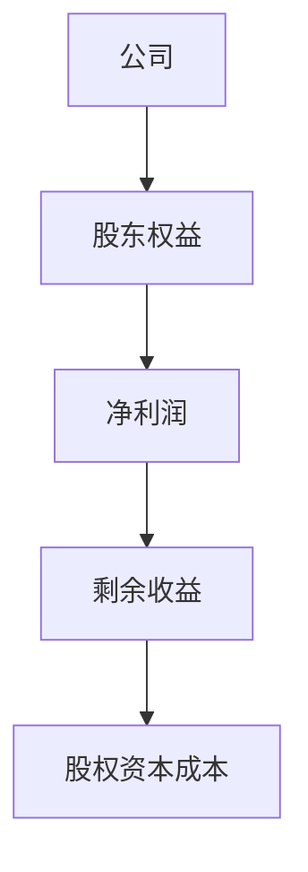
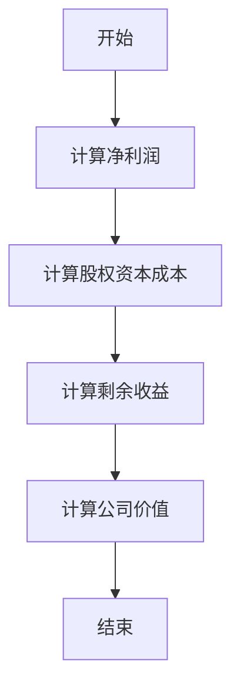
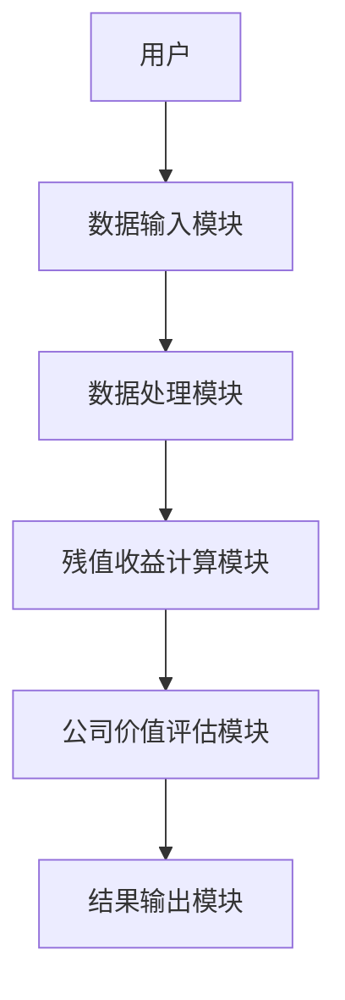

                 


# 剩余收益模型：结合会计信息的公司价值评估

## 关键词：
- 剩余收益模型
- 会计信息
- 公司价值评估
- 股权资本成本
- 财务分析

## 摘要：
剩余收益模型是一种结合会计信息评估公司价值的重要方法，通过分析公司净利润与股权资本成本之间的差异，帮助投资者做出更明智的决策。本文详细探讨了剩余收益模型的背景、核心概念、算法原理、数学模型、系统架构设计、项目实战以及最佳实践，为读者提供了全面的理解和应用指南。

---

## 第一部分：剩余收益模型的背景与核心概念

### 第1章：剩余收益模型的背景介绍

#### 1.1 剩余收益模型的起源与发展
剩余收益模型起源于20世纪70年代，由著名财务学家詹姆斯·斯科特提出。该模型旨在解决传统公司价值评估方法的局限性，特别是在处理会计信息和股权资本成本方面。随着金融理论的发展，剩余收益模型不断完善，逐渐成为企业价值评估的重要工具。

**1.1.1 传统公司价值评估方法的局限性**
传统的公司价值评估方法，如股利折现模型和现金流折现模型，存在以下问题：
- 高估或低估公司价值，尤其是在公司盈利不稳定的情况下。
- 忽略了会计信息中的关键因素，如净利润和股东权益。
- 需要复杂的假设和预测，增加了模型的不确定性和计算难度。

**1.1.2 剩余收益模型的提出与演变**
剩余收益模型的提出为公司价值评估提供了新的视角。它通过计算公司净利润与股权资本成本的差异，评估公司的剩余收益，进而得出公司价值。随着对公司价值评估需求的增加，剩余收益模型不断完善，逐渐成为财务分析的重要工具。

**1.1.3 剩余收益模型在现代财务分析中的地位**
在现代财务分析中，剩余收益模型被广泛应用于公司估值、投资决策和财务报表分析。它结合了会计信息和金融市场数据，能够更准确地评估公司的内在价值。

---

#### 1.2 剩余收益模型的核心概念
剩余收益模型的核心概念包括剩余收益、股权资本成本和公司价值评估。

**1.2.1 剩余收益的定义与计算公式**
剩余收益是指公司在扣除股权资本成本后的净利润。计算公式如下：
$$ \text{剩余收益} = \text{净利润} - (\text{股东权益} \times \text{股权资本成本}) $$

**1.2.2 剩余收益模型的适用范围**
剩余收益模型适用于以下情况：
- 公司有稳定的财务数据和清晰的股权结构。
- 股东权益和股权资本成本能够准确计算。
- 公司价值评估需要考虑会计信息和市场因素。

**1.2.3 剩余收益模型与会计信息的关系**
剩余收益模型依赖于财务报表中的净利润和股东权益数据，同时也需要考虑股权资本成本的市场决定因素。通过结合会计信息和市场数据，模型能够更全面地评估公司价值。

---

#### 1.3 剩余收益模型与传统价值评估方法的对比
剩余收益模型与传统方法在多个方面存在差异。

**1.3.1 传统方法的优缺点**
- **优点**：计算简单，适用于初步评估。
- **缺点**：忽略了会计信息的细节，假设过于简化。

**1.3.2 剩余收益模型的独特优势**
- **优势**：结合会计信息和市场数据，评估更准确。
- **劣势**：需要更多的数据和计算步骤。

**1.3.3 两种方法的适用场景与选择**
- 传统方法适用于快速初步评估。
- 剩余收益模型适用于需要详细分析的情况。

---

#### 1.4 剩余收益模型在企业价值评估中的作用
剩余收益模型在企业价值评估中的作用不可忽视。

**1.4.1 企业价值评估的基本框架**
企业价值评估通常包括资产、负债和股东权益的分析。

**1.4.2 剩余收益模型在其中的地位与应用**
剩余收益模型通过分析公司净利润和股东权益，帮助评估公司价值。

**1.4.3 剩余收益模型的局限性与改进方向**
- 局限性：需要准确的股权资本成本数据。
- 改进方向：结合其他评估方法，提高模型的准确性和适用性。

---

## 第2章：剩余收益模型的核心概念与联系

### 2.1 剩余收益模型的核心原理
剩余收益模型的核心原理是通过分析公司净利润与股权资本成本的关系，评估公司的剩余收益和价值。

**2.1.1 剩余收益的计算公式**
$$ \text{剩余收益} = \text{净利润} - (\text{股东权益} \times \text{股权资本成本}) $$

**2.1.2 剩余收益与公司价值的关系**
剩余收益越高，公司价值越高，因为公司能够创造更多的利润，超出股东的期望回报。

---

### 2.2 剩余收益模型与会计信息的结合
剩余收益模型依赖于会计信息，特别是净利润和股东权益数据。

**2.2.1 会计信息在模型中的应用**
- 净利润：财务报表中的核心数据。
- 股东权益：反映公司资本结构的重要指标。

**2.2.2 财务报表数据对模型的影响**
财务报表中的数据准确性直接影响剩余收益的计算结果。

**2.2.3 会计假设与模型假设的关联**
模型假设包括股权资本成本的市场决定因素，与会计假设密切相关。

---

### 2.3 剩余收益模型的实体关系图
以下是一个简单的实体关系图：



---

## 第三部分：剩余收益模型的算法原理与数学模型

## 第3章：剩余收益模型的算法原理

### 3.1 剩余收益模型的计算流程
以下是剩余收益模型的计算流程图：



---

### 3.2 剩余收益模型的Python实现

以下是一个简单的Python代码实现：

```python
def calculate_residual_income(net_income, equity, cost_of_equity):
    residual_income = net_income - (equity * cost_of_equity)
    return residual_income

# 示例数据
net_income = 100  # 净利润
equity = 500      # 股东权益
cost_of_equity = 0.08  # 股权资本成本

result = calculate_residual_income(net_income, equity, cost_of_equity)
print("剩余收益:", result)
```

---

### 3.3 剩余收益模型的数学模型和公式
剩余收益模型的数学模型如下：

$$ \text{剩余收益} = \text{净利润} - (\text{股东权益} \times \text{股权资本成本}) $$

---

## 第四部分：剩余收益模型的系统分析与架构设计

## 第4章：系统分析与架构设计方案

### 4.1 问题场景介绍
公司需要评估其市场价值，以便做出投资决策。

### 4.2 系统功能设计
系统功能包括：
- 数据输入与处理
- 残值收益计算
- 公司价值评估

---

### 4.3 系统架构设计
以下是系统架构图：



---

## 第五部分：剩余收益模型的项目实战

## 第5章：项目实战

### 5.1 环境安装
需要安装Python和相关库。

### 5.2 核心代码实现
以下是一个示例代码：

```python
def calculate_residual_income(net_income, equity, cost_of_equity):
    residual_income = net_income - (equity * cost_of_equity)
    return residual_income

# 示例数据
net_income = 100
equity = 500
cost_of_equity = 0.08

result = calculate_residual_income(net_income, equity, cost_of_equity)
print("剩余收益:", result)
```

---

### 5.3 案例分析与详细讲解
假设某公司净利润为100万元，股东权益为500万元，股权资本成本为8%。

计算过程：
$$ \text{剩余收益} = 100 - (500 \times 0.08) = 100 - 40 = 60 $$

---

## 第六部分：总结与展望

## 第6章：总结与展望

### 6.1 最佳实践 tips
- 确保数据的准确性和完整性。
- 组合使用多种评估方法。

### 6.2 小结
剩余收益模型是一种有效的公司价值评估工具，结合会计信息和市场数据，能够提供准确的评估结果。

### 6.3 注意事项
- 数据来源要可靠。
- 模型假设要合理。

### 6.4 拓展阅读
推荐阅读相关财务分析书籍，深入理解剩余收益模型的应用。

---

## 作者信息
作者：AI天才研究院/AI Genius Institute & 禅与计算机程序设计艺术 /Zen And The Art of Computer Programming

