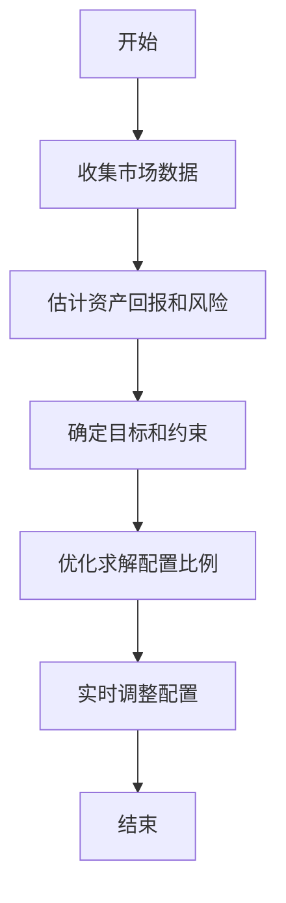
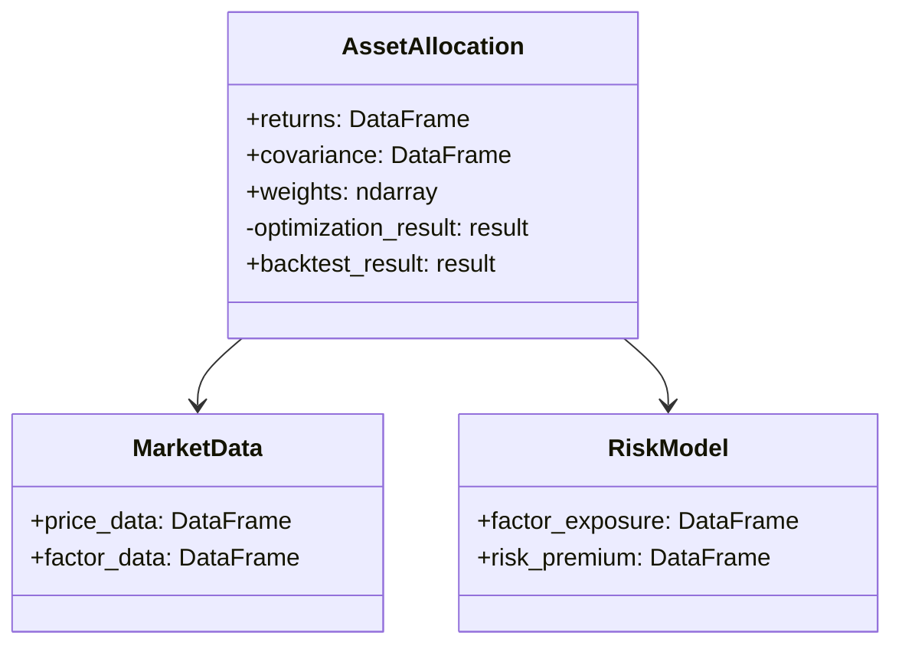

                 


# 动态资产配置：根据市场环境调整投资策略

> 关键词：动态资产配置，投资策略，市场环境，资产组合优化，风险管理

> 摘要：动态资产配置是一种根据市场环境变化调整资产分配的投资策略，旨在优化投资收益与风险。本文深入探讨了动态资产配置的背景、核心概念、算法原理、系统设计与项目实战，通过实例分析和代码实现，为读者提供全面的指导。文章结构清晰，内容详实，适合投资专业人士和编程爱好者阅读。

---

## 第1章：动态资产配置概述

### 1.1 动态资产配置的定义与背景

#### 1.1.1 资产配置的基本概念
资产配置是将资金分配到不同的资产类别（如股票、债券、房地产等）中，以实现投资目标（收益、风险、流动性等）。它是投资组合管理的核心。

#### 1.1.2 动态资产配置的定义
动态资产配置是一种根据市场环境变化（如经济周期、市场趋势、风险偏好等）实时调整资产分配比例的投资策略。与静态资产配置不同，它强调灵活性和适应性。

#### 1.1.3 动态资产配置的背景与重要性
随着市场环境的变化（如金融危机、经济波动、政策调整），静态资产配置难以应对复杂多变的市场。动态资产配置能够及时捕捉市场机会，降低风险，提高投资收益。

---

### 1.2 动态资产配置的核心要素

#### 1.2.1 投资目标与风险偏好
投资目标（收益、本金安全）和风险偏好（保守、中性、激进）决定资产配置的结构。

#### 1.2.2 市场环境与经济周期
经济周期（扩张、衰退、萧条、复苏）影响资产表现，动态资产配置需根据周期调整配置。

#### 1.2.3 资产类别与流动性
不同资产类别（股票、债券、商品、房地产）在不同市场环境下表现不同，流动性需求也不同。

---

## 第2章：动态资产配置的核心概念与联系

### 2.1 资产配置模型的原理

#### 2.1.1 资产配置模型的分类
- 基于历史数据：利用历史回报和波动率预测未来表现。
- 基于市场预测：结合宏观经济指标、技术分析预测市场趋势。
- 基于风险平价：根据风险贡献分配资产比例。

#### 2.1.2 资产配置模型的输入与输出
- 输入：市场数据（价格、回报）、风险偏好、投资目标。
- 输出：各资产类别配置比例。

#### 2.1.3 资产配置模型的评估标准
- 收益表现：是否达到预期收益。
- 风险控制：是否控制在目标风险范围内。
- 持续性：在不同市场环境下是否稳定。

---

### 2.2 市场预测与资产配置的关系

#### 2.2.1 市场预测的基本方法
- 宏观经济指标：GDP、通货膨胀、利率、失业率等。
- 技术分析：价格走势、成交量、技术指标。
- 量化模型：因子模型、机器学习模型。

#### 2.2.2 市场预测对资产配置的影响
准确的市场预测可以优化资产配置，但市场预测的不确定性会影响配置效果。

#### 2.2.3 市场预测的局限性
- 市场不可预测：金融市场具有不确定性。
- 数据偏差：历史数据不一定代表未来。
- 模型局限：模型假设可能与实际不符。

---

### 2.3 资产配置模型的属性特征对比

#### 2.3.1 不同模型的特征分析
| 模型类型       | 输入           | 输出           | 优缺点                           |
|----------------|----------------|----------------|----------------------------------|
| 均值-方差模型   | 历史回报、波动率 | 配置比例       | 简单但依赖历史数据准确性         |
| 风险平价模型    | 风险因子       | 风险贡献比例   | 更注重风险分散                   |
| 因子模型       | 市场因子       | 因子权重       | 更适合量化投资                   |

#### 2.3.2 模型属性的对比表格
| 属性         | 均值-方差模型 | 风险平价模型 | 因子模型 |
|--------------|--------------|-------------|----------|
| 输入类型     | 历史数据      | 风险因子    | 市场因子  |
| 输出类型     | 配置比例     | 风险贡献    | 因子权重  |
| 适用场景     | 静态市场     | 动态市场    | 量化投资  |

---

## 第3章：动态资产配置的算法原理

### 3.1 动态资产配置的数学模型

#### 3.1.1 均值-方差优化模型
目标是最小化投资组合的波动率（风险），在给定收益下。

$$\text{minimize } \sigma^2 \text{ subject to } \mu \geq \text{target return}$$

#### 3.1.2 风险平价模型
目标是使各资产的风险贡献相等。

$$w_i = \frac{1}{\sum_{i=1}^n (w_i \sigma_i^2)}$$

#### 3.1.3 基于因子模型的动态配置
$$r_i = \beta_1 f_1 + \beta_2 f_2 + \ldots + \beta_k f_k + \epsilon$$

---

### 3.2 算法原理的详细讲解

#### 3.2.1 算法的基本步骤
1. 收集市场数据。
2. 估计资产回报和风险。
3. 确定投资目标和约束。
4. 优化求解配置比例。
5. 实时调整配置。

#### 3.2.2 算法的数学推导
- 均值-方差优化的拉格朗日函数：
$$L = \sigma^2 + \lambda (\mu - \text{target return})$$

---

### 3.3 算法的mermaid流程图



---

### 3.4 算法的Python源代码实现

#### 3.4.1 环境安装与依赖管理
```bash
pip install numpy pandas scipy matplotlib
```

#### 3.4.2 核心算法代码
```python
import numpy as np
import scipy.optimize as opt

def mean_variance_optimization(returns, target_return):
    n = len(returns.columns)
    returns covariance = returns.cov()
    def objective(w):
        return np.dot(w.T, returns.cov() @ w)
    def constraint(w):
        return np.sum(w * returns.mean()) - target_return
    w = opt.minimize(objective, np.ones(n)/n, 
                     method='SLSQP', 
                     bounds=[(0,1)]*n,
                     constraints={'type': 'eq', 'fun': constraint})
    return w.x
```

---

## 第4章：动态资产配置的系统分析与架构设计

### 4.1 问题场景介绍

#### 4.1.1 动态资产配置的典型问题
- 市场波动剧烈，如何快速调整配置？
- 如何处理多资产类别的复杂性？
- 如何平衡收益与风险？

---

### 4.2 系统功能设计

#### 4.2.1 领域模型mermaid类图


---

### 4.3 系统架构设计

#### 4.3.1 系统架构mermaid图
```mermaid
container 系统边界 {
    DataCollector
    AssetAllocator
    RiskManager
    Output
}
```

---

## 第5章：动态资产配置的项目实战

### 5.1 环境安装与代码实现

#### 5.1.1 环境安装
```bash
pip install numpy pandas matplotlib
```

#### 5.1.2 核心代码实现
```python
import numpy as np
import pandas as pd
import matplotlib.pyplot as plt

def dynamic_asset_allocation():
    # 数据获取
    data = pd.read_csv('market_data.csv')
    returns = data.pct_change().dropna()
    
    # 优化配置
    weights = mean_variance_optimization(returns, target_return=0.1)
    
    # 结果可视化
    plt.bar(range(len(weights)), weights)
    plt.show()
    
dynamic_asset_allocation()
```

---

### 5.2 实际案例分析

#### 5.2.1 案例分析
假设市场数据包含3种资产，目标回报为10%，运行上述代码，得到各资产的配置比例。

#### 5.2.2 结果解读
可视化图表显示各资产的权重，帮助理解配置比例。

---

## 第6章：最佳实践、小结与展望

### 6.1 最佳实践 tips
- 定期监控市场变化。
- 结合多模型进行配置。
- 保持适度的杠杆和流动性。

### 6.2 小结
动态资产配置能够根据市场环境变化优化投资组合，提高收益，降低风险。通过算法和系统设计，可以实现自动化和智能化的配置调整。

### 6.3 注意事项
- 市场预测的不确定性。
- 模型的假设偏差。
- 调整频率的合理性。

### 6.4 未来展望
- 结合机器学习模型。
- 应用大数据技术。
- 探索更复杂的资产类别。

---

作者：AI天才研究院/AI Genius Institute & 禅与计算机程序设计艺术 /Zen And The Art of Computer Programming

