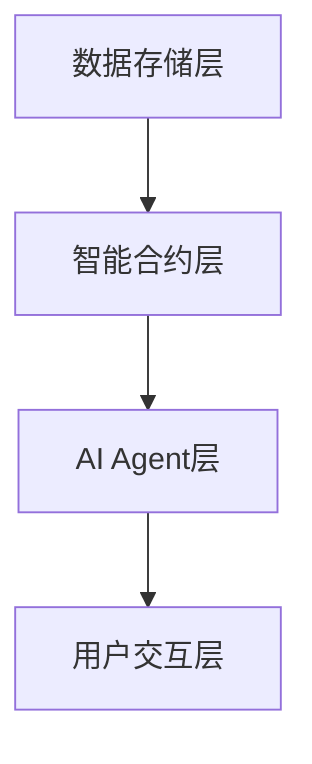
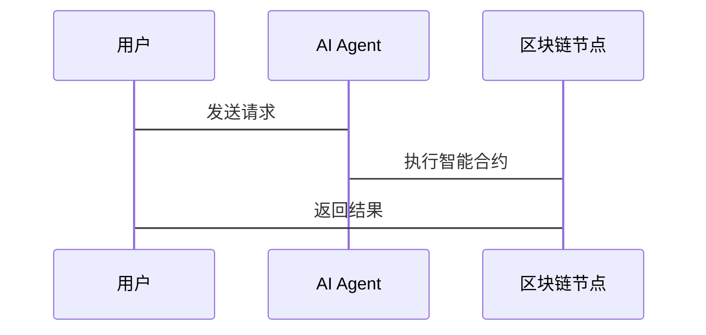

                 


# 区块链+AI：去中心化的可信AI Agent系统

## 关键词：
区块链、人工智能、去中心化、AI Agent、可信系统、智能合约、数据隐私

## 摘要：
本文探讨了区块链与人工智能的结合，重点分析了如何构建去中心化的可信AI Agent系统。通过区块链的特性，如去中心化、不可篡改和智能合约，AI Agent的可信性和安全性得到了显著提升。文章从概念、原理、算法、系统架构到实际案例，全面解析了区块链+AI的创新应用，为读者提供了深入的技术洞察和实践指导。

---

## 第一部分：区块链与AI的基础概念

### 第1章：区块链与AI的概述

#### 1.1 区块链的基本概念
区块链是一种去中心化的分布式账本技术，通过密码学和共识机制确保数据的安全性和一致性。其核心特点包括：
- **去中心化**：数据由多个节点共同维护，不存在单一的控制中心。
- **不可篡改**：通过链式结构和加密算法，确保数据一旦记录无法被修改。
- **智能合约**：自动执行的程序，能够在区块链上实现自动化的业务逻辑。

#### 1.2 AI的基本概念
人工智能（AI）是指计算机系统模拟人类智能的能力，包括学习、推理、决策等。其主要技术包括：
- **机器学习**：通过数据训练模型，使其能够自动识别模式。
- **深度学习**：基于神经网络的机器学习方法，能够处理复杂的非结构化数据。
- **自然语言处理（NLP）**：理解并生成人类语言的技术。

#### 1.3 区块链与AI的结合
区块链与AI的结合能够解决AI系统中的信任问题。通过区块链的透明性和不可篡改性，AI系统的数据和决策过程可以被追溯和验证，从而提升系统的可信度。

---

## 第二部分：去中心化AI系统的构建

### 第2章：去中心化AI系统的构建原理

#### 2.1 区块链在AI系统中的作用
区块链为AI系统提供了以下关键功能：
- **数据可信性保障**：通过区块链记录AI训练数据的来源和使用情况，防止数据被篡改或滥用。
- **智能合约的应用**：通过智能合约实现AI系统的自动化决策和激励机制。

#### 2.2 AI Agent的基本原理
AI Agent是一种能够感知环境并自主决策的智能体。在去中心化的环境中，AI Agent需要具备以下特点：
- **自主性**：能够自主决策，无需中央控制。
- **反应性**：能够实时感知环境并做出反应。
- **协作性**：能够与其他AI Agent或人类进行协作。

#### 2.3 区块链与AI Agent的结合
区块链为AI Agent提供了信任机制，确保AI Agent的行为可追溯、可验证。通过区块链，AI Agent的决策过程可以被记录和审计，从而提升系统的可信度。

---

## 第三部分：可信AI Agent的实现

### 第3章：可信AI Agent的核心机制

#### 3.1 数据可信性保障
区块链通过去中心化的数据存储和加密技术，确保AI Agent的数据来源和完整性。通过区块链的不可篡改性，AI Agent的数据可以被追溯和验证。

#### 3.2 身份认证与权限管理
在去中心化的环境中，AI Agent需要具备身份认证和权限管理功能。通过区块链的智能合约，可以实现细粒度的权限控制，确保AI Agent只能执行其被授权的操作。

#### 3.3 激励机制
为了激励AI Agent的行为，区块链可以通过代币机制实现激励。例如，AI Agent可以通过完成任务获得代币奖励，从而形成正向激励机制。

---

## 第四部分：系统架构与实现

### 第4章：系统架构设计

#### 4.1 系统功能设计
- **数据存储层**：负责存储AI Agent的数据和区块链的交易记录。
- **智能合约层**：实现AI Agent的决策逻辑和激励机制。
- **AI Agent层**：负责AI Agent的自主决策和与环境的交互。
- **用户交互层**：提供用户与AI Agent交互的界面。

#### 4.2 系统架构图


#### 4.3 接口设计
系统需要定义以下接口：
- `getData()`: 获取AI Agent的数据。
- `executeContract()`: 执行智能合约。
- `validateTransaction()`: 验证交易的合法性。

#### 4.4 交互流程


---

## 第五部分：项目实战

### 第5章：项目实战

#### 5.1 环境安装
1. 安装区块链环境（如以太坊）。
2. 安装AI开发环境（如TensorFlow）。

#### 5.2 核心代码实现
```python
# 区块链部分
class Blockchain:
    def __init__(self):
        self.chain = []
        self.transactions = []
    
    def add_transaction(self, transaction):
        self.transactions.append(transaction)
    
    def mine_block(self):
        # 模拟挖矿过程
        block = {
            'transactions': self.transactions,
            'timestamp': time.time()
        }
        self.chain.append(block)
        self.transactions = []
    
# AI Agent部分
class AIAgent:
    def __init__(self, blockchain):
        self.blockchain = blockchain
        self.data = []
    
    def train_model(self):
        # 训练AI模型
        pass
    
    def make_decision(self):
        # 基于区块链数据做出决策
        pass
```

#### 5.3 代码解读与分析
- `Blockchain`类实现了区块链的基本功能，包括添加交易和挖矿。
- `AIAgent`类实现了AI Agent的核心功能，包括数据训练和决策。

#### 5.4 实际案例分析
通过实际案例分析，展示区块链+AI Agent在去中心化环境中的实际应用。

---

## 第六部分：总结与展望

### 第6章：总结与展望

#### 6.1 总结
本文详细探讨了区块链与AI的结合，分析了去中心化可信AI Agent系统的实现过程。通过区块链的特性，AI Agent的可信性和安全性得到了显著提升。

#### 6.2 展望
未来，区块链与AI的结合将推动更多创新应用的出现。例如，去中心化AI医疗系统、智能化供应链管理等。

---

## 作者：AI天才研究院 & 禅与计算机程序设计艺术

