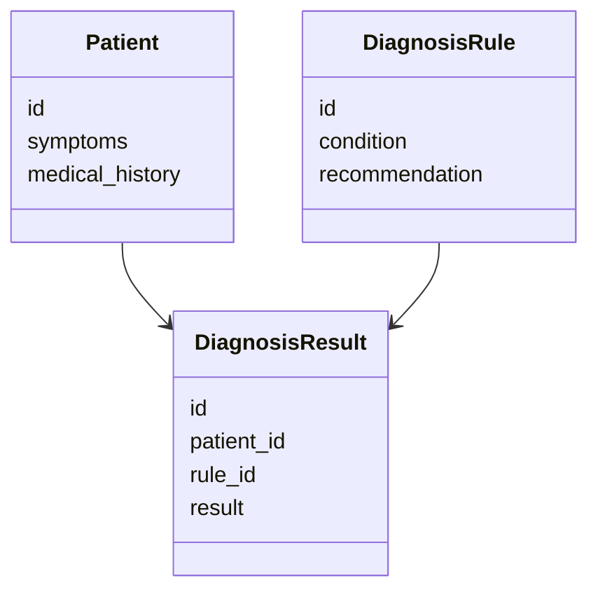
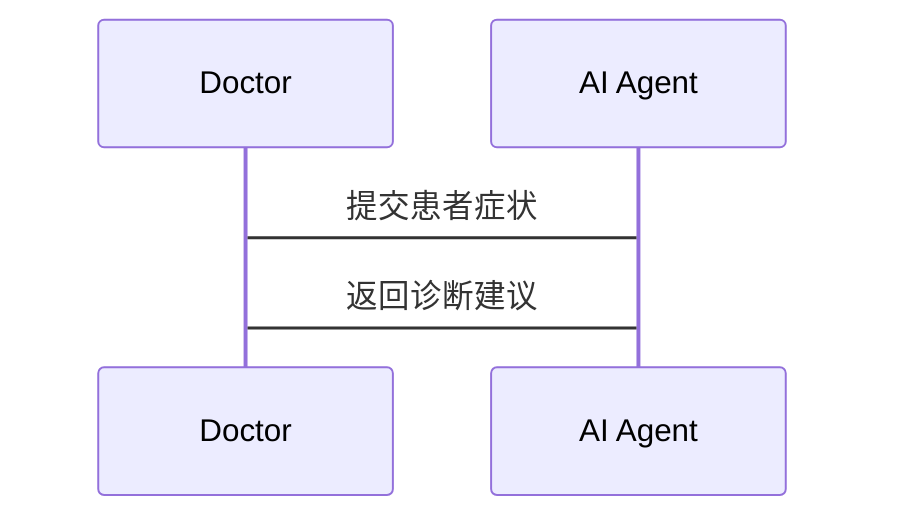

                 


```markdown
# 医疗健康AI Agent：开发难点与突破

> 关键词：医疗AI Agent，人工智能，医疗数据，知识表示，系统架构，AI推理

> 摘要：本文深入探讨了医疗健康AI Agent的开发难点与突破方法，从技术背景、核心概念、算法原理到系统架构与项目实战，全面解析了医疗AI Agent的实现过程。文章结合实际案例，详细分析了医疗数据处理、知识表示与推理、系统设计与实现等关键环节，为开发者提供了宝贵的实践经验与技术指导。

---

# 第一部分: 医疗健康AI Agent的背景与概念

## 第1章: 医疗健康AI Agent概述

### 1.1 医疗AI Agent的背景与意义

#### 1.1.1 医疗AI Agent的定义与核心概念
医疗AI Agent是一种基于人工智能技术的智能体，能够在医疗领域执行复杂任务，如疾病诊断、治疗方案推荐、患者管理等。其核心概念包括：
- **智能性**：通过AI算法实现自主决策。
- **交互性**：能够与医生、患者或其他系统进行实时交互。
- **适应性**：能够根据反馈动态调整行为。

#### 1.1.2 医疗AI Agent的应用场景与价值
医疗AI Agent的应用场景包括：
- **疾病诊断**：辅助医生进行疾病诊断和预测。
- **治疗方案推荐**：根据患者病情推荐个性化治疗方案。
- **患者管理**：帮助医院优化患者流程和资源分配。
- **健康监测**：实时监测患者的健康状况并提供预警。

其价值体现在提高医疗效率、降低医疗成本、改善患者体验等方面。

#### 1.1.3 医疗AI Agent的现状与发展趋势
当前，医疗AI Agent在国内外已有诸多应用，但仍面临数据隐私、模型准确性和实时性等挑战。未来，随着AI技术的进步，医疗AI Agent将更加智能化、个性化和普及化。

---

### 1.2 医疗健康AI Agent的核心问题

#### 1.2.1 数据隐私与安全问题
医疗数据涉及患者隐私，必须确保数据的安全存储和传输。解决方案包括数据加密、匿名化处理和访问控制。

#### 1.2.2 知识表示与推理难点
医疗知识复杂且动态变化，如何高效地表示和推理是关键。常用方法包括知识图谱、符号逻辑和深度学习模型。

#### 1.2.3 多模态数据处理挑战
医疗数据通常包括文本、图像、语音等多种形式，如何整合这些数据并进行有效分析是技术难点。

#### 1.2.4 实时性与响应速度问题
医疗场景往往需要快速决策，如何在保证准确性的前提下提升响应速度是关键。

---

### 1.3 医疗AI Agent的边界与外延

#### 1.3.1 医疗AI Agent的功能边界
医疗AI Agent的功能包括但不限于数据处理、知识推理、决策支持等，但不涉及直接的医疗操作。

#### 1.3.2 与其他医疗技术的区分
医疗AI Agent与传统医疗信息化系统的区别在于其具备自主学习和决策能力。

#### 1.3.3 医疗AI Agent的扩展应用领域
除了医疗领域，AI Agent还可应用于健康管理、医疗研究、医疗监管等方面。

---

### 1.4 医疗AI Agent的核心要素组成

#### 1.4.1 数据层：医疗数据的采集与处理
医疗数据包括电子健康记录（EHR）、医学影像、基因数据等，需要进行清洗、标注和标准化处理。

#### 1.4.2 知识层：医学知识库的构建与应用
知识层涉及医学知识图谱的构建，包括疾病、症状、药物等实体及其关系。

#### 1.4.3 模型层：AI算法的设计与优化
模型层采用深度学习、自然语言处理（NLP）等技术，训练出能够处理医疗数据的模型。

#### 1.4.4 接口层：与医疗系统的集成与交互
接口层负责与医院信息系统（HIS）、电子病历系统（EMR）等医疗系统的集成，确保数据的互联互通。

---

## 1.5 本章小结
本章从背景、核心问题、边界与外延、核心要素等方面全面介绍了医疗AI Agent，为后续的技术实现奠定了基础。

---

# 第二部分: 医疗健康AI Agent的技术基础

## 第2章: 医疗数据处理与分析

### 2.1 医疗数据的特征与挑战

#### 2.1.1 医疗数据的多样性与复杂性
医疗数据包括结构化数据（如EHR）和非结构化数据（如医生笔记），处理难度较大。

#### 2.1.2 数据隐私与安全要求
医疗数据涉及患者隐私，必须遵循相关法律法规，如GDPR和 HIPAA。

#### 2.1.3 数据清洗与预处理方法
数据清洗包括去重、填充缺失值、异常值处理等步骤，预处理包括特征提取和数据标注。

---

### 2.2 医疗数据的表示与建模

#### 2.2.1 医疗数据的特征提取方法
常用特征提取方法包括主成分分析（PCA）和t-分布邻域嵌入（t-SNE）。

#### 2.2.2 医疗数据的表示模型
- **向量表示**：将医疗数据转换为高维向量。
- **图结构表示**：构建疾病-症状-药物的知识图谱。

#### 2.2.3 数据表示的优缺点对比
| 方法 | 优点 | 缺点 |
|------|------|------|
| 向量表示 | 易于计算 | 无法捕捉语义关系 |
| 图结构表示 | 能够捕捉复杂关系 | 实现复杂，计算成本高 |

---

### 2.3 医疗数据的分析与挖掘

#### 2.3.1 基于机器学习的医疗数据分析
常用算法包括逻辑回归、支持向量机（SVM）和随机森林。

#### 2.3.2 基于深度学习的医疗数据挖掘
深度学习模型如卷积神经网络（CNN）和循环神经网络（RNN）在医学影像和文本分析中表现优异。

#### 2.3.3 医疗数据的可解释性问题
模型的可解释性是医疗AI应用的关键，可通过可视化和规则提取方法提升可解释性。

---

### 2.4 本章小结
本章重点介绍了医疗数据的处理与分析方法，为后续的AI模型设计提供了数据基础。

---

## 第3章: 医疗知识表示与推理

### 3.1 医疗知识的表示方法

#### 3.1.1 知识图谱的构建与应用
知识图谱构建步骤包括数据抽取、实体识别和关系抽取。知识图谱在医疗问答系统中具有重要应用。

#### 3.1.2 基于符号逻辑的知识表示
符号逻辑表示方法通过谓词逻辑描述医疗知识，但灵活性较低。

#### 3.1.3 基于向量空间的知识表示
向量空间模型通过词嵌入技术（如Word2Vec）将医疗术语映射到向量空间。

---

### 3.2 医疗知识的推理机制

#### 3.2.1 基于规则的推理方法
基于规则的推理方法通过预定义的医学规则进行推理，适用于确定性场景。

#### 3.2.2 基于概率的推理方法
概率推理方法（如贝叶斯网络）能够处理不确定性，但计算复杂度较高。

#### 3.2.3 基于深度学习的推理方法
深度学习模型（如Transformer）在医疗问答和诊断推理中表现出色。

---

### 3.3 医疗知识表示与推理的挑战

#### 3.3.1 知识表示的不完整性和动态性
医疗知识不断更新，知识表示需要动态维护。

#### 3.3.2 推理的准确性和效率问题
复杂推理任务需要权衡准确性和效率。

#### 3.3.3 多模态知识的融合与协调
如何有效融合文本、图像等多种数据源的知识是难点。

---

### 3.4 本章小结
本章重点探讨了医疗知识的表示与推理方法，分析了相关技术的优缺点及应用挑战。

---

# 第三部分: 医疗健康AI Agent的系统架构与实现

## 第4章: 医疗AI Agent的系统架构设计

### 4.1 问题场景介绍
以医院的疾病诊断场景为例，设计一个基于AI Agent的辅助诊断系统。

### 4.2 系统功能设计

#### 4.2.1 领域模型设计
领域模型采用Mermaid类图表示，包括患者信息、诊断规则、诊断结果等核心模块。



#### 4.2.2 系统架构设计
系统架构采用分层设计，包括数据层、业务逻辑层和表现层。


### 4.3 系统接口设计
系统接口采用RESTful API设计，包括数据接口、推理接口和结果接口。

### 4.4 系统交互设计

#### 4.4.1 系统交互流程
系统交互流程采用Mermaid序列图表示，描述医生与AI Agent之间的交互。



---

## 第5章: 医疗AI Agent的项目实战

### 5.1 环境安装
项目开发环境包括Python 3.8以上版本、TensorFlow 2.0以上版本、Flask框架等。

### 5.2 系统核心实现源代码

#### 5.2.1 数据处理代码
```python
import pandas as pd

def preprocess_medical_data(data_path):
    # 读取数据
    df = pd.read_csv(data_path)
    # 清洗数据
    df.dropna(inplace=True)
    # 标准化处理
    df['age'] = (df['age'] - df['age'].mean()) / df['age'].std()
    return df
```

#### 5.2.2 知识推理代码
```python
from transformers import pipeline

qa_pipeline = pipeline("question-answering", model="deepset/qcopa-large")
def medical_inquiry(question, context):
    return qa_pipeline(question, context)
```

### 5.3 代码应用解读与分析
通过上述代码实现医疗数据的预处理和知识问答功能，展示AI Agent在实际项目中的应用。

### 5.4 实际案例分析
以一个具体的疾病诊断案例为例，展示AI Agent如何通过数据处理和知识推理得出诊断建议。

### 5.5 项目小结
总结项目实现的关键点和经验教训，为后续开发提供参考。

---

## 第6章: 医疗AI Agent的最佳实践与总结

### 6.1 最佳实践 tips
- 数据安全：确保医疗数据的加密存储和传输。
- 模型优化：通过数据增强和模型调优提升推理准确性。
- 系统集成：确保与现有医疗系统的兼容性。

### 6.2 小结
总结医疗AI Agent的开发难点与突破方法，强调数据处理、知识表示和系统架构的重要性。

### 6.3 注意事项
- 注意模型的可解释性，避免“黑箱”决策。
- 定期更新知识库，保持模型的准确性。

### 6.4 拓展阅读
推荐相关技术书籍和论文，鼓励读者深入研究医疗AI领域。

---

# 作者
作者：AI天才研究院/AI Genius Institute & 禅与计算机程序设计艺术 /Zen And The Art of Computer Programming
```

