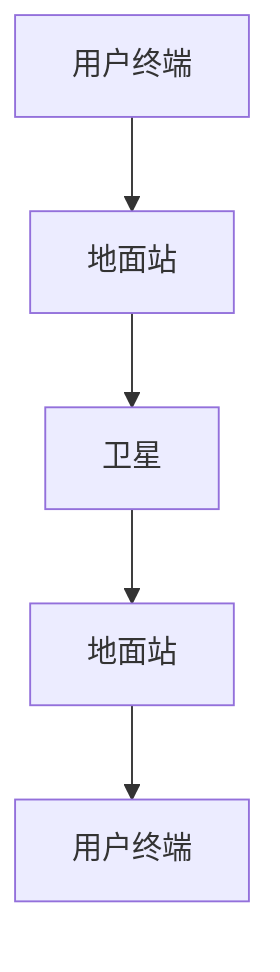
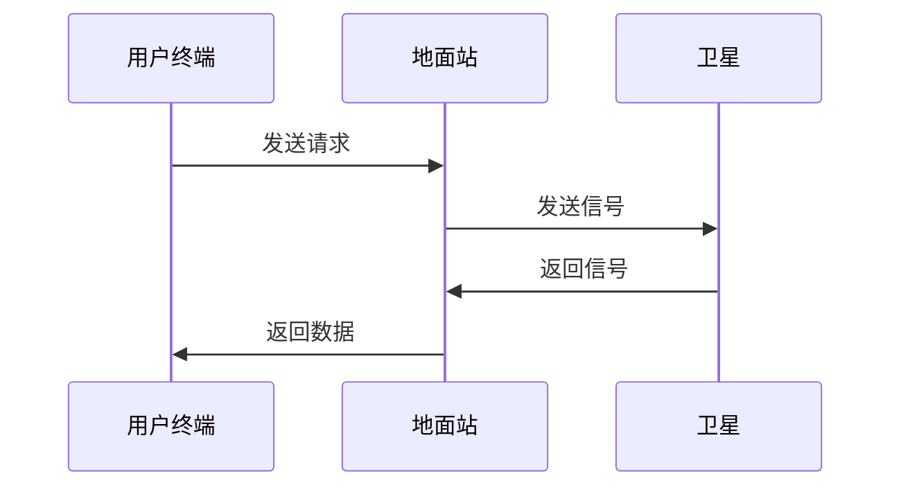

                 

# 卫星互联网技术的发展与投资前景

> 关键词：卫星互联网、5G通信、低轨卫星、物联网、通信技术、投资分析

> 摘要：卫星互联网技术作为现代通信领域的重要组成部分，近年来在全球范围内得到了快速发展。随着5G技术的普及和全球通信需求的不断增长，卫星互联网技术的应用场景日益广泛，投资价值也备受关注。本文将从卫星互联网技术的核心概念、发展背景、关键技术、投资分析、系统架构设计以及实际案例等方面进行详细阐述，旨在为读者提供全面的了解和深入的分析。

---

## 第1章: 卫星互联网技术的背景与概念

### 1.1 卫星互联网技术的定义与核心概念

#### 1.1.1 卫星互联网技术的定义
卫星互联网技术是指利用卫星作为通信节点，通过无线电波实现地面用户之间、地面用户与卫星之间以及卫星之间通信的技术。它是现代通信技术的重要组成部分，能够覆盖地面网络无法到达的偏远地区。

#### 1.1.2 卫星互联网技术的核心要素
卫星互联网技术的核心要素包括：
1. **卫星通信系统**：负责信号的收发和传输。
2. **卫星网络架构**：包括卫星的分布、组网方式和通信协议。
3. **卫星制造与发射技术**：涉及卫星的设计、制造和发射过程。
4. **用户终端设备**：包括卫星天线、调制解调器等设备。

#### 1.1.3 卫星互联网技术的演进历程
卫星互联网技术的发展经历了多个阶段：
1. **第一代卫星通信**：20世纪60年代，主要用于广播和电视传输。
2. **第二代卫星通信**：20世纪80年代，引入了更高效的通信技术，如FDMA和TDMA。
3. **第三代卫星通信**：21世纪初，开始支持宽带互联网服务。
4. **第四代卫星通信**：当前阶段，低轨卫星互联网技术快速发展，如SpaceX的Starlink项目。

### 1.2 卫星互联网技术的发展背景

#### 1.2.1 全球5G布局与通信需求
随着5G技术的普及，全球对高速、低延迟通信的需求不断增加。然而，地面网络在覆盖偏远地区和海洋等区域时存在局限性，卫星互联网技术成为重要的补充。

#### 1.2.2 卫星互联网技术的全球发展趋势
近年来，全球主要国家和企业纷纷加大对卫星互联网技术的投入。例如，SpaceX的Starlink项目计划发射1.2万颗低轨卫星，旨在为全球提供高速互联网服务。

#### 1.2.3 卫星互联网技术的应用场景
卫星互联网技术的应用场景包括：
1. **偏远地区互联网覆盖**：解决农村和山区的互联网接入问题。
2. **海洋和航空通信**：为远洋船只和飞机提供通信支持。
3. **物联网应用**：在物联网设备中实现全球范围内的通信。

---

## 第2章: 卫星互联网技术的核心概念与原理

### 2.1 卫星互联网技术的核心概念

#### 2.1.1 卫星通信的基本原理
卫星通信的基本原理是通过卫星作为中继站，实现地面用户之间的通信。信号从地面用户设备（如卫星天线）发射到卫星，卫星接收后转发到另一个地面用户设备。

#### 2.1.2 卫星网络的架构与组成
卫星网络的架构包括：
1. **卫星**：作为通信节点，接收和转发信号。
2. **地面站**：负责与卫星的通信，接收和发送信号。
3. **用户终端**：包括卫星天线、调制解调器等设备。

#### 2.1.3 卫星互联网技术的关键技术
卫星互联网技术的关键技术包括：
1. **卫星通信技术**：包括频率分配、抗干扰技术等。
2. **卫星网络技术**：包括组网方式、路由算法等。
3. **卫星定位与导航技术**：用于卫星的定位和导航。

### 2.2 卫星互联网技术的核心原理

#### 2.2.1 卫星通信的信号传输过程
信号从地面用户设备发射到卫星，经过放大和转发后，再传送到地面用户设备。整个过程包括发射、接收、放大和转发四个阶段。

#### 2.2.2 卫星网络的数据传输机制
卫星网络的数据传输机制包括：
1. **单 hop 传输**：直接通过卫星完成通信。
2. **多 hop 传输**：通过多个卫星接力完成通信。

#### 2.2.3 卫星定位与导航技术
卫星定位与导航技术主要用于卫星的定位和导航，确保卫星在正确的位置上运行。常用的卫星导航系统包括GPS、GLONASS和Galileo等。

---

## 第3章: 卫星互联网技术的关键技术分析

### 3.1 卫星通信技术

#### 3.1.1 卫星通信的频率分配
卫星通信的频率分配涉及上行链路和下行链路的频率分配。常用的频率包括C频段、Ku频段和Ka频段。

#### 3.1.2 卫星通信的抗干扰技术
抗干扰技术包括：
1. **FH-MT **（跳频技术）：通过快速跳变频率避免干扰。
2. **DSSS **（直接序列扩频技术）：通过扩频技术提高抗干扰能力。

#### 3.1.3 卫星通信的链路质量优化
链路质量优化包括：
1. **自适应调制与编码技术**：根据信道条件动态调整调制方式和编码速率。
2. **功率控制技术**：通过动态调整发射功率提高通信质量。

### 3.2 卫星网络技术

#### 3.2.1 卫星网络的组网方式
卫星网络的组网方式包括：
1. **星状网**：所有地面用户通过卫星直接通信。
2. **网状网**：卫星作为中继节点，实现多个地面用户之间的通信。

#### 3.2.2 卫星网络的路由算法
卫星网络的路由算法包括：
1. **静态路由**：预先配置路由表，适用于简单的网络结构。
2. **动态路由**：根据网络状态动态调整路由路径。

#### 3.2.3 卫星网络的安全性保障
卫星网络的安全性保障包括：
1. **加密技术**：对通信数据进行加密，防止数据泄露。
2. **身份认证**：通过身份认证确保通信双方的合法性。

---

## 第4章: 卫星互联网技术的投资前景分析

### 4.1 卫星互联网技术的市场现状

#### 4.1.1 全球卫星互联网市场的规模与增长
根据市场研究机构的数据，全球卫星互联网市场的规模预计将在未来几年快速增长，年复合增长率超过20%。

#### 4.1.2 主要卫星互联网企业的布局
目前，全球主要的卫星互联网企业包括SpaceX、OneWeb、Starlink和Globalstar等。这些企业正在积极推动低轨卫星互联网的建设。

#### 4.1.3 卫星互联网技术的商业化进程
卫星互联网技术的商业化进程包括：
1. **卫星制造与发射**：降低卫星制造和发射成本。
2. **地面设备普及**：推广卫星互联网用户终端设备的普及。

### 4.2 卫星互联网技术的投资热点

#### 4.2.1 低轨卫星互联网的投资机遇
低轨卫星互联网的投资机遇包括：
1. **低轨卫星的快速部署**：低轨卫星的轨道高度较低，通信延迟小，适合高速互联网服务。
2. **市场需求的增长**：随着5G技术的普及，低轨卫星互联网的需求不断增加。

#### 4.2.2 卫星制造与发射技术的投资价值
卫星制造与发射技术的投资价值包括：
1. **技术创新**：通过技术创新降低卫星制造和发射成本。
2. **规模化生产**：通过规模化生产降低成本，提高投资回报率。

#### 4.2.3 卫星互联网技术的应用领域拓展
卫星互联网技术的应用领域拓展包括：
1. **物联网**：在物联网设备中应用卫星互联网技术，实现全球范围内的通信。
2. **应急通信**：在灾害发生时，利用卫星互联网技术实现应急通信。

### 4.3 卫星互联网技术的投资风险与挑战

#### 4.3.1 技术风险
技术风险包括：
1. **技术瓶颈**：卫星互联网技术的某些领域还存在技术瓶颈，如低轨卫星的通信延迟问题。
2. **技术更新**：技术更新换代快，需要持续投入研发。

#### 4.3.2 市场风险
市场风险包括：
1. **市场竞争**：卫星互联网市场的竞争日益激烈，可能导致价格战和利润率下降。
2. **市场需求**：市场需求的不确定性可能影响投资回报。

#### 4.3.3 政策风险
政策风险包括：
1. **政策法规**：卫星互联网技术的政策法规可能影响企业的运营。
2. **国际竞争**：国际间的竞争可能影响企业的市场拓展。

---

## 第5章: 卫星互联网技术的系统架构设计

### 5.1 卫星互联网系统的组成与功能

#### 5.1.1 系统组成
卫星互联网系统包括：
1. **卫星**：作为通信节点，接收和转发信号。
2. **地面站**：负责与卫星的通信，接收和发送信号。
3. **用户终端**：包括卫星天线、调制解调器等设备。

#### 5.1.2 系统功能
卫星互联网系统的功能包括：
1. **数据传输**：实现数据的收发和传输。
2. **用户认证**：对用户进行身份认证，确保通信安全。
3. **网络管理**：对网络进行监控和管理，确保网络的正常运行。

### 5.2 卫星互联网系统的架构设计

#### 5.2.1 系统架构
卫星互联网系统的架构包括：
1. **卫星层**：负责信号的收发和转发。
2. **地面站层**：负责与卫星的通信，接收和发送信号。
3. **用户终端层**：负责与用户的通信，接收和发送信号。

#### 5.2.2 系统架构图

### 5.3 卫星互联网系统的接口设计

#### 5.3.1 卫星与地面站的接口
卫星与地面站的接口包括：
1. **上行链路**：地面站向卫星发送信号。
2. **下行链路**：卫星向地面站发送信号。

#### 5.3.2 用户终端与地面站的接口
用户终端与地面站的接口包括：
1. **用户请求**：用户终端向地面站发送请求。
2. **数据传输**：地面站通过卫星向用户终端发送数据。

### 5.4 卫星互联网系统的交互流程

#### 5.4.1 用户请求的处理流程

---

## 第6章: 卫星互联网技术的项目实战

### 6.1 项目背景与目标

#### 6.1.1 项目背景
本项目旨在设计和实现一个低轨卫星互联网系统，解决偏远地区互联网覆盖问题。

#### 6.1.2 项目目标
1. **系统设计**：设计低轨卫星互联网系统的架构和功能。
2. **系统实现**：实现系统的功能，包括用户终端、地面站和卫星的通信。
3. **系统测试**：对系统进行测试，验证系统的功能和性能。

### 6.2 项目环境与工具

#### 6.2.1 系统环境
系统环境包括：
1. **操作系统**：Linux
2. **开发工具**：Python、C++
3. **仿真工具**：Satellite Simulation Tool

#### 6.2.2 系统搭建
系统搭建包括：
1. **安装Python和C++开发环境**。
2. **安装卫星仿真工具**。
3. **配置网络环境**。

### 6.3 项目核心代码实现

#### 6.3.1 卫星通信模块
卫星通信模块的代码实现包括：
1. **信号收发**：实现信号的收发和转发。
2. **抗干扰技术**：实现跳频技术和直接序列扩频技术。

#### 6.3.2 网络管理模块
网络管理模块的代码实现包括：
1. **路由算法**：实现动态路由算法，根据网络状态动态调整路由路径。
2. **网络监控**：监控网络的运行状态，及时发现和处理网络故障。

### 6.4 项目测试与优化

#### 6.4.1 系统测试
系统测试包括：
1. **功能测试**：验证系统的功能是否正常。
2. **性能测试**：测试系统的性能，包括通信速度、延迟等。

#### 6.4.2 系统优化
系统优化包括：
1. **链路质量优化**：通过自适应调制与编码技术优化链路质量。
2. **功率控制优化**：通过动态调整发射功率优化通信质量。

### 6.5 项目总结与反思

#### 6.5.1 项目总结
本项目成功设计和实现了低轨卫星互联网系统，验证了系统的可行性和实用性。

#### 6.5.2 项目反思
在项目实施过程中，我们遇到了一些挑战，如技术瓶颈和市场需求的不确定性。未来，我们将进一步优化系统设计，降低成本，提高系统的性能和可靠性。

---

## 第7章: 卫星互联网技术的最佳实践与投资建议

### 7.1 卫星互联网技术的最佳实践

#### 7.1.1 技术创新
技术创新是卫星互联网技术发展的关键，企业应加大对新技术的研发投入。

#### 7.1.2 市场拓展
市场拓展是卫星互联网技术商业化的重要环节，企业应积极拓展市场，扩大用户规模。

#### 7.1.3 降低成本
降低成本是卫星互联网技术商业化的重要策略，企业应通过技术创新和规模化生产降低成本。

### 7.2 卫星互联网技术的小结

#### 7.2.1 核心内容总结
卫星互联网技术是现代通信领域的重要组成部分，具有广阔的发展前景和投资价值。

#### 7.2.2 投资建议
投资者应关注低轨卫星互联网技术的发展，积极投资于技术创新和市场拓展。

### 7.3 卫星互联网技术的行业展望

#### 7.3.1 行业发展趋势
卫星互联网技术的行业发展趋势包括：
1. **低轨卫星的快速部署**：低轨卫星的快速部署将推动行业的发展。
2. **技术的不断创新**：技术创新将推动行业的进一步发展。

#### 7.3.2 行业挑战
行业挑战包括：
1. **技术瓶颈**：技术瓶颈可能影响行业的发展。
2. **市场需求的不确定性**：市场需求的不确定性可能影响行业的增长。

---

## 作者：AI天才研究院/AI Genius Institute & 禅与计算机程序设计艺术 /Zen And The Art of Computer Programming

---

通过本文的详细阐述，我们全面分析了卫星互联网技术的发展与投资前景，从技术背景、核心概念、关键技术、投资分析、系统架构设计以及实际案例等方面进行了深入探讨。希望本文能够为读者提供有价值的信息和启发，帮助他们在卫星互联网技术领域做出明智的决策。

