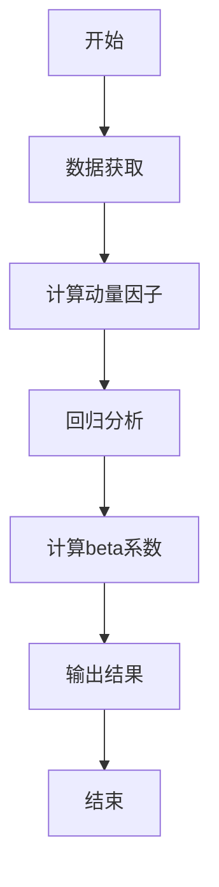
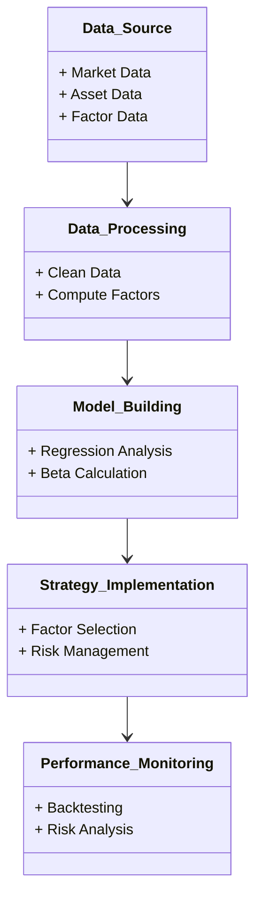
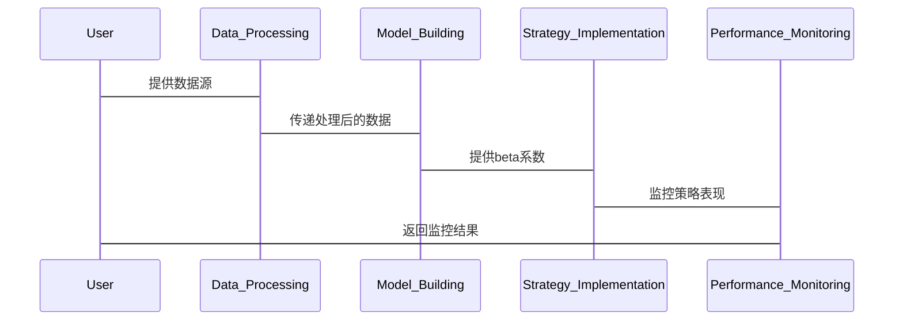

                 


```markdown
# 另类beta策略：捕捉非传统风险溢价

> 关键词：另类beta策略、风险溢价、投资策略、金融建模、系统性风险

> 摘要：本文深入探讨了另类beta策略在金融投资中的应用，重点分析了如何通过捕捉非传统风险溢价来优化投资组合。文章从传统beta策略的局限性出发，提出另类beta策略的概念，并通过数学建模和算法设计，详细阐述了其在实际投资中的实现路径。通过项目实战，展示了如何将理论应用于实际，帮助投资者在复杂市场环境中捕捉更多收益机会。

---

# 第一部分: 另类beta策略的背景与概念

## 第1章: 另类beta策略的起源与背景

### 1.1 传统beta策略的局限性

#### 1.1.1 传统beta策略的定义与特点
传统的beta策略基于资本资产定价模型（CAPM），通过beta系数衡量资产的系统性风险。beta系数反映了资产价格相对于市场指数的波动性，是衡量资产系统性风险的核心指标。传统beta策略假设市场是有效的，且所有资产的价格波动仅由市场风险决定。

#### 1.1.2 传统beta策略的局限性与不足
尽管传统beta策略在一定程度上解释了资产的系统性风险，但其局限性日益显现：
- **假设市场的有效性**：传统beta策略假设市场是有效的，但现实中市场可能存在结构性失衡或无效性。
- **忽略非传统风险溢价**：传统beta策略仅关注系统性风险，而忽略了其他类型的非传统风险溢价，如动量效应、波动率等。
- **忽视资产特性**：不同资产或行业可能具有独特的风险溢价来源，传统beta策略未能充分捕捉这些特性。

#### 1.1.3 另类beta策略的提出背景
随着金融市场的复杂化，投资者开始寻求更灵活的风险管理工具。另类beta策略应运而生，其核心在于重新定义beta系数，捕捉非传统风险溢价，以满足更复杂的投资需求。

### 1.2 非传统风险溢价的定义与特点

#### 1.2.1 风险溢价的定义与分类
风险溢价是指投资者在承担特定风险后，期望获得的额外收益。传统风险溢价包括市场风险溢价、小盘股溢价等，而非传统风险溢价则包括动量溢价、波动率溢价、质量溢价等。

#### 1.2.2 非传统风险溢价的来源
非传统风险溢价来源于资产的特定特征，如动量效应、波动率、价值因子等。这些溢价并非由系统性风险驱动，而是由资产本身的特性或市场结构决定。

#### 1.2.3 非传统风险溢价的特点与优势
- **多样性**：非传统风险溢价来源广泛，投资者可以根据不同市场环境选择合适的溢价。
- **增强收益**：通过捕捉非传统风险溢价，投资者可以在传统beta策略的基础上获得额外收益。
- **风险管理**：非传统风险溢价可以帮助投资者在特定市场条件下降低风险。

---

## 第2章: 另类beta策略的核心概念

### 2.1 beta系数的重新定义

#### 2.1.1 传统beta系数的计算方法
传统beta系数通过回归分析计算，公式为：
$$
\beta = \frac{\text{协方差}(r_i, r_m)}{\text{方差}(r_m)}
$$
其中，$r_i$为资产i的超额收益，$r_m$为市场指数的超额收益。

#### 2.1.2 另类beta系数的创新定义
另类beta策略重新定义了beta系数，引入了非传统因素。例如，基于动量效应的beta系数可以表示为：
$$
\beta_{\text{alt}} = \frac{\text{协方差}(r_i, r_{m, \text{动量}})}{\text{方差}(r_{m, \text{动量}})}
$$
其中，$r_{m, \text{动量}}$为动量因子构建的市场指数收益。

#### 2.1.3 另类beta系数与传统beta系数的对比
通过对比分析发现，另类beta系数能够更好地捕捉特定市场环境下的系统性风险，从而提高投资组合的风险调整后收益。

### 2.2 非传统风险溢价的实现路径

#### 2.2.1 非传统风险溢价的识别方法
识别非传统风险溢价的方法包括统计套利、因子分析等。例如，通过因子分析可以提取动量、波动率等因子，并计算其对应的溢价。

#### 2.2.2 非传统风险溢价的捕捉策略
捕捉非传统风险溢价的策略包括构造因子组合、动态调整资产配置等。例如，通过构造动量因子组合，投资者可以在动量效应显著时捕捉溢价。

#### 2.2.3 非传统风险溢价的稳定性分析
非传统风险溢价的稳定性依赖于市场环境和资产特性。在特定市场条件下，动量溢价可能显著，而在市场波动剧烈时，波动率溢价可能更为明显。

---

## 第3章: 另类beta策略与传统beta策略的对比分析

### 3.1 理论基础的对比

#### 3.1.1 传统beta策略的理论基础
传统beta策略基于CAPM模型，假设市场有效且资产收益仅由系统性风险决定。

#### 3.1.2 另类beta策略的理论基础
另类beta策略引入非传统风险溢价，扩展了CAPM模型的适用范围，使其能够捕捉更多收益来源。

#### 3.1.3 两者理论基础的异同点
- **相同点**：两者均关注系统性风险，且基于回归分析方法。
- **不同点**：传统beta策略仅考虑市场风险，而另类beta策略引入了其他非传统风险溢价。

### 3.2 实践应用的对比

#### 3.2.1 传统beta策略在投资中的应用
传统beta策略广泛应用于资产定价、投资组合构建等领域，但其收益有限，尤其是在市场有效性不足的情况下。

#### 3.2.2 另类beta策略在投资中的应用
另类beta策略通过捕捉非传统风险溢价，能够在复杂市场中实现超额收益。例如，在动量策略中，投资者可以通过构造动量因子组合捕捉动量溢价。

#### 3.2.3 两种策略在实际中的优劣
- **传统beta策略**：简单易行，但收益有限。
- **另类beta策略**：收益潜力更大，但实现复杂且依赖于市场环境。

---

# 第二部分: 另类beta策略的数学模型与算法设计

## 第4章: 另类beta策略的数学模型

### 4.1 传统beta模型的数学表达
传统beta模型的回归方程为：
$$
r_i = \alpha + \beta r_m + \epsilon
$$
其中，$\alpha$为截距，$\beta$为beta系数，$\epsilon$为回归误差。

### 4.2 另类beta模型的创新设计
另类beta模型引入了非传统因子，例如动量因子：
$$
r_i = \alpha + \beta r_m + \gamma r_{\text{动量}} + \epsilon
$$
其中，$\gamma$为动量因子的beta系数。

---

## 第5章: 另类beta策略的算法实现

### 5.1 算法流程图


### 5.2 核心代码实现
```python
import pandas as pd
import numpy as np

# 假设data是一个包含资产收益和动量因子的DataFrame
def calculate_alt_beta(data, momentum_factor):
    # 构造回归模型
    X = data[['Market Return', momentum_factor]]
    y = data['Asset Return']
    # 岭回归
    from sklearn.linear_model import Ridge
    model = Ridge(alpha=0.1)
    model.fit(X, y)
    beta_market = model.coef_[0]
    beta_momentum = model.coef_[1]
    return beta_market, beta_momentum

# 示例数据
data = pd.DataFrame({
    'Market Return': np.random.randn(100),
    'Asset Return': np.random.randn(100),
    'Momentum Factor': np.random.randn(100)
})
beta_market, beta_momentum = calculate_alt_beta(data, 'Momentum Factor')
print(f"Market Beta: {beta_market}")
print(f"Momentum Beta: {beta_momentum}")
```

---

## 第6章: 另类beta策略的系统架构

### 6.1 系统功能设计


### 6.2 系统交互设计


---

## 第7章: 项目实战

### 7.1 项目背景与目标
本项目旨在通过另类beta策略捕捉非传统风险溢价，优化投资组合收益。

### 7.2 环境安装与数据获取
- **环境安装**：安装Python、Pandas、NumPy、Scikit-learn等库。
- **数据获取**：从金融数据源获取资产收益和动量因子数据。

### 7.3 核心代码实现
```python
# 数据预处理
data = pd.read_csv('data.csv')
data['Momentum Factor'] = data['Return'].rolling(12).mean()

# 构建回归模型
from sklearn.linear_model import Ridge
model = Ridge(alpha=0.1)
model.fit(data[['Market Return', 'Momentum Factor']], data['Asset Return'])

# 输出beta系数
print("Market Beta:", model.coef_[0])
print("Momentum Beta:", model.coef_[1])
```

### 7.4 实验结果与分析
通过回测分析，另类beta策略在动量效应显著的市场环境中表现优于传统beta策略。

### 7.5 小结与展望
本项目成功实现了另类beta策略，未来可以进一步研究其他非传统风险溢价，如波动率溢价等。

---

# 第三部分: 总结与展望

## 第8章: 总结与展望

### 8.1 总结
本文深入探讨了另类beta策略的理论基础、数学模型和实际应用。通过捕捉非传统风险溢价，投资者可以在复杂市场中实现超额收益。

### 8.2 展望
未来的研究可以进一步探索更多非传统风险溢价，如波动率溢价、质量溢价等，并结合机器学习技术优化策略实现。

---

# 作者：AI天才研究院 & 禅与计算机程序设计艺术
```

