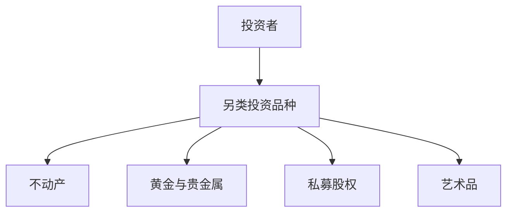

                 


# 另类投资品种：对冲通胀的有效工具

## 关键词：另类投资、通胀对冲、资产配置、风险管理、财富保值

## 摘要：本文系统探讨了另类投资品种作为对冲通胀的有效工具，从概念、原理到实际应用，深入分析了各类另类投资品种的特点、优势及其在通胀周期中的表现。通过理论与实践结合，结合具体案例和数学模型，揭示了另类投资在财富保值与增值中的重要作用，为投资者提供了科学的投资策略和风险管理建议。

---

## 第一部分：背景与概述

### 第1章：通胀与另类投资的背景

#### 1.1 通胀的定义与影响

- **1.1.1 通胀的定义**  
  通货膨胀是指物价总水平在一段时间内持续上涨，导致货币购买力下降。通胀对经济和资产的影响是多方面的，尤其在高通胀环境下，传统投资品种（如股票、债券）可能无法有效保值。

- **1.1.2 通胀对经济和资产的影响**  
  高通胀环境下，货币贬值，债务的实际价值下降，导致债权人受损；而债务人受益，因为实际还款压力降低。此外，高通胀可能导致市场波动加剧，传统资产如股票和债券可能面临估值压力。

- **1.1.3 通胀对个人财富的威胁**  
  对个人而言，通胀可能导致实际收入下降，储蓄和固定收益资产的实际购买力降低。因此，寻找能够对冲通胀的有效工具成为投资者的迫切需求。

#### 1.2 传统投资品种的局限性

- **1.2.1 股票投资的波动性**  
  股票市场受宏观经济环境影响较大，在高通胀环境下，企业盈利可能受到挤压，股票价格可能下跌。

- **1.2.2 债券投资的收益限制**  
  债券收益率通常较低，且在通胀上升时，债券的实际收益率可能为负，导致投资者损失购买力。

- **1.2.3 其他传统投资工具的不足**  
  银行存款和货币市场基金等传统低风险投资工具，收益率通常低于通胀水平，无法有效对冲通胀风险。

#### 1.3 另类投资的兴起

- **1.3.1 另类投资的定义**  
  另类投资是指传统股票、债券以外的其他资产类别，包括房地产、黄金、艺术品、私募股权等。

- **1.3.2 另类投资的兴起背景**  
  在传统资产收益率下降和通胀上升的背景下，投资者开始寻找能够提供超额收益和抗通胀能力的另类资产。

- **1.3.3 另类投资的多样化优势**  
  另类投资品种种类繁多，能够满足不同投资者的需求，同时提供多元化配置的可能性。

---

## 第二部分：另类投资品种的核心概念

### 第2章：另类投资的主要类别与特点

#### 2.1 不动产投资

- **2.1.1 不动产投资的特点**  
  不动产具有较高的流动性溢价，租金收入能够部分抵消通胀影响，同时在通胀上升时，房地产价格通常会上涨。

- **2.1.2 不动产投资的优势**  
  不动产作为实物资产，具有抗通胀能力，同时可以通过杠杆效应放大收益。

#### 2.2 黄金与贵金属投资

- **2.2.1 黄金投资的特点**  
  黄金作为贵金属，具有保值功能，在通胀上升时通常会表现较好。

- **2.2.2 黄金投资的优势**  
  黄金是全球公认的避险资产，在货币贬值时能够保护购买力。

#### 2.3 私募股权与风险投资

- **2.3.1 私募股权的特点**  
  私募股权通常具有较高的回报潜力，但投资周期较长，流动性较低。

- **2.3.2 私募股权投资的优势**  
  私募股权能够通过企业增值实现收益，同时在通胀周期中，企业盈利能力可能提升。

#### 2.4 艺术品与收藏品投资

- **2.4.1 艺术品投资的特点**  
  艺术品市场具有较高的波动性，但长期来看，优质艺术品可能具有较高的增值潜力。

- **2.4.2 艺术品投资的优势**  
  艺术品作为文化资产，具有独特的审美价值和历史意义，能够在通胀周期中保持或提升价值。

#### 2.5 其他另类资产

- **2.5.1 大宗商品投资**  
  大宗商品如原油、天然气等，具有较强的通胀对冲能力。

- **2.5.2 对冲基金投资**  
  对冲基金通过复杂的交易策略，能够在不同市场环境下实现收益。

### 第3章：另类投资的核心概念与联系

#### 3.1 另类投资品种的属性特征对比

- **表3.1-1 各类另类投资品种的属性特征对比**

| 投资品种   | 流动性 | 风险水平 | 收益潜力 | 抗通胀能力 |
|------------|--------|----------|----------|------------|
| 不动产     | 中等    | 中等     | 较高     | 强          |
| 黄金       | 低     | 低       | 中等     | 强          |
| 私募股权   | 低     | 高       | 高       | 中等        |
| 艺术品     | 低     | 高       | 高       | 强          |

#### 3.2 另类投资的ER实体关系图



---

## 第三部分：另类投资的算法原理

### 第4章：另类投资的评估与风险管理

#### 4.1 投资品种的评估模型

- **4.1.1 投资回报率的计算公式**  
  投资回报率（ROI）=（最终价值 - 初始价值）/ 初始价值 × 100%

- **4.1.2 风险调整后的收益模型**  
  使用夏普比率（Sharpe Ratio）评估风险调整后的收益：  
  $$ \text{夏普比率} = \frac{E[\text{收益}] - R_f}{\sigma} $$  
  其中，\( E[\text{收益}] \) 是预期收益，\( R_f \) 是无风险利率，\( \sigma \) 是收益的标准差。

#### 4.2 投资组合的优化配置

- **4.2.1 现代投资组合理论（MPT）**  
  根据MPT，通过优化资产配置，可以实现收益与风险的最佳平衡。

- **4.2.2 投资组合的风险分散**  
  通过配置不同类型的另类资产，可以有效分散系统性风险。

#### 4.3 通胀对冲的数学模型

- **4.3.1 通胀对冲模型**  
  假设通胀率为 \( \pi \)，投资回报率为 \( r \)，则实际回报率为：  
  $$ \text{实际回报率} = r - \pi $$  
  通过选择回报率高于通胀率的资产，可以实现实际收益的正增长。

---

## 第四部分：系统分析与架构设计

### 第5章：另类投资系统的架构与实现

#### 5.1 项目介绍

- **项目目标**  
  构建一个基于另类投资的对冲通胀系统，实现资产配置、风险管理和收益优化。

#### 5.2 系统功能设计

- **领域模型**  
  ```mermaid
  classDiagram
      class 投资者 {
          资金：Float
          风险偏好：String
          投资目标：String
      }
      class 投资品种 {
          名称：String
          类型：String
          预期收益：Float
          风险等级：Integer
      }
      class 投资组合 {
          资产配置：Map
          预期回报率：Float
          风险指数：Float
      }
      投资者 --> 投资品种
      投资品种 --> 投资组合
  ```

- **系统架构设计**  
  ```mermaid
  architecture
  Client --> API Gateway
  API Gateway --> Investment Service
  Investment Service --> Database
  ```

- **系统交互设计**  
  ```mermaid
  sequenceDiagram
      投资者 -> API Gateway: 请求投资建议
      API Gateway -> Investment Service: 调用投资评估接口
      Investment Service -> Database: 查询历史数据
      Investment Service --> API Gateway: 返回评估结果
      API Gateway -> 投资者: 提供优化建议
  ```

---

## 第五部分：项目实战与应用

### 第6章：另类投资的实战案例

#### 6.1 环境安装与配置

- **Python环境安装**  
  使用Anaconda安装Python 3.8及以上版本，并安装必要的库：pandas、numpy、scipy。

#### 6.2 核心实现源代码

- **投资回报率计算代码**  
  ```python
  import numpy as np
  def calculate_return(prices):
      returns = np.log(prices[1:] / prices[:-1])
      return returns.mean() * 100
  ```

- **风险评估代码**  
  ```python
  def calculate_risk(returns):
      return np.std(returns)
  ```

#### 6.3 案例分析与解读

- **案例：黄金与房地产投资组合**  
  在通胀上升周期，黄金和房地产的组合能够有效对冲通胀风险，同时保持较高的收益潜力。

#### 6.4 项目小结

- 本案例展示了如何通过另类投资构建抗通胀的投资组合，实际操作中需要根据市场环境和投资者需求进行动态调整。

---

## 第六部分：最佳实践与小结

### 第7章：最佳实践与注意事项

#### 7.1 投资策略建议

- **分散投资**：避免过度集中于单一资产类别，通过多元化配置降低风险。

- **定期评估**：根据市场环境和通胀预期，定期调整投资组合。

#### 7.2 风险管理技巧

- **设定止损点**：在投资组合中设定止损点，避免重大损失。

- **关注宏观经济指标**：密切关注通胀、利率和经济政策的变化，及时调整投资策略。

#### 7.3 小结

- 另类投资作为对冲通胀的有效工具，能够在传统资产表现不佳时提供超额收益。投资者需要根据自身需求和风险承受能力，合理配置另类资产，同时注重风险管理。

---

## 作者：AI天才研究院 & 禅与计算机程序设计艺术

--- 

**注意**：本文内容仅供参考，具体投资决策需结合实际情况和专业顾问建议。

